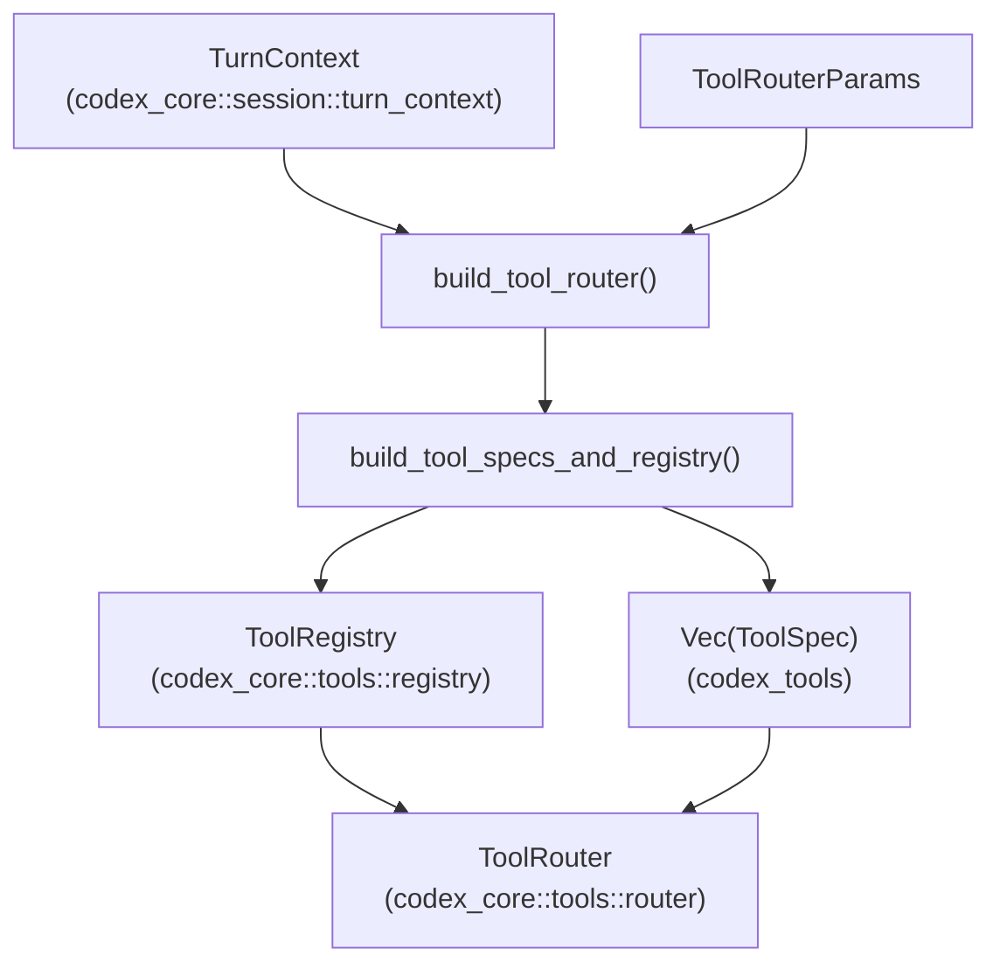
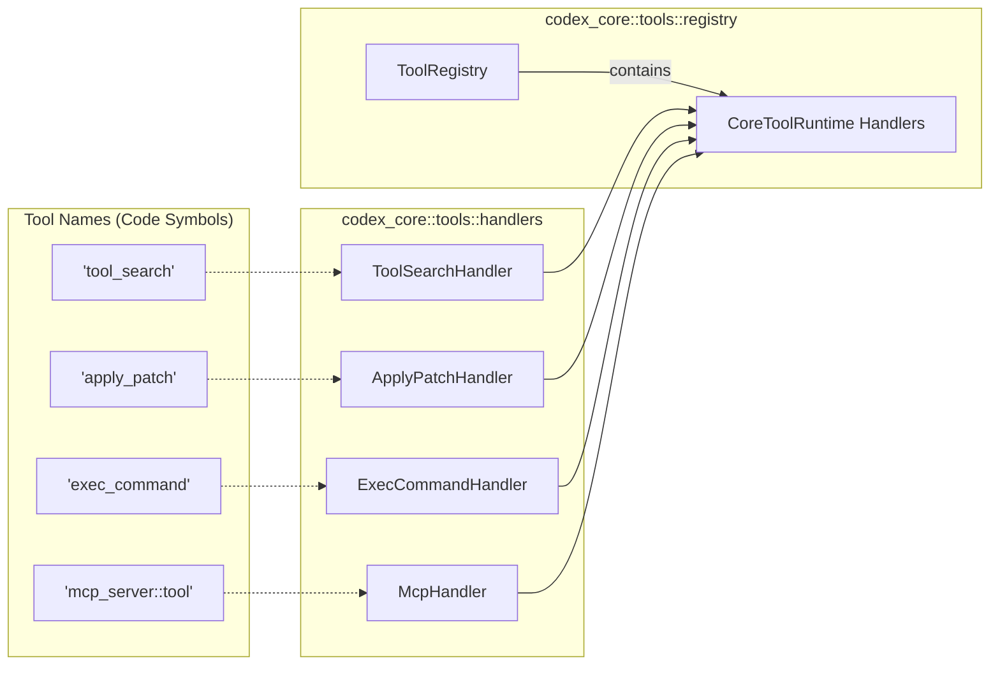
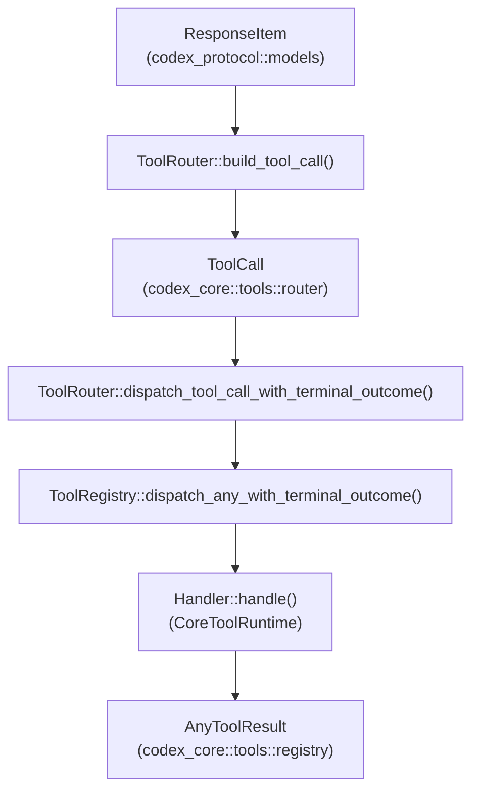

# Tool Registry and Configuration

Relevant source files

The following files were used as context for generating this wiki page:

- [codex-rs/core/src/state/session.rs](codex-rs/core/src/state/session.rs)
- [codex-rs/core/src/tools/code_mode/execute_handler.rs](codex-rs/core/src/tools/code_mode/execute_handler.rs)
- [codex-rs/core/src/tools/code_mode/mod.rs](codex-rs/core/src/tools/code_mode/mod.rs)
- [codex-rs/core/src/tools/code_mode/wait_handler.rs](codex-rs/core/src/tools/code_mode/wait_handler.rs)
- [codex-rs/core/src/tools/context.rs](codex-rs/core/src/tools/context.rs)
- [codex-rs/core/src/tools/context_tests.rs](codex-rs/core/src/tools/context_tests.rs)
- [codex-rs/core/src/tools/handlers/dynamic.rs](codex-rs/core/src/tools/handlers/dynamic.rs)
- [codex-rs/core/src/tools/handlers/extension_tools.rs](codex-rs/core/src/tools/handlers/extension_tools.rs)
- [codex-rs/core/src/tools/handlers/mcp.rs](codex-rs/core/src/tools/handlers/mcp.rs)
- [codex-rs/core/src/tools/handlers/mod.rs](codex-rs/core/src/tools/handlers/mod.rs)
- [codex-rs/core/src/tools/handlers/tool_search.rs](codex-rs/core/src/tools/handlers/tool_search.rs)
- [codex-rs/core/src/tools/parallel.rs](codex-rs/core/src/tools/parallel.rs)
- [codex-rs/core/src/tools/registry.rs](codex-rs/core/src/tools/registry.rs)
- [codex-rs/core/src/tools/registry_tests.rs](codex-rs/core/src/tools/registry_tests.rs)
- [codex-rs/core/src/tools/router.rs](codex-rs/core/src/tools/router.rs)
- [codex-rs/core/src/tools/router_tests.rs](codex-rs/core/src/tools/router_tests.rs)
- [codex-rs/core/src/tools/spec_plan.rs](codex-rs/core/src/tools/spec_plan.rs)
- [codex-rs/core/src/tools/spec_plan_tests.rs](codex-rs/core/src/tools/spec_plan_tests.rs)
- [codex-rs/core/tests/suite/code_mode.rs](codex-rs/core/tests/suite/code_mode.rs)
- [codex-rs/tools/Cargo.toml](codex-rs/tools/Cargo.toml)
- [codex-rs/tools/README.md](codex-rs/tools/README.md)
- [codex-rs/tools/src/dynamic_tool.rs](codex-rs/tools/src/dynamic_tool.rs)
- [codex-rs/tools/src/dynamic_tool_tests.rs](codex-rs/tools/src/dynamic_tool_tests.rs)
- [codex-rs/tools/src/json_schema.rs](codex-rs/tools/src/json_schema.rs)
- [codex-rs/tools/src/json_schema_tests.rs](codex-rs/tools/src/json_schema_tests.rs)
- [codex-rs/tools/src/lib.rs](codex-rs/tools/src/lib.rs)
- [codex-rs/tools/src/mcp_tool.rs](codex-rs/tools/src/mcp_tool.rs)
- [codex-rs/tools/src/mcp_tool_tests.rs](codex-rs/tools/src/mcp_tool_tests.rs)
- [codex-rs/tools/src/tool_call.rs](codex-rs/tools/src/tool_call.rs)
- [codex-rs/tools/src/tool_definition.rs](codex-rs/tools/src/tool_definition.rs)
- [codex-rs/tools/src/tool_definition_tests.rs](codex-rs/tools/src/tool_definition_tests.rs)
- [codex-rs/tools/tests/fixtures/json_schema_policy/google_calendar.json](codex-rs/tools/tests/fixtures/json_schema_policy/google_calendar.json)
- [codex-rs/tools/tests/fixtures/json_schema_policy/google_drive.json](codex-rs/tools/tests/fixtures/json_schema_policy/google_drive.json)
- [codex-rs/tools/tests/fixtures/json_schema_policy/microsoft_outlook_email.json](codex-rs/tools/tests/fixtures/json_schema_policy/microsoft_outlook_email.json)
- [codex-rs/tools/tests/fixtures/json_schema_policy/notion.json](codex-rs/tools/tests/fixtures/json_schema_policy/notion.json)
- [codex-rs/tools/tests/fixtures/json_schema_policy/oversized_notion_create_page_input_schema.json](codex-rs/tools/tests/fixtures/json_schema_policy/oversized_notion_create_page_input_schema.json)
- [codex-rs/tools/tests/fixtures/json_schema_policy/slack.json](codex-rs/tools/tests/fixtures/json_schema_policy/slack.json)
- [codex-rs/tools/tests/json_schema_policy_fixtures.rs](codex-rs/tools/tests/json_schema_policy_fixtures.rs)

This page documents how Codex decides which tools are made available to the model in a given session. It covers `ToolSpec` definitions, `ToolRegistry`, `ToolRouter`, and the `CoreToolRuntime` and `ToolExecutor` traits.

For how the tools themselves *execute* (e.g., shell, apply_patch, unified exec) see pages **5.2**–**5.8**. For MCP-specific tool configuration and delegation, see **6.1** and **6.2**. For the overall sandbox and approval system, see **2.4** and **5.5**.

---

## Overview

Every agent session computes a set of tools before the first API request. Tool planning is driven by the `TurnContext` [codex-rs/core/src/tools/router.rs:48-50](), which incorporates model capabilities, enabled feature flags (like `CodeMode` or `UnifiedExec`), and the session source.

These inputs are combined to build a `ToolRegistry` and a `ToolRouter`:

- **`ToolRegistry`**: Holds the concrete runtime tool handlers (`CoreToolRuntime`) and manages dispatch of tool calls [codex-rs/core/src/tools/registry.rs:48-143]().
- **`ToolRouter`**: Provides a session-scoped interface combining the registry and the filtered set of `ToolSpec`s sent to the model [codex-rs/core/src/tools/router.rs:34-37]().

The data flow from context to router is as follows:

### Natural Language Space to Code Entity Space: Tool Planning
Title: Tool Planning Data Flow

**Legend:**
- `ToolSpec` represents the model-visible description of a tool.
- `ToolRegistry` assembles tool handlers keyed by `ToolName`.
- `ToolRouter` routes runtime tool calls using the registry.

Sources: [codex-rs/core/src/tools/router.rs:34-57](), [codex-rs/core/src/tools/spec_plan.rs:153-156](), [codex-rs/core/src/tools/registry.rs:48-143]()

---

## Tool Planning and `ToolSpec`

The planning phase determines which tools are exposed to the model. This is handled by `build_tool_specs_and_registry` in `spec_plan.rs` [codex-rs/core/src/tools/spec_plan.rs:161-164]().

### Tool Sources
The system aggregates tools from multiple sources:
1.  **Built-in Handlers**: Core tools like `shell_command`, `exec_command`, and `apply_patch` [codex-rs/core/src/tools/spec_plan.rs:6-29]().
2.  **MCP Tools**: Tools provided by external Model Context Protocol servers [codex-rs/core/src/tools/handlers/mcp.rs:32-35]().
3.  **Dynamic Tools**: User-defined or runtime-injected tools [codex-rs/core/src/tools/handlers/dynamic.rs:1-10]().
4.  **Extension Tools**: Tools provided by plugins or external extensions [codex-rs/core/src/tools/handlers/extension_tools.rs:1-10]().

### Tool Exposure
Tools can have different exposure levels [codex-rs/core/src/tools/registry.rs:42-42]():
-   **Model-Visible**: Included in the `ToolSpec` list sent to the LLM [codex-rs/core/src/tools/router.rs:59-61]().
-   **Hidden/Dispatch-Only**: Registered in the `ToolRegistry` for execution (e.g., via Code Mode) but not advertised to the model [codex-rs/core/src/tools/spec_plan.rs:125-130]().

Sources: [codex-rs/core/src/tools/spec_plan.rs:99-139](), [codex-rs/core/src/tools/router.rs:59-61](), [codex-rs/tools/src/lib.rs:105-105]()

---

## Tool Registry and `CoreToolRuntime`

### `CoreToolRuntime` Trait
The `CoreToolRuntime` trait is the typed runtime contract for locally executed tools [codex-rs/core/src/tools/registry.rs:48-48](). It extends `ToolExecutor<ToolInvocation>` and provides:

-   **Hook Payloads**: `pre_tool_use_payload` and `post_tool_use_payload` for the Hooks System [codex-rs/core/src/tools/registry.rs:69-112]().
-   **Input Rewriting**: `with_updated_hook_input` allows hooks to modify tool arguments before execution [codex-rs/core/src/tools/registry.rs:118-140]().
-   **Telemetry**: `telemetry_tags` for observability [codex-rs/core/src/tools/registry.rs:62-67]().
-   **Diff Consumers**: `create_diff_consumer` for handling streamed tool arguments [codex-rs/core/src/tools/registry.rs:142-144]().

### Key Handlers

| Handler Class | Tool Name | Implementation Module |
| :--- | :--- | :--- |
| `ShellCommandHandler` | `shell_command` | [codex-rs/core/src/tools/handlers/shell/mod.rs]() |
| `ExecCommandHandler` | `exec_command` | [codex-rs/core/src/tools/handlers/unified_exec/mod.rs]() |
| `ApplyPatchHandler` | `apply_patch` | [codex-rs/core/src/tools/handlers/apply_patch/mod.rs]() |
| `McpHandler` | (Dynamic) | [codex-rs/core/src/tools/handlers/mcp.rs:32-35]() |
| `ToolSearchHandler` | `tool_search` | [codex-rs/core/src/tools/handlers/tool_search.rs]() |

### Code Entity Space — Registry Mapping
Title: Tool Handler Registry Mapping

Sources: [codex-rs/core/src/tools/registry.rs:48-145](), [codex-rs/core/src/tools/spec_plan.rs:4-29](), [codex-rs/core/src/tools/handlers/mod.rs:52-76]()

---

## `ToolRouter` and Dispatch

The `ToolRouter` is the primary interface for the `Session` to interact with tools. It handles the translation from model responses to tool execution.

### Tool Call Construction
The `build_tool_call` function converts a `ResponseItem` (from the LLM) into a `ToolCall` object [codex-rs/core/src/tools/router.rs:96-143](). This supports:
-   **Function Calls**: Standard namespaced function calls [codex-rs/core/src/tools/router.rs:98-111]().
-   **Tool Search**: Specific parsing for `tool_search` parameters [codex-rs/core/src/tools/router.rs:112-130]().
-   **Custom Tool Calls**: Generic input for dynamic tools [codex-rs/core/src/tools/router.rs:131-140]().

### Execution Dispatch
`ToolRouter` dispatches calls via the `ToolRegistry`. The `ToolCallRuntime` (used in parallel execution) uses the router to handle individual calls [codex-rs/core/src/tools/parallel.rs:31-37]().

### Parallel Execution
The router checks `tool_supports_parallel` [codex-rs/core/src/tools/router.rs:83-87]() to determine if a tool can run concurrently. If so, `ToolCallRuntime` acquires a read lock; otherwise, it acquires a write lock to ensure exclusive access [codex-rs/core/src/tools/parallel.rs:115-119]().

Sources: [codex-rs/core/src/tools/router.rs:96-143](), [codex-rs/core/src/tools/parallel.rs:82-133](), [codex-rs/core/src/tools/registry.rs:48-60]()

---

## Tool Outputs and Context Injection

Tools return an `AnyToolResult` [codex-rs/core/src/tools/registry.rs:160-165](), which contains the `ToolOutput`.

### `ToolOutput` Trait
Implementers of `ToolOutput` define how the result is presented:
-   **`to_response_item()`**: Converts the result into a `ResponseInputItem` for the model's conversation history [codex-rs/core/src/tools/context.rs:88-93]().
-   **`code_mode_result()`**: Provides a JSON value for JavaScript REPL consumption [codex-rs/core/src/tools/context.rs:95-99]().
-   **`log_preview()`**: Returns a truncated string for telemetry and logging [codex-rs/core/src/tools/context.rs:75-82]().

### Code Mode Integration
In Code Mode, `CodeModeService` starts a `CodeModeDispatchWorker` [codex-rs/core/src/tools/code_mode/mod.rs:112-118](). This worker bridges the JavaScript runtime back to the `ToolRouter` for nested tool calls [codex-rs/core/src/tools/code_mode/mod.rs:131-132]().

Sources: [codex-rs/core/src/tools/context.rs:28-108](), [codex-rs/core/src/tools/registry.rs:160-184](), [codex-rs/core/src/tools/code_mode/mod.rs:60-140]()

---

## Summary of Key Classes and Traits

| Type | Description | Defined In |
| :--- | :--- | :--- |
| `ToolSpec` | Specification of a tool's schema and metadata for the LLM. | [codex-rs/tools/src/lib.rs:105-105]() |
| `CoreToolRuntime` | Internal trait for Codex-native tool execution logic. | [codex-rs/core/src/tools/registry.rs:48-145]() |
| `ToolRegistry` | Registry of all active tool handlers for a turn. | [codex-rs/core/src/tools/registry.rs:1-10]() |
| `ToolRouter` | High-level interface for building and dispatching tool calls. | [codex-rs/core/src/tools/router.rs:34-37]() |
| `ToolInvocation` | Contextual information for a specific tool execution attempt. | [codex-rs/core/src/tools/context.rs:54-63]() |
| `ToolCallRuntime` | Manages the lifecycle and concurrency of tool calls during a turn. | [codex-rs/core/src/tools/parallel.rs:31-37]() |

Sources: [codex-rs/core/src/tools/registry.rs:48-48](), [codex-rs/core/src/tools/router.rs:34-37](), [codex-rs/core/src/tools/context.rs:54-63](), [codex-rs/core/src/tools/parallel.rs:31-37]()
