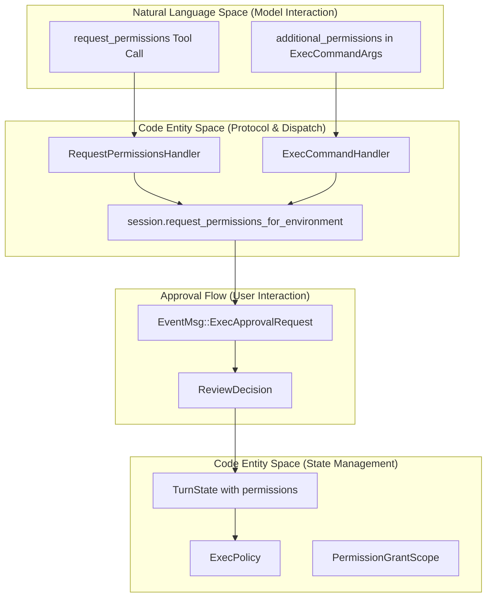
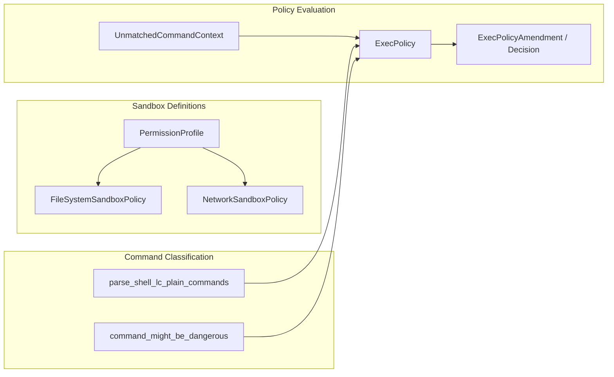

# Permission Request System

Relevant source files

The following files were used as context for generating this wiki page:

- [codex-rs/app-server/tests/suite/v2/request_user_input.rs](codex-rs/app-server/tests/suite/v2/request_user_input.rs)
- [codex-rs/core/src/exec_policy.rs](codex-rs/core/src/exec_policy.rs)
- [codex-rs/core/src/exec_policy_tests.rs](codex-rs/core/src/exec_policy_tests.rs)
- [codex-rs/core/src/exec_policy_windows_tests.rs](codex-rs/core/src/exec_policy_windows_tests.rs)
- [codex-rs/core/src/tools/handlers/plan.rs](codex-rs/core/src/tools/handlers/plan.rs)
- [codex-rs/core/src/tools/handlers/request_permissions.rs](codex-rs/core/src/tools/handlers/request_permissions.rs)
- [codex-rs/core/src/tools/handlers/request_user_input.rs](codex-rs/core/src/tools/handlers/request_user_input.rs)
- [codex-rs/core/src/tools/handlers/shell/shell_command.rs](codex-rs/core/src/tools/handlers/shell/shell_command.rs)
- [codex-rs/core/src/tools/handlers/test_sync.rs](codex-rs/core/src/tools/handlers/test_sync.rs)
- [codex-rs/core/src/tools/handlers/unified_exec/exec_command.rs](codex-rs/core/src/tools/handlers/unified_exec/exec_command.rs)
- [codex-rs/core/src/tools/handlers/unified_exec/write_stdin.rs](codex-rs/core/src/tools/handlers/unified_exec/write_stdin.rs)
- [codex-rs/core/src/tools/runtimes/shell/unix_escalation.rs](codex-rs/core/src/tools/runtimes/shell/unix_escalation.rs)
- [codex-rs/core/src/tools/runtimes/shell/unix_escalation_tests.rs](codex-rs/core/src/tools/runtimes/shell/unix_escalation_tests.rs)
- [codex-rs/core/tests/common/zsh_fork.rs](codex-rs/core/tests/common/zsh_fork.rs)
- [codex-rs/core/tests/suite/agent_websocket.rs](codex-rs/core/tests/suite/agent_websocket.rs)
- [codex-rs/core/tests/suite/approvals.rs](codex-rs/core/tests/suite/approvals.rs)
- [codex-rs/core/tests/suite/exec_policy.rs](codex-rs/core/tests/suite/exec_policy.rs)
- [codex-rs/core/tests/suite/request_user_input.rs](codex-rs/core/tests/suite/request_user_input.rs)
- [codex-rs/core/tests/suite/skill_approval.rs](codex-rs/core/tests/suite/skill_approval.rs)
- [codex-rs/core/tests/suite/turn_state.rs](codex-rs/core/tests/suite/turn_state.rs)
- [codex-rs/core/tests/suite/unified_exec_zsh_fork_approvals.rs](codex-rs/core/tests/suite/unified_exec_zsh_fork_approvals.rs)
- [codex-rs/core/tests/suite/websocket_fallback.rs](codex-rs/core/tests/suite/websocket_fallback.rs)

The Permission Request System enables the AI agent to dynamically request additional sandbox permissions (filesystem, network, and platform-specific capabilities) during execution. This system allows controlled escalation beyond the base `SandboxPolicy` through explicit user approval, with grants that can persist for a single turn or an entire session.

For information about the base sandbox policies and enforcement mechanisms, see [Sandbox and Approval Policies (2.4)](). For tool execution orchestration and approval workflows, see [Tool Orchestration and Approval (5.5)]().

---

## Overview

The permission request system operates through two primary mechanisms:

1.  **Standalone `request_permissions` tool**: Explicit permission request before execution. This is handled by the `RequestPermissionsHandler` [codex-rs/core/src/tools/handlers/request_permissions.rs:20-20]().
2.  **Inline `additional_permissions` field**: Permissions requested alongside execution tool calls (e.g., `shell_command`, `exec_command`). These are provided via the `AdditionalPermissionProfile` struct [codex-rs/core/src/tools/handlers/unified_exec/exec_command.rs:170-170]().

Both mechanisms result in normalized permission structures that can be stored as turn-scoped or session-scoped grants. These grants enable a "sticky permissions" pattern where subsequent tool calls automatically inherit previously-approved permissions without repeated user prompts.

**Sources:** [codex-rs/core/src/tools/handlers/request_permissions.rs:28-40](), [codex-rs/core/src/tools/handlers/unified_exec/exec_command.rs:178-192](), [codex-rs/core/tests/suite/approvals.rs:10-27]()

---

## System Architecture

### Permission Data Flow and Components

The following diagram bridges the model's natural language tool calls to the underlying code entities that manage state and validation within the Core systems.

Title: Permission Request and Validation Flow

**Sources:** [codex-rs/core/src/tools/handlers/request_permissions.rs:84-91](), [codex-rs/core/src/tools/handlers/unified_exec/exec_command.rs:178-192](), [codex-rs/core/src/exec_policy.rs:121-129](), [codex-rs/core/tests/suite/approvals.rs:21-27]()

---

## Implementation Details

### Validation and Execution Policy
The system uses an `ExecPolicy` to evaluate if a command requires explicit approval before execution. The `prompt_is_rejected_by_policy` function determines if a request should be blocked based on the current `AskForApproval` setting [codex-rs/core/src/exec_policy.rs:174-197]().

Key validation components include:
*   **`ExecPolicyCommandOrigin`**: Distinguishes between generic shell commands and PowerShell-specific heuristics [codex-rs/core/src/exec_policy.rs:110-118]().
*   **`UnmatchedCommandContext`**: Contains the sandbox permissions and approval policy used during evaluation [codex-rs/core/src/exec_policy.rs:121-128]().
*   **Shell Parsing**: The system uses specialized parsers to identify the actual underlying operations for policy matching, such as `parse_shell_lc_plain_commands` [codex-rs/core/src/exec_policy.rs:38-39]().

### Approval Rejection Logic
The system enforces granular approval settings. For example, if a policy rule requires approval but `AskForApproval::Granular.rules` is false, the request is rejected with `REJECT_RULES_APPROVAL_REASON` [codex-rs/core/src/exec_policy.rs:47-48](), [codex-rs/core/src/exec_policy.rs:184-187](). Similar logic applies to sandbox escalations [codex-rs/core/src/exec_policy.rs:45-46](), [codex-rs/core/src/exec_policy.rs:190-192]().

Title: Permission Logic and Policy Entities

**Sources:** [codex-rs/core/src/exec_policy.rs:121-129](), [codex-rs/core/src/exec_policy.rs:174-197](), [codex-rs/core/src/tools/runtimes/shell/unix_escalation.rs:80-85](), [codex-rs/core/tests/suite/approvals.rs:21-27]()

---

## Grant Scopes and Persistence

Permissions can be granted with different lifecycles, typically distinguished between "Turn" and "Session" scopes.

| Scope | Description |
|-------|-------------|
| **Turn** | Valid only for the current operation. |
| **Session** | Persists for the remainder of the session. |

### Sticky Permissions Pattern
The "sticky" behavior is implemented via session-scoped approval caches and `ExecPolicy` amendments. When a user approves a request with an amendment, the system can append rules to the policy, such as allowing a specific command prefix [codex-rs/core/src/exec_policy.rs:20-21]().

Subsequent calls are checked against these amended rules using `is_policy_match` [codex-rs/core/src/exec_policy.rs:161-166](). If a match is found in the `PrefixRuleMatch` category, the command is allowed without further interaction [codex-rs/core/src/exec_policy.rs:162-163]().

**Sources:** [codex-rs/core/src/exec_policy.rs:161-166](), [codex-rs/core/src/tools/handlers/unified_exec/exec_command.rs:179-186](), [codex-rs/core/tests/suite/approvals.rs:113-116]()

---

## Network Permission Integration

Network access is managed via `NetworkSandboxPolicy` and can be amended through `NetworkPolicyAmendment` [codex-rs/core/tests/suite/approvals.rs:11-12](). 

The system supports granular rules for network protocols and actions:
*   **`NetworkPolicyRuleAction`**: Defines whether a host/port is allowed or denied [codex-rs/core/tests/suite/approvals.rs:12-12]().
*   **`NetworkApprovalProtocol`**: Distinguishes between different traffic types (e.g., HTTPS, SOCKS5) [codex-rs/core/tests/suite/approvals.rs:10-10]().

These rules are evaluated during the tool execution phase to ensure that any network-bound process (like `curl` or `python` requests) complies with the current session policy [codex-rs/core/src/tools/runtimes/shell/unix_escalation.rs:159-160]().

**Sources:** [codex-rs/core/tests/suite/approvals.rs:10-18](), [codex-rs/core/src/tools/runtimes/shell/unix_escalation.rs:159-160](), [codex-rs/core/src/exec_policy.rs:16-17]()
