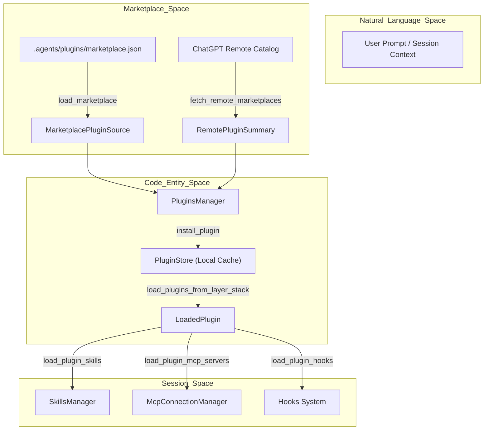
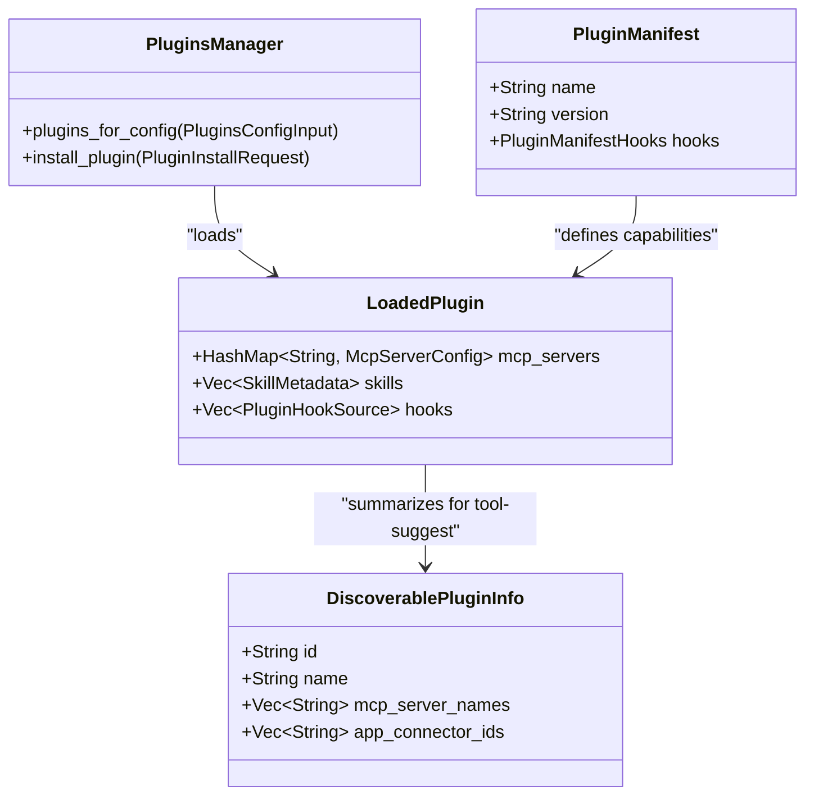

# Plugins System

Relevant source files

The following files were used as context for generating this wiki page:

- [codex-rs/app-server-protocol/schema/json/v2/PluginListResponse.json](codex-rs/app-server-protocol/schema/json/v2/PluginListResponse.json)
- [codex-rs/app-server-protocol/schema/json/v2/PluginReadResponse.json](codex-rs/app-server-protocol/schema/json/v2/PluginReadResponse.json)
- [codex-rs/app-server-protocol/schema/json/v2/PluginShareListResponse.json](codex-rs/app-server-protocol/schema/json/v2/PluginShareListResponse.json)
- [codex-rs/app-server-protocol/src/protocol/v2/plugin.rs](codex-rs/app-server-protocol/src/protocol/v2/plugin.rs)
- [codex-rs/app-server/src/request_processors/catalog_processor.rs](codex-rs/app-server/src/request_processors/catalog_processor.rs)
- [codex-rs/app-server/src/request_processors/plugins.rs](codex-rs/app-server/src/request_processors/plugins.rs)
- [codex-rs/app-server/tests/suite/v2/hooks_list.rs](codex-rs/app-server/tests/suite/v2/hooks_list.rs)
- [codex-rs/app-server/tests/suite/v2/plugin_install.rs](codex-rs/app-server/tests/suite/v2/plugin_install.rs)
- [codex-rs/app-server/tests/suite/v2/plugin_list.rs](codex-rs/app-server/tests/suite/v2/plugin_list.rs)
- [codex-rs/app-server/tests/suite/v2/plugin_read.rs](codex-rs/app-server/tests/suite/v2/plugin_read.rs)
- [codex-rs/app-server/tests/suite/v2/plugin_share.rs](codex-rs/app-server/tests/suite/v2/plugin_share.rs)
- [codex-rs/app-server/tests/suite/v2/plugin_uninstall.rs](codex-rs/app-server/tests/suite/v2/plugin_uninstall.rs)
- [codex-rs/cli/src/marketplace_cmd.rs](codex-rs/cli/src/marketplace_cmd.rs)
- [codex-rs/cli/src/plugin_cmd.rs](codex-rs/cli/src/plugin_cmd.rs)
- [codex-rs/cli/tests/marketplace_add.rs](codex-rs/cli/tests/marketplace_add.rs)
- [codex-rs/cli/tests/marketplace_remove.rs](codex-rs/cli/tests/marketplace_remove.rs)
- [codex-rs/cli/tests/marketplace_upgrade.rs](codex-rs/cli/tests/marketplace_upgrade.rs)
- [codex-rs/cli/tests/plugin_cli.rs](codex-rs/cli/tests/plugin_cli.rs)
- [codex-rs/cli/tests/update.rs](codex-rs/cli/tests/update.rs)
- [codex-rs/config/src/marketplace_edit.rs](codex-rs/config/src/marketplace_edit.rs)
- [codex-rs/core-plugins/src/discoverable.rs](codex-rs/core-plugins/src/discoverable.rs)
- [codex-rs/core-plugins/src/lib.rs](codex-rs/core-plugins/src/lib.rs)
- [codex-rs/core-plugins/src/loader.rs](codex-rs/core-plugins/src/loader.rs)
- [codex-rs/core-plugins/src/manager.rs](codex-rs/core-plugins/src/manager.rs)
- [codex-rs/core-plugins/src/manager_tests.rs](codex-rs/core-plugins/src/manager_tests.rs)
- [codex-rs/core-plugins/src/marketplace.rs](codex-rs/core-plugins/src/marketplace.rs)
- [codex-rs/core-plugins/src/marketplace_tests.rs](codex-rs/core-plugins/src/marketplace_tests.rs)
- [codex-rs/core-plugins/src/remote.rs](codex-rs/core-plugins/src/remote.rs)
- [codex-rs/core-plugins/src/remote/share.rs](codex-rs/core-plugins/src/remote/share.rs)
- [codex-rs/core-plugins/src/remote/share/tests.rs](codex-rs/core-plugins/src/remote/share/tests.rs)
- [codex-rs/core/src/plugins/discoverable.rs](codex-rs/core/src/plugins/discoverable.rs)
- [codex-rs/core/src/plugins/discoverable_tests.rs](codex-rs/core/src/plugins/discoverable_tests.rs)
- [codex-rs/core/src/tools/handlers/request_plugin_install_tests.rs](codex-rs/core/src/tools/handlers/request_plugin_install_tests.rs)
- [codex-rs/tools/src/request_plugin_install.rs](codex-rs/tools/src/request_plugin_install.rs)
- [codex-rs/tools/src/request_plugin_install_tests.rs](codex-rs/tools/src/request_plugin_install_tests.rs)
- [codex-rs/tools/src/tool_discovery.rs](codex-rs/tools/src/tool_discovery.rs)
- [codex-rs/tools/src/tool_discovery_tests.rs](codex-rs/tools/src/tool_discovery_tests.rs)
- [codex-rs/tui/src/snapshots/codex_tui__startup_hooks_review__tests__startup_hooks_review_prompt.snap](codex-rs/tui/src/snapshots/codex_tui__startup_hooks_review__tests__startup_hooks_review_prompt.snap)
- [codex-rs/tui/src/snapshots/codex_tui__startup_hooks_review__tests__startup_hooks_review_prompt_with_trust_error.snap](codex-rs/tui/src/snapshots/codex_tui__startup_hooks_review__tests__startup_hooks_review_prompt_with_trust_error.snap)
- [codex-rs/tui/src/startup_hooks_review.rs](codex-rs/tui/src/startup_hooks_review.rs)

The Plugins System provides an extensibility framework for Codex, allowing the discovery, installation, and execution of third-party capabilities. Plugins bundle multiple entities, including **Skills** (natural language instructions), **MCP Servers** (external tool providers), **App Connectors** (integrations with web services), and **Hooks** (automated session events) [[codex-rs/core-plugins/src/remote.rs:167-173]]() [[codex-rs/core-plugins/src/loader.rs:58-62]]().

## Overview and Marketplace

Plugins are distributed via **Marketplaces**, which are defined by a `marketplace.json` manifest file [[codex-rs/app-server/tests/suite/v2/plugin_list.rs:78-80]](). Codex supports local marketplaces (often in a repository's `.agents/plugins/` or `.claude-plugin/` directory) and remote marketplaces managed via the ChatGPT backend [[codex-rs/app-server/tests/suite/v2/plugin_list.rs:43-44]]() [[codex-rs/core-plugins/src/remote.rs:53-59]]().

### Plugin Discovery and Activation

The system resolves plugins by looking up their metadata in configured marketplaces and matching them against local installation state.

**Plugin Activation Flow**

Sources: [[codex-rs/core-plugins/src/manager.rs:42]](), [[codex-rs/core-plugins/src/loader.rs:128-147]](), [[codex-rs/core-plugins/src/remote.rs:130-142]](), [[codex-rs/core-plugins/src/store.rs:48]]()

## PluginsManager and App Server Integration

The `PluginsManager` coordinates plugin operations, while the `PluginRequestProcessor` in the app-server exposes these capabilities via JSON-RPC [[codex-rs/core-plugins/src/manager.rs:42]]() [[codex-rs/app-server/src/request_processors/plugins.rs:25-32]]().

### Key Structures
| Struct | Description |
| :--- | :--- |
| `LoadedPlugin` | Represents a plugin validated and loaded from disk, containing its skills and MCP servers [[codex-rs/core-plugins/src/lib.rs:23]](). |
| `PluginsManager` | The primary orchestrator for listing, installing, and loading plugins across local and remote sources [[codex-rs/core-plugins/src/manager.rs:42]](). |
| `PluginStore` | Manages the physical files in the plugins cache directory and versioning [[codex-rs/core-plugins/src/store.rs:48]](). |
| `RemotePluginDetail` | Detailed metadata for plugins hosted on remote services, including bundle download URLs [[codex-rs/core-plugins/src/remote.rs:162-174]](). |
| `PluginSummary` | Protocol-level summary used for UI display in marketplace listings [[codex-rs/app-server/src/request_processors/plugins.rs:133-153]](). |

Sources: [[codex-rs/core-plugins/src/lib.rs:23-42]](), [[codex-rs/core-plugins/src/remote.rs:162-174]](), [[codex-rs/app-server/src/request_processors/plugins.rs:25-58]]()

## Plugin Installation and Storage

Plugins are versioned and stored in a local cache directory to ensure session stability.

### Storage Hierarchy
The `PluginStore` enforces a directory structure within the Codex home:
*   **Cache Root**: `plugins/cache/` [[codex-rs/core-plugins/src/store.rs:1]]().
*   **Structure**: `plugins/cache/{marketplace}/{plugin_name}/{version}/` - Contains the immutable plugin bundle [[codex-rs/app-server/tests/suite/v2/plugin_install.rs:198-200]]().
*   **Manifests**: Every plugin must contain a `.codex-plugin/plugin.json` manifest [[codex-rs/core-plugins/src/manager_tests.rs:78-82]]().

### Installation Workflow
1.  **Request**: Triggered via `plugin/install` with a `marketplacePath` or `remoteMarketplaceName` [[codex-rs/app-server/tests/suite/v2/plugin_install.rs:106-111]]().
2.  **Validation**: The system ensures exactly one source is provided and validates the plugin ID [[codex-rs/app-server/tests/suite/v2/plugin_install.rs:129-157]]() [[codex-rs/core-plugins/src/manager.rs:17-18]]().
3.  **Download/Materialization**: For remote plugins, a `.tar.gz` bundle is downloaded, verified, and extracted to the cache [[codex-rs/app-server/tests/suite/v2/plugin_install.rs:208-213]]().
4.  **Registration**: The plugin is registered in the user's `config.toml` under the `[plugins]` table, enabling it for future sessions [[codex-rs/core-plugins/src/manager_tests.rs:131-138]]().

Sources: [[codex-rs/app-server/tests/suite/v2/plugin_install.rs:73-213]](), [[codex-rs/core-plugins/src/store.rs:1-2]](), [[codex-rs/core-plugins/src/manager.rs:148-152]]()

## Remote Plugins and Sharing

Codex supports a "Remote Plugin" feature that allows syncing plugins with the ChatGPT ecosystem [[codex-rs/core-plugins/src/remote.rs:53-64]]().

### Remote Marketplace Sync
The system syncs with global and workspace-specific remote marketplaces:
*   **Marketplaces**: `openai-curated-remote`, `workspace-directory`, and `workspace-shared-with-me` [[codex-rs/core-plugins/src/remote.rs:53-59]]().
*   **Sync Logic**: `sync_remote_installed_plugin_bundles_once` ensures that plugins marked as "installed" in the remote account have their bundles present locally [[codex-rs/core-plugins/src/remote.rs:35]]().
*   **Cache Management**: `mark_remote_plugin_cache_mutation_in_flight` prevents race conditions during concurrent sync operations [[codex-rs/core-plugins/src/remote.rs:33]]().

### Plugin Sharing
Users can share local plugins by uploading them to the remote catalog:
1.  **Discoverability**: Plugins can be `Public`, `Unlisted`, or `Private` [[codex-rs/core-plugins/src/remote.rs:148]]().
2.  **Principals**: Sharing can be targeted at specific users or groups with `Reader` or `Editor` roles [[codex-rs/core-plugins/src/remote.rs:38-40]]().
3.  **Persistence**: `save_remote_plugin_share` handles the registration of the share on the remote service [[codex-rs/core-plugins/src/remote.rs:50]]().

Sources: [[codex-rs/core-plugins/src/remote.rs:30-64]](), [[codex-rs/app-server/src/request_processors/plugins.rs:99-110]]()

## Session Injection and Entity Mapping

During session initialization, the `PluginsManager` provides the necessary injections to the core agent.

**Plugin Entity Mapping**

Sources: [[codex-rs/core-plugins/src/manager.rs:42]](), [[codex-rs/core-plugins/src/loader.rs:128-185]](), [[codex-rs/core/src/plugins/discoverable.rs:36-53]](), [[codex-rs/core-plugins/src/lib.rs:23-24]]()

### Injection Types
*   **Tool Suggestions**: `list_tool_suggest_discoverable_plugins` identifies uninstalled plugins from an allowlist (e.g., `slack@openai-curated`) to suggest to the user based on installed apps [[codex-rs/core/src/plugins/discoverable.rs:9-38]]() [[codex-rs/core/src/plugins/discoverable_tests.rs:84-102]]().
*   **Skills Injection**: `load_plugin_skills` extracts natural language capabilities from the plugin's `skills/` directory [[codex-rs/core-plugins/src/loader.rs:18]]() [[codex-rs/core-plugins/src/manager_tests.rs:83]]().
*   **Hook Dispatch**: `load_plugin_hooks` identifies automated triggers (e.g., `SessionStart`) defined in the plugin's `hooks/hooks.json` [[codex-rs/core-plugins/src/loader.rs:9]]() [[codex-rs/core-plugins/src/loader.rs:51]]().

Sources: [[codex-rs/core/src/plugins/discoverable.rs:9-53]](), [[codex-rs/core-plugins/src/loader.rs:1-53]](), [[codex-rs/core-plugins/src/manager_tests.rs:66-85]]()
