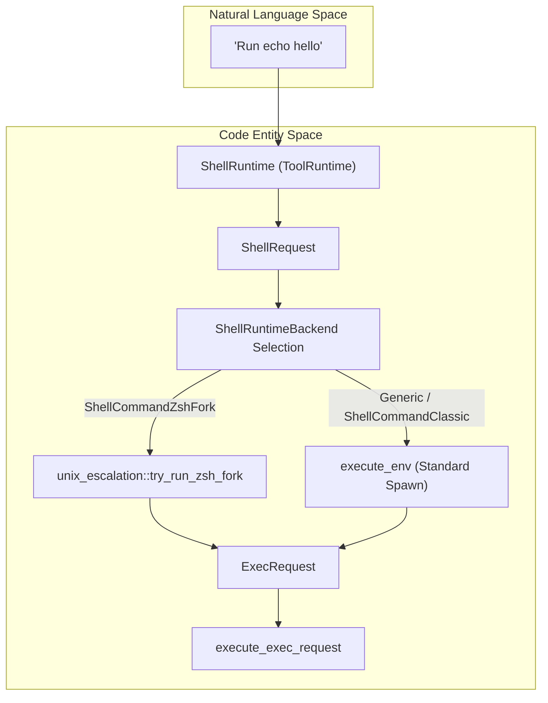
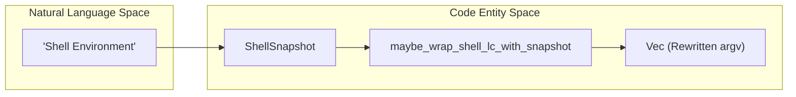

# Shell Execution Tools

Relevant source files

The following files were used as context for generating this wiki page:

- [codex-rs/core/src/exec_policy.rs](codex-rs/core/src/exec_policy.rs)
- [codex-rs/core/src/exec_policy_tests.rs](codex-rs/core/src/exec_policy_tests.rs)
- [codex-rs/core/src/exec_policy_windows_tests.rs](codex-rs/core/src/exec_policy_windows_tests.rs)
- [codex-rs/core/src/tools/events.rs](codex-rs/core/src/tools/events.rs)
- [codex-rs/core/src/tools/handlers/apply_patch.rs](codex-rs/core/src/tools/handlers/apply_patch.rs)
- [codex-rs/core/src/tools/handlers/shell.rs](codex-rs/core/src/tools/handlers/shell.rs)
- [codex-rs/core/src/tools/handlers/unified_exec.rs](codex-rs/core/src/tools/handlers/unified_exec.rs)
- [codex-rs/core/src/tools/handlers/view_image.rs](codex-rs/core/src/tools/handlers/view_image.rs)
- [codex-rs/core/src/tools/network_approval.rs](codex-rs/core/src/tools/network_approval.rs)
- [codex-rs/core/src/tools/orchestrator.rs](codex-rs/core/src/tools/orchestrator.rs)
- [codex-rs/core/src/tools/runtimes/apply_patch.rs](codex-rs/core/src/tools/runtimes/apply_patch.rs)
- [codex-rs/core/src/tools/runtimes/mod.rs](codex-rs/core/src/tools/runtimes/mod.rs)
- [codex-rs/core/src/tools/runtimes/mod_tests.rs](codex-rs/core/src/tools/runtimes/mod_tests.rs)
- [codex-rs/core/src/tools/runtimes/shell.rs](codex-rs/core/src/tools/runtimes/shell.rs)
- [codex-rs/core/src/tools/runtimes/shell/unix_escalation.rs](codex-rs/core/src/tools/runtimes/shell/unix_escalation.rs)
- [codex-rs/core/src/tools/runtimes/shell/unix_escalation_tests.rs](codex-rs/core/src/tools/runtimes/shell/unix_escalation_tests.rs)
- [codex-rs/core/src/tools/runtimes/unified_exec.rs](codex-rs/core/src/tools/runtimes/unified_exec.rs)
- [codex-rs/core/src/tools/sandboxing.rs](codex-rs/core/src/tools/sandboxing.rs)
- [codex-rs/core/src/turn_diff_tracker.rs](codex-rs/core/src/turn_diff_tracker.rs)
- [codex-rs/core/src/turn_diff_tracker_tests.rs](codex-rs/core/src/turn_diff_tracker_tests.rs)
- [codex-rs/core/src/unified_exec/mod.rs](codex-rs/core/src/unified_exec/mod.rs)
- [codex-rs/core/src/unified_exec/process_manager.rs](codex-rs/core/src/unified_exec/process_manager.rs)
- [codex-rs/core/tests/common/zsh_fork.rs](codex-rs/core/tests/common/zsh_fork.rs)
- [codex-rs/core/tests/suite/approvals.rs](codex-rs/core/tests/suite/approvals.rs)
- [codex-rs/core/tests/suite/exec_policy.rs](codex-rs/core/tests/suite/exec_policy.rs)
- [codex-rs/core/tests/suite/skill_approval.rs](codex-rs/core/tests/suite/skill_approval.rs)
- [codex-rs/core/tests/suite/unified_exec.rs](codex-rs/core/tests/suite/unified_exec.rs)
- [codex-rs/core/tests/suite/unified_exec_zsh_fork_approvals.rs](codex-rs/core/tests/suite/unified_exec_zsh_fork_approvals.rs)
- [codex-rs/shell-command/src/command_safety/is_dangerous_command.rs](codex-rs/shell-command/src/command_safety/is_dangerous_command.rs)
- [codex-rs/shell-command/src/command_safety/is_safe_command.rs](codex-rs/shell-command/src/command_safety/is_safe_command.rs)
- [codex-rs/shell-command/src/command_safety/mod.rs](codex-rs/shell-command/src/command_safety/mod.rs)
- [codex-rs/shell-command/src/command_safety/powershell_parser.ps1](codex-rs/shell-command/src/command_safety/powershell_parser.ps1)
- [codex-rs/shell-command/src/command_safety/powershell_parser.rs](codex-rs/shell-command/src/command_safety/powershell_parser.rs)
- [codex-rs/shell-command/src/command_safety/windows_dangerous_commands.rs](codex-rs/shell-command/src/command_safety/windows_dangerous_commands.rs)
- [codex-rs/shell-command/src/command_safety/windows_safe_commands.rs](codex-rs/shell-command/src/command_safety/windows_safe_commands.rs)
- [codex-rs/shell-command/src/powershell.rs](codex-rs/shell-command/src/powershell.rs)

This page documents the shell execution tools that enable Codex to run commands on the user's system. These tools are the primary interface for executing shell commands, managing interactive processes, and handling multi-turn command interactions. It covers the core `shell` abstraction, the specialized `unix_escalation` protocol for Zsh, and the unified interactive execution system.

## Overview

Codex provides shell execution capabilities through tools that handle both non-interactive script execution and interactive PTY sessions. The system supports multiple backends, including a standard process spawner and a specialized `zsh` fork for enhanced control and safety.

| Tool Name | Purpose | Implementation Runtime | Backend Options |
|-----------|---------|------------------------|-----------------|
| `shell_command` | Execute script-style commands | `ShellRuntime` [codex-rs/core/src/tools/runtimes/shell.rs:88]() | Classic, ZshFork |
| `exec_command` | Interactive PTY sessions | `UnifiedExecRuntime` [codex-rs/core/src/tools/runtimes/unified_exec.rs:96]() | Direct or ZshFork |
| `write_stdin` | Send input to running PTY | `WriteStdinHandler` [codex-rs/core/src/tools/handlers/unified_exec.rs:25]() | `UnifiedExecProcessManager` |

The execution environment is governed by `ExecParams` [codex-rs/core/src/exec.rs:85-97]() and `ExecRequest` [codex-rs/core/src/sandboxing/mod.rs:45-63](), which encapsulate command arguments, working directories, environment variables, and sandbox policies.

**Sources:** [codex-rs/core/src/exec.rs:85-97](), [codex-rs/core/src/sandboxing/mod.rs:45-63](), [codex-rs/core/src/tools/runtimes/shell.rs:54-70]()

## Backend Selection and Execution Flow

The system selects a backend based on configuration and the user's environment. On Unix systems, the `zsh` fork is preferred for its ability to intercept `execve` calls and apply granular security policies.

**Diagram: Shell Execution Backend Routing**

**Implementation Details:**
- **ZshFork**: If `Feature::ShellZshFork` is enabled and the user shell is Zsh [codex-rs/core/src/tools/runtimes/shell/unix_escalation.rs:113-120](), the system uses a patched `zsh` binary and `codex-shell-escalation` server [codex-rs/core/src/tools/runtimes/shell/unix_escalation.rs:54-65]().
- **Standard Execution**: Falls back to `execute_env` which calls `execute_exec_request` [codex-rs/core/src/sandboxing/mod.rs:169-174]().

**Sources:** [codex-rs/core/src/tools/runtimes/shell/unix_escalation.rs:102-120](), [codex-rs/core/src/sandboxing/mod.rs:169-174](), [codex-rs/core/src/tools/runtimes/shell.rs:74-86]()

## Unified Exec: Interactive Process Management

The Unified Exec system manages long-running interactive processes (PTYs) that persist across multiple model turns. It is orchestrated by the `UnifiedExecProcessManager` [codex-rs/core/src/unified_exec/mod.rs:133-136]().

### Process Lifecycle
1. **Orchestration**: The `UnifiedExecRuntime` [codex-rs/core/src/tools/runtimes/unified_exec.rs:96]() handles approvals and sandbox selection via the `ToolOrchestrator`.
2. **Execution**: `ExecCommandRequest` [codex-rs/core/src/unified_exec/mod.rs:91-109]() encapsulates the resolved parameters for the process manager.
3. **Capture Policy**: Uses `ExecCapturePolicy::ShellTool` to maintain historical output caps and timeout behavior [codex-rs/core/src/exec.rs:128-131]().
4. **Pruning**: The `ProcessStore` [codex-rs/core/src/unified_exec/mod.rs:121-124]() manages active handles and prunes them using an LRU policy if the `MAX_UNIFIED_EXEC_PROCESSES` limit (64) is reached [codex-rs/core/src/unified_exec/mod.rs:72]().

### Output Streaming
Live output is streamed back to the session via `EventMsg::ExecCommandOutputDelta` [codex-rs/core/src/exec.rs:39](). The system enforces a limit of 10,000 delta events per call to prevent flooding [codex-rs/core/src/exec.rs:73](). Output is buffered in a `HeadTailBuffer` [codex-rs/core/src/unified_exec/head_tail_buffer.rs:1]() to handle large streams while preserving critical exit context. Hard caps are enforced by `UNIFIED_EXEC_OUTPUT_MAX_BYTES` (1 MiB) [codex-rs/core/src/unified_exec/mod.rs:70]().

**Sources:** [codex-rs/core/src/unified_exec/mod.rs:1-180](), [codex-rs/core/src/exec.rs:39-73](), [codex-rs/core/src/exec.rs:128-131](), [codex-rs/core/src/unified_exec/process_manager.rs:1-205]()

## Unix Escalation Protocol (Zsh Fork)

The `unix_escalation` module [codex-rs/core/src/tools/runtimes/shell/unix_escalation.rs:1]() implements a protocol for managing shell execution through a patched Zsh process. This allows Codex to intercept sub-commands and apply "Just-in-Time" (JIT) approvals.

### Key Components
- **CoreShellCommandExecutor**: Implements the `ShellCommandExecutor` trait to handle the actual spawning of commands under the escalation server [codex-rs/core/src/tools/runtimes/shell/unix_escalation.rs:172-185]().
- **EscalateServer**: A communication bridge between the core agent and the patched shell [codex-rs/core/src/tools/runtimes/shell/unix_escalation.rs:54]().
- **codex-execve-wrapper**: A wrapper binary used to intercept execution attempts via the `EXEC_WRAPPER` environment variable.

### Approval Logic
If a command requires approval (based on `AskForApproval` settings), the system can pause execution and request user intervention. It specifically handles:
- **Sandbox Approval**: Required when a command attempts to break out of default sandbox constraints [codex-rs/core/src/tools/runtimes/shell/unix_escalation.rs:82-83]().
- **Rule-Based Approval**: Triggered by specific `exec_policy` matches [codex-rs/core/src/tools/runtimes/shell/unix_escalation.rs:84-85]().

**Sources:** [codex-rs/core/src/tools/runtimes/shell/unix_escalation.rs:54-185](), [codex-rs/core/src/tools/runtimes/shell/unix_escalation.rs:80-85]()

## Command Safety and Policy

Execution is governed by an `exec_policy` [codex-rs/core/src/exec_policy.rs:17]() which evaluates commands against a set of rules.

### Safe and Dangerous Command Detection
Codex uses a heuristic-based safety checker to auto-approve benign commands and flag risky ones.
- **Safe Commands**: The `is_known_safe_command` function [codex-rs/shell-command/src/command_safety/is_safe_command.rs:12]() identifies read-only or harmless commands like `ls`, `cat`, or `pwd` [codex-rs/shell-command/src/command_safety/is_safe_command.rs:76-102]().
- **Dangerous Commands**: The `command_might_be_dangerous` function [codex-rs/shell-command/src/command_safety/is_dangerous_command.rs:7]() identifies risky patterns such as `rm -rf` [codex-rs/shell-command/src/command_safety/is_dangerous_command.rs:149]().
- **Script Inspection**: Both checkers support parsing `bash -lc` or `zsh -lc` scripts to inspect inner commands [codex-rs/shell-command/src/command_safety/is_safe_command.rs:41-48](), [codex-rs/shell-command/src/command_safety/is_dangerous_command.rs:20-26]().

### Windows Safety
On Windows, safety is restricted to a small allow-list of PowerShell cmdlets [codex-rs/shell-command/src/command_safety/windows_safe_commands.rs:8-17](). The system uses `parse_with_powershell_ast` [codex-rs/shell-command/src/command_safety/windows_safe_commands.rs:98]() to tokenize and validate scripts. It specifically rejects nested unsafe cmdlets like `Set-Content` or `Remove-Item` [codex-rs/shell-command/src/command_safety/windows_safe_commands.rs:152-173]().

**Sources:** [codex-rs/shell-command/src/command_safety/is_safe_command.rs:12-102](), [codex-rs/shell-command/src/command_safety/is_dangerous_command.rs:7-149](), [codex-rs/shell-command/src/command_safety/windows_safe_commands.rs:8-173]()

## Environment and Context Management

Before execution, Codex constructs a sanitized environment to prevent leaking sensitive information while ensuring the shell functions correctly.

### Environment Variable Policy
The `exec_env_for_sandbox_permissions` function [codex-rs/core/src/tools/runtimes/mod.rs:54-65]() strips managed proxy environment variables if escalated permissions are required [codex-rs/core/src/tools/runtimes/mod.rs:59-63](). This is implemented via `strip_managed_proxy_env` [codex-rs/core/src/tools/runtimes/mod.rs:67-87](), which removes keys like `PROXY_ENV_KEYS` and `CUSTOM_CA_ENV_KEYS`.

### Snapshot Integration
For POSIX shells (Bash/Zsh/sh), Codex can wrap commands to source a shell snapshot before execution [codex-rs/core/src/tools/runtimes/mod.rs:175-220](). This ensures that aliases, functions, and exported variables from the user's interactive session are available to the agent.

**Diagram: Environment Context to Rewritten Shell Command Mapping**

**Sources:** [codex-rs/core/src/tools/runtimes/mod.rs:54-87](), [codex-rs/core/src/tools/runtimes/mod.rs:175-220]()

## User Shell Commands

The `/shell` command in the UI allows users to execute commands directly. This is handled by the `UserShellCommandTask` [codex-rs/core/src/tasks/user_shell.rs:53-61]().

- **Permissions**: Runs with `PermissionProfile::Disabled` (full-access escape hatch) [codex-rs/core/src/tasks/user_shell.rs:166-179]().
- **Mode**: Can run as a `StandaloneTurn` (new turn lifecycle) or `ActiveTurnAuxiliary` (within an existing turn) [codex-rs/core/src/tasks/user_shell.rs:43-50]().
- **Timeout**: Defaults to 1 hour (`USER_SHELL_TIMEOUT_MS`) for user-initiated commands [codex-rs/core/src/tasks/user_shell.rs:40]().

**Sources:** [codex-rs/core/src/tasks/user_shell.rs:40-61](), [codex-rs/core/src/tasks/user_shell.rs:166-179]()
