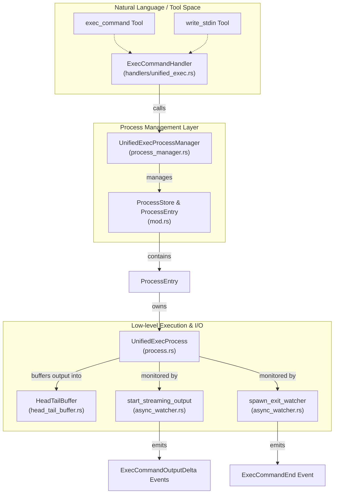
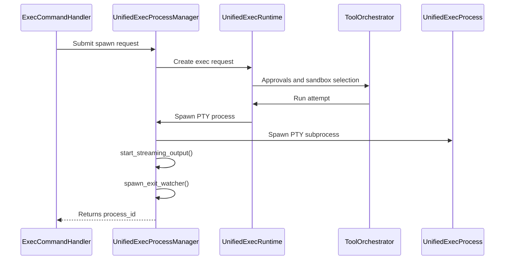
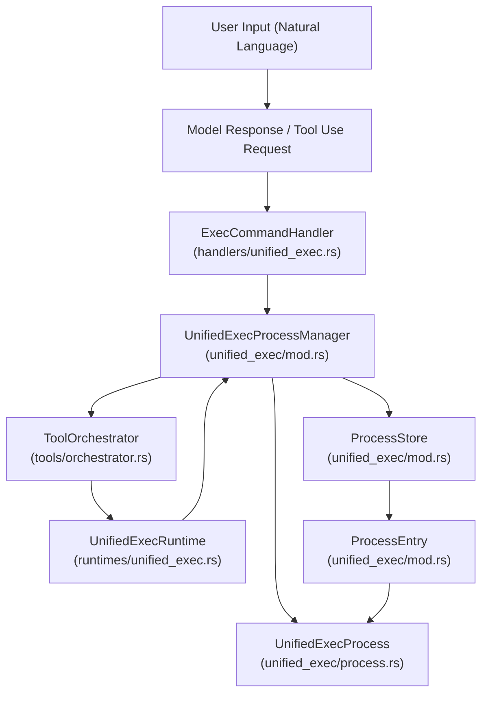

# Unified Exec Process Management

<details>
<summary>Relevant source files</summary>

The following files were used as context for generating this wiki page:

- [codex-rs/core/src/environment_selection.rs](codex-rs/core/src/environment_selection.rs)
- [codex-rs/core/src/tools/events.rs](codex-rs/core/src/tools/events.rs)
- [codex-rs/core/src/tools/handlers/apply_patch.rs](codex-rs/core/src/tools/handlers/apply_patch.rs)
- [codex-rs/core/src/tools/handlers/shell.rs](codex-rs/core/src/tools/handlers/shell.rs)
- [codex-rs/core/src/tools/handlers/unified_exec.rs](codex-rs/core/src/tools/handlers/unified_exec.rs)
- [codex-rs/core/src/tools/handlers/view_image.rs](codex-rs/core/src/tools/handlers/view_image.rs)
- [codex-rs/core/src/tools/network_approval.rs](codex-rs/core/src/tools/network_approval.rs)
- [codex-rs/core/src/tools/orchestrator.rs](codex-rs/core/src/tools/orchestrator.rs)
- [codex-rs/core/src/tools/runtimes/apply_patch.rs](codex-rs/core/src/tools/runtimes/apply_patch.rs)
- [codex-rs/core/src/tools/runtimes/mod.rs](codex-rs/core/src/tools/runtimes/mod.rs)
- [codex-rs/core/src/tools/runtimes/mod_tests.rs](codex-rs/core/src/tools/runtimes/mod_tests.rs)
- [codex-rs/core/src/tools/runtimes/shell.rs](codex-rs/core/src/tools/runtimes/shell.rs)
- [codex-rs/core/src/tools/runtimes/unified_exec.rs](codex-rs/core/src/tools/runtimes/unified_exec.rs)
- [codex-rs/core/src/tools/sandboxing.rs](codex-rs/core/src/tools/sandboxing.rs)
- [codex-rs/core/src/turn_diff_tracker.rs](codex-rs/core/src/turn_diff_tracker.rs)
- [codex-rs/core/src/turn_diff_tracker_tests.rs](codex-rs/core/src/turn_diff_tracker_tests.rs)
- [codex-rs/core/src/unified_exec/mod.rs](codex-rs/core/src/unified_exec/mod.rs)
- [codex-rs/core/src/unified_exec/mod_tests.rs](codex-rs/core/src/unified_exec/mod_tests.rs)
- [codex-rs/core/src/unified_exec/process.rs](codex-rs/core/src/unified_exec/process.rs)
- [codex-rs/core/src/unified_exec/process_manager.rs](codex-rs/core/src/unified_exec/process_manager.rs)
- [codex-rs/core/src/unified_exec/process_tests.rs](codex-rs/core/src/unified_exec/process_tests.rs)
- [codex-rs/core/tests/suite/unified_exec.rs](codex-rs/core/tests/suite/unified_exec.rs)
- [codex-rs/exec-server/Cargo.toml](codex-rs/exec-server/Cargo.toml)
- [codex-rs/exec-server/src/client.rs](codex-rs/exec-server/src/client.rs)
- [codex-rs/exec-server/src/environment.rs](codex-rs/exec-server/src/environment.rs)
- [codex-rs/exec-server/src/environment_provider.rs](codex-rs/exec-server/src/environment_provider.rs)
- [codex-rs/exec-server/src/environment_toml.rs](codex-rs/exec-server/src/environment_toml.rs)
- [codex-rs/exec-server/src/lib.rs](codex-rs/exec-server/src/lib.rs)
- [codex-rs/exec-server/src/local_process.rs](codex-rs/exec-server/src/local_process.rs)
- [codex-rs/exec-server/src/process.rs](codex-rs/exec-server/src/process.rs)
- [codex-rs/exec-server/src/protocol.rs](codex-rs/exec-server/src/protocol.rs)
- [codex-rs/exec-server/src/remote_process.rs](codex-rs/exec-server/src/remote_process.rs)
- [codex-rs/exec-server/src/server/handler.rs](codex-rs/exec-server/src/server/handler.rs)
- [codex-rs/exec-server/src/server/process_handler.rs](codex-rs/exec-server/src/server/process_handler.rs)
- [codex-rs/exec-server/src/server/registry.rs](codex-rs/exec-server/src/server/registry.rs)
- [codex-rs/exec-server/tests/exec_process.rs](codex-rs/exec-server/tests/exec_process.rs)
- [codex-rs/utils/pty/Cargo.toml](codex-rs/utils/pty/Cargo.toml)
- [codex-rs/utils/pty/README.md](codex-rs/utils/pty/README.md)
- [codex-rs/utils/pty/src/lib.rs](codex-rs/utils/pty/src/lib.rs)
- [codex-rs/utils/pty/src/pipe.rs](codex-rs/utils/pty/src/pipe.rs)
- [codex-rs/utils/pty/src/process.rs](codex-rs/utils/pty/src/process.rs)
- [codex-rs/utils/pty/src/process_group.rs](codex-rs/utils/pty/src/process_group.rs)
- [codex-rs/utils/pty/src/pty.rs](codex-rs/utils/pty/src/pty.rs)
- [codex-rs/utils/pty/src/tests.rs](codex-rs/utils/pty/src/tests.rs)
- [codex-rs/utils/pty/src/win/conpty.rs](codex-rs/utils/pty/src/win/conpty.rs)
- [codex-rs/utils/pty/src/win/mod.rs](codex-rs/utils/pty/src/win/mod.rs)
- [codex-rs/utils/pty/src/win/procthreadattr.rs](codex-rs/utils/pty/src/win/procthreadattr.rs)
- [codex-rs/utils/pty/src/win/psuedocon.rs](codex-rs/utils/pty/src/win/psuedocon.rs)
- [codex-rs/windows-sandbox-rs/src/conpty/mod.rs](codex-rs/windows-sandbox-rs/src/conpty/mod.rs)
- [codex-rs/windows-sandbox-rs/src/elevated/ipc_framed.rs](codex-rs/windows-sandbox-rs/src/elevated/ipc_framed.rs)
- [third_party/wezterm/LICENSE](third_party/wezterm/LICENSE)

</details>


## Purpose and Scope

The Unified Exec system provides **interactive PTY-based process execution** orchestrated with approvals and sandboxing, enabling persistent shell sessions that can maintain state across multiple tool calls. It manages PTY-backed subprocesses, their lifecycle, output buffering with caps, and enforces centralized approval and sandboxing policies using a shared orchestrator.

This page details the implementation of the Unified Exec process management layer, core tools `exec_command` and `write_stdin`, the `ProcessStore` for tracking active processes, and the LRU pruning mechanism for resource control.

Sources: [codex-rs/core/src/unified_exec/mod.rs:1-23]()

---

## Architecture Overview

The Unified Exec architecture connects high-level tool invocation with underlying PTY process management and asynchronous event streaming.

Title: Unified Exec Component Interaction


**Key Components:**

- **UnifiedExecProcessManager**: Central coordinator handling process creation, reuse, lifecycle, and pruning [codex-rs/core/src/unified_exec/mod.rs:133-136]().
- **ProcessStore**: Thread-safe store tracking active process entries and reserved IDs [codex-rs/core/src/unified_exec/mod.rs:121-124]().
- **ProcessEntry**: Metadata for each process including process handle, call ID, last used timestamp for LRU, and associated session info [codex-rs/core/src/unified_exec/mod.rs:154-165]().
- **UnifiedExecProcess**: The PTY-backed process handle implementing I/O and exit status tracking [codex-rs/core/src/unified_exec/mod.rs:62-62]().
- **HeadTailBuffer**: Efficient output buffer that retains leading and trailing output with a fixed max size, dropping middle output as needed for memory control [codex-rs/core/src/unified_exec/process_manager.rs:48-48]().
- **Async watchers**: Background tasks that monitor `UnifiedExecProcess` for incremental output and process exit, emitting structured events to the Codex session/event stream [codex-rs/core/src/unified_exec/process_manager.rs:42-45]().

Sources: [codex-rs/core/src/unified_exec/mod.rs:25-165](), [codex-rs/core/src/unified_exec/process_manager.rs:1-51]()

---

## UnifiedExecProcessManager and ProcessStore

### UnifiedExecProcessManager

The `UnifiedExecProcessManager` is the high-level interface managing the lifecycle of Unified Exec processes. It encapsulates a `ProcessStore` protected by an asynchronous `Mutex` to coordinate concurrent access.

```rust
pub(crate) struct UnifiedExecProcessManager {
    process_store: Mutex<ProcessStore>,
    max_write_stdin_yield_time_ms: u64,
}
```

- `max_write_stdin_yield_time_ms` defines the clamp on max wait time for output after writing stdin input [codex-rs/core/src/unified_exec/mod.rs:135-135]().
- Provides methods to spawn new processes (for `exec_command` calls) or write input to existing ones (`write_stdin`).
- Implements LRU pruning logic to maintain a maximum number of active processes, currently capped at 64 [codex-rs/core/src/unified_exec/mod.rs:72-72]().

Sources: [codex-rs/core/src/unified_exec/mod.rs:133-146](), [codex-rs/core/src/unified_exec/process_manager.rs:39-40]()

### ProcessStore

The `ProcessStore` holds the active processes keyed by their integer process IDs and maintains a reservation set for allocated IDs.

```rust
pub(crate) struct ProcessStore {
    processes: HashMap<i32, ProcessEntry>,
    reserved_process_ids: HashSet<i32>,
}
```

- Provides safe removal of processes via `remove` [codex-rs/core/src/unified_exec/mod.rs:127-130]().
- Prunes the least recently used processes when capacity is exceeded using timestamps stored in `ProcessEntry` [codex-rs/core/src/unified_exec/mod.rs:164-164]().

Sources: [codex-rs/core/src/unified_exec/mod.rs:121-131]()

### ProcessEntry

Each stored process includes metadata necessary for management, LRU tracking, and context association:

```rust
struct ProcessEntry {
    process: Arc<UnifiedExecProcess>,
    call_id: String,
    process_id: i32,
    cwd: AbsolutePathBuf,
    initial_exec_command_active: Arc<std::sync::atomic::AtomicBool>,
    hook_command: String,
    tty: bool,
    network_approval: Option<DeferredNetworkApproval>,
    session: Weak<Session>,
    last_used: tokio::time::Instant,
}
```

- References the actual process handle (`UnifiedExecProcess`) [codex-rs/core/src/unified_exec/mod.rs:155-155]().
- Includes session linkage via a weak reference to prevent reference cycles [codex-rs/core/src/unified_exec/mod.rs:163-163]().
- Tracks `last_used` instant for LRU pruning [codex-rs/core/src/unified_exec/mod.rs:164-164]().
- Holds optional `DeferredNetworkApproval` for network access tracking [codex-rs/core/src/unified_exec/mod.rs:162-162]().

Sources: [codex-rs/core/src/unified_exec/mod.rs:154-165]()

---

## Tools: exec_command and write_stdin

### exec_command Tool

The `exec_command` tool starts a new process or reuses an existing one by spawning a PTY-backed process.

- Handled by `ExecCommandHandler` [codex-rs/core/src/tools/handlers/unified_exec.rs:23-24]().
- Parses arguments like `cmd`, `workdir`, `shell`, and options such as `tty`, `login`, and `max_output_tokens` [codex-rs/core/src/tools/handlers/unified_exec.rs:28-50]().
- Resolves the effective shell command invocation considering session shell and shell modes (`Direct` or `ZshFork`) [codex-rs/core/src/tools/handlers/unified_exec.rs:99-145]().
- Delegates protocol-level approval and sandboxing orchestration to `ToolOrchestrator` and `UnifiedExecRuntime` [codex-rs/core/src/tools/runtimes/unified_exec.rs:147-180]().

Title: exec_command tool execution flow


Sources: [codex-rs/core/src/tools/handlers/unified_exec.rs:20-145](), [codex-rs/core/src/tools/runtimes/unified_exec.rs:95-121](), [codex-rs/core/src/tools/orchestrator.rs:25-25]()

### write_stdin Tool

The `write_stdin` tool sends input to an existing process via its `process_id`.

- Managed by `WriteStdinHandler` [codex-rs/core/src/tools/handlers/unified_exec.rs:25-25]().
- Looks up the process entry in the `ProcessStore` with the requested ID.
- Uses a yield time to pause for output generation, clamping defaults to 250ms minimum [codex-rs/core/src/unified_exec/mod.rs:64-64](), and 5s minimum if input is empty [codex-rs/core/src/unified_exec/mod.rs:66-66]().

Sources: [codex-rs/core/src/unified_exec/mod.rs:112-118](), [codex-rs/core/src/unified_exec/process_manager.rs:41-41]()

---

## Output Buffering and Streaming

### HeadTailBuffer

Output from processes is buffered in a `HeadTailBuffer`, which stores the leading and trailing output segments, dropping intermediate content if the output grows beyond a configured limit [codex-rs/core/src/unified_exec/process_manager.rs:48-48]().

### Async Output Streaming

Upon spawning a process, `start_streaming_output` is called:

- Runs asynchronously, reading output chunks from the `UnifiedExecProcess` [codex-rs/core/src/unified_exec/process_manager.rs:45-45]().
- Emits output delta events incrementally to the session event stream.
- Respects maximum output token limits (default 10,000 tokens) [codex-rs/core/src/unified_exec/mod.rs:69-69]() and total byte cap (1 MiB) [codex-rs/core/src/unified_exec/mod.rs:70-70]().

An exit watcher spawned by `spawn_exit_watcher` waits for the process termination and emits a final `ExecCommandEnd` event [codex-rs/core/src/unified_exec/process_manager.rs:44-44]().

Sources: [codex-rs/core/src/unified_exec/process_manager.rs:41-45](), [codex-rs/core/src/unified_exec/mod.rs:68-71]()

---

## Process ID and Yield Time Controls

### Process ID Generation

Process IDs are generated using a random range in production, but can be forced to deterministic values for testing [codex-rs/core/src/unified_exec/process_manager.rs:82-92]().

```rust
pub(crate) fn generate_chunk_id() -> String {
    let mut rng = rng();
    (0..6)
        .map(|_| format!("{:x}", rng.random_range(0..16)))
        .collect()
}
```

Sources: [codex-rs/core/src/unified_exec/mod.rs:175-180](), [codex-rs/core/src/unified_exec/process_manager.rs:82-92]()

### Yield Time Clamping

Output wait times after commands or input writes are clamped:

| Constant                   | Value (ms) | Description                           |
|----------------------------|------------|------------------------------------|
| `MIN_YIELD_TIME_MS`           | 250        | Min normal yield time for output [codex-rs/core/src/unified_exec/mod.rs:64-64]() |
| `MIN_EMPTY_YIELD_TIME_MS`     | 5,000      | Min wait time if input is empty [codex-rs/core/src/unified_exec/mod.rs:66-66]() |
| `MAX_YIELD_TIME_MS`           | 30,000     | Max allowed yield time [codex-rs/core/src/unified_exec/mod.rs:67-67]() |

Sources: [codex-rs/core/src/unified_exec/mod.rs:64-67](), [codex-rs/core/src/unified_exec/process_manager.rs:33-35]()

---

## LRU Pruning and Resource Limits

The `UnifiedExecProcessManager` enforces an upper bound on concurrently active processes:

| Constant                 | Value | Description                                |
|-------------------------|-------|--------------------------------------------|
| `MAX_UNIFIED_EXEC_PROCESSES` | 64    | Maximum concurrent PTY processes allowed [codex-rs/core/src/unified_exec/mod.rs:72-72]() |

When spawning a new process while capacity is reached, the manager prunes the least recently used (LRU) process by sorting entries by their `last_used` timestamp [codex-rs/core/src/unified_exec/mod.rs:164-164]().

Sources: [codex-rs/core/src/unified_exec/mod.rs:72-72](), [codex-rs/core/src/unified_exec/process_manager.rs:32-32]()

---

## Summary Table: Responsibilities of Core Entities

| Component/Entity              | Responsibility / Role                                          | File and Location                           |
|------------------------------|---------------------------------------------------------------|---------------------------------------------|
| `UnifiedExecProcessManager`  | Guard process lifecycle: spawn, reuse, prune; manage IDs      | [codex-rs/core/src/unified_exec/mod.rs:133-146]() |
| `ProcessStore`               | Storage and bookkeeping of active processes                    | [codex-rs/core/src/unified_exec/mod.rs:121-124]() |
| `ProcessEntry`               | Metadata per active process: call_id, timestamps, session refs| [codex-rs/core/src/unified_exec/mod.rs:154-165]() |
| `UnifiedExecProcess`          | Low-level PTY and OS process handle                            | [codex-rs/core/src/unified_exec/mod.rs:62-62]() |
| `ExecCommandHandler`          | Tool handler entrypoint for `exec_command`                     | [codex-rs/core/src/tools/handlers/unified_exec.rs:23-24]() |
| `WriteStdinHandler`           | Tool handler entrypoint for `write_stdin`                      | [codex-rs/core/src/tools/handlers/unified_exec.rs:25-25]() |
| `ToolOrchestrator`            | Central approval and sandbox orchestration                     | [codex-rs/core/src/tools/orchestrator.rs:25-25]() |
| `UnifiedExecRuntime`          | ToolRuntime implementation integrating manager and orchestrator| [codex-rs/core/src/tools/runtimes/unified_exec.rs:96-99]() |

---

# Diagrams Bridging Natural Language to Code Entities

### Diagram 1: From user prompt through exec_command tool to managed process lifecycle

Title: User Intent to Managed Process


### Diagram 2: Writing to process stdin and output streaming chain

Title: write_stdin tool and output event chain


Sources: [codex-rs/core/src/unified_exec/mod.rs:1-180](), [codex-rs/core/src/unified_exec/process_manager.rs:1-180](), [codex-rs/core/src/tools/handlers/unified_exec.rs:1-145](), [codex-rs/core/src/tools/runtimes/unified_exec.rs:1-180](), [codex-rs/core/src/tools/orchestrator.rs:21-25]()
