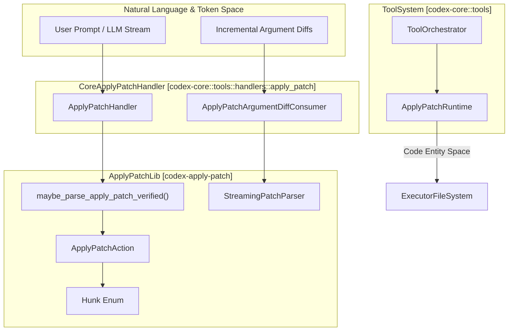
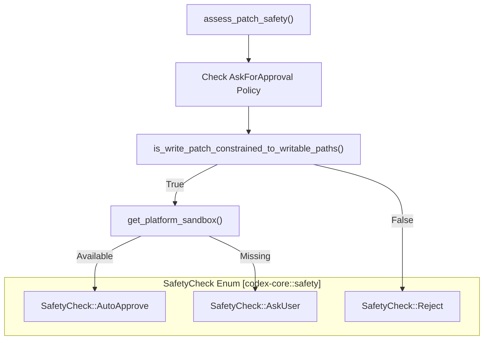
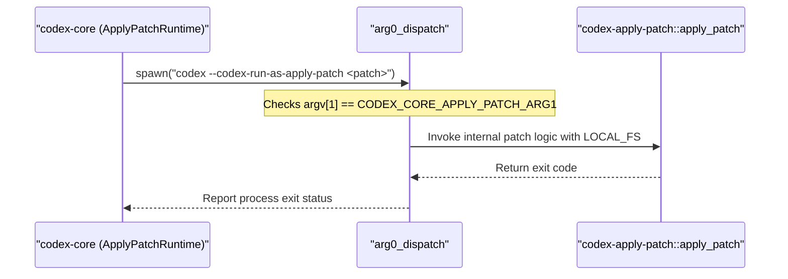

# Apply Patch System

Relevant source files

The following files were used as context for generating this wiki page:

- [codex-rs/apply-patch/src/invocation.rs](codex-rs/apply-patch/src/invocation.rs)
- [codex-rs/apply-patch/src/lib.rs](codex-rs/apply-patch/src/lib.rs)
- [codex-rs/apply-patch/src/parser.rs](codex-rs/apply-patch/src/parser.rs)
- [codex-rs/apply-patch/src/standalone_executable.rs](codex-rs/apply-patch/src/standalone_executable.rs)
- [codex-rs/apply-patch/src/streaming_parser.rs](codex-rs/apply-patch/src/streaming_parser.rs)
- [codex-rs/apply-patch/tests/fixtures/scenarios/020_whitespace_padded_patch_marker_lines/expected/file.txt](codex-rs/apply-patch/tests/fixtures/scenarios/020_whitespace_padded_patch_marker_lines/expected/file.txt)
- [codex-rs/apply-patch/tests/fixtures/scenarios/020_whitespace_padded_patch_marker_lines/input/file.txt](codex-rs/apply-patch/tests/fixtures/scenarios/020_whitespace_padded_patch_marker_lines/input/file.txt)
- [codex-rs/apply-patch/tests/fixtures/scenarios/020_whitespace_padded_patch_marker_lines/patch.txt](codex-rs/apply-patch/tests/fixtures/scenarios/020_whitespace_padded_patch_marker_lines/patch.txt)
- [codex-rs/arg0/Cargo.toml](codex-rs/arg0/Cargo.toml)
- [codex-rs/arg0/src/lib.rs](codex-rs/arg0/src/lib.rs)
- [codex-rs/core/src/apply_patch.rs](codex-rs/core/src/apply_patch.rs)
- [codex-rs/core/src/safety.rs](codex-rs/core/src/safety.rs)
- [codex-rs/core/src/tools/events.rs](codex-rs/core/src/tools/events.rs)
- [codex-rs/core/src/tools/handlers/apply_patch.rs](codex-rs/core/src/tools/handlers/apply_patch.rs)
- [codex-rs/core/src/tools/handlers/apply_patch_spec.rs](codex-rs/core/src/tools/handlers/apply_patch_spec.rs)
- [codex-rs/core/src/tools/handlers/apply_patch_spec_tests.rs](codex-rs/core/src/tools/handlers/apply_patch_spec_tests.rs)
- [codex-rs/core/src/tools/handlers/apply_patch_tests.rs](codex-rs/core/src/tools/handlers/apply_patch_tests.rs)
- [codex-rs/core/src/tools/handlers/shell.rs](codex-rs/core/src/tools/handlers/shell.rs)
- [codex-rs/core/src/tools/handlers/unified_exec.rs](codex-rs/core/src/tools/handlers/unified_exec.rs)
- [codex-rs/core/src/tools/handlers/view_image.rs](codex-rs/core/src/tools/handlers/view_image.rs)
- [codex-rs/core/src/tools/network_approval.rs](codex-rs/core/src/tools/network_approval.rs)
- [codex-rs/core/src/tools/orchestrator.rs](codex-rs/core/src/tools/orchestrator.rs)
- [codex-rs/core/src/tools/runtimes/apply_patch.rs](codex-rs/core/src/tools/runtimes/apply_patch.rs)
- [codex-rs/core/src/tools/runtimes/apply_patch_tests.rs](codex-rs/core/src/tools/runtimes/apply_patch_tests.rs)
- [codex-rs/core/src/tools/runtimes/mod.rs](codex-rs/core/src/tools/runtimes/mod.rs)
- [codex-rs/core/src/tools/runtimes/mod_tests.rs](codex-rs/core/src/tools/runtimes/mod_tests.rs)
- [codex-rs/core/src/tools/runtimes/shell.rs](codex-rs/core/src/tools/runtimes/shell.rs)
- [codex-rs/core/src/tools/runtimes/unified_exec.rs](codex-rs/core/src/tools/runtimes/unified_exec.rs)
- [codex-rs/core/src/tools/sandboxing.rs](codex-rs/core/src/tools/sandboxing.rs)
- [codex-rs/core/src/turn_diff_tracker.rs](codex-rs/core/src/turn_diff_tracker.rs)
- [codex-rs/core/src/turn_diff_tracker_tests.rs](codex-rs/core/src/turn_diff_tracker_tests.rs)
- [codex-rs/core/src/unified_exec/mod.rs](codex-rs/core/src/unified_exec/mod.rs)
- [codex-rs/core/src/unified_exec/process_manager.rs](codex-rs/core/src/unified_exec/process_manager.rs)
- [codex-rs/core/tests/suite/unified_exec.rs](codex-rs/core/tests/suite/unified_exec.rs)

## Purpose and Scope

The `apply_patch` system enables Codex agents to safely and precisely modify files using a custom patch format tailored for AI-generated diffs. It supports multiple invocation styles — structured JSON (function calls) and freeform text — while providing robust safety checks, approval workflows, and sandboxed execution. This system forms a critical part of the Codex toolset to automate code modifications without compromising workspace integrity.

Implementation is split between two primary components:

- The **`codex-apply-patch` crate**, which provides core patch parsing, validation, standalone execution logic, and streaming incremental parsing tools for partial patch reads [codex-rs/apply-patch/src/lib.rs:1-26]().
- The **`codex-core` integration**, which includes the `ApplyPatchHandler` to bridge tool calls to the patch runtime, approval policy enforcement, sandbox dispatch, and self-invocation subprocess management [codex-rs/core/src/tools/handlers/apply_patch.rs:59-68]().

Sources: [codex-rs/apply-patch/src/lib.rs:1-30](), [codex-rs/core/src/tools/handlers/apply_patch.rs:59-68]()

---

## Patch Format and Parsing

The patch format used by Codex is a custom textual format designed to be both human-readable and LLM-friendly. Patches are delimited by explicit markers and support nuanced file operations.

### Patch Delimiters and Markers

- Patches begin with `*** Begin Patch` and end with `*** End Patch` [codex-rs/apply-patch/src/lib.rs:165-171]().
- Individual file diffs start with directives such as `*** Add File: <path>`, `*** Delete File: <path>`, or `*** Update File: <path>` [codex-rs/apply-patch/src/lib.rs:167-168]().
- Updates use a unified diff format with optional context lines and may optionally specify a `move_path` for file renames [codex-rs/apply-patch/src/lib.rs:109-115]().

### Hunk Types

The fundamental units of patches are `Hunk`s, defined in `codex-apply-patch`, whose variants represent distinct file actions:

| Hunk Variant     | Description                             | Code Reference                                            |
| ---------------- | ------------------------------------ | ---------------------------------------------------------|
| `AddFile`        | Adds a new file with given contents   | [codex-rs/apply-patch/src/lib.rs:103-105]()              |
| `DeleteFile`     | Deletes an existing file               | [codex-rs/apply-patch/src/lib.rs:106-108]()              |
| `UpdateFile`     | Applies a unified diff to a file       | [codex-rs/apply-patch/src/lib.rs:109-115]()              |

### Verification and Extraction

- To accommodate freeform and shell-embedded patches, the system uses `maybe_parse_apply_patch_verified` which attempts to parse and verify patch arguments extracted from potentially escaped or heredoc-wrapped command strings [codex-rs/apply-patch/src/lib.rs:28-28]().
- This verification process allows the system to discern whether a given argument corresponds to a valid `apply_patch` invocation or reject malformed inputs gracefully [codex-rs/apply-patch/src/lib.rs:118-130]().
- Extracted patch bodies and hunks are fully parsed to identify paths for permission calculations or file system sandboxing [codex-rs/core/src/tools/handlers/apply_patch.rs:201-205]().

Sources: [codex-rs/apply-patch/src/lib.rs:91-130](), [codex-rs/core/src/tools/handlers/apply_patch.rs:137-167](), [codex-rs/apply-patch/src/parser.rs:1-50]()

---

## Architecture and Data Flow

### Overview

The `ApplyPatchHandler` is the central entry point for processing `apply_patch` tool calls within Codex. It handles invocation argument parsing, incremental argument diff processing, safety checks, and the actual patch application.

The handler utilizes:

- `StreamingPatchParser` to incrementally parse and build patch hunks from a streaming token diff input, emitting progressive `PatchApplyUpdatedEvent`s [codex-rs/core/src/tools/handlers/apply_patch.rs:71-96]().
- `ToolOrchestrator` to manage approval and sandboxing policies, prompting users if needed before patch application [codex-rs/core/src/tools/orchestrator.rs:1-50]().
- `ApplyPatchRuntime` to execute the verified patch against the target filesystem, supporting both local and remote environments [codex-rs/core/src/tools/runtimes/apply_patch.rs:47-60]().

### Component Interaction Diagram

- The `ApplyPatchArgumentDiffConsumer` coordinates with the incremental `StreamingPatchParser` and throttles emission of partial patch update events (default 500ms interval) for UI streaming [codex-rs/core/src/tools/handlers/apply_patch.rs:56-120]().
- Approval and execution proceed through the `ToolOrchestrator` framework, supporting caching via `ApplyPatchApprovalKey` [codex-rs/core/src/tools/runtimes/apply_patch.rs:40-44]().

Sources: [codex-rs/core/src/tools/handlers/apply_patch.rs:56-135](), [codex-rs/apply-patch/src/lib.rs:25-29](), [codex-rs/core/src/tools/runtimes/apply_patch.rs:40-60]()

---

## Approval and Safety Workflow

### Safety Assessment

- The function `assess_patch_safety` evaluates the patch action against the current `AskForApproval` policy and the user's `PermissionProfile` [codex-rs/core/src/safety.rs:33-40]().
- Auto-approval is only possible when the patch is strictly constrained to allowed writable paths as determined by `is_write_patch_constrained_to_writable_paths` [codex-rs/core/src/safety.rs:70-91]().
- Patches touching unauthorized or read-only sandbox paths trigger rejection with specific reasons like `PATCH_REJECTED_OUTSIDE_PROJECT_REASON` [codex-rs/core/src/safety.rs:16-19]().

### Safety Logic Diagram

### Streaming Patch Updates

- As token streams containing patch diffs arrive, the `ApplyPatchArgumentDiffConsumer` uses a `StreamingPatchParser` to parse hunks progressively [codex-rs/core/src/tools/handlers/apply_patch.rs:99-105]().
- This mechanism enables real-time UI feedback, showing partial patch progress via `PatchApplyUpdatedEvent` while the model is still generating content [codex-rs/core/src/tools/handlers/apply_patch.rs:88-90]().

Sources: [codex-rs/core/src/safety.rs:21-116](), [codex-rs/core/src/tools/handlers/apply_patch.rs:77-135]()

---

## Execution via Self-Invocation

To maintain a secure and isolated environment, Codex can apply patches by spawning a sandboxed subprocess that runs the patch application commands.

### Subprocess Dispatch Mechanism

1. The subprocess command line uses the special constant flag `--codex-run-as-apply-patch` (constant `CODEX_CORE_APPLY_PATCH_ARG1`) which signals the binary to operate as an isolated apply_patch executor [codex-rs/apply-patch/src/lib.rs:41-41]().
2. The `arg0_dispatch` function recognizes this flag early in startup and executes the internal `codex_apply_patch::apply_patch` logic [codex-rs/arg0/src/lib.rs:100-117]().
3. This isolates the filesystem modification logic from the main agent process, utilizing `LOCAL_FS` for the actual I/O [codex-rs/arg0/src/lib.rs:122-124]().

Sources: [codex-rs/apply-patch/src/lib.rs:34-41](), [codex-rs/arg0/src/lib.rs:54-135](), [codex-rs/core/src/tools/runtimes/apply_patch.rs:1-20]()

---

## Unified Exec Interception

The `UnifiedExecProcessManager` manages interactive processes with approvals and sandboxing [codex-rs/core/src/unified_exec/mod.rs:133-136]().

- When shell commands are submitted via `shell_command` or `exec_command`, they are checked for `apply_patch` patterns [codex-rs/core/src/tools/handlers/shell.rs:136-144]().
- The function `intercept_apply_patch` (defined in `codex-rs/core/src/tools/handlers/apply_patch.rs`) detects these calls and reroutes them through the structured `ApplyPatchHandler` logic [codex-rs/core/src/tools/handlers/shell.rs:17-17]().
- This ensures that even if a model attempts to run `apply_patch` as a raw shell command, it is still subject to the specialized safety checks and streaming UI events of the patch system [codex-rs/core/src/tools/handlers/shell.rs:145-148]().

Sources: [codex-rs/core/src/unified_exec/mod.rs:1-50](), [codex-rs/core/src/tools/handlers/shell.rs:60-151](), [codex-rs/core/src/tools/handlers/unified_exec.rs:23-49]()
