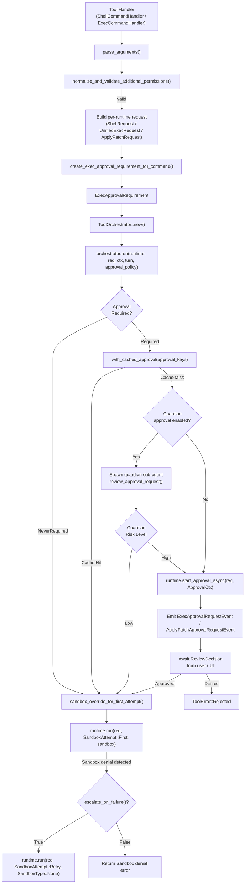
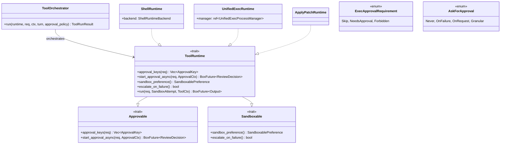
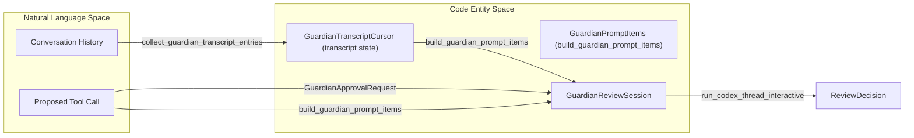

# Tool Orchestration and Approval

<details>
<summary>Relevant source files</summary>

The following files were used as context for generating this wiki page:

- [codex-rs/core/src/exec_policy.rs](codex-rs/core/src/exec_policy.rs)
- [codex-rs/core/src/exec_policy_tests.rs](codex-rs/core/src/exec_policy_tests.rs)
- [codex-rs/core/src/exec_policy_windows_tests.rs](codex-rs/core/src/exec_policy_windows_tests.rs)
- [codex-rs/core/src/guardian/approval_request.rs](codex-rs/core/src/guardian/approval_request.rs)
- [codex-rs/core/src/guardian/mod.rs](codex-rs/core/src/guardian/mod.rs)
- [codex-rs/core/src/guardian/policy.md](codex-rs/core/src/guardian/policy.md)
- [codex-rs/core/src/guardian/policy_template.md](codex-rs/core/src/guardian/policy_template.md)
- [codex-rs/core/src/guardian/prompt.rs](codex-rs/core/src/guardian/prompt.rs)
- [codex-rs/core/src/guardian/review.rs](codex-rs/core/src/guardian/review.rs)
- [codex-rs/core/src/guardian/review_session.rs](codex-rs/core/src/guardian/review_session.rs)
- [codex-rs/core/src/guardian/snapshots/codex_core__guardian__tests__guardian_followup_review_request_layout.snap](codex-rs/core/src/guardian/snapshots/codex_core__guardian__tests__guardian_followup_review_request_layout.snap)
- [codex-rs/core/src/guardian/snapshots/codex_core__guardian__tests__guardian_review_request_layout.snap](codex-rs/core/src/guardian/snapshots/codex_core__guardian__tests__guardian_review_request_layout.snap)
- [codex-rs/core/src/guardian/snapshots/codex_core__guardian__tests__network_access_guardian_prompt_layout.snap](codex-rs/core/src/guardian/snapshots/codex_core__guardian__tests__network_access_guardian_prompt_layout.snap)
- [codex-rs/core/src/guardian/tests.rs](codex-rs/core/src/guardian/tests.rs)
- [codex-rs/core/src/tools/events.rs](codex-rs/core/src/tools/events.rs)
- [codex-rs/core/src/tools/handlers/apply_patch.rs](codex-rs/core/src/tools/handlers/apply_patch.rs)
- [codex-rs/core/src/tools/handlers/shell.rs](codex-rs/core/src/tools/handlers/shell.rs)
- [codex-rs/core/src/tools/handlers/unified_exec.rs](codex-rs/core/src/tools/handlers/unified_exec.rs)
- [codex-rs/core/src/tools/handlers/view_image.rs](codex-rs/core/src/tools/handlers/view_image.rs)
- [codex-rs/core/src/tools/network_approval.rs](codex-rs/core/src/tools/network_approval.rs)
- [codex-rs/core/src/tools/orchestrator.rs](codex-rs/core/src/tools/orchestrator.rs)
- [codex-rs/core/src/tools/runtimes/apply_patch.rs](codex-rs/core/src/tools/runtimes/apply_patch.rs)
- [codex-rs/core/src/tools/runtimes/mod.rs](codex-rs/core/src/tools/runtimes/mod.rs)
- [codex-rs/core/src/tools/runtimes/mod_tests.rs](codex-rs/core/src/tools/runtimes/mod_tests.rs)
- [codex-rs/core/src/tools/runtimes/shell.rs](codex-rs/core/src/tools/runtimes/shell.rs)
- [codex-rs/core/src/tools/runtimes/shell/unix_escalation.rs](codex-rs/core/src/tools/runtimes/shell/unix_escalation.rs)
- [codex-rs/core/src/tools/runtimes/shell/unix_escalation_tests.rs](codex-rs/core/src/tools/runtimes/shell/unix_escalation_tests.rs)
- [codex-rs/core/src/tools/runtimes/unified_exec.rs](codex-rs/core/src/tools/runtimes/unified_exec.rs)
- [codex-rs/core/src/tools/sandboxing.rs](codex-rs/core/src/tools/sandboxing.rs)
- [codex-rs/core/src/turn_diff_tracker.rs](codex-rs/core/src/turn_diff_tracker.rs)
- [codex-rs/core/src/turn_diff_tracker_tests.rs](codex-rs/core/src/turn_diff_tracker_tests.rs)
- [codex-rs/core/src/unified_exec/mod.rs](codex-rs/core/src/unified_exec/mod.rs)
- [codex-rs/core/src/unified_exec/process_manager.rs](codex-rs/core/src/unified_exec/process_manager.rs)
- [codex-rs/core/tests/common/zsh_fork.rs](codex-rs/core/tests/common/zsh_fork.rs)
- [codex-rs/core/tests/suite/approvals.rs](codex-rs/core/tests/suite/approvals.rs)
- [codex-rs/core/tests/suite/exec_policy.rs](codex-rs/core/tests/suite/exec_policy.rs)
- [codex-rs/core/tests/suite/skill_approval.rs](codex-rs/core/tests/suite/skill_approval.rs)
- [codex-rs/core/tests/suite/unified_exec.rs](codex-rs/core/tests/suite/unified_exec.rs)
- [codex-rs/core/tests/suite/unified_exec_zsh_fork_approvals.rs](codex-rs/core/tests/suite/unified_exec_zsh_fork_approvals.rs)

</details>


## Purpose and Scope

This page documents the `ToolOrchestrator` [codex-rs/core/src/tools/orchestrator.rs]() and the surrounding infrastructure that centralizes **approval prompting**, **additional permissions handling**, **sandbox type selection**, and **retry-on-denial** semantics for all executable tool runtimes. It covers the shared traits (`Approvable`, `Sandboxable`, `ToolRuntime`), the `ExecApprovalRequirement` [codex-rs/core/src/tools/sandboxing.rs:37-37]() computation, permission validation, guardian sub-agent approval, and how those pieces coordinate across the concrete runtimes: `ShellRuntime` [codex-rs/core/src/tools/runtimes/shell.rs:23-24](), `UnifiedExecRuntime` [codex-rs/core/src/tools/runtimes/unified_exec.rs:96-99](), and `ApplyPatchRuntime` [codex-rs/core/src/tools/runtimes/apply_patch.rs:35-36]().

Key approval flows covered:
- **Sandbox escalation approval**: Commands requiring `RequireEscalated` sandbox permissions [codex-rs/core/src/tools/handlers/shell.rs:121-124]().
- **Additional permissions approval**: Commands requesting granular filesystem/network permissions via `AdditionalPermissionProfile` [codex-rs/core/src/tools/handlers/shell.rs:86-94]().
- **Guardian auto-approval**: AI-powered low-risk command pre-approval [codex-rs/core/src/guardian/review_session.rs:61-62]().
- **Exec Policy Rules**: Enforcement of `.rules` files via `Policy` [codex-rs/core/src/exec_policy.rs:17-18]().

Sources: [codex-rs/core/src/tools/orchestrator.rs](), [codex-rs/core/src/tools/sandboxing.rs:37-37](), [codex-rs/core/src/tools/runtimes/shell.rs:23-24](), [codex-rs/core/src/tools/runtimes/unified_exec.rs:96-99](), [codex-rs/core/src/tools/runtimes/apply_patch.rs:35-36]().

---

## Architecture Overview

Every executable tool call is orchestrated through a common approval and sandbox management pipeline managed by `ToolOrchestrator`. This orchestrator:

1. Determines whether approval is required for a tool invocation using Exec Policy calculations [codex-rs/core/src/tools/handlers/shell.rs:163-178]().
2. Reuses cached approvals if available, skipping user prompts [codex-rs/core/src/tools/sandboxing.rs:39-39]().
3. Invokes the Guardian sub-agent when enabled for low-risk AI-based auto-approval [codex-rs/core/src/guardian/review_session.rs:163-178]().
4. Falls back to interactive user approval if necessary [codex-rs/core/src/tools/handlers/shell.rs:163-178]().
5. Selects an appropriate sandbox environment for execution [codex-rs/core/src/tools/sandboxing.rs:33-33]().
6. Retries execution with relaxed sandboxing on denial, based on policy [codex-rs/core/src/unified_exec/mod.rs:7-10]().

**Orchestration Pipeline:**



Sources: [codex-rs/core/src/tools/handlers/shell.rs:60-116](), [codex-rs/core/src/tools/handlers/shell.rs:163-178](), [codex-rs/core/src/unified_exec/mod.rs:12-23](), [codex-rs/core/src/tools/orchestrator.rs](), [codex-rs/core/src/tools/runtimes/unified_exec.rs:163-178]().

---

## Key Types and Code Entities

This system uses several traits and structs to orchestrate tool execution from natural language intent down to code actions:



| Type | File | Role |
| :--- | :--- | :--- |
| `ToolOrchestrator` | [codex-rs/core/src/tools/orchestrator.rs]() | Central orchestrator coordinating approval → sandbox → run → retry lifecycle. |
| `ExecApprovalRequirement` | [codex-rs/core/src/tools/sandboxing.rs:37-37]() | Enum representing approval requirement computed from exec policy and permissions. |
| `ToolRuntime` | [codex-rs/core/src/tools/sandboxing.rs:36-36]() | Trait combining approval and sandbox interface for runtime implementations. |
| `ShellRuntime` | [codex-rs/core/src/tools/runtimes/shell.rs:23-23]() | Concrete runtime for shell command execution. |
| `UnifiedExecRuntime` | [codex-rs/core/src/tools/runtimes/unified_exec.rs:96-96]() | Concrete runtime for PTY-based unified exec command execution. |
| `ApplyPatchRuntime` | [codex-rs/core/src/tools/runtimes/apply_patch.rs:36-36]() | Concrete runtime for applying verified code patches. |
| `UnifiedExecProcessManager` | [codex-rs/core/src/unified_exec/mod.rs:133-136]() | Manages the lifecycle of interactive processes in Unified Exec mode. |

Sources: [codex-rs/core/src/tools/sandboxing.rs:36-37](), [codex-rs/core/src/unified_exec/mod.rs:133-136](), [codex-rs/core/src/tools/runtimes/shell.rs:23-24](), [codex-rs/core/src/tools/runtimes/unified_exec.rs:96-96]().

---

## ExecApprovalRequirement Computation

The execution approval requirement for a command is computed before runtime invocation, based on policy, requested permissions, and sandboxing context. The `ExecPolicyManager` uses an `UnmatchedCommandContext` struct to capture details relevant to approval decisions [codex-rs/core/src/exec_policy.rs:121-128]().

```rust
pub(crate) struct UnmatchedCommandContext<'a> {
    pub(crate) approval_policy: AskForApproval,
    pub(crate) permission_profile: &'a PermissionProfile,
    pub(crate) windows_sandbox_level: WindowsSandboxLevel,
    pub(crate) sandbox_permissions: SandboxPermissions,
    pub(crate) used_complex_parsing: bool,
    pub(crate) command_origin: ExecPolicyCommandOrigin,
}
```

This context drives the decision to require approval, skip it, or forbid execution, captured as variants in `ExecApprovalRequirement` [codex-rs/core/src/tools/sandboxing.rs:37-37]().

Key aspects considered:
- Whether the approval policy (`AskForApproval`) mandates prompting [codex-rs/core/src/exec_policy.rs:174-197]().
- Whether the command matches any prefix or blacklist rules [codex-rs/core/src/exec_policy.rs:52-99]().
- The intersection with requested sandbox permissions, especially escalations [codex-rs/core/src/tools/handlers/shell.rs:121-134]().

Sources: [codex-rs/core/src/exec_policy.rs:121-128](), [codex-rs/core/src/tools/sandboxing.rs:37-37](), [codex-rs/core/src/tools/handlers/shell.rs:163-178](), [codex-rs/core/src/exec_policy.rs:174-197]().

---

## AskForApproval and Granular Policies

`AskForApproval` [codex-rs/core/src/exec_policy.rs:122-122]() controls when approval prompts may be emitted for tool runs.

| Variant | Behavior |
| :--- | :--- |
| `Never` | Never emits approval prompts; commands run directly or error if conflicting [codex-rs/core/src/exec_policy.rs:179-179](). |
| `OnFailure` | Prompts only after sandbox failure or denial occurs [codex-rs/core/src/exec_policy.rs:180-180](). |
| `OnRequest` | Prompts when model requests elevated permissions explicitly [codex-rs/core/src/exec_policy.rs:181-181](). |
| `Granular` | Provides fine-grained control over rules and sandbox escalation prompts independently [codex-rs/core/src/exec_policy.rs:183-195](). |

Using `AskForApproval::Never` while a prompt is required causes the tool invocation to be rejected with a `PROMPT_CONFLICT_REASON` error [codex-rs/core/src/exec_policy.rs:43-44]().

Sources: [codex-rs/core/src/exec_policy.rs:178-197](), [codex-rs/core/src/exec_policy.rs:43-44]().

---

## SandboxPermissions and Additional Permissions

Tool runtimes handle sandboxing and permission escalation via `SandboxPermissions` [codex-rs/core/src/unified_exec/mod.rs:40-40]() and `AdditionalPermissionProfile` [codex-rs/core/src/unified_exec/mod.rs:32-32]().

- `RequireEscalated` permission forces execution outside sandbox (full system access) [codex-rs/core/src/tools/handlers/shell.rs:121-124]().
- `WithAdditionalPermissions` requests access to fine-grained filesystem paths or network [codex-rs/core/src/tools/handlers/shell.rs:171-175]().
- Permission requests must be approved either automatically (feature flags/Guardian) or interactively.

The function `apply_granted_turn_permissions` [codex-rs/core/src/tools/handlers/shell.rs:87-94]() ensures that the requested permissions are valid under the current turn's approval policy and feature flags, cleaning and validating additional permission profiles before runtime execution attempts.

Sources: [codex-rs/core/src/tools/handlers/shell.rs:87-116](), [codex-rs/core/src/unified_exec/mod.rs:32-40]().

---

## Guardian Approval Sub-Agent

The Guardian system serves as an AI-powered sub-agent that may automatically approve low-risk tool executions, reducing user burden.

### Data Flow and Interaction



The Guardian first collects relevant conversation history via `GuardianTranscriptCursor` for context delta prompts [codex-rs/core/src/guardian/review_session.rs:54-54](). It then receives the proposed tool call wrapped as a `GuardianApprovalRequest` [codex-rs/core/src/guardian/review_session.rs:52-52](). Using the `GuardianPromptItems` builder, the system synthesizes an AI prompt and runs an independent Codex thread dedicated to review via `run_codex_thread_interactive` [codex-rs/core/src/guardian/review_session.rs:35-35]().

On completion, the Guardian returns a `ReviewDecision` indicating approval, rejection, or conditional action [codex-rs/core/src/guardian/review_session.rs:61-62]().

### Risk Assessment Details

- **Transcript Delta:** If possible, the system sends only new history since last review via `GuardianPromptMode::Delta`, reducing prompt size [codex-rs/core/src/guardian/review_session.rs:112-114]().
- **GuardianRejectionCircuitBreaker:** Prevents infinite loops or flooding by interrupting turns after 3 consecutive Guardian denials or 10 total recent denials [codex-rs/core/src/guardian/tests.rs:84-149]().
- **Outcome:** Represented by `GuardianReviewSessionOutcome` enum: completion with result, prompt build failure, session failure, timeout, or abortion [codex-rs/core/src/guardian/review_session.rs:61-70]().

Sources: [codex-rs/core/src/guardian/review_session.rs:35-131](), [codex-rs/core/src/guardian/tests.rs:84-149]().

---

# Summary

The tool orchestration and approval subsystem in Codex centralizes complex interactions spanning execution policy evaluation, sandboxing, approval prompting, and auxiliary AI-powered review via the Guardian sub-agent. This leads to consistent, policy-driven, and user-transparent tool execution, with the flexibility to retry on sandbox denials.

This page bridges user intent to tools execution in the codebase by detailing:

- The role of `ToolOrchestrator` in managing the approval lifecycle.
- How `ExecApprovalRequirement` is computed from config, policies, and requested permissions.
- Integration of approval policies like `AskForApproval` and sandbox escalation.
- Validation and normalization of permissions requested by tools.
- The AI-powered Guardian sub-agent for low-risk auto-approval, including state management and circuit breaker logic.

Sources:
[codex-rs/core/src/tools/orchestrator.rs]()
[codex-rs/core/src/tools/handlers/shell.rs:163-178]()
[codex-rs/core/src/tools/sandboxing.rs:36-37]()
[codex-rs/core/src/exec_policy.rs:121-128]()
[codex-rs/core/src/guardian/review_session.rs:61-70]()
[codex-rs/core/src/guardian/tests.rs:84-149]()
