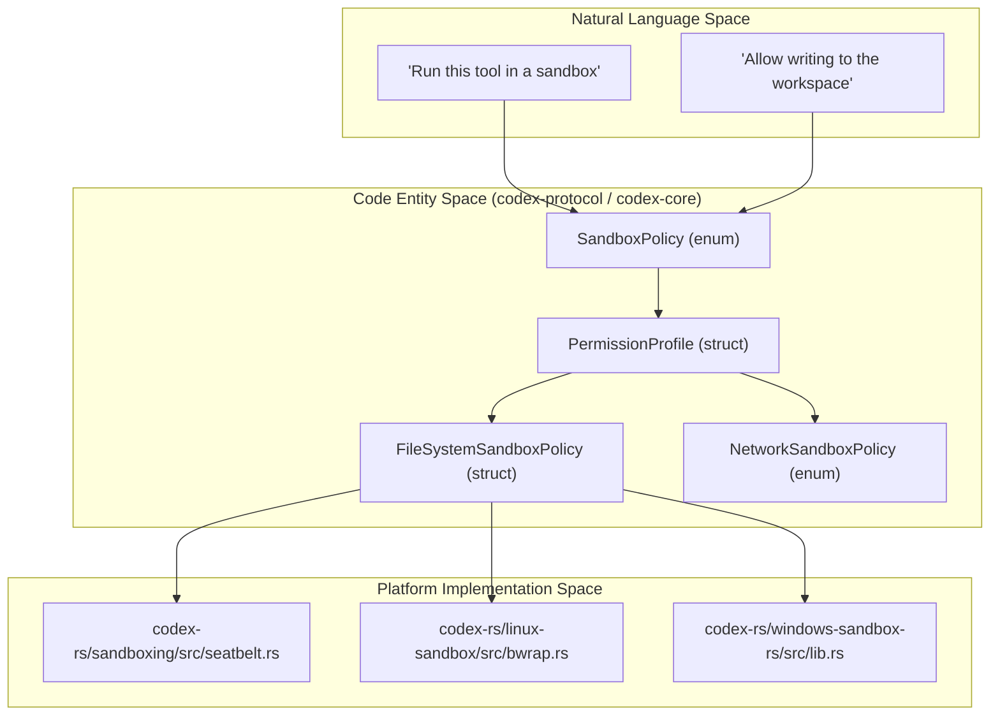
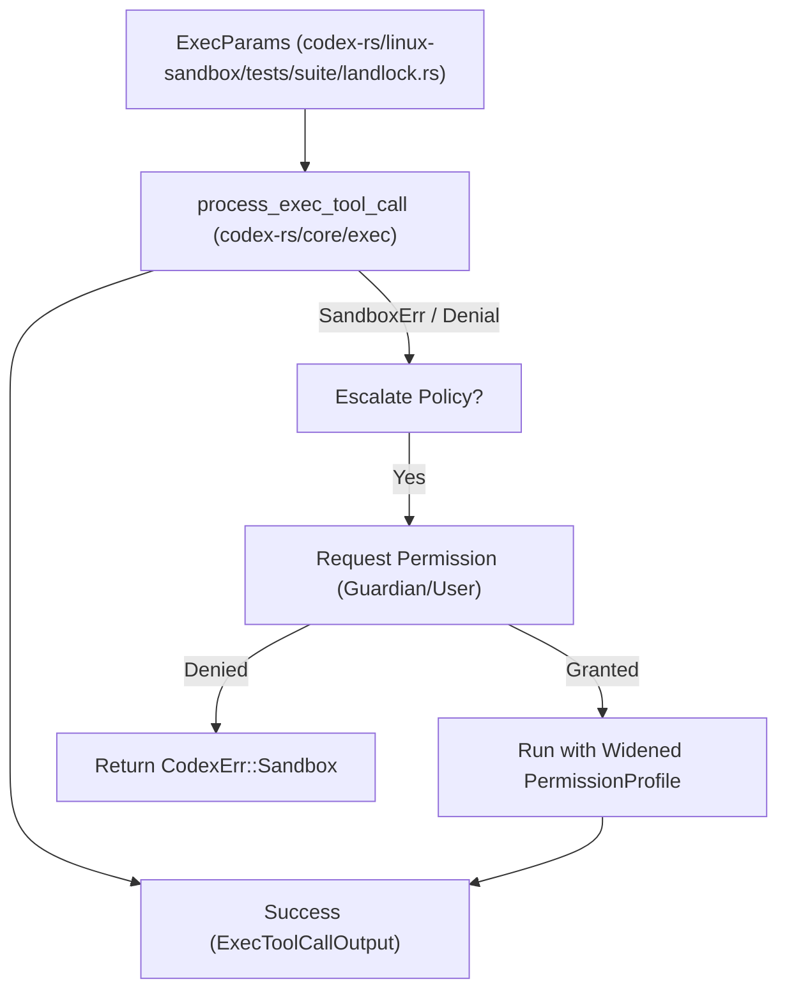

# Sandboxing Implementation

Relevant source files

The following files were used as context for generating this wiki page:

- [codex-rs/chatgpt/Cargo.toml](codex-rs/chatgpt/Cargo.toml)
- [codex-rs/cli/src/sandbox_setup.rs](codex-rs/cli/src/sandbox_setup.rs)
- [codex-rs/core/README.md](codex-rs/core/README.md)
- [codex-rs/core/src/landlock.rs](codex-rs/core/src/landlock.rs)
- [codex-rs/core/src/safety_tests.rs](codex-rs/core/src/safety_tests.rs)
- [codex-rs/core/src/windows_sandbox.rs](codex-rs/core/src/windows_sandbox.rs)
- [codex-rs/core/tests/suite/exec.rs](codex-rs/core/tests/suite/exec.rs)
- [codex-rs/core/tests/suite/windows_sandbox.rs](codex-rs/core/tests/suite/windows_sandbox.rs)
- [codex-rs/exec/tests/suite/sandbox.rs](codex-rs/exec/tests/suite/sandbox.rs)
- [codex-rs/linux-sandbox/Cargo.toml](codex-rs/linux-sandbox/Cargo.toml)
- [codex-rs/linux-sandbox/README.md](codex-rs/linux-sandbox/README.md)
- [codex-rs/linux-sandbox/src/bwrap.rs](codex-rs/linux-sandbox/src/bwrap.rs)
- [codex-rs/linux-sandbox/src/landlock.rs](codex-rs/linux-sandbox/src/landlock.rs)
- [codex-rs/linux-sandbox/src/launcher.rs](codex-rs/linux-sandbox/src/launcher.rs)
- [codex-rs/linux-sandbox/src/lib.rs](codex-rs/linux-sandbox/src/lib.rs)
- [codex-rs/linux-sandbox/src/linux_run_main.rs](codex-rs/linux-sandbox/src/linux_run_main.rs)
- [codex-rs/linux-sandbox/src/linux_run_main_tests.rs](codex-rs/linux-sandbox/src/linux_run_main_tests.rs)
- [codex-rs/linux-sandbox/tests/suite/landlock.rs](codex-rs/linux-sandbox/tests/suite/landlock.rs)
- [codex-rs/linux-sandbox/tests/suite/managed_proxy.rs](codex-rs/linux-sandbox/tests/suite/managed_proxy.rs)
- [codex-rs/sandboxing/BUILD.bazel](codex-rs/sandboxing/BUILD.bazel)
- [codex-rs/sandboxing/Cargo.toml](codex-rs/sandboxing/Cargo.toml)
- [codex-rs/sandboxing/src/bwrap.rs](codex-rs/sandboxing/src/bwrap.rs)
- [codex-rs/sandboxing/src/bwrap_tests.rs](codex-rs/sandboxing/src/bwrap_tests.rs)
- [codex-rs/sandboxing/src/lib.rs](codex-rs/sandboxing/src/lib.rs)
- [codex-rs/sandboxing/src/seatbelt.rs](codex-rs/sandboxing/src/seatbelt.rs)
- [codex-rs/sandboxing/src/seatbelt_base_policy.sbpl](codex-rs/sandboxing/src/seatbelt_base_policy.sbpl)
- [codex-rs/sandboxing/src/seatbelt_network_policy.sbpl](codex-rs/sandboxing/src/seatbelt_network_policy.sbpl)
- [codex-rs/sandboxing/src/seatbelt_tests.rs](codex-rs/sandboxing/src/seatbelt_tests.rs)
- [codex-rs/windows-sandbox-rs/src/allow.rs](codex-rs/windows-sandbox-rs/src/allow.rs)
- [codex-rs/windows-sandbox-rs/src/audit.rs](codex-rs/windows-sandbox-rs/src/audit.rs)
- [codex-rs/windows-sandbox-rs/src/bin/command_runner/win.rs](codex-rs/windows-sandbox-rs/src/bin/command_runner/win.rs)
- [codex-rs/windows-sandbox-rs/src/bin/setup_main/win.rs](codex-rs/windows-sandbox-rs/src/bin/setup_main/win.rs)
- [codex-rs/windows-sandbox-rs/src/bin/setup_main/win/firewall.rs](codex-rs/windows-sandbox-rs/src/bin/setup_main/win/firewall.rs)
- [codex-rs/windows-sandbox-rs/src/bin/setup_main/win/sandbox_users.rs](codex-rs/windows-sandbox-rs/src/bin/setup_main/win/sandbox_users.rs)
- [codex-rs/windows-sandbox-rs/src/bin/setup_main/win/setup_runtime_bin.rs](codex-rs/windows-sandbox-rs/src/bin/setup_main/win/setup_runtime_bin.rs)
- [codex-rs/windows-sandbox-rs/src/elevated/runner_client.rs](codex-rs/windows-sandbox-rs/src/elevated/runner_client.rs)
- [codex-rs/windows-sandbox-rs/src/elevated/runner_pipe.rs](codex-rs/windows-sandbox-rs/src/elevated/runner_pipe.rs)
- [codex-rs/windows-sandbox-rs/src/elevated_impl.rs](codex-rs/windows-sandbox-rs/src/elevated_impl.rs)
- [codex-rs/windows-sandbox-rs/src/identity.rs](codex-rs/windows-sandbox-rs/src/identity.rs)
- [codex-rs/windows-sandbox-rs/src/lib.rs](codex-rs/windows-sandbox-rs/src/lib.rs)
- [codex-rs/windows-sandbox-rs/src/resolved_permissions.rs](codex-rs/windows-sandbox-rs/src/resolved_permissions.rs)
- [codex-rs/windows-sandbox-rs/src/setup.rs](codex-rs/windows-sandbox-rs/src/setup.rs)
- [codex-rs/windows-sandbox-rs/src/setup_error.rs](codex-rs/windows-sandbox-rs/src/setup_error.rs)
- [codex-rs/windows-sandbox-rs/src/spawn_prep.rs](codex-rs/windows-sandbox-rs/src/spawn_prep.rs)
- [codex-rs/windows-sandbox-rs/src/unified_exec/backends/elevated.rs](codex-rs/windows-sandbox-rs/src/unified_exec/backends/elevated.rs)
- [codex-rs/windows-sandbox-rs/src/unified_exec/backends/legacy.rs](codex-rs/windows-sandbox-rs/src/unified_exec/backends/legacy.rs)
- [codex-rs/windows-sandbox-rs/src/unified_exec/backends/windows_common.rs](codex-rs/windows-sandbox-rs/src/unified_exec/backends/windows_common.rs)
- [codex-rs/windows-sandbox-rs/src/unified_exec/mod.rs](codex-rs/windows-sandbox-rs/src/unified_exec/mod.rs)
- [codex-rs/windows-sandbox-rs/src/unified_exec/tests.rs](codex-rs/windows-sandbox-rs/src/unified_exec/tests.rs)
- [scripts/test-remote-env.sh](scripts/test-remote-env.sh)

This page documents the implementation of Codex's sandboxing system, which provides platform-specific process isolation for tool execution. The system translates high-level `SandboxPolicy` requirements into OS-native primitives: **Seatbelt** on macOS, **Bubblewrap/Landlock** on Linux, and **Restricted Tokens/ACLs** on Windows.

---

## Overview

The sandboxing architecture is divided into policy definition, platform-specific drivers, and a setup orchestration layer. The system selects the appropriate sandbox type based on the requested policies and the host operating system.

Title: Sandbox Policy to Code Entity Mapping

Sources: [codex-rs/linux-sandbox/src/bwrap.rs:27-33](), [codex-rs/linux-sandbox/src/linux_run_main.rs:96-101](), [codex-rs/windows-sandbox-rs/src/lib.rs:232-232]()

---

## macOS: Seatbelt (sandbox-exec)

On macOS, Codex utilizes the system's `sandbox-exec` utility. The implementation generates a Sandbox Profile Language (SBPL) script dynamically based on the requested permissions.

### Implementation Details
The core logic is managed by `codex-sandboxing`, which:
1.  Constructs SBPL arguments based on the `PermissionProfile` via `create_seatbelt_command_args`. [codex-rs/sandboxing/src/seatbelt_tests.rs:7-8]()
2.  Ensures `.git`, `.agents`, and `.codex` directories remain read-only even in `WorkspaceWrite` mode. [codex-rs/core/README.md:13-15]()
3.  Executes the command by spawning the `sandbox-exec` binary located at `/usr/bin/sandbox-exec`. [codex-rs/core/README.md:11-11]()

### Network and Filesystem Policies
The Seatbelt profile consumes the resolved policy and enforces it, including controlling network access via `dynamic_network_policy`. [codex-rs/sandboxing/src/seatbelt_tests.rs:9-9]() It handles `FileSystemSandboxPolicy` by mapping `FileSystemSandboxEntry` to SBPL `allow` or `deny` rules. [codex-rs/sandboxing/src/seatbelt_tests.rs:22-26]()

Sources: [codex-rs/core/README.md:9-22](), [codex-rs/sandboxing/src/seatbelt_tests.rs:1-30](), [codex-rs/sandboxing/src/seatbelt_tests.rs:187-200]()

---

## Linux: Bubblewrap and Landlock

The Linux implementation primarily uses **Bubblewrap** (`bwrap`) to construct a restricted filesystem view and **Landlock** as a supplementary restriction or legacy fallback.

### Bubblewrap (Default Pipeline)
Bubblewrap is the preferred filesystem sandbox. It enforces a read-only-by-default environment and layers writable roots using `--bind`. [codex-rs/linux-sandbox/src/bwrap.rs:3-7](), [codex-rs/core/README.md:28-32]()

Key features of the Bubblewrap implementation:
- **Namespace Isolation**: Explicitly isolates user, PID, and network namespaces via `--unshare-user`, `--unshare-pid`, and `--unshare-net`. [codex-rs/linux-sandbox/README.md:84-87]()
- **Sensitive Path Protection**: Re-applies read-only mounts for sensitive subpaths like `.git`, `.agents`, and `.codex` even within writable roots. [codex-rs/linux-sandbox/src/bwrap.rs:6-7]()
- **Network Modes**: Supports `Isolated`, `ProxyOnly`, and `FullAccess` modes via `BwrapNetworkMode`. [codex-rs/linux-sandbox/src/bwrap.rs:87-98]()
- **Glob Masking**: Unreadable glob entries are expanded before launch using `ripgrep` or an internal globset walker, and matching files are masked in bubblewrap. [codex-rs/linux-sandbox/README.md:62-69]()

### Landlock and Seccomp
The helper applies `PR_SET_NO_NEW_PRIVS` and a seccomp network filter in-process. [codex-rs/linux-sandbox/README.md:49-50]()
- **Landlock**: Used for legacy fallback or as an additional layer. It restricts access using rulesets defined in `install_filesystem_landlock_rules_on_current_thread`. [codex-rs/linux-sandbox/src/landlock.rs:137-143]()
- **Seccomp**: Restricts syscalls like `connect`, `bind`, and `ptrace` after the filesystem view is established. [codex-rs/linux-sandbox/src/landlock.rs:169-185]()

Sources: [codex-rs/linux-sandbox/src/bwrap.rs:1-11](), [codex-rs/linux-sandbox/src/linux_run_main.rs:147-196](), [codex-rs/linux-sandbox/README.md:49-94](), [codex-rs/linux-sandbox/src/landlock.rs:42-88]()

---

## Windows: Restricted Tokens and ACLs

Windows sandboxing involves managing Access Control Lists (ACLs) and specialized restricted tokens to isolate processes.

### Audit and ACL Management
Before spawning a sandboxed process, Codex performs a preflight audit to ensure security:
1.  **Audit Preflight**: A scan for world-writable directories (e.g., in `TEMP`, `PATH`, or `USERPROFILE`) that might bypass sandbox restrictions is performed by `audit_everyone_writable`. [codex-rs/windows-sandbox-rs/src/audit.rs:95-104]()
2.  **ACL Management**: Functions like `add_deny_read_ace` and `add_deny_write_ace` are used to manipulate directory permissions for the sandbox identity. [codex-rs/windows-sandbox-rs/src/lib.rs:120-123]()

### Execution via Restricted Token
Commands can be launched using `create_process_as_user` with a restricted token. [codex-rs/windows-sandbox-rs/src/lib.rs:226-226]() The system supports legacy `ReadOnly` and `WorkspaceWrite` behavior via restricted tokens. [codex-rs/core/README.md:67-72]()

### Elevated Sandbox Capture
For high-integrity execution, `run_windows_sandbox_capture_for_permission_profile` orchestrates an elevated runner that communicates over a framed IPC pipe. [codex-rs/windows-sandbox-rs/src/elevated_impl.rs:97-99]() It uses `SpawnRequest` to pass policy and command details to the runner. [codex-rs/windows-sandbox-rs/src/elevated_impl.rs:181-183]()

Sources: [codex-rs/windows-sandbox-rs/src/lib.rs:120-226](), [codex-rs/windows-sandbox-rs/src/audit.rs:95-104](), [codex-rs/windows-sandbox-rs/src/elevated_impl.rs:7-183](), [codex-rs/core/README.md:58-72]()

---

## Sandbox Denial Detection and Retry Logic

Codex implements logic to detect when a tool fails specifically due to sandbox restrictions, allowing for automated or user-prompted retries.

### Detection Patterns
The system looks for specific exit codes and error signals:
- **SandboxErr**: Captures errors such as `LandlockRestrict` or general sandbox failures during execution. [codex-rs/linux-sandbox/tests/suite/landlock.rs:12-12]()
- **Bwrap Failures**: Specific stderr patterns like "bubblewrap is unavailable" or "Can't mount proc on /newroot/proc" are detected by `is_bwrap_unavailable_output` to identify environment-related sandbox issues. [codex-rs/linux-sandbox/tests/suite/landlock.rs:201-210]()

Title: Sandbox Execution and Escalation Flow

Sources: [codex-rs/linux-sandbox/tests/suite/landlock.rs:174-186](), [codex-rs/linux-sandbox/tests/suite/landlock.rs:189-198]()

### Implementation of Retry Logic
The `process_exec_tool_call` function orchestrates the actual spawning of the sandboxed process, passing the `PermissionProfile` and `ExecParams` to the platform-specific helper (e.g., `spawn_command_under_linux_sandbox`). [codex-rs/linux-sandbox/tests/suite/landlock.rs:189-198](), [codex-rs/core/src/landlock.rs:22-32]() If a failure occurs, the higher-level tool orchestrator can evaluate if the failure was a sandbox denial (e.g., `Operation not permitted`) and prompt for permission escalation via the `Permission Request System`. [codex-rs/linux-sandbox/tests/suite/landlock.rs:201-210]()

Sources: [codex-rs/linux-sandbox/tests/suite/landlock.rs:166-210](), [codex-rs/core/src/landlock.rs:22-70](), [codex-rs/linux-sandbox/src/linux_run_main.rs:147-160]()
