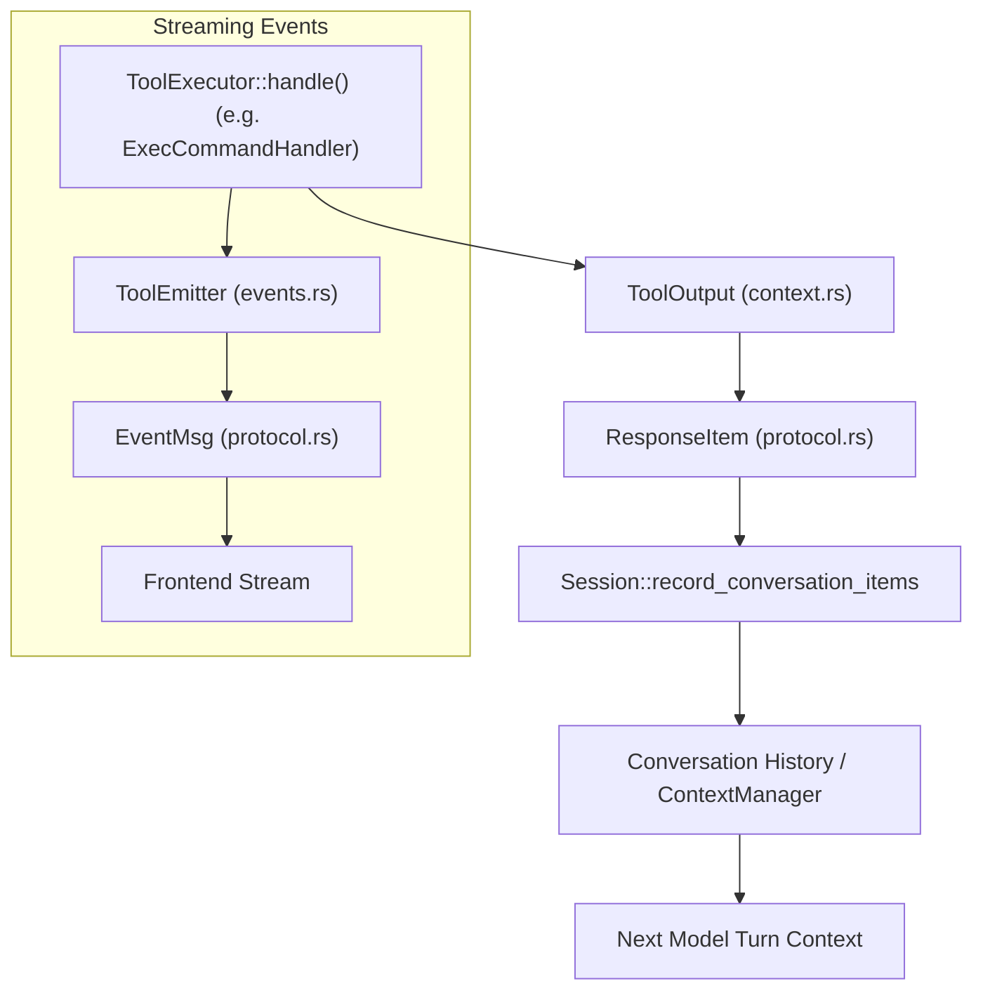
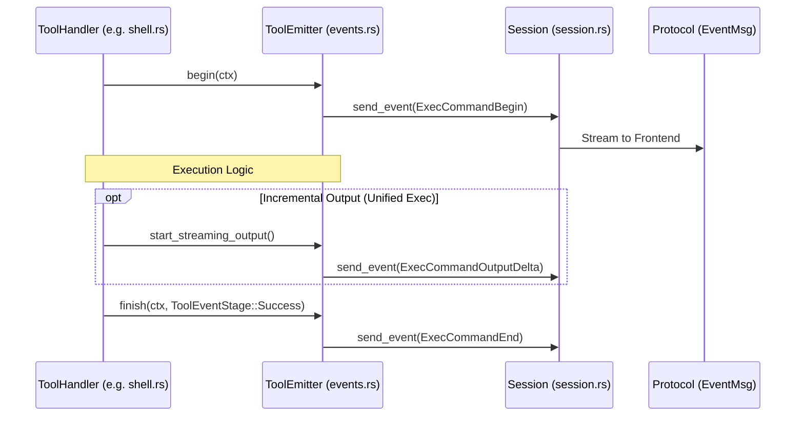
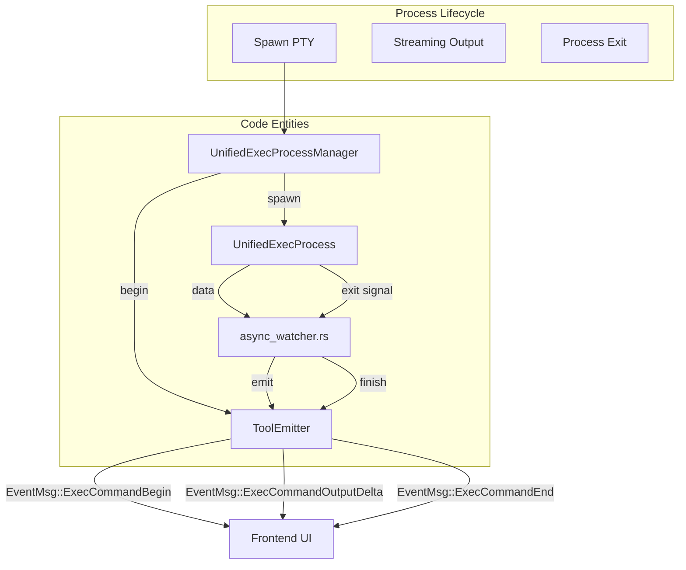

# Tool Event Emission and Output

<details>
<summary>Relevant source files</summary>

The following files were used as context for generating this wiki page:

- [codex-rs/app-server/tests/suite/v2/imagegen_extension.rs](codex-rs/app-server/tests/suite/v2/imagegen_extension.rs)
- [codex-rs/core/src/session/turn_tests.rs](codex-rs/core/src/session/turn_tests.rs)
- [codex-rs/core/src/stream_events_utils.rs](codex-rs/core/src/stream_events_utils.rs)
- [codex-rs/core/src/stream_events_utils_tests.rs](codex-rs/core/src/stream_events_utils_tests.rs)
- [codex-rs/core/src/tools/events.rs](codex-rs/core/src/tools/events.rs)
- [codex-rs/core/src/tools/handlers/apply_patch.rs](codex-rs/core/src/tools/handlers/apply_patch.rs)
- [codex-rs/core/src/tools/handlers/shell.rs](codex-rs/core/src/tools/handlers/shell.rs)
- [codex-rs/core/src/tools/handlers/unified_exec.rs](codex-rs/core/src/tools/handlers/unified_exec.rs)
- [codex-rs/core/src/tools/handlers/view_image.rs](codex-rs/core/src/tools/handlers/view_image.rs)
- [codex-rs/core/src/tools/network_approval.rs](codex-rs/core/src/tools/network_approval.rs)
- [codex-rs/core/src/tools/orchestrator.rs](codex-rs/core/src/tools/orchestrator.rs)
- [codex-rs/core/src/tools/runtimes/apply_patch.rs](codex-rs/core/src/tools/runtimes/apply_patch.rs)
- [codex-rs/core/src/tools/runtimes/mod.rs](codex-rs/core/src/tools/runtimes/mod.rs)
- [codex-rs/core/src/tools/runtimes/mod_tests.rs](codex-rs/core/src/tools/runtimes/mod_tests.rs)
- [codex-rs/core/src/tools/runtimes/shell.rs](codex-rs/core/src/tools/runtimes/shell.rs)
- [codex-rs/core/src/tools/runtimes/unified_exec.rs](codex-rs/core/src/tools/runtimes/unified_exec.rs)
- [codex-rs/core/src/tools/sandboxing.rs](codex-rs/core/src/tools/sandboxing.rs)
- [codex-rs/core/src/turn_diff_tracker.rs](codex-rs/core/src/turn_diff_tracker.rs)
- [codex-rs/core/src/turn_diff_tracker_tests.rs](codex-rs/core/src/turn_diff_tracker_tests.rs)
- [codex-rs/core/src/unified_exec/mod.rs](codex-rs/core/src/unified_exec/mod.rs)
- [codex-rs/core/src/unified_exec/process_manager.rs](codex-rs/core/src/unified_exec/process_manager.rs)
- [codex-rs/core/tests/suite/unified_exec.rs](codex-rs/core/tests/suite/unified_exec.rs)
- [codex-rs/ext/image-generation/Cargo.toml](codex-rs/ext/image-generation/Cargo.toml)
- [codex-rs/ext/image-generation/imagegen_description.md](codex-rs/ext/image-generation/imagegen_description.md)
- [codex-rs/ext/image-generation/src/extension.rs](codex-rs/ext/image-generation/src/extension.rs)
- [codex-rs/ext/image-generation/src/tests.rs](codex-rs/ext/image-generation/src/tests.rs)
- [codex-rs/ext/image-generation/src/tool.rs](codex-rs/ext/image-generation/src/tool.rs)

</details>


## Purpose and Scope

This page details the mechanism by which tool execution outputs are emitted as events and packaged for return to the AI model. It focuses on:

- The `ToolEmitter` factory pattern that wraps tool invocation context for emitting lifecycle events [codex-rs/core/src/tools/events.rs:122-141]().
- The tool event lifecycle phases: `begin`, `emit`, and `finish` [codex-rs/core/src/tools/events.rs:182-262]().
- Background asynchronous watcher tasks used primarily by `UnifiedExecProcessManager` to stream tool output incrementally [codex-rs/core/src/unified_exec/process_manager.rs:42-45]().
- Integration with the `ToolRegistry` and `ToolRouter` for dispatching results back to the conversation history [codex-rs/core/src/stream_events_utils.rs:191-212]().
- Handling of specialized outputs like image generation and patches [codex-rs/core/src/stream_events_utils.rs:130-166](), [codex-rs/core/src/tools/handlers/apply_patch.rs:77-96]().

For related topics, see **Shell Execution Tools (5.2)**, **Apply Patch System (5.4)**, **Tool Orchestration and Approval (5.5)**, and **Unified Exec Process Management (5.3)**.

---

## Core Output Types

### `ToolOutput` Trait

Every tool handler returns a type implementing this trait, defined in `codex-rs/core/src/tools/context.rs`. Implementations exist for MCP tools, image viewing [codex-rs/core/src/tools/handlers/view_image.rs:18-21](), and standard function tools.

- **`to_response_item`**: Converts internal output into wire protocol types (`ResponseInputItem`) for the conversation history [codex-rs/core/src/stream_events_utils.rs:29-30]().
- **`post_tool_use_response`**: Provides data for post-tool hooks, allowing external systems to inspect results [codex-rs/core/src/tools/handlers/unified_exec.rs:80-97]().
- **`log_preview`**: Generates a truncated string representation for telemetry and logging.

### `ResponseItem` and `ResponseInputItem`

The `ResponseItem` enum represents items in the conversation history [codex-rs/core/src/stream_events_utils.rs:30-30](). When tools complete, they are recorded into the session [codex-rs/core/src/stream_events_utils.rs:191-195]().

| Variant | Associated Tool Type | Description |
|---------|---------------------|-------------|
| `FunctionCallOutput` | Most tools (shell, unified exec) | Standard function call output wrapping the tool result text [codex-rs/core/tests/suite/unified_exec.rs:173-177](). |
| `ImageView` | `view_image` | Specialized output for image data URLs [codex-rs/core/src/tools/handlers/view_image.rs:205-208](). |
| `ImageGeneration` | `image_generation` | Result of image generation, often saved to disk [codex-rs/core/src/stream_events_utils.rs:130-134](). |

Sources: [codex-rs/core/src/stream_events_utils.rs:26-30](), [codex-rs/core/src/tools/handlers/view_image.rs:205-208](), [codex-rs/core/src/tools/handlers/unified_exec.rs:80-97]()

---

## Data Flow: From Tool Handler to API Request

The tool output lifecycle starts with a tool handler producing a `ToolOutput` result. The `ToolRouter` dispatches the call, and the resulting `ResponseItem` is recorded in the `Session`.

### Simplified Flow Diagram



Sources: [codex-rs/core/src/stream_events_utils.rs:191-212](), [codex-rs/core/src/tools/handlers/unified_exec.rs:80-97](), [codex-rs/core/src/tools/events.rs:182-183]()

---

## Tool Event Emission: The `ToolEmitter` Factory

`ToolEmitter` centralizes event emission for different tool families, ensuring that frontends receive consistent lifecycle updates [codex-rs/core/src/tools/events.rs:122-141]().

### `ToolEmitter` Variants

| Variant | Description | Emitted events |
|---------|-------------|----------------|
| `Shell` | Standard shell execution | `ExecCommandBegin`, `ExecCommandEnd` [codex-rs/core/src/tools/events.rs:123-128]() |
| `ApplyPatch` | Patch application | `FileChange` (TurnItem), `PatchApplyUpdated` [codex-rs/core/src/tools/events.rs:129-133]() |
| `UnifiedExec` | Interactive PTY processes | `ExecCommandBegin`, `ExecCommandEnd` [codex-rs/core/src/tools/events.rs:134-140]() |

### `ToolEventCtx`

A context struct passed to emitters holding references required for event dispatch [codex-rs/core/src/tools/events.rs:31-36]():

```rust
pub(crate) struct ToolEventCtx<'a> {
    pub session: &'a Session,
    pub turn: &'a TurnContext,
    pub call_id: &'a str,
    pub turn_diff_tracker: Option<&'a SharedTurnDiffTracker>,
}
```

Sources: [codex-rs/core/src/tools/events.rs:31-52](), [codex-rs/core/src/tools/events.rs:122-141]()

---

## Tool Event Lifecycle: Begin → Emit → Finish

### 1. Begin Phase
Signals the start of a tool. For execution tools, this emits `ExecCommandBegin` which includes the command, `cwd`, and `source` [codex-rs/core/src/tools/events.rs:95-120](). For patches, it emits a `TurnItemStarted` event [codex-rs/core/src/tools/events.rs:212-226]().

### 2. Intermediate Emit Phase
Used for streaming updates.
- **Unified Exec**: `start_streaming_output` watches the PTY and emits output chunks [codex-rs/core/src/unified_exec/process_manager.rs:45]().
- **Apply Patch**: `ApplyPatchArgumentDiffConsumer` parses incoming deltas and emits `PatchApplyUpdated` events [codex-rs/core/src/tools/handlers/apply_patch.rs:77-89]().

### 3. Finish Phase
Signals completion. `emit_exec_end_for_unified_exec` or `emit_failed_exec_end_for_unified_exec` sends the final status, exit code, and wall time [codex-rs/core/src/unified_exec/process_manager.rs:42-43]().

### Event Sequence Diagram



Sources: [codex-rs/core/src/tools/events.rs:182-262](), [codex-rs/core/src/unified_exec/process_manager.rs:41-45](), [codex-rs/core/src/tools/handlers/shell.rs:154-161]()

---

## Unified Exec: Background Async Watchers

The `UnifiedExecProcessManager` uses background tasks to handle the asynchronous nature of PTY output and process termination [codex-rs/core/src/unified_exec/process_manager.rs:41-45]().

- **`spawn_exit_watcher`**: Subscribes to the process exit signal. Upon termination, it triggers the end-of-execution events [codex-rs/core/src/unified_exec/process_manager.rs:44]().
- **`start_streaming_output`**: Monitors the `OutputBuffer` and pushes data to the `ToolEmitter` for real-time UI updates [codex-rs/core/src/unified_exec/process_manager.rs:45]().
- **`emit_exec_end_for_unified_exec`**: A helper that constructs the final `ExecCommandEndEvent` including wall time and exit code [codex-rs/core/src/unified_exec/process_manager.rs:42]().

Sources: [codex-rs/core/src/unified_exec/process_manager.rs:41-45](), [codex-rs/core/src/unified_exec/mod.rs:46-51]()

---

## Bridging Natural Language to Code Entity Space

### Diagram 1: Tool Output Transformation Pipeline

This diagram shows how a tool result is processed from raw execution output into a structured `ResponseItem` for the model.

```mermaid
flowchart LR
    NL["NL: 'Apply this fix'"] --> TC["ToolCall (router.rs)"]
    TC --> APH["ApplyPatchHandler (apply_patch.rs)"]
    APH --> APR["ApplyPatchRuntime (apply_patch.rs)"]
    APR --> APD["AppliedPatchDelta (events.rs)"]
    APD --> TE["ToolEmitter (events.rs)"]
    TE --> RI["ResponseItem (protocol.rs)"]
    RI --> SESS["Session::record_conversation_items"]

    click TC "codex-rs/core/src/stream_events_utils.rs:19-20"
    click APH "codex-rs/core/src/tools/handlers/apply_patch.rs:60-60"
    click APR "codex-rs/core/src/tools/runtimes/apply_patch.rs:58-58"
    click TE "codex-rs/core/src/tools/events.rs:122-122"
```



### Diagram 2: Unified Exec Event Lifecycle

This diagram associates high-level execution states with the specific code entities responsible for emitting events during an interactive process.



Sources: [codex-rs/core/src/unified_exec/process_manager.rs:41-45](), [codex-rs/core/src/tools/events.rs:122-141](), [codex-rs/core/src/tools/handlers/apply_patch.rs:60-68]()
