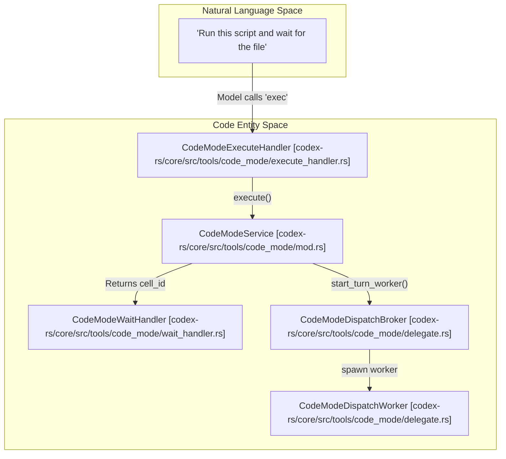
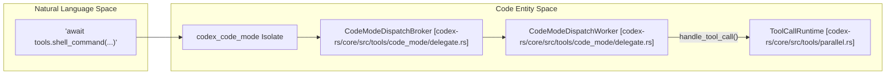

# Code Mode and JavaScript REPL

Relevant source files

The following files were used as context for generating this wiki page:

- [codex-rs/code-mode/Cargo.toml](codex-rs/code-mode/Cargo.toml)
- [codex-rs/code-mode/src/description.rs](codex-rs/code-mode/src/description.rs)
- [codex-rs/code-mode/src/lib.rs](codex-rs/code-mode/src/lib.rs)
- [codex-rs/code-mode/src/runtime/callbacks.rs](codex-rs/code-mode/src/runtime/callbacks.rs)
- [codex-rs/code-mode/src/runtime/globals.rs](codex-rs/code-mode/src/runtime/globals.rs)
- [codex-rs/code-mode/src/runtime/mod.rs](codex-rs/code-mode/src/runtime/mod.rs)
- [codex-rs/code-mode/src/service.rs](codex-rs/code-mode/src/service.rs)
- [codex-rs/core/src/context/image_generation_instructions.rs](codex-rs/core/src/context/image_generation_instructions.rs)
- [codex-rs/core/src/state/session.rs](codex-rs/core/src/state/session.rs)
- [codex-rs/core/src/tools/code_mode/delegate.rs](codex-rs/core/src/tools/code_mode/delegate.rs)
- [codex-rs/core/src/tools/code_mode/execute_handler.rs](codex-rs/core/src/tools/code_mode/execute_handler.rs)
- [codex-rs/core/src/tools/code_mode/mod.rs](codex-rs/core/src/tools/code_mode/mod.rs)
- [codex-rs/core/src/tools/code_mode/wait_handler.rs](codex-rs/core/src/tools/code_mode/wait_handler.rs)
- [codex-rs/core/src/tools/context.rs](codex-rs/core/src/tools/context.rs)
- [codex-rs/core/src/tools/context_tests.rs](codex-rs/core/src/tools/context_tests.rs)
- [codex-rs/core/src/tools/handlers/dynamic.rs](codex-rs/core/src/tools/handlers/dynamic.rs)
- [codex-rs/core/src/tools/handlers/extension_tools.rs](codex-rs/core/src/tools/handlers/extension_tools.rs)
- [codex-rs/core/src/tools/handlers/mcp.rs](codex-rs/core/src/tools/handlers/mcp.rs)
- [codex-rs/core/src/tools/handlers/mod.rs](codex-rs/core/src/tools/handlers/mod.rs)
- [codex-rs/core/src/tools/handlers/tool_search.rs](codex-rs/core/src/tools/handlers/tool_search.rs)
- [codex-rs/core/src/tools/parallel.rs](codex-rs/core/src/tools/parallel.rs)
- [codex-rs/core/src/tools/registry.rs](codex-rs/core/src/tools/registry.rs)
- [codex-rs/core/src/tools/registry_tests.rs](codex-rs/core/src/tools/registry_tests.rs)
- [codex-rs/core/src/tools/router.rs](codex-rs/core/src/tools/router.rs)
- [codex-rs/core/src/tools/router_tests.rs](codex-rs/core/src/tools/router_tests.rs)
- [codex-rs/core/src/tools/spec_plan.rs](codex-rs/core/src/tools/spec_plan.rs)
- [codex-rs/core/src/tools/spec_plan_tests.rs](codex-rs/core/src/tools/spec_plan_tests.rs)
- [codex-rs/core/tests/suite/code_mode.rs](codex-rs/core/tests/suite/code_mode.rs)
- [codex-rs/tools/src/code_mode.rs](codex-rs/tools/src/code_mode.rs)
- [codex-rs/tools/src/code_mode_tests.rs](codex-rs/tools/src/code_mode_tests.rs)
- [codex-rs/tools/src/tool_call.rs](codex-rs/tools/src/tool_call.rs)

This page documents the JavaScript execution systems in Codex, focusing on the yielding execution model of Code Mode, its orchestration of nested tools, and the integration of V8 isolates for stateful REPL interactions.

---

## Overview and Feature Gates

Code Mode and its associated REPL capabilities are controlled by feature flags within the `Config` and `TurnContext`. These flags determine the availability of tools and the visibility of nested tool definitions to the model.

| Feature flag | Effect |
| :--- | :--- |
| `Feature::CodeMode` | Enables the `exec` and `wait` tools for yielding JavaScript execution. [codex-rs/core/tests/suite/code_mode.rs:188-188]() |
| `ToolMode::CodeMode` | A runtime state for a turn where the model is expected to use JavaScript for tool interaction. [codex-rs/core/src/tools/code_mode/mod.rs:119-119]() |

Sources: [codex-rs/core/tests/suite/code_mode.rs:188-188](), [codex-rs/core/src/tools/code_mode/mod.rs:119-119]()

---

## Code Mode System

### Purpose and Architecture

Code Mode provides a **yielding execution model** for JavaScript. It allows scripts to run in a V8 isolate, yield control back to the model (for example, to wait for an external event or async tool output), and maintain execution state across multiple turns using `CellId` management. [codex-rs/core/src/tools/code_mode/mod.rs:60-74]()

**Code Mode System Architecture (Natural Language to Code Entity Space)**

Sources: [codex-rs/core/src/tools/code_mode/mod.rs:60-63](), [codex-rs/core/src/tools/code_mode/execute_handler.rs:1-10](), [codex-rs/core/src/tools/code_mode/wait_handler.rs:1-10](), [codex-rs/core/src/tools/code_mode/delegate.rs:39-41]()

### Tool Registration and Specs

Code Mode tools are registered via `CodeModeExecuteHandler` and `CodeModeWaitHandler`. The `exec` tool allows execution of JS in a persistent session, while `wait` allows polling for results from yielded scripts. [codex-rs/core/src/tools/code_mode/mod.rs:45-46]()

| Constant | Value | Handler Class | Purpose |
| :--- | :--- | :--- | :--- |
| `PUBLIC_TOOL_NAME` | `"exec"` | `CodeModeExecuteHandler` | Execute JS in a V8 isolate. Supports raw source text. [codex-rs/core/src/tools/code_mode/execute_handler.rs:41-41]() |
| `WAIT_TOOL_NAME` | `"wait"` | `CodeModeWaitHandler` | Resume or poll a yielded cell using a `cell_id`. [codex-rs/core/src/tools/code_mode/wait_handler.rs:43-43]() |

**Pragma and Parameters:**
The `exec` tool supports yielding execution where a script can be suspended and resumed. The `DEFAULT_WAIT_YIELD_TIME_MS` is set to the value defined in the `codex_code_mode` crate. [codex-rs/core/src/tools/code_mode/mod.rs:47-47]()

Sources: [codex-rs/core/src/tools/code_mode/mod.rs:45-47](), [codex-rs/core/src/tools/code_mode/execute_handler.rs:41-41](), [codex-rs/core/src/tools/code_mode/wait_handler.rs:43-43]()

---

## Tool Orchestration and Nested Calls

Code Mode acts as an orchestrator for other tools, allowing complex logic to be defined in JS and executed against the Codex toolset.

### Nested Tool Discovery
Tools are exposed to the V8 environment via the `CodeModeDispatchBroker`, which provides the infrastructure for these nested calls, ensuring that tools executed from within Code Mode are routed correctly back to the core session. [codex-rs/core/src/tools/code_mode/delegate.rs:62-63]()

### CodeModeSessionDelegate and Tool Invocation
The `CodeModeDispatchBroker` acts as the bridge between the V8 isolate and the Codex tool registry. [codex-rs/core/src/tools/code_mode/mod.rs:62-63]()

1.  **Tool Dispatch**: When the JS script executes a tool, the request is routed through the `CodeModeDispatchWorker`. [codex-rs/core/src/tools/code_mode/delegate.rs:40-40]()
2.  **Context Management**: The `ExecContext` holds references to the `Session` and `TurnContext` required to resolve tool permissions and state. [codex-rs/core/src/tools/code_mode/mod.rs:55-58]()

**Nested Tool Data Flow (Natural Language to Code Entity Space)**

Sources: [codex-rs/core/src/tools/code_mode/delegate.rs:39-41](), [codex-rs/core/src/tools/parallel.rs:31-37](), [codex-rs/core/src/tools/code_mode/mod.rs:112-118]()

---

## Execution Management and State

### Cell Management
The `CodeModeService` manages the lifecycle of execution cells. [codex-rs/core/src/tools/code_mode/mod.rs:60-63]() It tracks active cells and provides methods to `execute`, `wait`, and `terminate` them. [codex-rs/core/src/tools/code_mode/mod.rs:76-95]()

### Multi-Session Support
To maintain state across different `exec` calls within the same session, the `CodeModeService` maintains a `CodeModeSession`. [codex-rs/core/src/tools/code_mode/mod.rs:61-61]() This allows the JS environment to persist variables or storage between turns.

### Truncation and Sanitization
Results from Code Mode are subject to:
*   **Truncation**: `truncate_code_mode_result` limits output based on `max_output_tokens` to prevent context window overflow. [codex-rs/core/src/tools/code_mode/mod.rs:154-154]()
*   **Image Sanitization**: `sanitize_runtime_image_detail` filters image detail requests based on session permissions using `can_request_original_image_detail`. [codex-rs/core/src/tools/code_mode/mod.rs:188-190]()

---

## JavaScript REPL Integration

The system supports a persistent REPL-like experience where variable bindings and state are maintained across calls.

*   **Yield Control Pattern**: Scripts can yield control back to the model while remaining active in the background. This is handled by the `wait` tool. [codex-rs/core/src/tools/code_mode/wait_handler.rs:21-25]()
*   **Result Mapping**: Runtime responses (Yielded, Terminated, or Result) are transformed into `FunctionToolOutput` for the model. [codex-rs/core/src/tools/code_mode/mod.rs:142-147]()
*   **Parallelism**: Code Mode execution interacts with the `ToolCallRuntime`, which manages whether tool calls can run in parallel or must be serialized. [codex-rs/core/src/tools/parallel.rs:88-95]()

Sources: [codex-rs/core/src/tools/code_mode/mod.rs:142-186](), [codex-rs/core/src/tools/parallel.rs:88-95](), [codex-rs/core/src/tools/code_mode/wait_handler.rs:21-25]()
