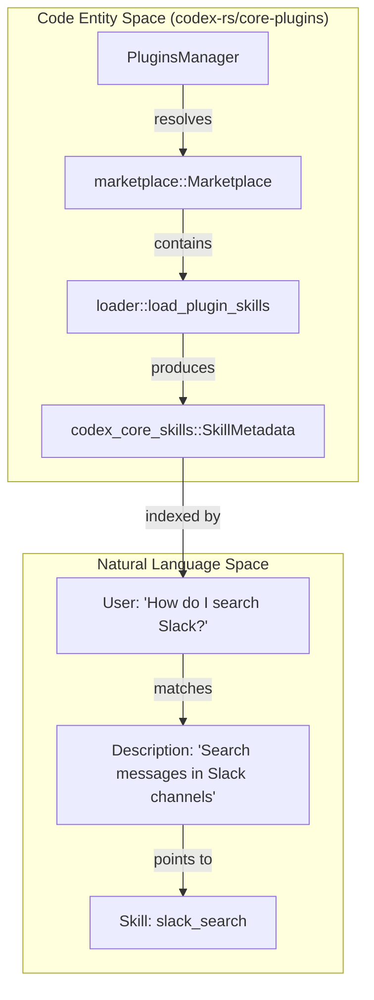
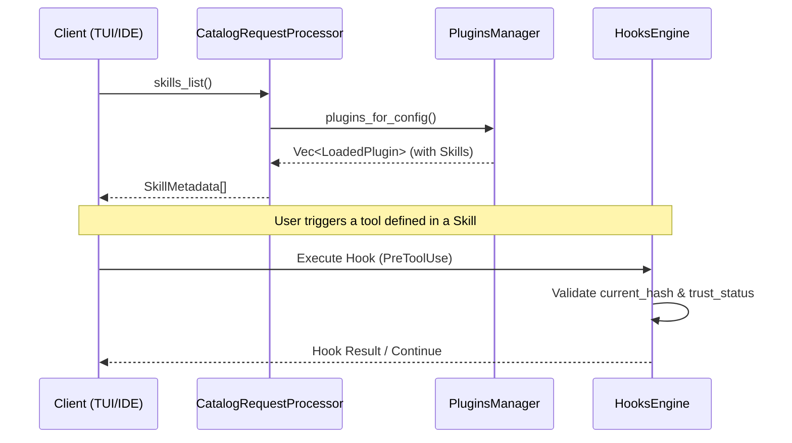

# Skills System

Relevant source files

The following files were used as context for generating this wiki page:

- [codex-rs/app-server/src/request_processors/catalog_processor.rs](codex-rs/app-server/src/request_processors/catalog_processor.rs)
- [codex-rs/app-server/tests/suite/v2/hooks_list.rs](codex-rs/app-server/tests/suite/v2/hooks_list.rs)
- [codex-rs/core-plugins/src/discoverable.rs](codex-rs/core-plugins/src/discoverable.rs)
- [codex-rs/core-plugins/src/lib.rs](codex-rs/core-plugins/src/lib.rs)
- [codex-rs/core-plugins/src/loader.rs](codex-rs/core-plugins/src/loader.rs)
- [codex-rs/core-plugins/src/manager.rs](codex-rs/core-plugins/src/manager.rs)
- [codex-rs/core-plugins/src/manager_tests.rs](codex-rs/core-plugins/src/manager_tests.rs)
- [codex-rs/core-plugins/src/marketplace.rs](codex-rs/core-plugins/src/marketplace.rs)
- [codex-rs/core-plugins/src/marketplace_tests.rs](codex-rs/core-plugins/src/marketplace_tests.rs)
- [codex-rs/core/src/plugins/discoverable.rs](codex-rs/core/src/plugins/discoverable.rs)
- [codex-rs/core/src/plugins/discoverable_tests.rs](codex-rs/core/src/plugins/discoverable_tests.rs)
- [codex-rs/core/src/tools/handlers/request_plugin_install_tests.rs](codex-rs/core/src/tools/handlers/request_plugin_install_tests.rs)
- [codex-rs/tools/src/request_plugin_install.rs](codex-rs/tools/src/request_plugin_install.rs)
- [codex-rs/tools/src/request_plugin_install_tests.rs](codex-rs/tools/src/request_plugin_install_tests.rs)
- [codex-rs/tools/src/tool_discovery.rs](codex-rs/tools/src/tool_discovery.rs)
- [codex-rs/tools/src/tool_discovery_tests.rs](codex-rs/tools/src/tool_discovery_tests.rs)
- [codex-rs/tui/src/snapshots/codex_tui__startup_hooks_review__tests__startup_hooks_review_prompt.snap](codex-rs/tui/src/snapshots/codex_tui__startup_hooks_review__tests__startup_hooks_review_prompt.snap)
- [codex-rs/tui/src/snapshots/codex_tui__startup_hooks_review__tests__startup_hooks_review_prompt_with_trust_error.snap](codex-rs/tui/src/snapshots/codex_tui__startup_hooks_review__tests__startup_hooks_review_prompt_with_trust_error.snap)
- [codex-rs/tui/src/startup_hooks_review.rs](codex-rs/tui/src/startup_hooks_review.rs)

The Skills System in `codex-rs` is a framework for discovering, loading, and injecting high-level instructions, toolsets, and hook configurations into an agent's session. It allows the agent to extend its capabilities using repository-local definitions, built-in "core" skills, and plugin-provided functionality managed via the `PluginsManager`.

---

## Overview

The Skills System manages the lifecycle of "Skills"—curated packages containing natural language instructions (usually in Markdown) and optional metadata. These skills provide the model with domain-specific knowledge or complex tool-use strategies without hardcoding them into the base prompt.

The system architecture is divided into:
1.  **Discovery**: Locating skill definitions in specific directory roots like `.codex/skills`, `.agents/skills`, or plugin cache directories [codex-rs/core-plugins/src/loader.rs:50-53]().
2.  **Loading**: Parsing `SKILL.md` files and metadata via the `PluginsManager` and `load_plugin_skills` [codex-rs/core-plugins/src/loader.rs:12-13]().
3.  **Management**: The `PluginsManager` maintains the registry of active skills from both local and remote sources (Marketplaces) [codex-rs/core-plugins/src/manager.rs:42-48]().
4.  **Injection**: Dynamic injection of skill content into the conversation history, often facilitated by the `CatalogRequestProcessor` for frontend display [codex-rs/app-server/src/request_processors/catalog_processor.rs:18-21]().

---

## Skill Discovery and Plugins

Skills are aggregated from several sources, including local directories and installed plugins. The `PluginsManager` is the central authority for resolving which skills are available based on the current configuration and environment.

### Skill Discovery Hierarchy
The system aggregates skills from the following locations:
*   **Project Root**: `.codex/skills` or `.agents/skills` within the current workspace [codex-rs/core-plugins/src/loader.rs:50-53]().
*   **Plugin Cache**: Skills bundled within installed plugins located in `plugins/cache/{marketplace}/{name}` [codex-rs/core-plugins/src/manager_tests.rs:178-183]().
*   **Core Skills**: Built-in skills provided by the `codex-core-skills` crate [codex-rs/core-plugins/src/manager.rs:56-58]().

### Plugin Integration
The `PluginsManager` tracks the installation and enablement of plugins, which can bundle skills, MCP servers, and hooks [codex-rs/core-plugins/src/manager.rs:167-182](). When a plugin is loaded, its skills are materialized and indexed.

| Component | Role | File Reference |
| :--- | :--- | :--- |
| `PluginsManager` | Orchestrates plugin lifecycle and skill loading. | [codex-rs/core-plugins/src/manager.rs:42-48]() |
| `PluginLoadOutcome` | Result of a plugin load attempt, containing loaded skills. | [codex-rs/core-plugins/src/lib.rs:24-24]() |
| `SkillMetadata` | Metadata for a skill, including name, description, and dependencies. | [codex-rs/app-server/src/request_processors/catalog_processor.rs:18-21]() |

Sources: [codex-rs/core-plugins/src/loader.rs:128-147](), [codex-rs/core-plugins/src/manager.rs:167-185](), [codex-rs/core-plugins/src/manager_tests.rs:178-188]()

---

## Tool Suggestion and Discoverability

Skills are not just static instructions; they are often associated with tools. The system uses a discoverability layer to suggest relevant plugins and skills to the user or the model.

### Discoverable Plugins
The `list_tool_suggest_discoverable_plugins` function filters available plugins from marketplaces (like `openai-curated` or `openai-bundled`) based on the user's current installed apps and configuration [codex-rs/core-plugins/src/discoverable.rs:80-84]().

Sources: [codex-rs/core-plugins/src/discoverable.rs:80-114](), [codex-rs/core-plugins/src/loader.rs:12-13](), [codex-rs/tools/src/tool_discovery.rs:94-102]()

---

## Skills and Hooks Integration

The Skills system is tightly coupled with the Hooks system. Plugins can define `PreToolUse` or `PostToolUse` hooks that execute when specific skills or tools are triggered [codex-rs/app-server/tests/suite/v2/hooks_list.rs:190-211]().

### Hook Metadata and Discovery
The `CatalogRequestProcessor` provides the `hooks_list` and `skills_list` RPC endpoints, allowing frontends (like the TUI) to display available capabilities [codex-rs/app-server/src/request_processors/catalog_processor.rs:120-136]().

*   **Managed Hooks**: Hooks defined in `.codex/config.toml` or plugin manifests [codex-rs/app-server/tests/suite/v2/hooks_list.rs:69-83]().
*   **Trust Status**: Hooks are categorized by `HookTrustStatus` (e.g., `Untrusted`, `Trusted`) to ensure security during execution [codex-rs/app-server/tests/suite/v2/hooks_list.rs:180-180]().

### Data Flow: Skill Activation to Hook Execution

Sources: [codex-rs/app-server/src/request_processors/catalog_processor.rs:18-62](), [codex-rs/app-server/tests/suite/v2/hooks_list.rs:155-185](), [codex-rs/core-plugins/src/loader.rs:188-206]()

---

## Configuration and Rules

Skill behavior can be modified through `SkillConfigRules`. This allows for disabling specific skill paths or enforcing product-level restrictions [codex-rs/core-plugins/src/loader.rs:19-21]().

*   **SkillConfigRules**: Resolved from the `ConfigLayerStack`, these rules determine which skills are active in a given session [codex-rs/core-plugins/src/loader.rs:135-136]().
*   **Product Gating**: Some skills or plugins are restricted to specific products (e.g., `Product::Claude`) via `restriction_product` checks [codex-rs/core-plugins/src/loader.rs:132-134]().
*   **Marketplace Policies**: Marketplaces define `MarketplacePluginInstallPolicy` (e.g., `INSTALLED_BY_DEFAULT`) which dictates the initial skill set available to users [codex-rs/core-plugins/src/marketplace.rs:91-100]().

Sources: [codex-rs/core-plugins/src/loader.rs:19-21](), [codex-rs/core-plugins/src/marketplace.rs:91-109](), [codex-rs/core-plugins/src/manager.rs:56-58]()
