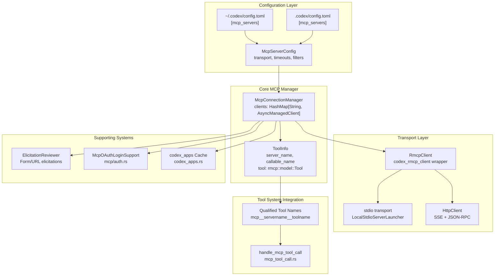
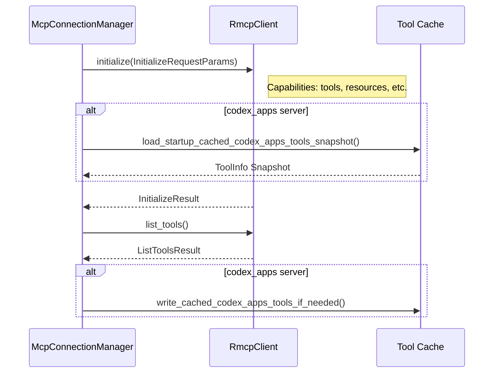
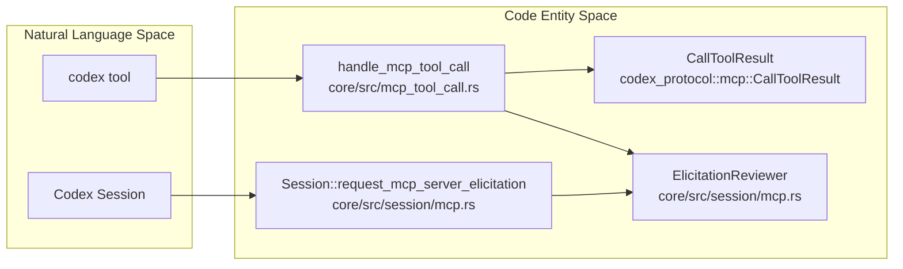

# Model Context Protocol (MCP)

Relevant source files

The following files were used as context for generating this wiki page:

- [codex-rs/app-server/tests/suite/v2/app_list.rs](codex-rs/app-server/tests/suite/v2/app_list.rs)
- [codex-rs/app-server/tests/suite/v2/experimental_feature_list.rs](codex-rs/app-server/tests/suite/v2/experimental_feature_list.rs)
- [codex-rs/app-server/tests/suite/v2/mcp_tool.rs](codex-rs/app-server/tests/suite/v2/mcp_tool.rs)
- [codex-rs/chatgpt/src/connectors.rs](codex-rs/chatgpt/src/connectors.rs)
- [codex-rs/codex-mcp/src/codex_apps.rs](codex-rs/codex-mcp/src/codex_apps.rs)
- [codex-rs/codex-mcp/src/connection_manager.rs](codex-rs/codex-mcp/src/connection_manager.rs)
- [codex-rs/codex-mcp/src/connection_manager_tests.rs](codex-rs/codex-mcp/src/connection_manager_tests.rs)
- [codex-rs/codex-mcp/src/lib.rs](codex-rs/codex-mcp/src/lib.rs)
- [codex-rs/codex-mcp/src/mcp/mod.rs](codex-rs/codex-mcp/src/mcp/mod.rs)
- [codex-rs/codex-mcp/src/mcp/mod_tests.rs](codex-rs/codex-mcp/src/mcp/mod_tests.rs)
- [codex-rs/codex-mcp/src/rmcp_client.rs](codex-rs/codex-mcp/src/rmcp_client.rs)
- [codex-rs/codex-mcp/src/runtime.rs](codex-rs/codex-mcp/src/runtime.rs)
- [codex-rs/codex-mcp/src/tools.rs](codex-rs/codex-mcp/src/tools.rs)
- [codex-rs/core/src/connectors.rs](codex-rs/core/src/connectors.rs)
- [codex-rs/core/src/connectors_tests.rs](codex-rs/core/src/connectors_tests.rs)
- [codex-rs/core/src/mcp_skill_dependencies.rs](codex-rs/core/src/mcp_skill_dependencies.rs)
- [codex-rs/core/src/mcp_tool_call.rs](codex-rs/core/src/mcp_tool_call.rs)
- [codex-rs/core/src/mcp_tool_call_tests.rs](codex-rs/core/src/mcp_tool_call_tests.rs)
- [codex-rs/core/src/session/mcp.rs](codex-rs/core/src/session/mcp.rs)
- [codex-rs/core/tests/common/apps_test_server.rs](codex-rs/core/tests/common/apps_test_server.rs)
- [codex-rs/core/tests/suite/plugins.rs](codex-rs/core/tests/suite/plugins.rs)
- [codex-rs/core/tests/suite/search_tool.rs](codex-rs/core/tests/suite/search_tool.rs)
- [codex-rs/exec-server/src/client/http_response_body_stream.rs](codex-rs/exec-server/src/client/http_response_body_stream.rs)
- [codex-rs/exec-server/src/client/reqwest_http_client.rs](codex-rs/exec-server/src/client/reqwest_http_client.rs)
- [codex-rs/exec-server/src/client/rpc_http_client.rs](codex-rs/exec-server/src/client/rpc_http_client.rs)
- [codex-rs/rmcp-client/Cargo.toml](codex-rs/rmcp-client/Cargo.toml)
- [codex-rs/rmcp-client/src/auth_status.rs](codex-rs/rmcp-client/src/auth_status.rs)
- [codex-rs/rmcp-client/src/bin/rmcp_test_server.rs](codex-rs/rmcp-client/src/bin/rmcp_test_server.rs)
- [codex-rs/rmcp-client/src/bin/test_stdio_server.rs](codex-rs/rmcp-client/src/bin/test_stdio_server.rs)
- [codex-rs/rmcp-client/src/bin/test_streamable_http_server.rs](codex-rs/rmcp-client/src/bin/test_streamable_http_server.rs)
- [codex-rs/rmcp-client/src/http_client_adapter.rs](codex-rs/rmcp-client/src/http_client_adapter.rs)
- [codex-rs/rmcp-client/src/lib.rs](codex-rs/rmcp-client/src/lib.rs)
- [codex-rs/rmcp-client/src/oauth.rs](codex-rs/rmcp-client/src/oauth.rs)
- [codex-rs/rmcp-client/src/perform_oauth_login.rs](codex-rs/rmcp-client/src/perform_oauth_login.rs)
- [codex-rs/rmcp-client/src/rmcp_client.rs](codex-rs/rmcp-client/src/rmcp_client.rs)
- [codex-rs/rmcp-client/src/streamable_http_retry.rs](codex-rs/rmcp-client/src/streamable_http_retry.rs)
- [codex-rs/rmcp-client/src/streamable_http_retry_tests.rs](codex-rs/rmcp-client/src/streamable_http_retry_tests.rs)
- [codex-rs/rmcp-client/tests/streamable_http_oauth_startup.rs](codex-rs/rmcp-client/tests/streamable_http_oauth_startup.rs)
- [codex-rs/rmcp-client/tests/streamable_http_recovery.rs](codex-rs/rmcp-client/tests/streamable_http_recovery.rs)
- [codex-rs/rmcp-client/tests/streamable_http_test_support.rs](codex-rs/rmcp-client/tests/streamable_http_test_support.rs)

The Model Context Protocol (MCP) system enables Codex to integrate with external tool servers, extending its capabilities beyond built-in tools. MCP servers expose tools, resources, and prompts that the agent can invoke during conversation turns. This document covers MCP server configuration, connection management, tool discovery, authentication, and elicitation handling.

For information about built-in tool execution, see [Tool System](#5). For general configuration management, see [Configuration System](#2.2).

---

## Overview

The MCP integration consists of three major subsystems:

1.  **Connection Management** - Manages lifecycle of `RmcpClient` instances per configured server.
2.  **Tool Aggregation** - Discovered, qualified, and routes tool calls to appropriate servers.
3.  **Authentication & Elicitation** - Handles OAuth flows and interactive server requests for user input.

MCP servers can be configured globally in `~/.codex/config.toml` or per-project in `.codex/config.toml` under the `[mcp_servers]` table. Each server operates independently with its own transport (stdio or HTTP), timeout settings, and tool filters.

---

## System Architecture

### MCP Integration Overview
The following diagram illustrates how the `McpConnectionManager` bridges the Codex session logic to external MCP servers via the `rmcp` protocol.

**Sources:** [codex-rs/codex-mcp/src/connection_manager.rs:1-15](), [codex-rs/codex-mcp/src/mcp/mod.rs:40-43](), [codex-rs/codex-mcp/src/lib.rs:1-13]()

The `McpConnectionManager` (defined in `codex-mcp`) owns the lifecycle of MCP connections. It aggregates tools across all servers into a unified map of `ToolInfo` objects, keyed by their model-visible qualified names.

---

## MCP Server Configuration

### Configuration Structure
MCP servers are defined using the `McpServerConfig` struct, which includes transport details and execution policies. The `McpConfig` struct acts as a container for these settings and environment-wide defaults like `codex_home` and `approval_policy`.

**Sources:** [codex-rs/codex-mcp/src/mcp/mod.rs:107-143](), [codex-rs/codex-mcp/src/lib.rs:11-13]()

### Transport Types

#### stdio Transport
Launches a subprocess via command line.
*   **Implementation:** Uses `LocalStdioServerLauncher` or `ExecutorStdioServerLauncher` to manage stdin/stdout pipes.
*   **Launcher:** `codex_rmcp_client::StdioServerLauncher`.

**Sources:** [codex-rs/rmcp-client/src/rmcp_client.rs:88-90](), [codex-rs/rmcp-client/src/lib.rs:37-39]()

#### HTTP Transport
Connects to a remote HTTP server using the Model Context Protocol's SSE-based transport.
*   **Implementation:** Uses `StreamableHttpClientTransport` with a `HttpClient` adapter.
*   **OAuth Support:** Can be wrapped with `AuthClient` for OAuth-protected endpoints.

**Sources:** [codex-rs/rmcp-client/src/rmcp_client.rs:91-97](), [codex-rs/rmcp-client/src/lib.rs:14-17]()

For details on all configuration fields, see [MCP Server Configuration](#6.1).

---

## Server Lifecycle and Startup

### Startup Flow
The `McpConnectionManager` initializes servers using the `InitializeRequestParams` defined by the MCP spec. For the special `codex_apps` server, a disk cache provides availability while background initialization occurs.

**Sources:** [codex-rs/codex-mcp/src/mcp/mod.rs:39-44](), [codex-rs/rmcp-client/src/rmcp_client.rs:33-37](), [codex-rs/codex-mcp/src/lib.rs:24-25]()

For details on client lifecycle and state management, see [MCP Connection Manager](#6.2).

---

## Tool Discovery and Qualification

### Tool Qualification Process
MCP tools must be transformed into qualified names that conform to the model's tool-calling constraints.

1.  **Format:** The standard format is `mcp__{server_name}__toolname`, defined by `qualified_mcp_tool_name_prefix`.
2.  **Prefix:** Uses `mcp` as the standard prefix and `__` as the delimiter.
3.  **Sanitization:** The system ensures names are compatible with model-facing tool definitions using `sanitize_responses_api_tool_name`.

**Sources:** [codex-rs/codex-mcp/src/mcp/mod.rs:44-46](), [codex-rs/codex-mcp/src/mcp/mod.rs:62-66]()

---

## OAuth Authentication

MCP servers can require OAuth authentication, managed via `McpOAuthLoginSupport`.

*   **Flow:** Initiated via `perform_oauth_login`, which handles scope discovery and status computation.
*   **Credential Storage:** Managed according to `OAuthCredentialsStoreMode` (Keyring or local files) via `OAuthPersistor`.
*   **Integration:** `RmcpClient` uses `StoredOAuthTokens` to handle token resolution during transport setup.

**Sources:** [codex-rs/rmcp-client/src/perform_oauth_login.rs:80-91](), [codex-rs/rmcp-client/src/rmcp_client.rs:94-97](), [codex-rs/codex-mcp/src/mcp/mod.rs:1-10]()

For details, see [OAuth Authentication for MCP](#6.5).

---

## Codex Tool Execution

Codex invokes MCP tools via a specialized handler that manages the protocol bridge, approval logic, and result formatting.

### Execution Components
The following diagram maps the tool call handling architecture to internal code entities.

*   **Tool Dispatch:** `handle_mcp_tool_call` manages the full lifecycle of an MCP tool call, including permission checking via `run_permission_request_hooks` and argument rewriting for OpenAI files.
*   **Elicitation:** Servers can request user input via `CreateElicitationRequestParams`. Codex handles this via `request_mcp_server_elicitation` in the session, which emits `EventMsg::ElicitationRequest` events.
*   **Guardian Integration:** `GuardianMcpElicitationReviewer` provides a bridge between MCP elicitations and the Codex Guardian/Approval system.

**Sources:** [codex-rs/core/src/mcp_tool_call.rs:107-115](), [codex-rs/core/src/session/mcp.rs:85-90](), [codex-rs/core/src/session/mcp.rs:174-179](), [codex-rs/core/src/session/mcp.rs:61-74]()

For details, see [MCP Server Implementation (codex-mcp-server)](#6.4).

---

## Sandbox State Synchronization

MCP servers can receive notifications about the current sandbox state to ensure tool execution matches agent permissions.

*   **Capability:** Servers can declare the `codex/sandbox-state-meta` capability.
*   **Metadata Propagation:** If supported, `SandboxState` is included in tool-call request metadata to inform the server of filesystem and network policies.

**Sources:** [codex-rs/codex-mcp/src/mcp/mod.rs:124-127](), [codex-rs/core/src/mcp_tool_call.rs:40-41](), [codex-rs/core/src/mcp_tool_call.rs:150-155]()

For details, see [Sandbox State Synchronization](#6.6).

---

## CLI Commands

The `codex mcp` subcommand allows users to manage their external server integrations.

| Command | Description |
| :--- | :--- |
| `list` | Lists configured servers and their current auth/connection status. |
| `add` | Configures a new stdio or HTTP server in `config.toml`. |
| `login` | Initiates the OAuth login flow for a remote server. |
| `logout` | Clears stored credentials and tokens for a specific server. |

For details, see [MCP CLI Commands](#6.3).
