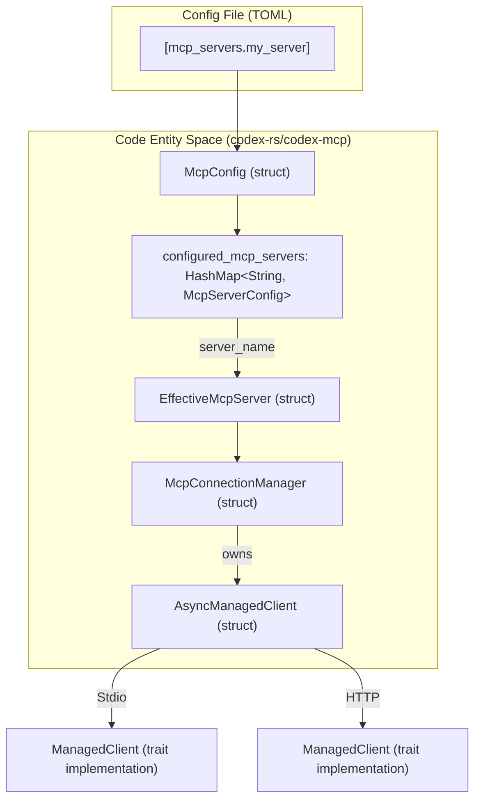
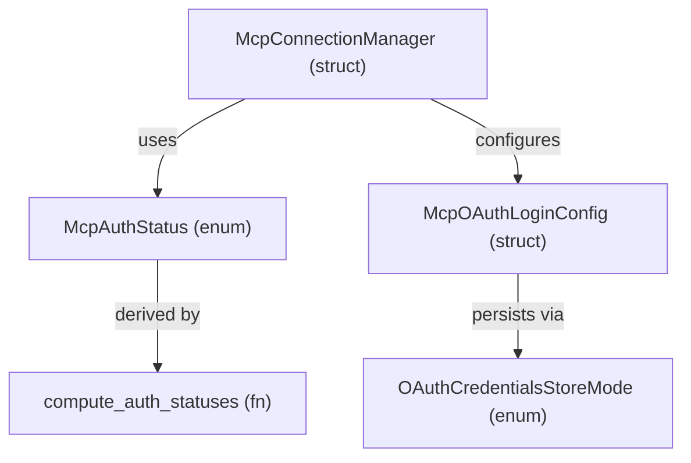

# MCP Server Configuration

Relevant source files

The following files were used as context for generating this wiki page:

- [codex-rs/app-server/tests/suite/v2/app_list.rs](codex-rs/app-server/tests/suite/v2/app_list.rs)
- [codex-rs/app-server/tests/suite/v2/experimental_feature_list.rs](codex-rs/app-server/tests/suite/v2/experimental_feature_list.rs)
- [codex-rs/app-server/tests/suite/v2/mcp_tool.rs](codex-rs/app-server/tests/suite/v2/mcp_tool.rs)
- [codex-rs/chatgpt/src/connectors.rs](codex-rs/chatgpt/src/connectors.rs)
- [codex-rs/codex-mcp/src/codex_apps.rs](codex-rs/codex-mcp/src/codex_apps.rs)
- [codex-rs/codex-mcp/src/connection_manager.rs](codex-rs/codex-mcp/src/connection_manager.rs)
- [codex-rs/codex-mcp/src/connection_manager_tests.rs](codex-rs/codex-mcp/src/connection_manager_tests.rs)
- [codex-rs/codex-mcp/src/lib.rs](codex-rs/codex-mcp/src/lib.rs)
- [codex-rs/codex-mcp/src/mcp/mod.rs](codex-rs/codex-mcp/src/mcp/mod.rs)
- [codex-rs/codex-mcp/src/mcp/mod_tests.rs](codex-rs/codex-mcp/src/mcp/mod_tests.rs)
- [codex-rs/codex-mcp/src/rmcp_client.rs](codex-rs/codex-mcp/src/rmcp_client.rs)
- [codex-rs/codex-mcp/src/runtime.rs](codex-rs/codex-mcp/src/runtime.rs)
- [codex-rs/codex-mcp/src/tools.rs](codex-rs/codex-mcp/src/tools.rs)
- [codex-rs/core/src/connectors.rs](codex-rs/core/src/connectors.rs)
- [codex-rs/core/src/connectors_tests.rs](codex-rs/core/src/connectors_tests.rs)
- [codex-rs/core/src/mcp_skill_dependencies.rs](codex-rs/core/src/mcp_skill_dependencies.rs)
- [codex-rs/core/src/mcp_tool_call.rs](codex-rs/core/src/mcp_tool_call.rs)
- [codex-rs/core/src/mcp_tool_call_tests.rs](codex-rs/core/src/mcp_tool_call_tests.rs)
- [codex-rs/core/src/session/mcp.rs](codex-rs/core/src/session/mcp.rs)
- [codex-rs/core/tests/common/apps_test_server.rs](codex-rs/core/tests/common/apps_test_server.rs)
- [codex-rs/core/tests/suite/plugins.rs](codex-rs/core/tests/suite/plugins.rs)
- [codex-rs/core/tests/suite/search_tool.rs](codex-rs/core/tests/suite/search_tool.rs)

This document describes the technical implementation and configuration schema for MCP (Model Context Protocol) servers in Codex. MCP servers extend Codex's capabilities by providing external tools, resources, and data sources that the AI can access during conversations.

---

## Configuration Structure

MCP servers are configured in the `config.toml` file under the `[mcp_servers]` table. The configuration is managed by the `McpConfig` struct [codex-rs/codex-mcp/src/mcp/mod.rs:107-147](), which aggregates runtime settings derived from the root configuration.

### McpServerConfig Fields

The `McpServerConfig` struct [codex-rs/core/src/mcp_tool_call_tests.rs:17-18]() defines how Codex connects to and manages an MCP server.

| Field | Type | Description |
|-------|------|-------------|
| `transport` | `McpServerTransportConfig` | Defines the connection method (Stdio or HTTP) [codex-rs/core/tests/suite/search_tool.rs:6](). |
| `enabled` | `bool` | Whether the server is active. Defaults to `true`. |
| `required` | `bool` | If `true`, session initialization fails if this server cannot start [codex-rs/codex-mcp/src/connection_manager.rs:138-141](). |
| `supports_parallel_tool_calls` | `bool` | Enables concurrent execution for tools from this server [codex-rs/codex-mcp/src/connection_manager.rs:35](). |
| `default_tools_approval_mode` | `AppToolApproval` | Default behavior (`auto`, `prompt`, `approve`) for all tools on this server [codex-rs/core/src/mcp_tool_call.rs:34](). |
| `tools` | `HashMap<String, McpServerToolConfig>` | Per-tool overrides (e.g., `enabled`, `approval_mode`) [codex-rs/core/src/mcp_tool_call_tests.rs:18](). |
| `oauth` | `McpOAuthLoginConfig` | Configuration for OAuth-based authentication [codex-rs/codex-mcp/src/mcp/mod.rs:2](). |
| `startup_timeout_sec` | `Option<f64>` | Custom timeout for server initialization [codex-rs/core/tests/suite/plugins.rs:78](). |

**Sources:** [codex-rs/codex-mcp/src/mcp/mod.rs:107-147](), [codex-rs/codex-mcp/src/connection_manager.rs:138-143](), [codex-rs/core/src/mcp_tool_call_tests.rs:12-18]()

---

## Transport Types

Codex supports two primary transport mechanisms for MCP communication, defined in the `McpServerTransportConfig` enum [codex-rs/core/tests/suite/search_tool.rs:6]().

### Stdio Transport
Launches the server as a local subprocess.
- **`command`**: The executable to run [codex-rs/core/tests/suite/plugins.rs:76]().
- **`env`**: Environment variables passed to the child process.
- **`cwd`**: Current working directory for the server process [codex-rs/core/tests/suite/plugins.rs:77]().

### HTTP Transport
Connects to a remote or local HTTP endpoint using the `http` variant [codex-rs/core/src/mcp_tool_call_tests.rs:113-114]().
- **`url`**: The base URL of the MCP server [codex-rs/core/src/mcp_tool_call_tests.rs:114]().

### Configuration to Code Entity Mapping

The following diagram bridges the configuration file to the internal implementation, specifically focusing on how the `McpConnectionManager` initializes these transports.

**Sources:** [codex-rs/codex-mcp/src/mcp/mod.rs:107-147](), [codex-rs/codex-mcp/src/connection_manager.rs:106-115](), [codex-rs/codex-mcp/src/connection_manager.rs:24-31]()

---

## Tool Filters and Approvals

Codex implements a hierarchical approval system for MCP tools. The effective approval mode is resolved by checking tool-specific configs and the global `approval_policy`.

### Auto-Approval Logic
The function `mcp_permission_prompt_is_auto_approved` [codex-rs/codex-mcp/src/mcp/mod.rs:71-90]() determines if a prompt should be bypassed:
- If `tool_approval_mode` is `AppToolApproval::Approve`, it returns `true` [codex-rs/codex-mcp/src/mcp/mod.rs:76-78]().
- If the `approval_policy` is `AskForApproval::Never`, it checks the `PermissionProfile` [codex-rs/codex-mcp/src/mcp/mod.rs:80-89](). Managed profiles with full disk write access are auto-approved [codex-rs/codex-mcp/src/mcp/mod.rs:86-88]().

### Tool Filtering and Visibility
Tools can be filtered based on visibility metadata. `tool_is_model_visible` [codex-rs/codex-mcp/src/connection_manager.rs:87-103]() hides tools unless they explicitly include `model` in their visibility metadata. Tools are further normalized for model visibility (e.g., prefixing names) via `normalize_tools_for_model_with_prefix` [codex-rs/codex-mcp/src/connection_manager.rs:37]().

**Sources:** [codex-rs/codex-mcp/src/mcp/mod.rs:71-90](), [codex-rs/codex-mcp/src/connection_manager.rs:87-103](), [codex-rs/codex-mcp/src/connection_manager.rs:35-38]()

---

## OAuth Settings and Flow

Codex supports OAuth 2.0 for MCP servers. Authentication state is managed via `McpAuthStatusEntry` [codex-rs/codex-mcp/src/mcp/mod.rs:1]().

### OAuth Flow and Components
The system handles scope discovery via `discover_supported_scopes` [codex-rs/codex-mcp/src/mcp/mod.rs:7]() and manages retries if scope-restricted requests fail via `should_retry_without_scopes` [codex-rs/codex-mcp/src/mcp/mod.rs:10]().

**Sources:** [codex-rs/codex-mcp/src/mcp/mod.rs:1-10](), [codex-rs/codex-mcp/src/mcp/mod.rs:114-119](), [codex-rs/codex-mcp/src/connection_manager.rs:121-122]()

---

## Elicitation and Sandbox State

MCP servers can request information from the user via **Elicitation Requests** [codex-rs/core/src/session/mcp.rs:85-90]().

1. **Processing**: `request_mcp_server_elicitation` handles incoming requests from the MCP server [codex-rs/core/src/session/mcp.rs:85-144](). It checks `elicitations_auto_deny()` before prompting the user [codex-rs/core/src/session/mcp.rs:91-96]().
2. **Approval**: Requests are reviewed by `GuardianMcpElicitationReviewer` [codex-rs/core/src/session/mcp.rs:61-74]() to ensure they comply with security policies.
3. **Sandbox Sync**: The system synchronizes sandbox state (e.g., Landlock/Seatbelt policies) with the MCP server to ensure the server is aware of the agent's current permissions [codex-rs/codex-mcp/src/mcp/mod.rs:41]().

**Sources:** [codex-rs/core/src/session/mcp.rs:61-184](), [codex-rs/codex-mcp/src/connection_manager.rs:113-115](), [codex-rs/codex-mcp/src/mcp/mod.rs:41-43]()

---

## Performance and Caching

MCP operations use specific timeouts and caching strategies to maintain responsiveness:
- **`DEFAULT_STARTUP_TIMEOUT`**: Default time allowed for a server to initialize (60 seconds) [codex-rs/codex-mcp/src/connection_manager.rs:25]().
- **Caching**: For the internal `codex_apps` server, tools are cached to speed up subsequent starts using `write_cached_codex_apps_tools_if_needed` [codex-rs/codex-mcp/src/connection_manager.rs:19]().
- **Metrics**: The system tracks tool listing durations via `MCP_TOOLS_LIST_DURATION_METRIC` [codex-rs/codex-mcp/src/connection_manager.rs:27]().

**Sources:** [codex-rs/codex-mcp/src/connection_manager.rs:17-30](), [codex-rs/codex-mcp/src/connection_manager.rs:47-48]()
