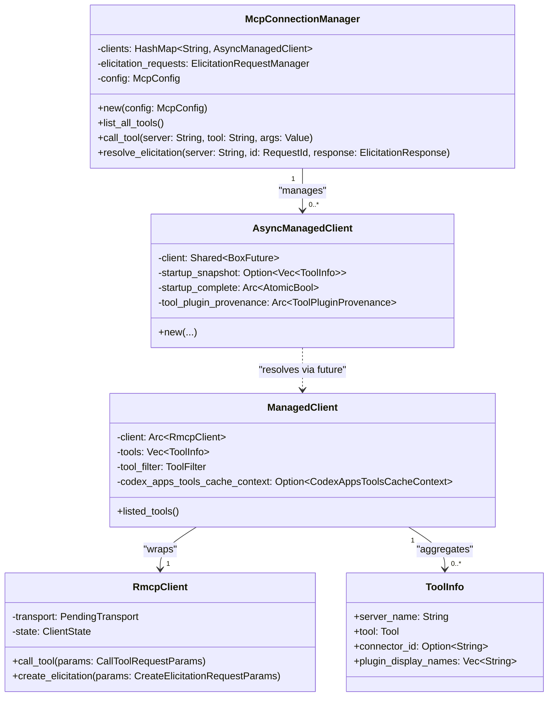
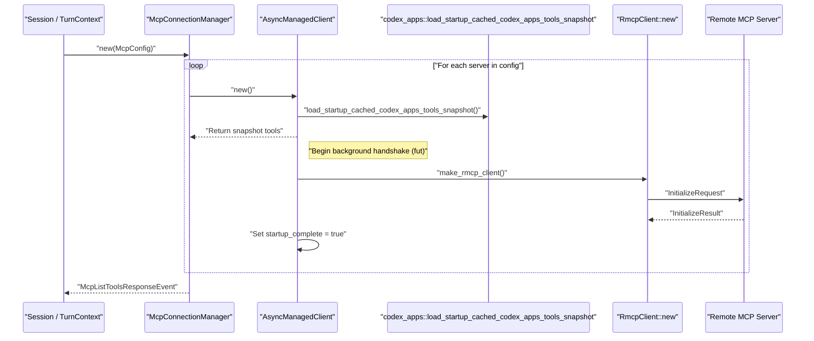
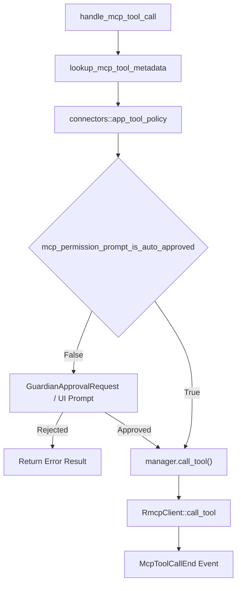

# MCP Connection Manager

Relevant source files

The following files were used as context for generating this wiki page:

- [codex-rs/app-server/tests/suite/v2/app_list.rs](codex-rs/app-server/tests/suite/v2/app_list.rs)
- [codex-rs/app-server/tests/suite/v2/experimental_feature_list.rs](codex-rs/app-server/tests/suite/v2/experimental_feature_list.rs)
- [codex-rs/app-server/tests/suite/v2/mcp_tool.rs](codex-rs/app-server/tests/suite/v2/mcp_tool.rs)
- [codex-rs/chatgpt/src/connectors.rs](codex-rs/chatgpt/src/connectors.rs)
- [codex-rs/codex-mcp/src/codex_apps.rs](codex-rs/codex-mcp/src/codex_apps.rs)
- [codex-rs/codex-mcp/src/connection_manager.rs](codex-rs/codex-mcp/src/connection_manager.rs)
- [codex-rs/codex-mcp/src/connection_manager_tests.rs](codex-rs/codex-mcp/src/connection_manager_tests.rs)
- [codex-rs/codex-mcp/src/lib.rs](codex-rs/codex-mcp/src/lib.rs)
- [codex-rs/codex-mcp/src/mcp/mod.rs](codex-rs/codex-mcp/src/mcp/mod.rs)
- [codex-rs/codex-mcp/src/mcp/mod_tests.rs](codex-rs/codex-mcp/src/mcp/mod_tests.rs)
- [codex-rs/codex-mcp/src/rmcp_client.rs](codex-rs/codex-mcp/src/rmcp_client.rs)
- [codex-rs/codex-mcp/src/runtime.rs](codex-rs/codex-mcp/src/runtime.rs)
- [codex-rs/codex-mcp/src/tools.rs](codex-rs/codex-mcp/src/tools.rs)
- [codex-rs/core/src/connectors.rs](codex-rs/core/src/connectors.rs)
- [codex-rs/core/src/connectors_tests.rs](codex-rs/core/src/connectors_tests.rs)
- [codex-rs/core/src/mcp_skill_dependencies.rs](codex-rs/core/src/mcp_skill_dependencies.rs)
- [codex-rs/core/src/mcp_tool_call.rs](codex-rs/core/src/mcp_tool_call.rs)
- [codex-rs/core/src/mcp_tool_call_tests.rs](codex-rs/core/src/mcp_tool_call_tests.rs)
- [codex-rs/core/src/session/mcp.rs](codex-rs/core/src/session/mcp.rs)
- [codex-rs/core/tests/common/apps_test_server.rs](codex-rs/core/tests/common/apps_test_server.rs)
- [codex-rs/core/tests/suite/plugins.rs](codex-rs/core/tests/suite/plugins.rs)
- [codex-rs/core/tests/suite/search_tool.rs](codex-rs/core/tests/suite/search_tool.rs)
- [codex-rs/exec-server/src/client/http_response_body_stream.rs](codex-rs/exec-server/src/client/http_response_body_stream.rs)
- [codex-rs/exec-server/src/client/reqwest_http_client.rs](codex-rs/exec-server/src/client/reqwest_http_client.rs)
- [codex-rs/exec-server/src/client/rpc_http_client.rs](codex-rs/exec-server/src/client/rpc_http_client.rs)
- [codex-rs/rmcp-client/Cargo.toml](codex-rs/rmcp-client/Cargo.toml)
- [codex-rs/rmcp-client/src/auth_status.rs](codex-rs/rmcp-client/src/auth_status.rs)
- [codex-rs/rmcp-client/src/bin/rmcp_test_server.rs](codex-rs/rmcp-client/src/bin/rmcp_test_server.rs)
- [codex-rs/rmcp-client/src/bin/test_stdio_server.rs](codex-rs/rmcp-client/src/bin/test_stdio_server.rs)
- [codex-rs/rmcp-client/src/bin/test_streamable_http_server.rs](codex-rs/rmcp-client/src/bin/test_streamable_http_server.rs)
- [codex-rs/rmcp-client/src/http_client_adapter.rs](codex-rs/rmcp-client/src/http_client_adapter.rs)
- [codex-rs/rmcp-client/src/lib.rs](codex-rs/rmcp-client/src/lib.rs)
- [codex-rs/rmcp-client/src/oauth.rs](codex-rs/rmcp-client/src/oauth.rs)
- [codex-rs/rmcp-client/src/perform_oauth_login.rs](codex-rs/rmcp-client/src/perform_oauth_login.rs)
- [codex-rs/rmcp-client/src/rmcp_client.rs](codex-rs/rmcp-client/src/rmcp_client.rs)
- [codex-rs/rmcp-client/src/streamable_http_retry.rs](codex-rs/rmcp-client/src/streamable_http_retry.rs)
- [codex-rs/rmcp-client/src/streamable_http_retry_tests.rs](codex-rs/rmcp-client/src/streamable_http_retry_tests.rs)
- [codex-rs/rmcp-client/tests/streamable_http_oauth_startup.rs](codex-rs/rmcp-client/tests/streamable_http_oauth_startup.rs)
- [codex-rs/rmcp-client/tests/streamable_http_recovery.rs](codex-rs/rmcp-client/tests/streamable_http_recovery.rs)
- [codex-rs/rmcp-client/tests/streamable_http_test_support.rs](codex-rs/rmcp-client/tests/streamable_http_test_support.rs)

The MCP Connection Manager is the runtime component in `codex-core` and `codex-mcp` responsible for establishing and maintaining connections to external MCP (Model Context Protocol) servers. It manages the lifecycle of `RmcpClient` instances, aggregates tool/resource listings, routes tool calls, and handles elicitation requests. [codex-rs/codex-mcp/src/connection_manager.rs:40-45]()

This page documents the internal mechanics of `McpConnectionManager`, the `RmcpClient` wrapper, and the data flow for tool execution and elicitation.

---

## Structural Overview

The `McpConnectionManager` acts as the central orchestrator. It maintains a map of `AsyncManagedClient` objects, each representing a connection to a specific MCP server defined in the configuration. [codex-rs/codex-mcp/src/connection_manager.rs:40-45]()

### Class Relationship Diagram

Sources: [codex-rs/codex-mcp/src/connection_manager.rs:40-45](), [codex-rs/codex-mcp/src/rmcp_client.rs:86-94](), [codex-rs/codex-mcp/src/rmcp_client.rs:124-130](), [codex-rs/rmcp-client/src/rmcp_client.rs:100-109](), [codex-rs/codex-mcp/src/tools.rs:25-33]()

---

## Initialization and Startup Sequence

`McpConnectionManager` initialization involves spawning asynchronous tasks for each configured MCP server. It uses a "startup snapshot" mechanism where tool definitions are loaded from a local cache (managed via `codex_apps_tools_cache_key`) to allow the model to start planning before all remote connections are fully established. [codex-rs/codex-mcp/src/rmcp_client.rs:153-157]()

### Startup Flow Diagram

Sources: [codex-rs/codex-mcp/src/rmcp_client.rs:148-160](), [codex-rs/codex-mcp/src/rmcp_client.rs:168-177](), [codex-rs/codex-mcp/src/rmcp_client.rs:182-190](), [codex-rs/codex-mcp/src/codex_apps.rs:40-40]()

---

## Tool Execution and Approval Pipeline

Tool calls originating from the model are processed by `handle_mcp_tool_call`. This function determines the security policy, requests user approval if necessary, and dispatches the call to the manager. [codex-rs/core/src/mcp_tool_call.rs:108-116]()

### Execution Flow

Sources: [codex-rs/core/src/mcp_tool_call.rs:141-149](), [codex-rs/core/src/mcp_tool_call.rs:150-160](), [codex-rs/core/src/mcp_tool_call.rs:320-330]()

### Approval Logic
Approval requirements are governed by `mcp_permission_prompt_is_auto_approved`. Auto-approval occurs if:
- The `tool_approval_mode` is `Approve`. [codex-rs/codex-mcp/src/mcp/mod.rs:76-78]()
- The `AskForApproval` policy is `Never` AND the `PermissionProfile` has full disk write access (via sandbox policy). [codex-rs/codex-mcp/src/mcp/mod.rs:80-90]()

---

## Elicitation Handling

Elicitation allows an MCP server to request user input (e.g., credentials or confirmations) during tool execution. The `McpConnectionManager` manages these requests via an `ElicitationRequestManager`. [codex-rs/codex-mcp/src/connection_manager.rs:43-43]()

### Elicitation Data Flow

| Component | Role | Code Pointer |
| :--- | :--- | :--- |
| `CreateElicitationRequestParams` | Protocol message emitted by server. | [codex-rs/rmcp-client/src/rmcp_client.rs:27-27]() |
| `ElicitationAction` | The type of request action (e.g., Accept). | [codex-rs/rmcp-client/src/rmcp_client.rs:31-31]() |
| `ElicitationResponse` | The user's response sent back to the server. | [codex-rs/rmcp-client/src/rmcp_client.rs:76-76]() |

When a server requests elicitation, the `Session` emits an `EventMsg::ElicitationRequest` to the frontend via `request_mcp_server_elicitation`. [codex-rs/core/src/session/mcp.rs:85-90]() The tool call remains pending in the `TurnState` until resolved. [codex-rs/core/src/session/mcp.rs:151-156]()

### Elicitation Pause Mechanism
The `RmcpClient` implementation includes an `ElicitationPauseState` to manage timeouts during active elicitation prompts. It tracks `active_count` and uses a `watch` channel to signal when operations should be paused or resumed, preventing background timeouts while waiting for user input. [codex-rs/rmcp-client/src/rmcp_client.rs:139-142]()

---

## Tool Metadata and Sanitization

To prevent collisions, tools are namespaced using the server name.

1. **Qualified Names**: Tools are exposed to the model as `mcp__{server_name}__{tool_name}`. [codex-rs/codex-mcp/src/mcp/mod.rs:63-67]()
2. **Sanitization**: Server names are sanitized to ensure they contain only alphanumeric characters and underscores. [codex-rs/codex-mcp/src/mcp/mod.rs:64-66]()
3. **OpenAI File Handling**: `rewrite_mcp_tool_arguments_for_openai_files` detects parameters declared in tool metadata (`openai/fileParams`) and transforms them into OpenAI file references for the model. [codex-rs/core/src/mcp_tool_call.rs:18-18]()

---

## Telemetry and Truncation

The manager and clients track performance and usage metrics:
- **Startup Metrics**: `codex.mcp.tools.list.duration_ms` and `codex.mcp.tools.fetch_uncached.duration_ms`. [codex-rs/codex-mcp/src/rmcp_client.rs:71-73]()
- **Execution Metrics**: `codex.mcp.call` (count) and `codex.mcp.call.duration_ms`. [codex-rs/core/src/mcp_tool_call.rs:94-95]()
- **Output Truncation**: Large tool outputs are truncated based on `MCP_TOOL_CALL_EVENT_RESULT_MAX_BYTES` (defaulting to `DEFAULT_OUTPUT_BYTES_CAP`). [codex-rs/core/src/mcp_tool_call.rs:104-104]()

Sources: [codex-rs/codex-mcp/src/rmcp_client.rs:71-73](), [codex-rs/core/src/mcp_tool_call.rs:94-104](), [codex-rs/core/src/mcp_tool_call.rs:81-81]()
