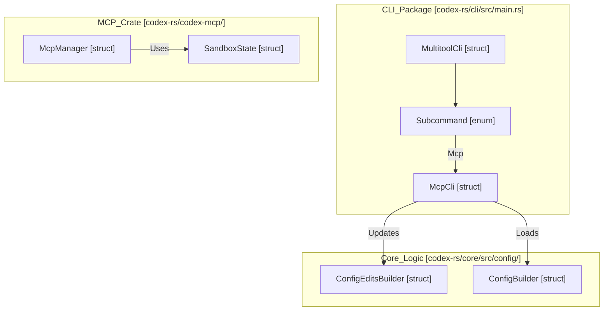
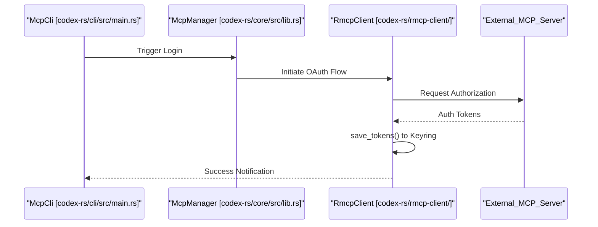

# MCP CLI Commands

Relevant source files

The following files were used as context for generating this wiki page:

- [codex-rs/Cargo.lock](codex-rs/Cargo.lock)
- [codex-rs/Cargo.toml](codex-rs/Cargo.toml)
- [codex-rs/cli/Cargo.toml](codex-rs/cli/Cargo.toml)
- [codex-rs/cli/src/lib.rs](codex-rs/cli/src/lib.rs)
- [codex-rs/cli/src/main.rs](codex-rs/cli/src/main.rs)
- [codex-rs/core/Cargo.toml](codex-rs/core/Cargo.toml)
- [codex-rs/core/src/lib.rs](codex-rs/core/src/lib.rs)
- [codex-rs/exec/Cargo.toml](codex-rs/exec/Cargo.toml)
- [codex-rs/exec/src/cli.rs](codex-rs/exec/src/cli.rs)
- [codex-rs/exec/src/event_processor.rs](codex-rs/exec/src/event_processor.rs)
- [codex-rs/exec/src/lib.rs](codex-rs/exec/src/lib.rs)
- [codex-rs/tui/Cargo.toml](codex-rs/tui/Cargo.toml)
- [codex-rs/tui/src/cli.rs](codex-rs/tui/src/cli.rs)
- [codex-rs/tui/src/lib.rs](codex-rs/tui/src/lib.rs)

This page documents the `codex mcp` subcommands that allow users to manage Model Context Protocol (MCP) server configurations from the command line. These commands provide a technical interface for adding, removing, listing, and authenticating with MCP servers by manipulating the `config.toml` file and managing OAuth credentials.

For information about the MCP server configuration structure and connection lifecycle, see **6.1 MCP Server Configuration** and **6.2 MCP Connection Manager**. For details on OAuth implementation, see **6.5 OAuth Authentication for MCP**.

---

## Command Overview

The MCP CLI commands are implemented as subcommands under `codex mcp`. All commands operate on the global MCP server configuration stored in `~/.codex/config.toml` (or `$CODEX_HOME/config.toml`), which is located using `find_codex_home` [codex-rs/cli/src/main.rs:73]().

**Available Commands**:
- `list` — Display all configured servers (with `--json` support).
- `get <name>` — Show detailed configuration for a single server.
- `add <name>` — Add a server launcher entry to `config.toml`.
- `remove <name>` — Delete a server entry.
- `login <name>` — Authenticate with an MCP server using OAuth.
- `logout <name>` — Remove OAuth credentials for an MCP server.

Sources: [codex-rs/cli/src/main.rs:135-136](), [codex-rs/cli/src/main.rs:61-61]()

---

## Command Dispatch Architecture

The `McpCli` struct is the primary entry point for these commands [codex-rs/cli/src/main.rs:61](). The main CLI entry point in `main.rs` routes the `Mcp` variant to this logic [codex-rs/cli/src/main.rs:135-136]().

**Diagram: MCP CLI Entry Points**

Sources: [codex-rs/cli/src/main.rs:103-118](), [codex-rs/cli/src/main.rs:121-209](), [codex-rs/core/src/lib.rs:55-60](), [codex-rs/core/src/lib.rs:70-71]()

---

## Configuration Manipulation

All write operations for MCP servers eventually result in modifications to the `config.toml`. The system uses `ConfigEditsBuilder` [codex-rs/cli/src/main.rs:72]() to perform these mutations.

### Add and Remove Logic
When a user runs `codex mcp add`, the CLI:
1. Validates the server name and transport parameters.
2. Uses `ConfigEditsBuilder` to insert a new entry into the `[mcp_servers]` table of the configuration.
3. If the server is an HTTP-based server, the system may check for OAuth requirements.

Conversely, `remove` identifies the key in the `[mcp_servers]` table and deletes it via the same editing abstraction.

### Persistence Table
| Command | Key Code Entity | Data Target |
| :--- | :--- | :--- |
| `add` | `ConfigEditsBuilder` | `[mcp_servers]` table in `config.toml` |
| `remove` | `ConfigEditsBuilder` | `[mcp_servers]` table in `config.toml` |
| `login` | `McpManager` / OAuth Client | Local credential store (Keyring/File) |
| `logout` | `McpManager` / OAuth Client | Local credential store (Keyring/File) |

Sources: [codex-rs/cli/src/main.rs:70-74](), [codex-rs/core/src/lib.rs:49-55]()

---

## Authentication Flow (Login/Logout)

These commands manage OAuth 2.0 credentials for MCP servers. The `McpManager` [codex-rs/core/src/lib.rs:55]() in `codex-core` handles the underlying connection logic, but the CLI provides the trigger for the initial handshake.

**Diagram: OAuth Credential Lifecycle**

### Logout Behavior
The `logout` command instructs the system to purge stored tokens for a specific server name. This is handled by interacting with the `codex-rmcp-client` which manages the secure storage of these secrets.

Sources: [codex-rs/core/src/lib.rs:49-55](), [codex-rs/cli/src/main.rs:135-136](), [codex-rs/Cargo.toml:77-77]()

---

## Implementation Details

The CLI commands are designed to be thin wrappers around the core logic found in `codex-core` and `codex-mcp`.

- **Configuration Loading**: Uses `load_config_as_toml_with_cli_and_load_options` [codex-rs/tui/src/lib.rs:10]() to ensure that CLI overrides are respected when inspecting current MCP settings.
- **Path Resolution**: The `find_codex_home` function [codex-rs/core/src/config/mod.rs]() (re-exported in [codex-rs/cli/src/main.rs:73]()) is critical for locating the `config.toml` and the local state database where MCP metadata might reside.
- **Sandbox Integration**: MCP servers are often subject to the same sandboxing constraints as other tools. The `SandboxState` [codex-rs/core/src/lib.rs:60]() is used to communicate the current environment's capabilities to the MCP server during the `initialize` handshake.

Sources: [codex-rs/tui/src/lib.rs:10-12](), [codex-rs/core/src/lib.rs:60-60](), [codex-rs/cli/src/main.rs:73-74]()
