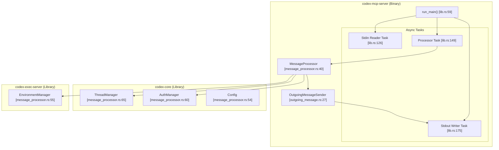
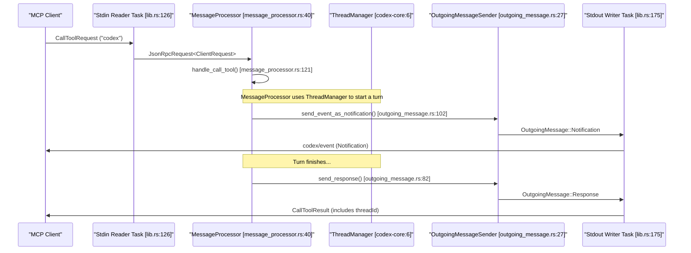

# MCP Server Implementation (codex-mcp-server)

Relevant source files

The following files were used as context for generating this wiki page:

- [codex-rs/app-server/tests/suite/v2/app_list.rs](codex-rs/app-server/tests/suite/v2/app_list.rs)
- [codex-rs/app-server/tests/suite/v2/experimental_feature_list.rs](codex-rs/app-server/tests/suite/v2/experimental_feature_list.rs)
- [codex-rs/app-server/tests/suite/v2/mcp_tool.rs](codex-rs/app-server/tests/suite/v2/mcp_tool.rs)
- [codex-rs/chatgpt/src/connectors.rs](codex-rs/chatgpt/src/connectors.rs)
- [codex-rs/codex-mcp/src/codex_apps.rs](codex-rs/codex-mcp/src/codex_apps.rs)
- [codex-rs/codex-mcp/src/connection_manager.rs](codex-rs/codex-mcp/src/connection_manager.rs)
- [codex-rs/codex-mcp/src/connection_manager_tests.rs](codex-rs/codex-mcp/src/connection_manager_tests.rs)
- [codex-rs/codex-mcp/src/lib.rs](codex-rs/codex-mcp/src/lib.rs)
- [codex-rs/codex-mcp/src/mcp/mod.rs](codex-rs/codex-mcp/src/mcp/mod.rs)
- [codex-rs/codex-mcp/src/mcp/mod_tests.rs](codex-rs/codex-mcp/src/mcp/mod_tests.rs)
- [codex-rs/codex-mcp/src/rmcp_client.rs](codex-rs/codex-mcp/src/rmcp_client.rs)
- [codex-rs/codex-mcp/src/runtime.rs](codex-rs/codex-mcp/src/runtime.rs)
- [codex-rs/codex-mcp/src/tools.rs](codex-rs/codex-mcp/src/tools.rs)
- [codex-rs/core/src/connectors.rs](codex-rs/core/src/connectors.rs)
- [codex-rs/core/src/connectors_tests.rs](codex-rs/core/src/connectors_tests.rs)
- [codex-rs/core/src/mcp_skill_dependencies.rs](codex-rs/core/src/mcp_skill_dependencies.rs)
- [codex-rs/core/src/mcp_tool_call.rs](codex-rs/core/src/mcp_tool_call.rs)
- [codex-rs/core/src/mcp_tool_call_tests.rs](codex-rs/core/src/mcp_tool_call_tests.rs)
- [codex-rs/core/src/session/mcp.rs](codex-rs/core/src/session/mcp.rs)
- [codex-rs/core/tests/common/apps_test_server.rs](codex-rs/core/tests/common/apps_test_server.rs)
- [codex-rs/core/tests/suite/plugins.rs](codex-rs/core/tests/suite/plugins.rs)
- [codex-rs/core/tests/suite/search_tool.rs](codex-rs/core/tests/suite/search_tool.rs)
- [codex-rs/exec/src/main.rs](codex-rs/exec/src/main.rs)
- [codex-rs/mcp-server/Cargo.toml](codex-rs/mcp-server/Cargo.toml)
- [codex-rs/mcp-server/src/codex_tool_config.rs](codex-rs/mcp-server/src/codex_tool_config.rs)
- [codex-rs/mcp-server/src/lib.rs](codex-rs/mcp-server/src/lib.rs)
- [codex-rs/mcp-server/src/main.rs](codex-rs/mcp-server/src/main.rs)
- [codex-rs/mcp-server/src/message_processor.rs](codex-rs/mcp-server/src/message_processor.rs)
- [codex-rs/mcp-server/src/outgoing_message.rs](codex-rs/mcp-server/src/outgoing_message.rs)
- [codex-rs/mcp-server/tests/common/mcp_process.rs](codex-rs/mcp-server/tests/common/mcp_process.rs)
- [codex-rs/mcp-server/tests/suite/mod.rs](codex-rs/mcp-server/tests/suite/mod.rs)
- [codex-rs/tui/src/main.rs](codex-rs/tui/src/main.rs)

## Purpose and Scope

This document describes the `codex-mcp-server` implementation, which exposes Codex as an MCP (Model Context Protocol) server. This allows external MCP clients—such as Claude Desktop, Zed Editor, or custom applications—to invoke Codex as a tool over stdio JSON-RPC. The server provides the `codex` tool for starting and continuing conversations, managing the underlying agent sessions via `ThreadManager`. [codex-rs/mcp-server/src/lib.rs:1-13]()

**CLI Entry Point**: The server is typically launched via the `codex mcp-server` subcommand. The binary uses `arg0_dispatch_or_else` to handle its execution logic, ensuring proper binary path resolution for sandboxing. [codex-rs/mcp-server/src/main.rs:6-16]()

For information about Codex acting as an MCP *client* to consume external MCP tools, see pages 6.1 (MCP Server Configuration) and 6.2 (MCP Connection Manager).

Sources: [codex-rs/mcp-server/src/lib.rs:1-13](), [codex-rs/mcp-server/src/main.rs:6-16](), [codex-rs/mcp-server/Cargo.toml:7-13]()

## Overview

The `codex-mcp-server` crate implements a JSON-RPC server that communicates over stdio, following the [Model Context Protocol specification](https://modelcontextprotocol.io). When an MCP client invokes the `codex` tool, the server spawns a Codex session using `ThreadManager` from `codex-core`, streams events back to the client as notifications, and returns the final response when the turn completes. [codex-rs/mcp-server/src/message_processor.rs:65-76](), [codex-rs/mcp-server/src/message_processor.rs:121-123]()

**Key characteristics:**
- **Transport**: stdio JSON-RPC (line-delimited JSON messages). [codex-rs/mcp-server/src/lib.rs:132-142](), [codex-rs/mcp-server/src/lib.rs:175-186]()
- **Tools exposed**: `codex` (managed via `CodexToolCallParam`) and `codex_reply` (managed via `CodexToolCallReplyParam`). [codex-rs/mcp-server/src/codex_tool_config.rs:108-126](), [codex-rs/mcp-server/src/message_processor.rs:34-37]()
- **Event streaming**: Codex `Event` types are translated to `codex/event` notifications. [codex-rs/mcp-server/src/outgoing_message.rs:102-125]()
- **Session multiplexing**: Multiple threads can share a single MCP connection via `threadId` metadata in notification `_meta` fields. [codex-rs/mcp-server/src/outgoing_message.rs:195-204]()
- **Approval flows**: Interactive approval requests for command execution or file patches (elicitation protocol). [codex-rs/mcp-server/src/lib.rs:45-48]()

Sources: [codex-rs/mcp-server/src/lib.rs:1-189](), [codex-rs/mcp-server/src/message_processor.rs:40-83](), [codex-rs/mcp-server/src/outgoing_message.rs:102-125]()

## System Architecture

### Component Diagram (Code Entity Space)

This diagram shows how the MCP server components interact with the core Codex systems.

Sources: [codex-rs/mcp-server/src/lib.rs:59-185](), [codex-rs/mcp-server/src/message_processor.rs:40-83](), [codex-rs/mcp-server/src/outgoing_message.rs:27-40]()

### Message Flow (Natural Language to Code Space)

This diagram illustrates the flow of a tool call from the client into the Codex execution engine.

Sources: [codex-rs/mcp-server/src/message_processor.rs:86-161](), [codex-rs/mcp-server/src/outgoing_message.rs:42-136](), [codex-rs/mcp-server/src/lib.rs:126-184]()

## Tool Definitions

The server exposes the `codex` tool, with its schema derived from `CodexToolCallParam`. [codex-rs/mcp-server/src/codex_tool_config.rs:108-126]()

### Tool: `codex`

**Input Schema Fields (`CodexToolCallParam`):**

| Field | Type | Required | Description |
|-------|------|----------|-------------|
| `prompt` | string | Yes | Initial user prompt to start the conversation. [codex-rs/mcp-server/src/codex_tool_config.rs:27]() |
| `model` | string | No | Model name override (e.g., `gpt-4o`). [codex-rs/mcp-server/src/codex_tool_config.rs:31]() |
| `cwd` | string | No | Working directory for the session. [codex-rs/mcp-server/src/codex_tool_config.rs:36]() |
| `approval-policy` | enum | No | `untrusted`, `on-failure`, `on-request`, `never`. [codex-rs/mcp-server/src/codex_tool_config.rs:41]() |
| `sandbox` | enum | No | `read-only`, `workspace-write`, `danger-full-access`. [codex-rs/mcp-server/src/codex_tool_config.rs:45]() |
| `config` | object | No | Individual config settings overriding `config.toml`. [codex-rs/mcp-server/src/codex_tool_config.rs:50]() |
| `base-instructions` | string | No | Custom instructions to replace default system prompt. [codex-rs/mcp-server/src/codex_tool_config.rs:54]() |
| `developer-instructions` | string | No | Instructions injected as a developer role message. [codex-rs/mcp-server/src/codex_tool_config.rs:58]() |
| `compact-prompt` | string | No | Prompt used when compacting the conversation. [codex-rs/mcp-server/src/codex_tool_config.rs:62]() |

**Output Schema:**
The tool returns a `threadId` and the response `content` as text. [codex-rs/mcp-server/src/codex_tool_config.rs:128-141]()

Sources: [codex-rs/mcp-server/src/codex_tool_config.rs:25-63](), [codex-rs/mcp-server/src/codex_tool_config.rs:108-141]()

## Message Processing

### MessageProcessor Implementation

The `MessageProcessor` is the central dispatcher for the server. It is initialized with a `ThreadManager` configured for `SessionSource::Mcp`. [codex-rs/mcp-server/src/message_processor.rs:40-84]()

**Request Handling:**
The `process_request` method routes incoming JSON-RPC requests to specific handlers: [codex-rs/mcp-server/src/message_processor.rs:86-160]()
- `InitializeRequest`: Sets up the connection and server capabilities. [codex-rs/mcp-server/src/message_processor.rs:91-93]()
- `ListToolsRequest`: Returns the available tools (e.g., `codex`). [codex-rs/mcp-server/src/message_processor.rs:118-120]()
- `CallToolRequest`: Triggers a Codex turn via `handle_call_tool`. [codex-rs/mcp-server/src/message_processor.rs:121-123]()

### Outgoing Message Management

The `OutgoingMessageSender` handles sending responses, notifications, and requests (for elicitation) back to the client. [codex-rs/mcp-server/src/outgoing_message.rs:27-40]()

It maintains a `request_id_to_callback` map to correlate client responses to elicitation requests sent by the server. [codex-rs/mcp-server/src/outgoing_message.rs:30-31](), [codex-rs/mcp-server/src/outgoing_message.rs:64-80]()

Sources: [codex-rs/mcp-server/src/message_processor.rs:40-160](), [codex-rs/mcp-server/src/outgoing_message.rs:27-136]()

## Task Orchestration

The `run_main` function sets up three primary async tasks to manage the stdio lifecycle: [codex-rs/mcp-server/src/lib.rs:59-189]()

1. **Stdin Reader Task**: Reads line-delimited JSON from `io::stdin`, deserializes into `IncomingMessage`, and sends to the processor channel. [codex-rs/mcp-server/src/lib.rs:126-146]()
2. **Processor Task**: Receives messages from the channel and calls `MessageProcessor` methods. [codex-rs/mcp-server/src/lib.rs:149-172]()
3. **Stdout Writer Task**: Receives `OutgoingMessage` from the sender channel, serializes to JSON, and writes to `io::stdout`. [codex-rs/mcp-server/src/lib.rs:175-195]()

Sources: [codex-rs/mcp-server/src/lib.rs:121-195]()

## Testing

The implementation includes an `McpProcess` test harness that spawns the server binary and performs the initialization handshake. [codex-rs/mcp-server/tests/common/mcp_process.rs:35-111]()

**Example Test Workflow:**
- `initialize()`: Validates the protocol handshake and server info, including checking the `user_agent` string and protocol version `V_2025_03_26`. [codex-rs/mcp-server/tests/common/mcp_process.rs:114-185]()
- **Binary Discovery**: Tests use `codex_utils_cargo_bin::cargo_bin("codex-mcp-server")` to find the binary. [codex-rs/mcp-server/tests/common/mcp_process.rs:60-61]()

Sources: [codex-rs/mcp-server/tests/common/mcp_process.rs:35-198]()
