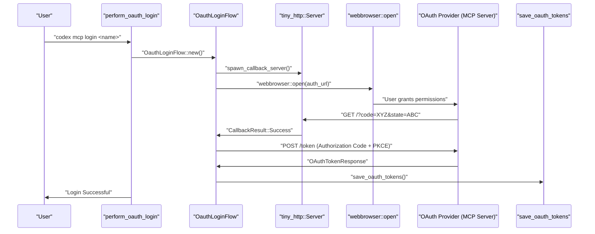
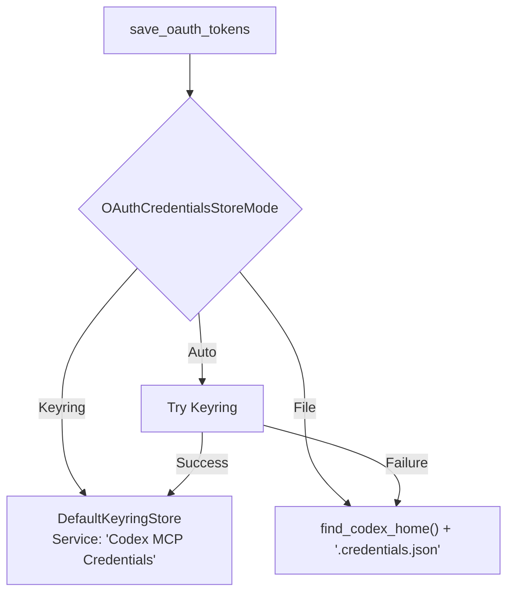

# OAuth Authentication for MCP

<details>
<summary>Relevant source files</summary>

The following files were used as context for generating this wiki page:

- [codex-rs/agent-identity/Cargo.toml](codex-rs/agent-identity/Cargo.toml)
- [codex-rs/agent-identity/src/lib.rs](codex-rs/agent-identity/src/lib.rs)
- [codex-rs/app-server/tests/common/auth_fixtures.rs](codex-rs/app-server/tests/common/auth_fixtures.rs)
- [codex-rs/cli/tests/login.rs](codex-rs/cli/tests/login.rs)
- [codex-rs/exec-server/src/client/http_response_body_stream.rs](codex-rs/exec-server/src/client/http_response_body_stream.rs)
- [codex-rs/exec-server/src/client/reqwest_http_client.rs](codex-rs/exec-server/src/client/reqwest_http_client.rs)
- [codex-rs/exec-server/src/client/rpc_http_client.rs](codex-rs/exec-server/src/client/rpc_http_client.rs)
- [codex-rs/login/src/auth/agent_identity.rs](codex-rs/login/src/auth/agent_identity.rs)
- [codex-rs/login/src/auth/auth_tests.rs](codex-rs/login/src/auth/auth_tests.rs)
- [codex-rs/login/src/auth/manager.rs](codex-rs/login/src/auth/manager.rs)
- [codex-rs/login/src/auth/mod.rs](codex-rs/login/src/auth/mod.rs)
- [codex-rs/login/src/auth/revoke.rs](codex-rs/login/src/auth/revoke.rs)
- [codex-rs/login/src/auth/storage.rs](codex-rs/login/src/auth/storage.rs)
- [codex-rs/login/src/auth/storage_tests.rs](codex-rs/login/src/auth/storage_tests.rs)
- [codex-rs/login/tests/suite/auth_refresh.rs](codex-rs/login/tests/suite/auth_refresh.rs)
- [codex-rs/login/tests/suite/logout.rs](codex-rs/login/tests/suite/logout.rs)
- [codex-rs/login/tests/suite/mod.rs](codex-rs/login/tests/suite/mod.rs)
- [codex-rs/model-provider/src/auth.rs](codex-rs/model-provider/src/auth.rs)
- [codex-rs/models-manager/src/manager.rs](codex-rs/models-manager/src/manager.rs)
- [codex-rs/models-manager/src/manager_tests.rs](codex-rs/models-manager/src/manager_tests.rs)
- [codex-rs/rmcp-client/Cargo.toml](codex-rs/rmcp-client/Cargo.toml)
- [codex-rs/rmcp-client/src/auth_status.rs](codex-rs/rmcp-client/src/auth_status.rs)
- [codex-rs/rmcp-client/src/bin/rmcp_test_server.rs](codex-rs/rmcp-client/src/bin/rmcp_test_server.rs)
- [codex-rs/rmcp-client/src/bin/test_stdio_server.rs](codex-rs/rmcp-client/src/bin/test_stdio_server.rs)
- [codex-rs/rmcp-client/src/bin/test_streamable_http_server.rs](codex-rs/rmcp-client/src/bin/test_streamable_http_server.rs)
- [codex-rs/rmcp-client/src/http_client_adapter.rs](codex-rs/rmcp-client/src/http_client_adapter.rs)
- [codex-rs/rmcp-client/src/lib.rs](codex-rs/rmcp-client/src/lib.rs)
- [codex-rs/rmcp-client/src/oauth.rs](codex-rs/rmcp-client/src/oauth.rs)
- [codex-rs/rmcp-client/src/perform_oauth_login.rs](codex-rs/rmcp-client/src/perform_oauth_login.rs)
- [codex-rs/rmcp-client/src/rmcp_client.rs](codex-rs/rmcp-client/src/rmcp_client.rs)
- [codex-rs/rmcp-client/src/streamable_http_retry.rs](codex-rs/rmcp-client/src/streamable_http_retry.rs)
- [codex-rs/rmcp-client/src/streamable_http_retry_tests.rs](codex-rs/rmcp-client/src/streamable_http_retry_tests.rs)
- [codex-rs/rmcp-client/tests/streamable_http_oauth_startup.rs](codex-rs/rmcp-client/tests/streamable_http_oauth_startup.rs)
- [codex-rs/rmcp-client/tests/streamable_http_recovery.rs](codex-rs/rmcp-client/tests/streamable_http_recovery.rs)
- [codex-rs/rmcp-client/tests/streamable_http_test_support.rs](codex-rs/rmcp-client/tests/streamable_http_test_support.rs)
- [codex-rs/tui/src/local_chatgpt_auth.rs](codex-rs/tui/src/local_chatgpt_auth.rs)

</details>


## Overview

OAuth 2.0 authentication is supported for MCP servers using the **StreamableHttp** transport. Stdio transport servers do not support OAuth through Codex's built-in mechanisms. When configured, Codex performs an OAuth 2.0 authorization code flow with PKCE (Proof Key for Code Exchange) that opens a browser for user authorization, then stores the resulting credentials securely in the system keyring or a fallback file. [codex-rs/rmcp-client/src/perform_oauth_login.rs:80-106]()

The OAuth system consists of four main components:

1.  **OAuth Flow** - Browser-based authorization with local callback server via `perform_oauth_login`. [codex-rs/rmcp-client/src/perform_oauth_login.rs:80-106]()
2.  **Credential Storage** - Platform-specific secure storage via the `keyring` crate with fallback mechanisms. [codex-rs/rmcp-client/src/oauth.rs:86-102]()
3.  **Discovery Mechanism** - Runtime detection of OAuth support via RFC 8414 well-known endpoints. [codex-rs/rmcp-client/src/auth_status.rs:173-197]()
4.  **Token Management** - Handling of expiration and refresh within the `RmcpClient`. [codex-rs/rmcp-client/src/rmcp_client.rs:94-97]()

Sources: [codex-rs/rmcp-client/src/lib.rs:7-12](), [codex-rs/rmcp-client/src/perform_oauth_login.rs:80-106](), [codex-rs/rmcp-client/src/auth_status.rs:173-197](), [codex-rs/rmcp-client/src/rmcp_client.rs:94-97]()

---

## OAuth Flow for StreamableHttp Servers

### Flow Architecture

When a user initiates an MCP login (e.g., via `codex mcp login`), Codex triggers an OAuth 2.0 authorization code flow. The process involves starting a local HTTP server to receive the authorization callback, opening the user's browser to the authorization URL, and exchanging the authorization code for access and refresh tokens. [codex-rs/rmcp-client/src/perform_oauth_login.rs:212-233]()

**OAuth Authorization Flow (Code Entity Space)**



Sources: [codex-rs/rmcp-client/src/perform_oauth_login.rs:212-233](), [codex-rs/rmcp-client/src/perform_oauth_login.rs:155-171](), [codex-rs/rmcp-client/src/oauth.rs:189-213]()

### Discovery and Status

Before login, Codex attempts to discover if a server supports OAuth by querying `.well-known/oauth-authorization-server` as per RFC 8414. [codex-rs/rmcp-client/src/auth_status.rs:173-197]() The function `determine_streamable_http_auth_status` checks for existing tokens or discovery metadata to report the current state. [codex-rs/rmcp-client/src/auth_status.rs:31-66]()

| Status | Condition |
| :--- | :--- |
| `BearerToken` | Static token in config or `AUTHORIZATION` header. [codex-rs/rmcp-client/src/auth_status.rs:39-46]() |
| `OAuth` | Valid OAuth tokens found in local storage via `oauth_token_status`. [codex-rs/rmcp-client/src/auth_status.rs:48-49]() |
| `NotLoggedIn` | Server supports OAuth but no tokens exist or authorization is required. [codex-rs/rmcp-client/src/auth_status.rs:50-52]() |
| `Unsupported` | No auth method detected or discovery failed. [codex-rs/rmcp-client/src/auth_status.rs:58-65]() |

Sources: [codex-rs/rmcp-client/src/auth_status.rs:31-66](), [codex-rs/rmcp-client/src/auth_status.rs:173-197]()

### OAuth Callback Server

The `OauthLoginFlow` starts a temporary `tiny_http::Server` on a local port (defaulting to a random port or a configured `callback_port`) to receive the redirection. [codex-rs/rmcp-client/src/perform_oauth_login.rs:212-216]()

**Callback Processing:**
*   `parse_oauth_callback` validates the callback path and extracts the `code` and `state`. [codex-rs/rmcp-client/src/perform_oauth_login.rs:220-221]()
*   The server responds with a simple message: "Authentication complete. You may close this window." [codex-rs/rmcp-client/src/perform_oauth_login.rs:222-224]()
*   A `CallbackServerGuard` ensures the server is unblocked and closed when the flow completes or is dropped. [codex-rs/rmcp-client/src/perform_oauth_login.rs:39-47]()

Sources: [codex-rs/rmcp-client/src/perform_oauth_login.rs:212-233](), [codex-rs/rmcp-client/src/perform_oauth_login.rs:39-47]()

---

## Credential Storage

### Storage Modes

Codex manages MCP OAuth credentials through the `OAuthCredentialsStoreMode` setting, which determines where secrets are persisted. [codex-rs/rmcp-client/src/oauth.rs:86-102]()

| Mode | Behavior |
| :--- | :--- |
| `Keyring` | Uses the OS-native credential store (macOS Keychain, Windows Credential Manager, Linux Secret Service). [codex-rs/rmcp-client/src/oauth.rs:97-101]() |
| `File` | Stores tokens in a JSON file at `~/.codex/.credentials.json`. [codex-rs/rmcp-client/src/oauth.rs:96]() |
| `Auto` | Attempts Keyring first, falling back to File if the keyring is unavailable. [codex-rs/rmcp-client/src/oauth.rs:93-95]() |

**Credential Persistence Logic (Code Entity Space)**



Sources: [codex-rs/rmcp-client/src/oauth.rs:189-213](), [codex-rs/rmcp-client/src/oauth.rs:53-54](), [codex-rs/rmcp-client/Cargo.toml:74-85]()

### Stored Data Model

Credentials are encapsulated in the `StoredOAuthTokens` struct. [codex-rs/rmcp-client/src/oauth.rs:57-64]()

```rust
pub struct StoredOAuthTokens {
    pub server_name: String,
    pub url: String,
    pub client_id: String,
    pub token_response: WrappedOAuthTokenResponse,
    pub expires_at: Option<u64>, // Unix timestamp in millis
}
```

The `WrappedOAuthTokenResponse` provides a wrapper around the `rmcp` crate's `OAuthTokenResponse` to implement `PartialEq` and `Serialize/Deserialize` compatibility via JSON string comparison. [codex-rs/rmcp-client/src/oauth.rs:67-77]()

Sources: [codex-rs/rmcp-client/src/oauth.rs:57-77]()

---

## Token Management and Refresh

The `RmcpClient` uses an `AuthClient` transport wrapper when OAuth is enabled. [codex-rs/rmcp-client/src/rmcp_client.rs:94-97]() This client is responsible for attaching the `Authorization: Bearer <token>` header to all requests. [codex-rs/rmcp-client/src/rmcp_client.rs:21-22]()

### Automatic Refresh
The system calculates token expiration using `expires_at`. [codex-rs/rmcp-client/src/oauth.rs:118-131]() Before a token is used, the client checks if it is nearing expiration via `token_needs_refresh`. [codex-rs/rmcp-client/src/oauth.rs:54]() If the token is expired or about to expire, the `AuthClient` uses the stored `refresh_token` to obtain a new `access_token` from the server. [codex-rs/rmcp-client/src/oauth.rs:124-127]()

### Token Revocation (Logout)
The `delete_oauth_tokens` function removes credentials from the configured store. [codex-rs/rmcp-client/src/oauth.rs:248-264]() It computes a unique store key based on the server name and URL hash to identify the correct entry in the keyring or file. [codex-rs/rmcp-client/src/oauth.rs:271-280]()

Sources: [codex-rs/rmcp-client/src/rmcp_client.rs:94-97](), [codex-rs/rmcp-client/src/oauth.rs:248-264](), [codex-rs/rmcp-client/src/oauth.rs:118-131]()

---

## Comparison with Codex Core Authentication

While MCP uses a specialized OAuth flow for external servers, Codex core authentication (for the primary agent identity) is managed by the `codex-login` crate. [codex-rs/login/src/auth/manager.rs:53-62]()

| Feature | MCP OAuth | Codex Core Auth |
| :--- | :--- | :--- |
| **Provider** | External MCP Servers | OpenAI / ChatGPT |
| **Auth Modes** | OAuth 2.0 PKCE | ApiKey, Chatgpt, AgentIdentity, PAT [codex-rs/login/src/auth/manager.rs:53-62]() |
| **Storage** | `~/.codex/.credentials.json` | `auth.json` or Keychain [codex-rs/login/src/auth/storage.rs:36-40]() |
| **Refresh Logic** | Managed by `rmcp` / `AuthClient` | Managed by `AuthManager` [codex-rs/login/src/auth/manager.rs:96-104]() |

Sources: [codex-rs/login/src/auth/manager.rs:53-62](), [codex-rs/login/src/auth/storage.rs:36-40](), [codex-rs/rmcp-client/src/rmcp_client.rs:94-97]()
