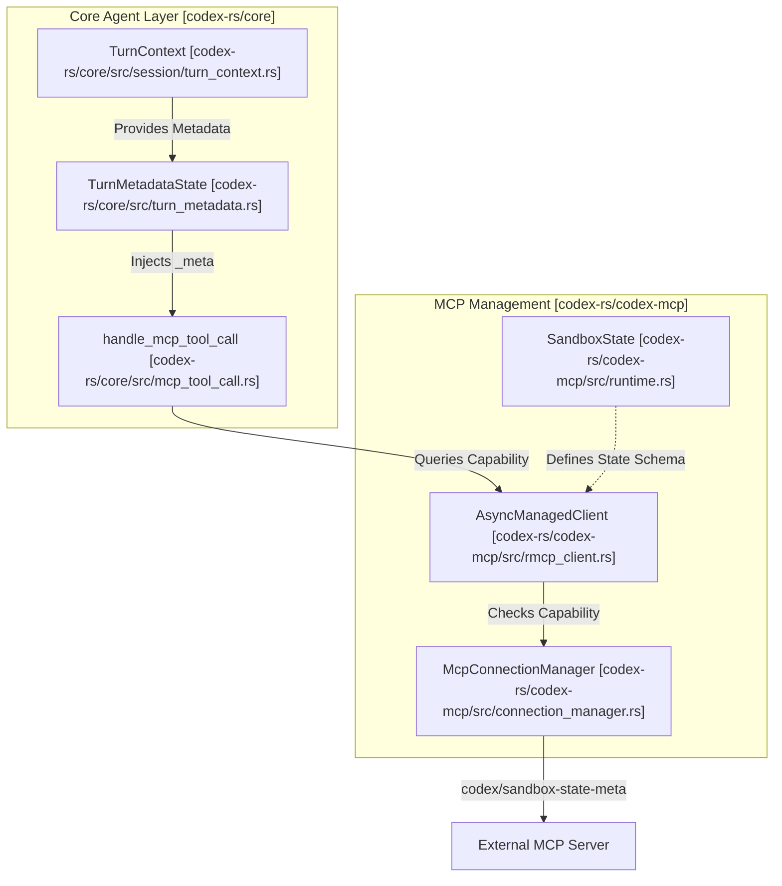
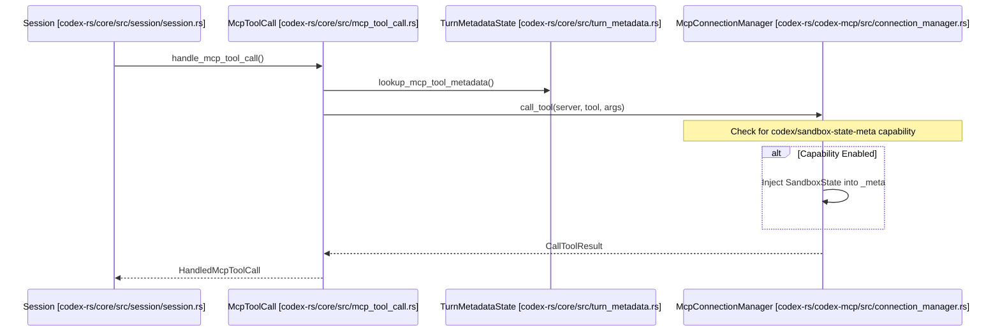

# Sandbox State Synchronization

Relevant source files

The following files were used as context for generating this wiki page:

- [codex-rs/app-server-protocol/schema/json/ClientRequest.json](codex-rs/app-server-protocol/schema/json/ClientRequest.json)
- [codex-rs/app-server-protocol/schema/json/ServerNotification.json](codex-rs/app-server-protocol/schema/json/ServerNotification.json)
- [codex-rs/app-server-protocol/schema/json/codex_app_server_protocol.schemas.json](codex-rs/app-server-protocol/schema/json/codex_app_server_protocol.schemas.json)
- [codex-rs/app-server-protocol/schema/json/codex_app_server_protocol.v2.schemas.json](codex-rs/app-server-protocol/schema/json/codex_app_server_protocol.v2.schemas.json)
- [codex-rs/app-server-protocol/schema/typescript/ClientRequest.ts](codex-rs/app-server-protocol/schema/typescript/ClientRequest.ts)
- [codex-rs/app-server-protocol/schema/typescript/ServerNotification.ts](codex-rs/app-server-protocol/schema/typescript/ServerNotification.ts)
- [codex-rs/app-server-protocol/schema/typescript/v2/index.ts](codex-rs/app-server-protocol/schema/typescript/v2/index.ts)
- [codex-rs/app-server-protocol/src/protocol/common.rs](codex-rs/app-server-protocol/src/protocol/common.rs)
- [codex-rs/app-server/README.md](codex-rs/app-server/README.md)
- [codex-rs/app-server/src/bespoke_event_handling.rs](codex-rs/app-server/src/bespoke_event_handling.rs)
- [codex-rs/app-server/tests/suite/v2/app_list.rs](codex-rs/app-server/tests/suite/v2/app_list.rs)
- [codex-rs/app-server/tests/suite/v2/experimental_feature_list.rs](codex-rs/app-server/tests/suite/v2/experimental_feature_list.rs)
- [codex-rs/app-server/tests/suite/v2/mcp_tool.rs](codex-rs/app-server/tests/suite/v2/mcp_tool.rs)
- [codex-rs/chatgpt/src/connectors.rs](codex-rs/chatgpt/src/connectors.rs)
- [codex-rs/codex-mcp/src/codex_apps.rs](codex-rs/codex-mcp/src/codex_apps.rs)
- [codex-rs/codex-mcp/src/connection_manager.rs](codex-rs/codex-mcp/src/connection_manager.rs)
- [codex-rs/codex-mcp/src/connection_manager_tests.rs](codex-rs/codex-mcp/src/connection_manager_tests.rs)
- [codex-rs/codex-mcp/src/lib.rs](codex-rs/codex-mcp/src/lib.rs)
- [codex-rs/codex-mcp/src/mcp/mod.rs](codex-rs/codex-mcp/src/mcp/mod.rs)
- [codex-rs/codex-mcp/src/mcp/mod_tests.rs](codex-rs/codex-mcp/src/mcp/mod_tests.rs)
- [codex-rs/codex-mcp/src/rmcp_client.rs](codex-rs/codex-mcp/src/rmcp_client.rs)
- [codex-rs/codex-mcp/src/runtime.rs](codex-rs/codex-mcp/src/runtime.rs)
- [codex-rs/codex-mcp/src/tools.rs](codex-rs/codex-mcp/src/tools.rs)
- [codex-rs/core/src/connectors.rs](codex-rs/core/src/connectors.rs)
- [codex-rs/core/src/connectors_tests.rs](codex-rs/core/src/connectors_tests.rs)
- [codex-rs/core/src/mcp_skill_dependencies.rs](codex-rs/core/src/mcp_skill_dependencies.rs)
- [codex-rs/core/src/mcp_tool_call.rs](codex-rs/core/src/mcp_tool_call.rs)
- [codex-rs/core/src/mcp_tool_call_tests.rs](codex-rs/core/src/mcp_tool_call_tests.rs)
- [codex-rs/core/src/session/mcp.rs](codex-rs/core/src/session/mcp.rs)
- [codex-rs/core/tests/common/apps_test_server.rs](codex-rs/core/tests/common/apps_test_server.rs)
- [codex-rs/core/tests/suite/plugins.rs](codex-rs/core/tests/suite/plugins.rs)
- [codex-rs/core/tests/suite/search_tool.rs](codex-rs/core/tests/suite/search_tool.rs)

## Purpose and Scope

This document describes how Codex synchronizes sandbox execution state with Model Context Protocol (MCP) servers through a custom protocol extension. When Codex enforces sandbox restrictions (read-only access, workspace boundaries, specific sandboxing mechanisms), MCP servers require awareness of these constraints to adapt their tool behavior.

This page covers the `codex/sandbox-state/update` notification, capability checking, and the propagation of state from the `app-server` and `codex-core` to external MCP servers.

---

## Overview

Sandbox state synchronization is a Codex-specific extension to MCP that enables servers to receive notifications about the active execution environment. This allows external tool servers to:

- Understand the active sandbox policy (e.g., `Restricted`, `Unrestricted`).
- Identify the working directory for sandboxed operations.
- Receive platform-specific sandbox executor paths (e.g., `codex-linux-sandbox`).
- Align tool execution with Codex's security constraints and approval policies.

The synchronization utilizes a custom MCP capability (`codex/sandbox-state-meta`) and metadata injection into tool calls to propagate state from the core agent to external servers.

Sources: [codex-rs/codex-mcp/src/mcp/mod.rs:126-129](), [codex-rs/codex-mcp/src/lib.rs:6-8]()

---

## System Architecture

The synchronization flow originates in the core agent's session management, influenced by the current `TurnContext` and `PermissionProfile`, and is delivered to servers via the `McpConnectionManager`.

### Sandbox State Propagation Flow
The following diagram maps the Natural Language concept of "State Sync" to specific code entities and data flows.

Sources: [codex-rs/core/src/mcp_tool_call.rs:107-148](), [codex-rs/codex-mcp/src/lib.rs:6-8](), [codex-rs/codex-mcp/src/runtime.rs:8-8]()

---

## SandboxState and Configuration

The `SandboxState` represents the snapshot of security constraints applied to a specific tool execution or session context.

### Sandbox State Components
The `McpConfig` struct captures long-lived configuration used to derive sandbox states and determine how servers are launched.

| Field | Code Entity | Description |
|-------|-------------|-------------|
| `approval_policy` | `AskForApproval` | Controls if tools require explicit user confirmation. [codex-rs/codex-mcp/src/mcp/mod.rs:124-124]() |
| `codex_linux_sandbox_exe` | `Option<PathBuf>` | Path to the Linux sandbox helper binary. [codex-rs/codex-mcp/src/mcp/mod.rs:125-126]() |
| `use_legacy_landlock` | `bool` | Toggles legacy Landlock behavior in the sandbox state. [codex-rs/codex-mcp/src/mcp/mod.rs:128-128]() |
| `apps_enabled` | `bool` | Whether the built-in app MCP integration is active. [codex-rs/codex-mcp/src/mcp/mod.rs:133-133]() |

Sources: [codex-rs/codex-mcp/src/mcp/mod.rs:106-147](), [codex-rs/codex-mcp/src/runtime.rs:8-8]()

### Auto-Approval Logic
Codex determines if a sandbox state allows for "auto-approval" of tool permissions using the `mcp_permission_prompt_is_auto_approved` function. This logic checks:
1. If the `tool_approval_mode` is explicitly set to `AppToolApproval::Approve`. [codex-rs/codex-mcp/src/mcp/mod.rs:75-77]()
2. If the global `AskForApproval` policy is `Never`. [codex-rs/codex-mcp/src/mcp/mod.rs:79-81]()
3. If the `PermissionProfile` (specifically `Managed`) has full disk write access via its `sandbox_policy`. [codex-rs/codex-mcp/src/mcp/mod.rs:85-88]()

Sources: [codex-rs/codex-mcp/src/mcp/mod.rs:70-89]()

---

## Tool Call Synchronization

When the model invokes an MCP tool, `handle_mcp_tool_call` performs a metadata lookup and applies sandbox policies before dispatching the request.

### Tool Invocation Lifecycle

Sources: [codex-rs/core/src/mcp_tool_call.rs:108-150](), [codex-rs/codex-mcp/src/lib.rs:6-8]()

---

## Capability Negotiation and Data Flow

### Server Capability Declaration
Servers advertise support for the `codex/sandbox-state-meta` capability during the MCP `initialize` handshake. Codex tracks this via `AsyncManagedClient`, which identifies the `MCP_SANDBOX_STATE_META_CAPABILITY` during connection setup.

Sources: [codex-rs/codex-mcp/src/lib.rs:6-6](), [codex-rs/codex-mcp/src/connection_manager.rs:105-146]()

### File Parameter Masking
To maintain sandbox integrity, Codex uses `rewrite_mcp_tool_arguments_for_openai_files` to ensure that tool arguments containing file paths are correctly translated to the sandboxed environment's perspective. This is particularly relevant for the `codex_apps` server.

Sources: [codex-rs/core/src/mcp_tool_call.rs:18-18](), [codex-rs/codex-mcp/src/mcp/mod.rs:44-44]()

---

## Implementation Reference

### Key Classes and Functions

| Entity | Location | Role |
|--------|----------|------|
| `TurnMetadataState` | [codex-rs/core/src/turn_metadata.rs:1-1]() | Manages turn-specific metadata, including sandbox tags and git state. |
| `handle_mcp_tool_call` | [codex-rs/core/src/mcp_tool_call.rs:108-116]() | Orchestrates MCP tool execution, including approval and sandbox checks. |
| `McpConnectionManager` | [codex-rs/codex-mcp/src/connection_manager.rs:105-113]() | Manages lifecycles and capability negotiation for all MCP servers. |
| `AsyncManagedClient` | [codex-rs/codex-mcp/src/rmcp_client.rs:1-1]() | Handles the asynchronous initialization and capability detection of MCP servers. |
| `SandboxState` | [codex-rs/codex-mcp/src/runtime.rs:8-8]() | Struct defining the state schema sent to servers. |

### Error Handling
If an MCP tool call fails due to sandbox violations or malformed arguments, Codex returns a `CallToolResult::from_error_text` and emits a `McpToolCallError` to the session history.

Sources: [codex-rs/core/src/mcp_tool_call.rs:123-131](), [codex-rs/core/src/mcp_tool_call.rs:47-49]()
