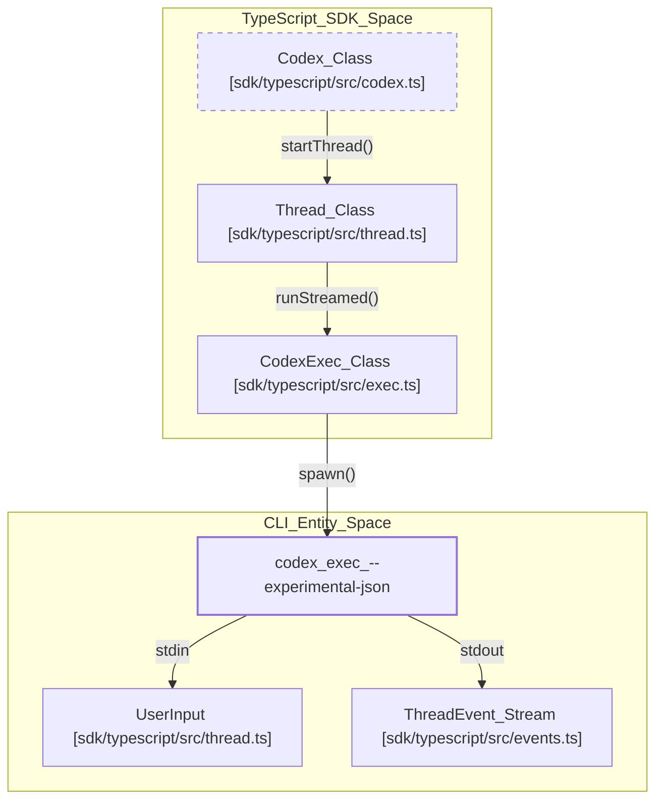
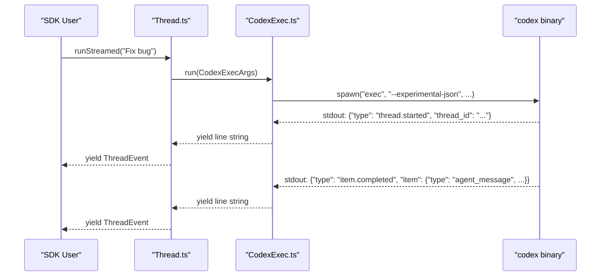
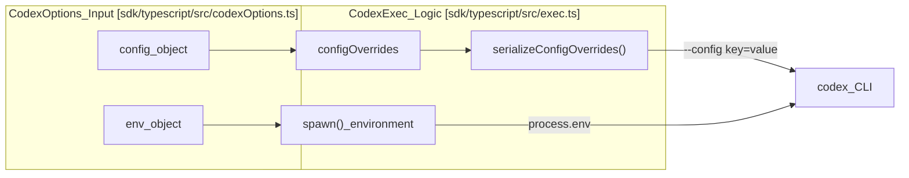

# TypeScript SDK

Relevant source files

The following files were used as context for generating this wiki page:

- [codex-rs/exec/src/event_processor_with_jsonl_output.rs](codex-rs/exec/src/event_processor_with_jsonl_output.rs)
- [codex-rs/exec/src/exec_events.rs](codex-rs/exec/src/exec_events.rs)
- [codex-rs/exec/tests/event_processor_with_json_output.rs](codex-rs/exec/tests/event_processor_with_json_output.rs)
- [codex-rs/exec/tests/suite/add_dir.rs](codex-rs/exec/tests/suite/add_dir.rs)
- [sdk/typescript/README.md](sdk/typescript/README.md)
- [sdk/typescript/eslint.config.js](sdk/typescript/eslint.config.js)
- [sdk/typescript/samples/basic_streaming.ts](sdk/typescript/samples/basic_streaming.ts)
- [sdk/typescript/src/codex.ts](sdk/typescript/src/codex.ts)
- [sdk/typescript/src/codexOptions.ts](sdk/typescript/src/codexOptions.ts)
- [sdk/typescript/src/events.ts](sdk/typescript/src/events.ts)
- [sdk/typescript/src/exec.ts](sdk/typescript/src/exec.ts)
- [sdk/typescript/src/index.ts](sdk/typescript/src/index.ts)
- [sdk/typescript/src/items.ts](sdk/typescript/src/items.ts)
- [sdk/typescript/src/thread.ts](sdk/typescript/src/thread.ts)
- [sdk/typescript/src/threadOptions.ts](sdk/typescript/src/threadOptions.ts)
- [sdk/typescript/src/turnOptions.ts](sdk/typescript/src/turnOptions.ts)
- [sdk/typescript/tests/abort.test.ts](sdk/typescript/tests/abort.test.ts)
- [sdk/typescript/tests/codexExecSpy.ts](sdk/typescript/tests/codexExecSpy.ts)
- [sdk/typescript/tests/exec.test.ts](sdk/typescript/tests/exec.test.ts)
- [sdk/typescript/tests/responsesProxy.ts](sdk/typescript/tests/responsesProxy.ts)
- [sdk/typescript/tests/run.test.ts](sdk/typescript/tests/run.test.ts)
- [sdk/typescript/tests/runStreamed.test.ts](sdk/typescript/tests/runStreamed.test.ts)

The `@openai/codex-sdk` package provides a high-level TypeScript interface for embedding the Codex agent into external workflows and applications. It acts as a wrapper around the `codex` CLI (distributed via the `@openai/codex` package), managing the execution of the binary and orchestrating communication via JSONL events over standard I/O [sdk/typescript/README.md:1-5](), [sdk/typescript/src/exec.ts:43-45]().

## Overview

The SDK is designed to manage the lifecycle of conversations (Threads) and individual interactions (Turns). It handles binary discovery, environment configuration, and the parsing of structured events into typed TypeScript objects [sdk/typescript/src/thread.ts:9-25]().

### Key Components

| Component | Role |
| :--- | :--- |
| `Codex` | The entry-point class for initializing the SDK and managing sessions [sdk/typescript/src/codex.ts:11-20](). |
| `Thread` | Represents a persistent conversation state. Manages turn execution, ID tracking, and input normalization [sdk/typescript/src/thread.ts:41-63](). |
| `CodexExec` | The low-level execution engine that spawns the `codex` process, handles stdin/stdout, and serializes config [sdk/typescript/src/exec.ts:63-84](). |

Sources: [sdk/typescript/src/codex.ts:11-20](), [sdk/typescript/src/thread.ts:41-63](), [sdk/typescript/src/exec.ts:63-84]()

## Codex/Thread/Turn API

The SDK follows a hierarchical structure where a `Codex` instance creates or resumes `Thread` instances, which in turn execute `run` or `runStreamed` operations [sdk/typescript/src/thread.ts:66-115]().

### System and Code Entity Mapping
The following diagram illustrates how the SDK's high-level classes map to the underlying execution entities and the CLI protocol.

**SDK to CLI Mapping**

Sources: [sdk/typescript/src/codex.ts:11-39](), [sdk/typescript/src/thread.ts:77-80](), [sdk/typescript/src/exec.ts:181-184](), [sdk/typescript/src/exec.ts:171-176](), [sdk/typescript/src/events.ts:1-13]()

### Thread Lifecycle
Threads are identified by a `thread_id` which is returned by the CLI after the first turn starts and is tracked internally by the `Thread` instance [sdk/typescript/src/thread.ts:48-50](), [sdk/typescript/src/thread.ts:104-106]().
*   **Initialization**: `codex.startThread(options)` creates a new thread context [sdk/typescript/src/codex.ts:25-27]().
*   **Resumption**: `codex.resumeThread(id)` allows continuing a session stored in `~/.codex/sessions` by passing the ID to the CLI `resume` command [sdk/typescript/src/codex.ts:36-38](), [sdk/typescript/src/exec.ts:151-153]().
*   **Execution**: `thread.run(input)` is used for atomic request-response patterns, buffering events until the turn is complete [sdk/typescript/src/thread.ts:115-138]().

Sources: [sdk/typescript/src/codex.ts:25-38](), [sdk/typescript/src/thread.ts:48-138](), [sdk/typescript/src/exec.ts:151-153]()

## Streaming Events

The `runStreamed` method returns an `AsyncGenerator<ThreadEvent>`, allowing real-time observation of the agent's actions as they are emitted by the CLI [sdk/typescript/src/thread.ts:66-68]().

### Event Types
The SDK parses the JSONL stream into several typed events defined in `codex-rs/exec/src/exec_events.rs` [codex-rs/exec/src/exec_events.rs:11-37]():
*   `thread.started`: Emitted when a new thread is initialized; contains the `thread_id` [codex-rs/exec/src/exec_events.rs:13-14](), [sdk/typescript/src/thread.ts:104-106]().
*   `item.started` / `item.updated` / `item.completed`: Marks the lifecycle of a `ThreadItem` such as `agent_message`, `command_execution`, or `mcp_tool_call` [codex-rs/exec/src/exec_events.rs:25-33](), [sdk/typescript/src/items.ts:120-128]().
*   `turn.completed`: Signals the end of the current interaction and includes `Usage` statistics (tokens) [codex-rs/exec/src/exec_events.rs:19-21](), [sdk/typescript/src/thread.ts:127-128]().
*   `turn.failed`: Indicates a terminal error for the specific turn [codex-rs/exec/src/exec_events.rs:22-24](), [sdk/typescript/src/thread.ts:129-131]().

**Event Data Flow**

Sources: [sdk/typescript/src/thread.ts:70-112](), [sdk/typescript/src/exec.ts:216-226](), [sdk/typescript/src/exec.ts:181-184](), [codex-rs/exec/src/exec_events.rs:11-37]()

## Structured Output

Codex supports generating JSON that adheres to a specific schema. The SDK facilitates this by writing the provided `outputSchema` to a temporary file and passing the path via the `--output-schema` flag [sdk/typescript/src/thread.ts:74-87]().

### Implementation
1.  **Schema Input**: The user provides a JSON schema in `TurnOptions` [sdk/typescript/src/turnOptions.ts:9]().
2.  **File Creation**: `createOutputSchemaFile` generates a temporary `.json` file on disk [sdk/typescript/src/thread.ts:74]().
3.  **CLI Invocation**: `CodexExec` adds `--output-schema <path>` to the command arguments [sdk/typescript/src/exec.ts:124-126]().
4.  **Result**: The agent restricts its output to the provided schema, which is returned as the `text` field in an `AgentMessageItem` [sdk/typescript/src/items.ts:74-80](), [sdk/typescript/tests/runStreamed.test.ts:182-196]().

Sources: [sdk/typescript/src/thread.ts:74-87](), [sdk/typescript/src/exec.ts:124-126](), [sdk/typescript/src/turnOptions.ts:9](), [sdk/typescript/src/items.ts:74-80]()

## Session Resumption

Session persistence is managed by the underlying CLI. The SDK exposes this via the `resumeThread` method and the `threadId` argument in `CodexExecArgs` [sdk/typescript/src/exec.ts:15](), [sdk/typescript/src/codex.ts:36-38]().

### Implementation Detail
When `thread.run()` or `thread.runStreamed()` is called on a resumed thread, the SDK includes the `threadId` in the CLI command using the `resume` subcommand:
`codex exec --experimental-json resume <threadId>` [sdk/typescript/src/exec.ts:151-153]().

This causes the agent to load the historical context (stored in `~/.codex/sessions`) before processing the new input [sdk/typescript/README.md:98-106]().

Sources: [sdk/typescript/src/exec.ts:151-153](), [sdk/typescript/src/codex.ts:36-38](), [sdk/typescript/README.md:98-106]()

## Configuration and Environment

The SDK allows fine-grained control over the execution environment:
*   **Base URL & API Key**: Passed via `--config openai_base_url` and the `CODEX_API_KEY` environment variable [sdk/typescript/src/exec.ts:95-100](), [sdk/typescript/src/exec.ts:174-176]().
*   **Sandbox Modes**: Supports `read-only`, `workspace-write`, and `danger-full-access` via the `--sandbox` flag [sdk/typescript/src/exec.ts:106-108](), [sdk/typescript/src/threadOptions.ts:3]().
*   **Config Overrides**: Arbitrary configuration objects provided in `CodexOptions` are flattened and passed via repeated `--config` flags [sdk/typescript/src/exec.ts:89-93](), [sdk/typescript/src/codexOptions.ts:16]().
*   **Originator**: The SDK automatically sets the `INTERNAL_ORIGINATOR_ENV` to `codex_sdk_ts` to identify the source of the requests [sdk/typescript/src/exec.ts:43-44](), [sdk/typescript/src/exec.ts:171-173]().

**SDK Configuration Data Flow**

Sources: [sdk/typescript/src/exec.ts:89-93](), [sdk/typescript/src/exec.ts:161-180](), [sdk/typescript/src/codexOptions.ts:5-22]()

Sources:
* [sdk/typescript/src/exec.ts:10-41]() (CodexExecArgs definition)
* [sdk/typescript/src/thread.ts:41-139]() (Thread implementation)
* [sdk/typescript/src/codex.ts:11-39]() (Codex entry point)
* [sdk/typescript/README.md:1-150]() (Usage and patterns)
* [sdk/typescript/src/events.ts:1-13]() (SDK event definitions)
* [codex-rs/exec/src/exec_events.rs:11-130]() (ThreadItem and Event definitions)
* [codex-rs/exec/src/event_processor_with_jsonl_output.rs:141-210]() (Mapping internal items to Exec events)
