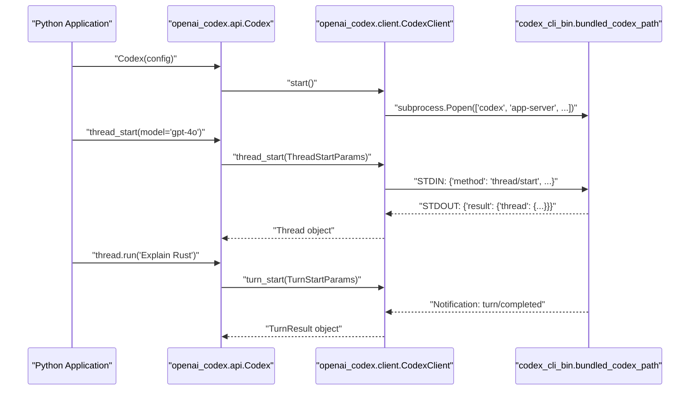
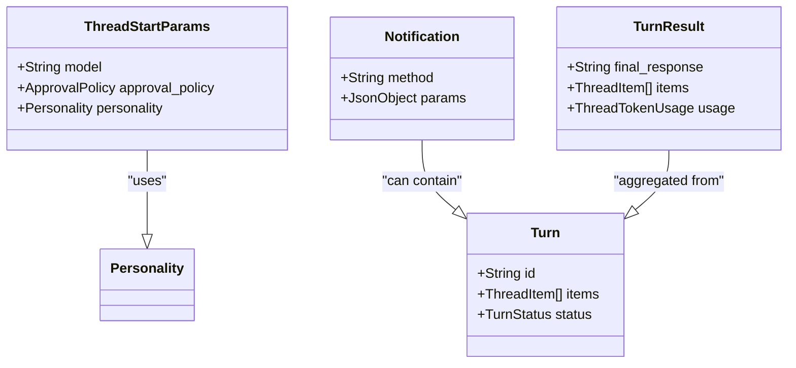

# Python SDK

Relevant source files

The following files were used as context for generating this wiki page:

- [.github/workflows/python-runtime-build.yml](.github/workflows/python-runtime-build.yml)
- [.github/workflows/python-runtime-release.yml](.github/workflows/python-runtime-release.yml)
- [.github/workflows/python-sdk-release.yml](.github/workflows/python-sdk-release.yml)
- [sdk/python-runtime/README.md](sdk/python-runtime/README.md)
- [sdk/python/README.md](sdk/python/README.md)
- [sdk/python/_runtime_setup.py](sdk/python/_runtime_setup.py)
- [sdk/python/docs/api-reference.md](sdk/python/docs/api-reference.md)
- [sdk/python/docs/faq.md](sdk/python/docs/faq.md)
- [sdk/python/docs/getting-started.md](sdk/python/docs/getting-started.md)
- [sdk/python/examples/README.md](sdk/python/examples/README.md)
- [sdk/python/notebooks/sdk_walkthrough.ipynb](sdk/python/notebooks/sdk_walkthrough.ipynb)
- [sdk/python/pyproject.toml](sdk/python/pyproject.toml)
- [sdk/python/scripts/update_sdk_artifacts.py](sdk/python/scripts/update_sdk_artifacts.py)
- [sdk/python/src/openai_codex/__init__.py](sdk/python/src/openai_codex/__init__.py)
- [sdk/python/src/openai_codex/api.py](sdk/python/src/openai_codex/api.py)
- [sdk/python/src/openai_codex/generated/notification_registry.py](sdk/python/src/openai_codex/generated/notification_registry.py)
- [sdk/python/src/openai_codex/generated/v2_all.py](sdk/python/src/openai_codex/generated/v2_all.py)
- [sdk/python/src/openai_codex/types.py](sdk/python/src/openai_codex/types.py)
- [sdk/python/tests/test_artifact_workflow_and_binaries.py](sdk/python/tests/test_artifact_workflow_and_binaries.py)
- [sdk/python/tests/test_contract_generation.py](sdk/python/tests/test_contract_generation.py)
- [sdk/python/tests/test_public_api_signatures.py](sdk/python/tests/test_public_api_signatures.py)
- [sdk/python/tests/test_real_app_server_integration.py](sdk/python/tests/test_real_app_server_integration.py)
- [sdk/python/uv.lock](sdk/python/uv.lock)

The Python SDK (`openai-codex`) provides a high-level, type-safe interface for embedding the Codex agent into Python applications. It acts as a wrapper around the Codex CLI and the App Server JSON-RPC v2 protocol, facilitating thread management, turn execution, and structured data exchange.

## Overview

The SDK allows developers to interact with Codex using either synchronous or asynchronous clients. It manages the lifecycle of the underlying `codex` process, handles JSON-RPC communication over stdio, and provides Pydantic models for type-safe interaction with the protocol's wire format [sdk/python/src/openai_codex/api.py:76-77](), [sdk/python/src/openai_codex/api.py:381](), [sdk/python/README.md:3-5]().

### Key Components
*   **Codex Client**: The primary entry point, available as `Codex` (sync) and `AsyncCodex` (async) [sdk/python/src/openai_codex/api.py:75](), [sdk/python/src/openai_codex/api.py:381]().
*   **Thread**: Represents a persistent conversation session, managing turn submission and state retrieval [sdk/python/src/openai_codex/api.py:277]().
*   **TurnHandle**: Provides low-level control over an active turn, including streaming, steering, and interruption [sdk/python/src/openai_codex/api.py:381]().
*   **Pydantic Models**: Mirror the Rust-defined protocol for validation and IDE autocompletion, generated into `v2_all.py` [sdk/python/src/openai_codex/generated/v2_all.py:1-10]().
*   **Runtime Packaging**: The SDK depends on the `openai-codex-cli-bin` package, which contains the platform-specific `codex` binary [sdk/python/pyproject.toml:19-19](), [sdk/python/README.md:19-20]().

**Sources:** [sdk/python/src/openai_codex/api.py:75-381](), [sdk/python/src/openai_codex/generated/v2_all.py:1-10](), [sdk/python/README.md:3-20](), [sdk/python/pyproject.toml:19-19]()

---

## Architecture and Data Flow

The Python SDK communicates with the Codex core through the `app-server` protocol. It spawns a Codex process in the background and uses standard I/O (stdio) to exchange JSON-RPC messages [sdk/python/src/openai_codex/client.py:137-154](), [sdk/python/src/openai_codex/client.py:162-190]().

### Process Lifecycle and Communication
The SDK abstracts process management and protocol negotiation.

| Component | Responsibility |
| :--- | :--- |
| `Codex` Client | Manages process spawning and the `initialize` handshake in the constructor [sdk/python/src/openai_codex/api.py:82-86](). |
| `CodexClient` | Implements the low-level JSON-RPC transport and message framing over `subprocess.Popen` [sdk/python/src/openai_codex/client.py:137-154](). |
| `Pydantic Models` | Generated wire-models with `snake_case` fields that serialize to `camelCase` wire format [sdk/python/src/openai_codex/generated/v2_all.py:10-20](). |
| `codex-cli-bin` | Provides the actual executable (`codex` or `codex.exe`) [sdk/python/scripts/update_sdk_artifacts.py:52-53](). |

### SDK-to-Core Interaction Diagram
This diagram illustrates how the Python SDK entities map to the underlying system processes and protocol structures.

**SDK to Code Entity Mapping**

**Sources:** [sdk/python/src/openai_codex/api.py:75-170](), [sdk/python/src/openai_codex/client.py:137-191](), [sdk/python/scripts/update_sdk_artifacts.py:123-126](), [sdk/python/README.md:22-29]()

---

## Client and Thread Management

### Thread Lifecycle
A `Thread` is initialized either by starting a fresh session or resuming an existing one via a `thread_id`.

*   **Start**: `thread_start` creates a new session with optional `base_instructions`, `model`, and `approval_mode` [sdk/python/src/openai_codex/api.py:132-170]().
*   **Resume**: `thread_resume` reloads a specific thread, allowing overrides of `cwd` or `model` [sdk/python/src/openai_codex/api.py:201-234]().
*   **Fork**: `thread_fork` creates a new thread from the state of an existing one [sdk/python/src/openai_codex/api.py:236-267]().
*   **Execution**: The `run()` method is a convenience wrapper that starts a turn and collects all events into a `TurnResult` [sdk/python/src/openai_codex/api.py:333-356]().

### Sandbox and Access Controls
The SDK exposes the `Sandbox` enum to control workspace access [sdk/python/src/openai_codex/api.py:40](). These presets map to internal sandbox policies:
*   `Sandbox.read_only`: Restricted to reading files [sdk/python/docs/getting-started.md:90]().
*   `Sandbox.workspace_write`: Standard access for workspace modifications [sdk/python/docs/getting-started.md:91-92]().
*   `Sandbox.full_access`: Unrestricted filesystem access [sdk/python/docs/getting-started.md:93-94]().

### Configuration and Environment
The SDK uses `CodexConfig` to define how the runtime is invoked [sdk/python/src/openai_codex/client.py:125-135]().

| Parameter | Code Entity / Model | Description |
| :--- | :--- | :--- |
| `codex_bin` | `CodexConfig.codex_bin` | Path to a specific codex binary [sdk/python/src/openai_codex/client.py:126](). |
| `env` | `CodexConfig.env` | Environment variables for the subprocess [sdk/python/src/openai_codex/client.py:130](). |
| `cwd` | `CodexConfig.cwd` | Working directory for the subprocess [sdk/python/src/openai_codex/client.py:129](). |

**Sources:** [sdk/python/src/openai_codex/api.py:132-267](), [sdk/python/src/openai_codex/client.py:125-135](), [sdk/python/docs/getting-started.md:88-94]()

---

## Protocol and Wire Models

The SDK relies on Pydantic models generated from the Rust protocol schemas. These models use `snake_case` for Python but serialize to `camelCase` for the wire using Pydantic aliases [sdk/python/src/openai_codex/generated/v2_all.py:10-20]().

### JSON-RPC Message Structure
All communication follows the JSON-RPC 2.0 specification. The `CodexClient` handles serialization using `model_dump(by_alias=True)` [sdk/python/src/openai_codex/client.py:68-72]().

**Protocol Entity Mapping**

**Sources:** [sdk/python/src/openai_codex/generated/v2_all.py:10-252](), [sdk/python/src/openai_codex/api.py:333-356](), [sdk/python/src/openai_codex/client.py:67-75]()

### Authentication Flows
The SDK supports multiple authentication modes via dedicated helpers:
*   **API Key**: `login_api_key(api_key)` performs a synchronous login [sdk/python/src/openai_codex/api.py:104-113]().
*   **ChatGPT Browser**: `login_chatgpt()` returns a `ChatgptLoginHandle` containing an `auth_url` [sdk/python/src/openai_codex/api.py:115-117]().
*   **Device Code**: `login_chatgpt_device_code()` returns a `DeviceCodeLoginHandle` with `verification_url` and `user_code` [sdk/python/src/openai_codex/api.py:119-121]().

**Sources:** [sdk/python/src/openai_codex/api.py:104-121](), [sdk/python/README.md:31-59]()

---

## Runtime Packaging

The SDK repo includes scripts to package the `codex` binary into a separate Python package named `openai-codex-cli-bin` [sdk/python/scripts/update_sdk_artifacts.py:21-22]().

*   **Platform Wheels**: The runtime is published as platform-specific wheels (e.g., `manylinux_2_17_x86_64`, `win_amd64`) that carry the binary for the target architecture [.github/workflows/python-sdk-release.yml:117-122]().
*   **Binary Resolution**: The SDK attempts to import `codex_cli_bin` to find the `bundled_codex_path()` [sdk/python/scripts/update_sdk_artifacts.py:117-126]().
*   **Version Pinning**: The SDK `pyproject.toml` strictly pins the compatible `openai-codex-cli-bin` version [sdk/python/pyproject.toml:19-19]().
*   **Maintenance Script**: The `update_sdk_artifacts.py` script orchestrates type generation from schemas, version pinning in `pyproject.toml`, and runtime binary resolution [sdk/python/scripts/update_sdk_artifacts.py:79-126]().
*   **CI Release**: The release workflow automates building wheels by staging binaries and publishing to PyPI before the SDK itself is built [.github/workflows/python-sdk-release.yml:76-100]().

**Sources:** [sdk/python/scripts/update_sdk_artifacts.py:21-126](), [sdk/python/pyproject.toml:19-19](), [.github/workflows/python-sdk-release.yml:76-122]()
