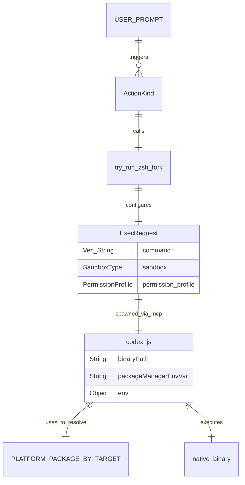

# Shell Tool MCP Package

<details>
<summary>Relevant source files</summary>

The following files were used as context for generating this wiki page:

- [.github/actions/linux-code-sign/action.yml](.github/actions/linux-code-sign/action.yml)
- [.github/actions/windows-code-sign/action.yml](.github/actions/windows-code-sign/action.yml)
- [.github/scripts/archive-release-symbols-and-strip-binaries.sh](.github/scripts/archive-release-symbols-and-strip-binaries.sh)
- [.github/workflows/ci.yml](.github/workflows/ci.yml)
- [.github/workflows/rust-ci-full.yml](.github/workflows/rust-ci-full.yml)
- [.github/workflows/rust-ci.yml](.github/workflows/rust-ci.yml)
- [.github/workflows/rust-release-argument-comment-lint.yml](.github/workflows/rust-release-argument-comment-lint.yml)
- [.github/workflows/rust-release-windows.yml](.github/workflows/rust-release-windows.yml)
- [.github/workflows/rust-release.yml](.github/workflows/rust-release.yml)
- [.github/workflows/sdk.yml](.github/workflows/sdk.yml)
- [codex-cli/.gitignore](codex-cli/.gitignore)
- [codex-cli/bin/codex.js](codex-cli/bin/codex.js)
- [codex-cli/scripts/README.md](codex-cli/scripts/README.md)
- [codex-cli/scripts/build_npm_package.py](codex-cli/scripts/build_npm_package.py)
- [codex-rs/core/src/exec_policy.rs](codex-rs/core/src/exec_policy.rs)
- [codex-rs/core/src/exec_policy_tests.rs](codex-rs/core/src/exec_policy_tests.rs)
- [codex-rs/core/src/exec_policy_windows_tests.rs](codex-rs/core/src/exec_policy_windows_tests.rs)
- [codex-rs/core/src/tools/runtimes/shell/unix_escalation.rs](codex-rs/core/src/tools/runtimes/shell/unix_escalation.rs)
- [codex-rs/core/src/tools/runtimes/shell/unix_escalation_tests.rs](codex-rs/core/src/tools/runtimes/shell/unix_escalation_tests.rs)
- [codex-rs/core/tests/common/zsh_fork.rs](codex-rs/core/tests/common/zsh_fork.rs)
- [codex-rs/core/tests/suite/approvals.rs](codex-rs/core/tests/suite/approvals.rs)
- [codex-rs/core/tests/suite/exec_policy.rs](codex-rs/core/tests/suite/exec_policy.rs)
- [codex-rs/core/tests/suite/skill_approval.rs](codex-rs/core/tests/suite/skill_approval.rs)
- [codex-rs/core/tests/suite/unified_exec_zsh_fork_approvals.rs](codex-rs/core/tests/suite/unified_exec_zsh_fork_approvals.rs)
- [scripts/stage_npm_packages.py](scripts/stage_npm_packages.py)

</details>


The `@openai/codex-shell-tool-mcp` package is a specialized Model Context Protocol (MCP) server designed to provide high-fidelity terminal access to Codex. Unlike standard shell execution tools, this package uses patched versions of common shells (Bash and Zsh) to provide deep integration with the Codex sandbox and security policy engine.

## Overview and Purpose

The primary goal of the Shell Tool MCP package is to enable an AI agent to interact with a local terminal environment while maintaining strict safety boundaries and state awareness. It implements several advanced features:

*   **Patched Binaries**: Custom-compiled Bash and Zsh binaries that support an `EXEC_WRAPPER` for command interception and policy enforcement.
*   **Sandbox Synchronization**: Capability to receive and enforce sandbox state updates via the MCP protocol, ensuring the shell process respects `SandboxMode` and platform-specific sandbox levels.
*   **Rules Enforcement**: Application of workspace rules to constrain shell behavior through the `codex-execpolicy` integration [codex-rs/core/src/exec_policy.rs:49-51]().
*   **Unified Execution**: Integration with the `UnifiedExecProcessManager` to handle long-running shell processes and signal management.

The distribution of these native capabilities is handled via the `@openai/codex` npm package, which acts as a unified entry point, dynamically resolving the correct platform-specific binary based on the host's `targetTriple` [codex-cli/bin/codex.js:15-22]().

Sources: [codex-cli/bin/codex.js:15-22](), [codex-rs/core/src/exec_policy.rs:49-51]()

## Patched Shell Implementation

The package leverages patched shell environments to ensure that every command executed by the agent is subject to the same security constraints as built-in tools.

### EXEC_WRAPPER and Escalation
The shell integration utilizes a patch applied to shell source code to route command executions through a wrapper. In the `codex-rs` core, this is supported by the `PreparedUnifiedExecZshFork` backend [codex-rs/core/src/tools/runtimes/shell/unix_escalation.rs:75-78](). When the patched shell attempts an execution, it interacts with an escalation server [codex-rs/core/src/tools/runtimes/shell/unix_escalation.rs:54-59]() to determine if the command is permitted under the current policy.

The `try_run_zsh_fork` function orchestrates this by building a sandbox command and configuring `ExecOptions` with a capture policy of `ExecCapturePolicy::ShellTool` [codex-rs/core/src/tools/runtimes/shell/unix_escalation.rs:134-137]().

### Shell Detection and Selection
The system dynamically detects the appropriate shell for the environment. The npm wrapper identifies the platform and architecture to select the correct native payload [codex-cli/bin/codex.js:26-67]().

| Component | Role | Source |
| :--- | :--- | :--- |
| `codex-cli/bin/codex.js` | Node.js entry point that spawns native binaries | [codex-cli/bin/codex.js:150-153]() |
| `PLATFORM_PACKAGE_BY_TARGET` | Mapping of OS/Arch to specialized npm packages | [codex-cli/bin/codex.js:15-22]() |
| `findCodexExecutable` | Locates the binary and path directory for execution | [codex-cli/bin/codex.js:78-105]() |

Sources: [codex-cli/bin/codex.js:15-153](), [codex-rs/core/src/tools/runtimes/shell/unix_escalation.rs:54-137]()

## Build and Distribution

The package is managed as part of the Codex monorepo and follows a rigorous build and staging process to ensure the patched binaries are available for all supported platforms.

### Compilation and Packaging
The native components are compiled to support multiple OS variants, including Linux, macOS, and Windows.
*   **Target Triples**: Supported targets include `x86_64-unknown-linux-musl`, `aarch64-apple-darwin`, and `x86_64-pc-windows-msvc` [codex-cli/bin/codex.js:16-21]().
*   **Staging Logic**: The `scripts/stage_npm_packages.py` script stages native binaries into an output directory for the npm package layout [scripts/stage_npm_packages.py:58-62]().
*   **Release Pipeline**: The `rust-release.yml` workflow automates the creation of these artifacts, including macOS signing [ .github/workflows/rust-release.yml:79-102]() and Windows binary builds [ .github/workflows/rust-release-windows.yml:27-68]().

### Distribution Strategy
Codex uses a "thin wrapper" pattern where the main `@openai/codex` package resolves optional platform-specific packages (e.g., `@openai/codex-linux-x64`) [codex-cli/bin/codex.js:16-21](). This minimizes the download size by only pulling the binary relevant to the user's system.

Sources: [codex-cli/bin/codex.js:15-22](), [scripts/stage_npm_packages.py:58-62](), [.github/workflows/rust-release.yml:79-102](), [.github/workflows/rust-release-windows.yml:27-68]()

## MCP Integration and Data Flow

The package operates as an MCP server, communicating with the Codex core. The wrapper script ensures that signal forwarding (`SIGINT`, `SIGTERM`, `SIGHUP`) is handled correctly so that the native shell process shuts down gracefully when the Node.js parent is terminated [codex-cli/bin/codex.js:179-181]().

### Data Flow Diagram: Shell Execution
This diagram shows how a natural language request for a shell command flows through the system into the patched binary.

```mermaid
graph TD
    "User_Prompt" -- "Natural Language" --> "Codex_Core"
    "Codex_Core" -- "ToolCall" --> "Mcp_Connection_Manager"
    "Mcp_Connection_Manager" -- "Spawn" --> "Node_Wrapper (codex.js)"
    
    subgraph "NPM_Package_Logic"
        "Node_Wrapper (codex.js)" -- "findCodexExecutable" --> "Native_Binary_Path"
        "Native_Binary_Path" -- "spawn" --> "Patched_Shell (Bash/Zsh)"
    end
    
    subgraph "Patched_Shell_Logic"
        "Patched_Shell (Bash/Zsh)" -- "execve_intercept" --> "EXEC_WRAPPER"
        "EXEC_WRAPPER" -- "EscalateServer" --> "EscalationDecision"
        "EscalationDecision" -- "Allow/Deny" --> "Patched_Shell (Bash/Zsh)"
    end
    
    "Patched_Shell (Bash/Zsh)" -- "StreamOutput" --> "Codex_Core"
```

Sources: [codex-cli/bin/codex.js:78-181](), [codex-rs/core/src/tools/runtimes/shell/unix_escalation.rs:54-64]()

## Security and Sandboxing

To ensure the integrity of the shell tools, all executions are governed by the Codex sandboxing engine.

*   **Rules Enforcement**: The `ExecPolicy` evaluates commands against prefix rules and heuristics [codex-rs/core/src/exec_policy.rs:161-166]().
*   **Path Injection**: The `prepend_zsh_fork_bin_to_path` function ensures that the patched binaries are prioritized during execution [codex-rs/core/src/tools/runtimes/shell/unix_escalation.rs:131]().
*   **Environment Isolation**: The wrapper sanitizes and extends the environment, including setting `CODEX_MANAGED_PACKAGE_ROOT` to help the native binary locate its resources [codex-cli/bin/codex.js:147]().
*   **Approval Rejection**: Policy can reject prompts if granular settings for `rules` or `sandbox_approval` are disabled [codex-rs/core/src/exec_policy.rs:183-196]().

### Entity Relationship Diagram: Command Execution
This diagram associates natural language intent with the code entities responsible for shell execution.



Sources: [codex-cli/bin/codex.js:15-153](), [codex-rs/core/src/tools/runtimes/shell/unix_escalation.rs:102-163](), [codex-rs/core/tests/suite/approvals.rs:94-130]()

## Development and Testing

The build system includes scripts for staging and verifying the npm package before publication.

*   **CI Validation**: The `rust-ci.yml` workflow includes steps to detect changes in the `codex-rs` workspace and run general formatting and linting checks [ .github/workflows/rust-ci.yml:12-59]().
*   **Full CI Checks**: The `rust-ci-full.yml` workflow runs builds across Linux, macOS, and Windows to ensure binary compatibility and linting via `argument-comment-lint` [ .github/workflows/rust-ci-full.yml:97-154]().
*   **Staging Verification**: The `ci.yml` workflow includes a step to stage the npm package using `scripts/stage_npm_packages.py` for verification [ .github/workflows/ci.yml:45-62]().

Sources: [ .github/workflows/rust-ci.yml:12-59](), [ .github/workflows/rust-ci-full.yml:97-154](), [ .github/workflows/ci.yml:45-62]()
