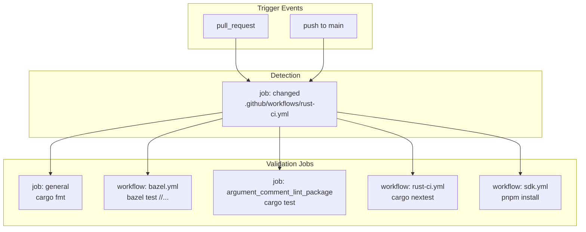
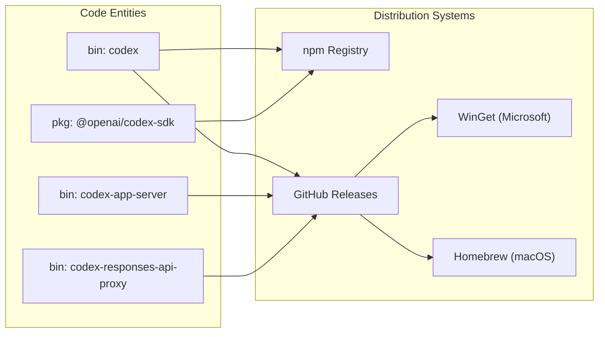

# Build and Distribution

Relevant source files

The following files were used as context for generating this wiki page:

- [.bazelrc](.bazelrc)
- [.github/actions/linux-code-sign/action.yml](.github/actions/linux-code-sign/action.yml)
- [.github/actions/windows-code-sign/action.yml](.github/actions/windows-code-sign/action.yml)
- [.github/scripts/archive-release-symbols-and-strip-binaries.sh](.github/scripts/archive-release-symbols-and-strip-binaries.sh)
- [.github/scripts/run-bazel-ci.sh](.github/scripts/run-bazel-ci.sh)
- [.github/scripts/run-bazel-query-ci.sh](.github/scripts/run-bazel-query-ci.sh)
- [.github/scripts/run_bazel_with_buildbuddy.py](.github/scripts/run_bazel_with_buildbuddy.py)
- [.github/scripts/rusty_v8_bazel.py](.github/scripts/rusty_v8_bazel.py)
- [.github/scripts/test_run_bazel_with_buildbuddy.py](.github/scripts/test_run_bazel_with_buildbuddy.py)
- [.github/scripts/test_rusty_v8_bazel.py](.github/scripts/test_rusty_v8_bazel.py)
- [.github/workflows/bazel.yml](.github/workflows/bazel.yml)
- [.github/workflows/ci.yml](.github/workflows/ci.yml)
- [.github/workflows/rust-ci-full.yml](.github/workflows/rust-ci-full.yml)
- [.github/workflows/rust-ci.yml](.github/workflows/rust-ci.yml)
- [.github/workflows/rust-release-argument-comment-lint.yml](.github/workflows/rust-release-argument-comment-lint.yml)
- [.github/workflows/rust-release-windows.yml](.github/workflows/rust-release-windows.yml)
- [.github/workflows/rust-release.yml](.github/workflows/rust-release.yml)
- [.github/workflows/rusty-v8-release.yml](.github/workflows/rusty-v8-release.yml)
- [.github/workflows/sdk.yml](.github/workflows/sdk.yml)
- [.github/workflows/v8-canary.yml](.github/workflows/v8-canary.yml)
- [AGENTS.md](AGENTS.md)
- [codex-cli/.gitignore](codex-cli/.gitignore)
- [codex-cli/bin/codex.js](codex-cli/bin/codex.js)
- [codex-cli/scripts/README.md](codex-cli/scripts/README.md)
- [codex-cli/scripts/build_npm_package.py](codex-cli/scripts/build_npm_package.py)
- [codex-rs/docs/bazel.md](codex-rs/docs/bazel.md)
- [docs/authentication.md](docs/authentication.md)
- [docs/contributing.md](docs/contributing.md)
- [docs/install.md](docs/install.md)
- [justfile](justfile)
- [scripts/list-bazel-clippy-targets.sh](scripts/list-bazel-clippy-targets.sh)
- [scripts/stage_npm_packages.py](scripts/stage_npm_packages.py)

This document describes the build system, CI/CD pipelines, and distribution infrastructure for Codex. It covers the Cargo workspace structure, the Bazel build configuration, platform build matrix, code signing procedures, artifact packaging, and distribution channels (npm, Homebrew, WinGet, GitHub Releases).

For information about development environment setup and local tooling, see [Development Setup](#9.1). For workspace organization and crate relationships, see [Repository Structure](#1.2).

---

## Overview

The Codex build and distribution system supports multiple execution modes and platforms through a layered pipeline:

1.  **CI Pipeline** (`rust-ci.yml`, `bazel.yml`): Runs on every pull request and push to `main`, performing lint/test checks across all supported platforms using both Cargo and Bazel.
2.  **Release Pipeline** (`rust-release.yml`, `rust-release-windows.yml`): Triggered by git tags matching `rust-v*.*.*`, builds release binaries with platform-specific code signing and thin LTO optimizations.
3.  **Shell Tool MCP Pipeline**: Builds patched Bash and Zsh shells across various OS/distribution variants for the `@openai/codex-shell-tool-mcp` package.
4.  **Distribution Channels**: Publishes to npm (default and alpha tags), Homebrew cask (macOS), WinGet (Windows), and GitHub Releases.

**Build Targets**: The release pipeline builds for platform triples including:
*   **macOS**: `aarch64-apple-darwin`, `x86_64-apple-darwin` [[.github/workflows/rust-release.yml:79-102]()]
*   **Linux**: `x86_64-unknown-linux-musl`, `aarch64-unknown-linux-musl` [[.github/workflows/rust-release.yml:104-127]()]
*   **Windows**: `x86_64-pc-windows-msvc`, `aarch64-pc-windows-msvc` [[.github/workflows/rust-release-windows.yml:27-68]()]

**Sources**: [[.github/workflows/rust-release.yml:11-128]()], [[.github/workflows/rust-ci.yml:1-10]()], [[.github/workflows/bazel.yml:20-53]()]

---

## Cargo Workspace and Bazel Structure

Codex uses a hybrid build approach. While Cargo is the primary developer interface, Bazel provides hermetic builds, remote caching via BuildBuddy, and cross-compilation toolchains. For details, see [Cargo Workspace Structure](#8.1).

| Component | Build Tool | Primary Output / Target |
| :--- | :--- | :--- |
| `codex` | Cargo / Bazel | `//codex-rs/cli:codex` [[justfile:103-104]()] |
| `codex-app-server` | Cargo / Bazel | `codex-app-server` [[.github/workflows/rust-release.yml:89]()] |
| `argument-comment-lint` | Dylint / Bazel | `tools/argument-comment-lint` [[.github/workflows/rust-ci.yml:106-107]()] |
| `sdk/typescript` | pnpm | `@openai/codex-sdk` [[.github/workflows/sdk.yml:147-148]()] |

**Toolchain Management**: The workspace pins the Rust toolchain version to `1.95.0` [[.github/workflows/rust-ci.yml:75]()] and uses `just` for task automation [[justfile:1-12]()].

**Bazel Integration**: Bazel uses a `disk_cache` and `repository_cache` to speed up builds [[.bazelrc:6-8]()]. It configures platform-specific host settings for Linux and Windows [[.bazelrc:18-19]()]. Windows binaries are configured with a specific `RUST_MIN_STACK` (8 MiB) to prevent stack overflows in large async test futures [[.bazelrc:38]()] and [[justfile:7]()].

**Sources**: [[.bazelrc:1-100]()], [[justfile:1-180]()], [[.github/workflows/rust-ci.yml:70-80]()]

---

## CI Pipeline

The CI pipeline validates code quality and correctness on every change. For details, see [CI Pipeline](#8.2).

### Workflow Triggers and Detection
The `rust-ci.yml` workflow uses a `changed` job to analyze path changes, skipping expensive build steps if only documentation or unrelated tools were modified. It detects changes in `codex-rs/*`, `.github/*`, and `tools/argument-comment-lint/*` [[.github/workflows/rust-ci.yml:13-60]()].

### Build and Test Matrix
The CI runs a comprehensive matrix across Linux, macOS, and Windows.
*   **Cargo Native**: Executes `cargo fmt` [[.github/workflows/rust-ci.yml:82]()] and `cargo shear` to find unused dependencies [[.github/workflows/rust-ci.yml:104]()].
*   **Bazel**: Executes `bazel test //...` with remote caching [[.github/workflows/bazel.yml:87-121]()] and BuildBuddy integration [[.bazelrc:53-73]()].
*   **Linting**: Runs a custom `argument-comment-lint` using Dylint to enforce documentation standards on function arguments [[.github/workflows/rust-ci.yml:106-156]()].

**Sources**: [[.github/workflows/rust-ci.yml:13-160]()], [[.github/workflows/bazel.yml:87-121]()], [[.bazelrc:53-140]()]

### CI Workflow Diagram

**Sources**: [[.github/workflows/rust-ci.yml:1-160]()], [[.github/workflows/bazel.yml:1-150]()], [[.github/workflows/sdk.yml:1-164]()]

---

## Release Pipeline

The release pipeline automates the creation of production-ready artifacts. For details, see [Release Pipeline](#8.3).

### Tag-Based Workflow
Releases are triggered by pushing a tag matching `rust-v*.*.*` [[.github/workflows/rust-release.yml:12-15]()]. The `tag-check` job validates that the tag matches the version in `codex-rs/Cargo.toml` [[.github/workflows/rust-release.yml:22-52]()].

### Code Signing and Notarization
*   **macOS**: The build matrix includes a `build_dmg` flag for macOS targets [[.github/workflows/rust-release.yml:84-96]()].
*   **Windows**: Uses Azure Trusted Signing for `codex.exe` and helper binaries like `codex-windows-sandbox-setup` and `codex-command-runner` [[.github/workflows/rust-release-windows.yml:150-161]()].
*   **Linux**: Release artifacts ship MUSL-linked Linux binaries for maximum portability across distributions [[.github/workflows/rust-release.yml:103-127]()].

**Sources**: [[.github/workflows/rust-release.yml:1-200]()], [[.github/workflows/rust-release-windows.yml:1-180]()]

---

## Distribution Channels

Codex is distributed through multiple channels to support different user workflows. For details, see [Distribution Channels](#8.4).

*   **npm Registry**: Packages `@openai/codex`. Uses `scripts/stage_npm_packages.py` to bundle native binaries into the npm package layout [[.github/workflows/ci.yml:58-62]()]. The `codex-cli/bin/codex.js` entry point dynamically resolves the correct native binary based on the `PLATFORM_PACKAGE_BY_TARGET` map [[codex-cli/bin/codex.js:15-22]()].
*   **GitHub Releases**: The primary source for binaries such as `codex` and `codex-app-server` across all matrix targets [[.github/workflows/rust-release.yml:83-126]()].
*   **Homebrew/WinGet**: Supported via standard package manifests that point to GitHub Release artifacts.

### Distribution Mapping

**Sources**: [[.github/workflows/ci.yml:45-70]()], [[codex-cli/bin/codex.js:15-120]()], [[.github/workflows/rust-release.yml:83-126]()]

---

## Shell Tool MCP Build System

Codex includes a specialized build system for patched versions of Bash and Zsh. For details, see [Shell Tool MCP Build System](#8.5).

The build process involves compiling shells across various OS variants to ensure compatibility with the `EXEC_WRAPPER` sandbox requirements. This is managed as part of the `shell-tool-mcp` workflow, which prepares the `@openai/codex-shell-tool-mcp` package for distribution.

**Sources**: [[.github/workflows/rust-ci.yml:1-60]()] (Scoping informed by repository structure and `shell-tool-mcp` distribution package references).
