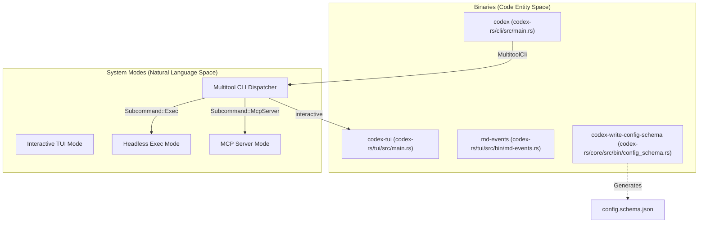
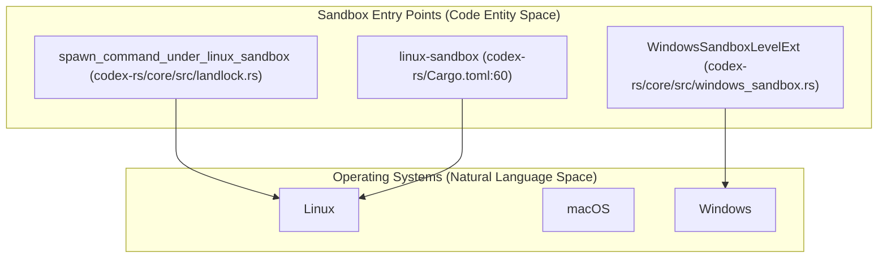
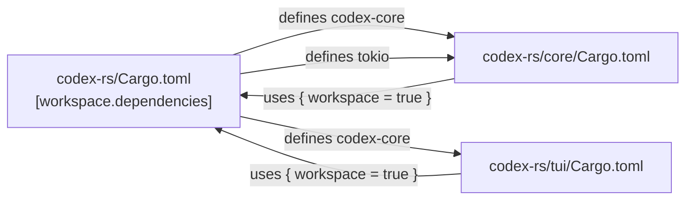

# Cargo Workspace Structure

Relevant source files

The following files were used as context for generating this wiki page:

- [.bazelrc](.bazelrc)
- [.github/scripts/run-bazel-ci.sh](.github/scripts/run-bazel-ci.sh)
- [.github/scripts/run-bazel-query-ci.sh](.github/scripts/run-bazel-query-ci.sh)
- [.github/scripts/run_bazel_with_buildbuddy.py](.github/scripts/run_bazel_with_buildbuddy.py)
- [.github/scripts/rusty_v8_bazel.py](.github/scripts/rusty_v8_bazel.py)
- [.github/scripts/test_run_bazel_with_buildbuddy.py](.github/scripts/test_run_bazel_with_buildbuddy.py)
- [.github/scripts/test_rusty_v8_bazel.py](.github/scripts/test_rusty_v8_bazel.py)
- [.github/workflows/bazel.yml](.github/workflows/bazel.yml)
- [.github/workflows/rusty-v8-release.yml](.github/workflows/rusty-v8-release.yml)
- [.github/workflows/v8-canary.yml](.github/workflows/v8-canary.yml)
- [AGENTS.md](AGENTS.md)
- [codex-rs/Cargo.lock](codex-rs/Cargo.lock)
- [codex-rs/Cargo.toml](codex-rs/Cargo.toml)
- [codex-rs/cli/Cargo.toml](codex-rs/cli/Cargo.toml)
- [codex-rs/cli/src/lib.rs](codex-rs/cli/src/lib.rs)
- [codex-rs/cli/src/main.rs](codex-rs/cli/src/main.rs)
- [codex-rs/core/Cargo.toml](codex-rs/core/Cargo.toml)
- [codex-rs/core/src/lib.rs](codex-rs/core/src/lib.rs)
- [codex-rs/docs/bazel.md](codex-rs/docs/bazel.md)
- [codex-rs/exec/Cargo.toml](codex-rs/exec/Cargo.toml)
- [codex-rs/exec/src/cli.rs](codex-rs/exec/src/cli.rs)
- [codex-rs/exec/src/event_processor.rs](codex-rs/exec/src/event_processor.rs)
- [codex-rs/exec/src/lib.rs](codex-rs/exec/src/lib.rs)
- [codex-rs/tui/Cargo.toml](codex-rs/tui/Cargo.toml)
- [codex-rs/tui/src/cli.rs](codex-rs/tui/src/cli.rs)
- [codex-rs/tui/src/lib.rs](codex-rs/tui/src/lib.rs)
- [docs/authentication.md](docs/authentication.md)
- [docs/contributing.md](docs/contributing.md)
- [docs/install.md](docs/install.md)
- [justfile](justfile)
- [scripts/list-bazel-clippy-targets.sh](scripts/list-bazel-clippy-targets.sh)

This page covers the layout of the Rust Cargo workspace located at `codex-rs/`, including crate membership, shared dependency management, and the integration of specialized build tooling like Bazel.

---

## Workspace Root

The workspace is defined in `codex-rs/Cargo.toml` [codex-rs/Cargo.toml:1-121](). It uses Cargo's `resolver = "2"` [codex-rs/Cargo.toml:122-122]() for feature resolution and sets a shared `[workspace.package]` block [codex-rs/Cargo.toml:124-132]() that member crates inherit. This centralized configuration ensures that the Rust edition and license remain consistent across all 120+ crates.

| Field | Value |
|---|---|
| `resolver` | `"2"` [codex-rs/Cargo.toml:122-122]() |
| `version` | `"0.0.0"` (all crates share the same in-development version) [codex-rs/Cargo.toml:125-125]() |
| `edition` | `"2024"` [codex-rs/Cargo.toml:130-130]() |
| `license` | `"Apache-2.0"` [codex-rs/Cargo.toml:131-131]() |

Sources: [codex-rs/Cargo.toml:1-132]()

---

## Crate Membership

The workspace contains over 120 member crates [codex-rs/Cargo.toml:2-121](). These are organized into several functional groups, ranging from the core agent logic to platform-specific utilities.

### Key Crates

**Core Logic and Engine**

| Path in workspace | Crate name | Role |
|---|---|---|
| `core` | `codex-core` | Central agent engine, thread management, and session logic [codex-rs/core/src/lib.rs:1-198]() |
| `protocol` | `codex-protocol` | Shared Op/Event protocol types [codex-rs/Cargo.toml:72-72]() |
| `config` | `codex-config` | Configuration loading and validation [codex-rs/Cargo.toml:31-31]() |
| `rollout` | `codex-rollout` | Session persistence and event replay [codex-rs/core/src/lib.rs:147-170]() |
| `models-manager` | `codex-models-manager` | Model discovery and info resolution [codex-rs/Cargo.toml:68-68]() |

**User Interfaces**

| Path in workspace | Crate name | Role |
|---|---|---|
| `cli` | `codex-cli` | The primary `codex` multitool binary [codex-rs/cli/src/main.rs:103-118]() |
| `tui` | `codex-tui` | Interactive Terminal User Interface [codex-rs/tui/src/lib.rs:1-215]() |
| `exec` | `codex-exec` | Headless execution mode for automation [codex-rs/exec/src/lib.rs:1-158]() |
| `app-server` | `codex-app-server` | JSON-RPC server for IDE integrations [codex-rs/Cargo.toml:11-11]() |

**Tooling and Infrastructure**

| Path in workspace | Crate name | Role |
|---|---|---|
| `codex-mcp` | `codex-mcp` | Model Context Protocol (MCP) client logic [codex-rs/Cargo.toml:63-63]() |
| `mcp-server` | `codex-mcp-server` | Implementation of Codex as an MCP server [codex-rs/Cargo.toml:64-64]() |
| `sandboxing` | `codex-sandboxing` | Cross-platform sandbox abstractions [codex-rs/Cargo.toml:80-80]() |
| `shell-command` | `codex-shell-command` | Shell execution backend [codex-rs/Cargo.toml:33-33]() |
| `otel` | `codex-otel` | OpenTelemetry integration [codex-rs/Cargo.toml:82-82]() |

Sources: [codex-rs/Cargo.toml:2-121](), [codex-rs/core/src/lib.rs:1-198](), [codex-rs/cli/src/main.rs:103-209](), [codex-rs/tui/src/lib.rs:1-215](), [codex-rs/exec/src/lib.rs:1-173]()

---

## System Architecture: Code Entity Mapping

The following diagrams bridge high-level system components to their implementation crates and entry points.

**Crate-to-Binary Mapping**

**Sandbox Dispatch Mapping**

Sources: [codex-rs/cli/src/main.rs:91-209](), [codex-rs/tui/Cargo.toml:8-15](), [codex-rs/core/Cargo.toml:11-14](), [codex-rs/core/src/lib.rs:47-48](), [codex-rs/core/src/lib.rs:103-103]()

---

## Dependency Management

The workspace uses a "single source of truth" for dependencies. All shared external and internal dependencies are defined in the root `Cargo.toml` [codex-rs/Cargo.toml:133-220]() and inherited by member crates.

**Dependency Flow**

Internal dependencies are mapped to their relative paths in the root manifest:
- `codex-core = { path = "core" }` [codex-rs/Cargo.toml:163-163]()
- `codex-protocol = { path = "protocol" }` [codex-rs/Cargo.toml:205-205]()

Member crates reference them using the `workspace = true` syntax:
- `codex-core = { workspace = true }` [codex-rs/core/Cargo.toml:4-4]()
- `codex-protocol = { workspace = true }` [codex-rs/core/Cargo.toml:56-56]()

Sources: [codex-rs/Cargo.toml:133-220](), [codex-rs/core/Cargo.toml:1-120]()

---

## Shared Tooling and Multi-Build Systems

### Bazel Integration
In addition to Cargo, the project uses Bazel for hermetic builds, cross-compilation, and advanced linting.

- **MODULE.bazel**: Defines the external dependency graph and build targets.
- **CI/CD Pipelines**: The project runs Bazel tests across macOS, Linux (GNU/MUSL), and Windows shards in GitHub Actions [.github/workflows/bazel.yml:27-48]().
- **Argument Comment Lint**: A custom dylint-based check enforced via Bazel to ensure positional literal arguments are commented [AGENTS.md:15-19](), [justfile:157-164]().

### Development Utilities
- **Justfile**: The primary task runner. Common commands include `just test` [justfile:77-83](), `just fmt` [justfile:40-42](), and `just write-config-schema` [justfile:144-145]().
- **Config Schema**: `codex-write-config-schema` [codex-rs/core/Cargo.toml:12-13]() generates JSON schemas for validation of `config.toml`.
- **Sccache**: Shared compilation caching is supported to speed up incremental builds across the workspace.

Sources: [codex-rs/core/Cargo.toml:11-14](), [justfile:1-177](), [.github/workflows/bazel.yml:1-121](), [AGENTS.md:1-66]()
