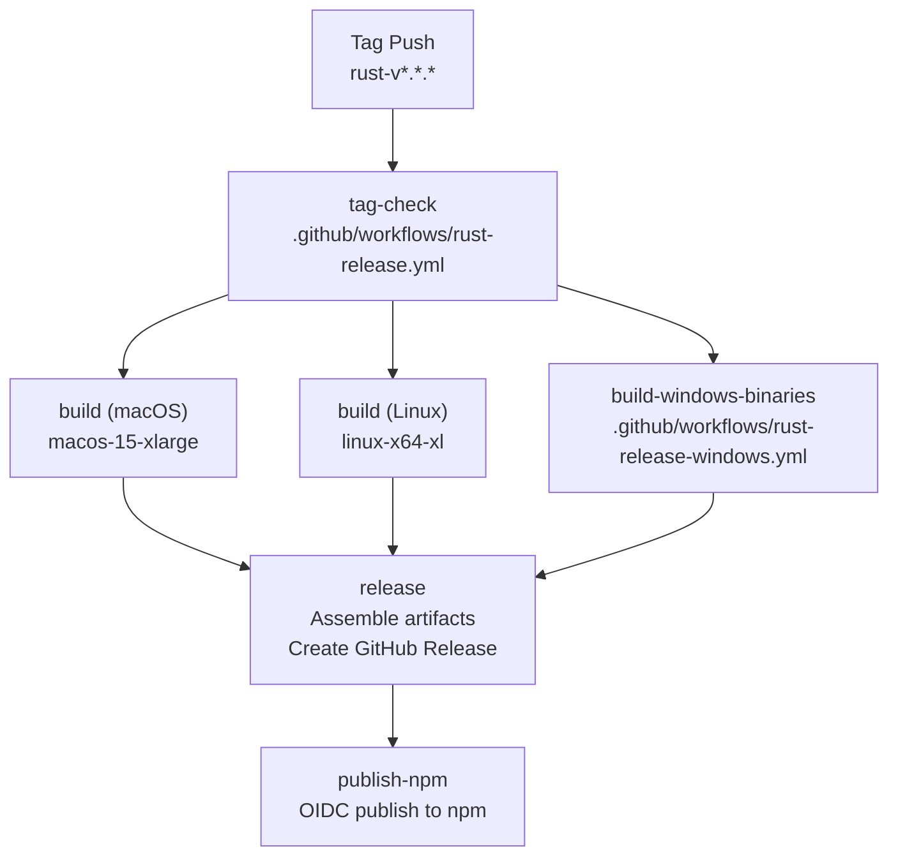
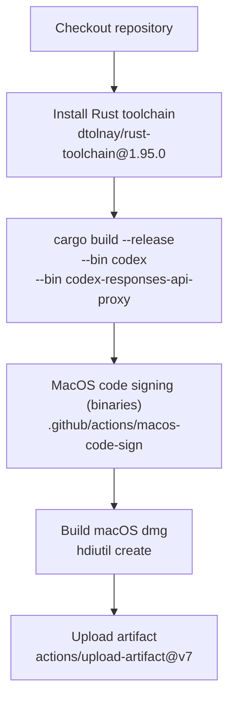
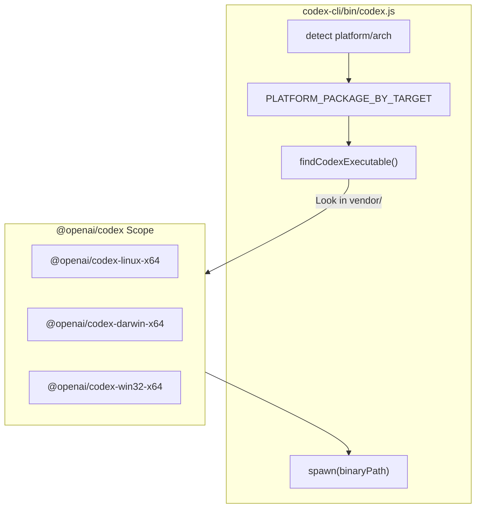

# Release Pipeline

<details>
<summary>Relevant source files</summary>

The following files were used as context for generating this wiki page:

- [.github/actions/linux-code-sign/action.yml](.github/actions/linux-code-sign/action.yml)
- [.github/actions/windows-code-sign/action.yml](.github/actions/windows-code-sign/action.yml)
- [.github/scripts/archive-release-symbols-and-strip-binaries.sh](.github/scripts/archive-release-symbols-and-strip-binaries.sh)
- [.github/workflows/Dockerfile.bazel](.github/workflows/Dockerfile.bazel)
- [.github/workflows/ci.yml](.github/workflows/ci.yml)
- [.github/workflows/rust-ci-full.yml](.github/workflows/rust-ci-full.yml)
- [.github/workflows/rust-ci.yml](.github/workflows/rust-ci.yml)
- [.github/workflows/rust-release-argument-comment-lint.yml](.github/workflows/rust-release-argument-comment-lint.yml)
- [.github/workflows/rust-release-windows.yml](.github/workflows/rust-release-windows.yml)
- [.github/workflows/rust-release.yml](.github/workflows/rust-release.yml)
- [.github/workflows/sdk.yml](.github/workflows/sdk.yml)
- [BUILD.bazel](BUILD.bazel)
- [MODULE.bazel](MODULE.bazel)
- [MODULE.bazel.lock](MODULE.bazel.lock)
- [SECURITY.md](SECURITY.md)
- [codex-cli/.gitignore](codex-cli/.gitignore)
- [codex-cli/bin/codex.js](codex-cli/bin/codex.js)
- [codex-cli/scripts/README.md](codex-cli/scripts/README.md)
- [codex-cli/scripts/build_npm_package.py](codex-cli/scripts/build_npm_package.py)
- [codex-rs/app-server/BUILD.bazel](codex-rs/app-server/BUILD.bazel)
- [codex-rs/core/BUILD.bazel](codex-rs/core/BUILD.bazel)
- [codex-rs/mcp-server/BUILD.bazel](codex-rs/mcp-server/BUILD.bazel)
- [codex-rs/tui/BUILD.bazel](codex-rs/tui/BUILD.bazel)
- [codex-rs/utils/cargo-bin/BUILD.bazel](codex-rs/utils/cargo-bin/BUILD.bazel)
- [defs.bzl](defs.bzl)
- [patches/BUILD.bazel](patches/BUILD.bazel)
- [patches/rules_rs_build_script_deps_annotation.patch](patches/rules_rs_build_script_deps_annotation.patch)
- [patches/v8_bazel_rules.patch](patches/v8_bazel_rules.patch)
- [patches/v8_module_deps.patch](patches/v8_module_deps.patch)
- [patches/v8_source_portability.patch](patches/v8_source_portability.patch)
- [rbe.bzl](rbe.bzl)
- [scripts/stage_npm_packages.py](scripts/stage_npm_packages.py)
- [third_party/v8/BUILD.bazel](third_party/v8/BUILD.bazel)
- [third_party/v8/README.md](third_party/v8/README.md)
- [workspace_root_test_launcher.bat.tpl](workspace_root_test_launcher.bat.tpl)
- [workspace_root_test_launcher.sh.tpl](workspace_root_test_launcher.sh.tpl)

</details>


## Purpose and Scope

This document describes the release pipeline defined in [.github/workflows/rust-release.yml]() that builds, signs, and publishes Codex binaries for all supported platforms. The pipeline is triggered by pushing a version tag and orchestrates multi-platform builds, platform-specific code signing (Apple, Cosign, Azure), artifact compression, GitHub release creation, and npm package publishing.

The pipeline covers the core `codex` CLI, the `codex-responses-api-proxy`, and the `codex-app-server`. It also handles the complex cross-compilation requirements for Windows and Linux (musl) using both Cargo and Bazel-based workflows.

---

## Release Trigger and Tag Validation

The release pipeline is triggered by pushing a Git tag that matches the pattern `rust-v*.*.*` [[.github/workflows/rust-release.yml:13-15]]().

```bash
git tag -a rust-v0.1.0 -m "Release 0.1.0"
git push origin rust-v0.1.0
```

The `tag-check` job validates that the tag format is correct and matches the version declared in `codex-rs/Cargo.toml` [[.github/workflows/rust-release.yml:22-29]](). Accepted tag formats include stable releases (e.g., `rust-v1.2.3`) and alpha/beta pre-releases (e.g., `rust-v1.2.3-alpha.1`) [[.github/workflows/rust-release.yml:40-41]]().

The validation logic [[.github/workflows/rust-release.yml:31-51]]() extracts the version from the tag, reads the version from `Cargo.toml` using `grep` and `sed`, and fails the workflow if they do not match. This prevents accidental releases with mismatched versions.

**Sources:** [[.github/workflows/rust-release.yml:1-52]]()

---

## Workflow Job Dependencies

The pipeline uses concurrent builds for all platforms, then gates the final release assembly on all builds completing successfully.

**Diagram: Release Pipeline Job Graph**



**Sources:** [[.github/workflows/rust-release.yml:21-615]](), [[.github/workflows/rust-release-windows.yml:12-145]]()

---

## Build Matrix Strategy

### Platform Coverage

The `build` job uses a matrix strategy to build binaries for several platform/libc combinations in parallel [[.github/workflows/rust-release.yml:75-127]]().

| Runner | Target | libc | Artifact Name | Binaries |
|--------|--------|------|---------------|----------|
| `macos-15-xlarge` | `aarch64-apple-darwin` | system | `aarch64-apple-darwin` | `codex`, `proxy` |
| `macos-15-xlarge` | `x86_64-apple-darwin` | system | `x86_64-apple-darwin` | `codex`, `proxy` |
| `linux-x64-xl` | `x86_64-unknown-linux-musl` | musl | `x86_64-unknown-linux-musl` | `codex`, `proxy`, `bwrap` |
| `linux-arm64` | `aarch64-unknown-linux-musl` | musl | `aarch64-unknown-linux-musl` | `codex`, `proxy`, `bwrap` |

Windows builds are handled by a separate reusable workflow [[.github/workflows/rust-release-windows.yml]]() that builds targets including `x86_64-pc-windows-msvc` and `aarch64-pc-windows-msvc` [[.github/workflows/rust-release-windows.yml:26-68]]().

### Build Configuration
The pipeline optimizes for network reliability and debug information:
*   **Git CLI**: Sets `CARGO_NET_GIT_FETCH_WITH_CLI: "true"` to avoid `libgit2` flakiness with nested submodules (e.g., `libwebrtc`) [[.github/workflows/rust-release.yml:69-73]]().
*   **dSYMs**: macOS release packages archive packed dSYM bundles before stripping [[.github/workflows/rust-release.yml:67-68]]().

**Sources:** [[.github/workflows/rust-release.yml:53-128]](), [[.github/workflows/rust-release-windows.yml:8-69]]()

---

## macOS Build and Code Signing

**Diagram: macOS Release Build Flow**



The macOS build process features integrated signing:
1.  **Binary Signing**: Uses a dedicated environment `codesigning` for access to Apple signing certificates [[.github/workflows/rust-release.yml:8-9]]().
2.  **Architecture**: Builds for both `aarch64` and `x86_64` using `macos-15-xlarge` runners [[.github/workflows/rust-release.yml:79-102]]().

**Sources:** [[.github/workflows/rust-release.yml:79-102]](), [[.github/workflows/rust-release.yml:147-161]]()

---

## Linux Build and musl Cross-Compilation

### musl Toolchain Setup
Linux builds produce musl-linked binaries for portability across different Linux distributions.
*   **Build Dependencies**: Installs `binutils`, `pkg-config`, and `libcap-dev` on the runner to support `bwrap` and other low-level components [[.github/workflows/rust-release.yml:162-168]]().
*   **Hermetic Cargo Home**: Creates an isolated `.cargo-home` within the workspace to ensure build reproducibility [[.github/workflows/rust-release.yml:174-180]]().

### Linux Code Signing
Linux binaries are signed using **Cosign** [[.github/workflows/rust-release.yml:8-9]](). This provides a verifiable signature for the `x86_64` and `aarch64` musl binaries.

**Sources:** [[.github/workflows/rust-release.yml:103-127]](), [[.github/workflows/rust-release.yml:162-180]]()

---

## Windows Build and Azure Trusted Signing

Windows builds are delegated to `rust-release-windows.yml` [[.github/workflows/rust-release-windows.yml:1]]().

1.  **Bundle Splitting**: Compiles binaries in three bundles: `primary` (`codex`, `proxy`), `helpers` (`codex-windows-sandbox-setup`, `codex-command-runner`), and `app-server` (`codex-app-server`) [[.github/workflows/rust-release-windows.yml:26-68]]().
2.  **LLVM Linker**: Configures the MSVC environment to use the LLVM linker for Windows builds [[.github/workflows/rust-release-windows.yml:92-95]]().
3.  **Azure Trusted Signing**: Uses the `azure-artifact-signing` environment [[.github/workflows/rust-release-windows.yml:150-151]]() to apply signatures to `.exe` files.
4.  **PDB Staging**: Packages both the `.exe` and the `.pdb` symbol files for debugging [[.github/workflows/rust-release-windows.yml:117-136]]().

**Sources:** [[.github/workflows/rust-release-windows.yml:23-144]](), [[.github/workflows/rust-release-windows.yml:145-218]]()

---

## Bazel Dependency Patches and Windows Support

The repository uses Bazel for complex cross-platform builds, particularly for components requiring specific C++ toolchains like `v8` or `llvm`.

### Patches for Cross-Compilation
The `patches/` directory contains critical modifications for Bazel dependencies [[MODULE.bazel:12-15]]():
*   **LLVM**: Patches for Windows symlink extraction and `rusty_v8` custom libc++ [[MODULE.bazel:13-14]]().
*   **Abseil**: Forced portable C++11 thread-local paths for `windows-gnullvm` compatibility [[MODULE.bazel:22-24]]().
*   **Rules Rust**: Extensive patches for `windows-gnullvm` execution, build script environment handling, and linker arguments [[MODULE.bazel:108-119]]().

### Linker Flag Alignment
To ensure consistency between Cargo and Bazel builds, `defs.bzl` defines `WINDOWS_RUSTC_LINK_FLAGS` to set the 8 MiB stack reserve and UCRT imports [[defs.bzl:8-22]]().

**Sources:** [[MODULE.bazel:1-122]](), [[defs.bzl:6-22]]()

---

## Release Assembly and npm Publishing

The final stage of the pipeline assembles the distribution artifacts and publishes the npm packages.

**Diagram: npm Package Resolution Logic**



### npm Multi-Package Layout
The Codex CLI is distributed as a set of npm packages:
*   **Wrapper Package**: `@openai/codex` contains the `codex.js` entry point which detects the host platform [[codex-cli/bin/codex.js:15-67]]().
*   **Platform Packages**: Six optional dependencies (e.g., `@openai/codex-linux-x64`, `@openai/codex-darwin-arm64`) contain the actual native binaries in a `vendor/` directory [[codex-cli/bin/codex.js:15-22]]().
*   **Resolution**: The `findCodexExecutable` function uses `require.resolve` to find the installed platform package and locate the `codex` binary [[codex-cli/bin/codex.js:78-105]]().

### Staging and Packaging
The `build_npm_package.py` script orchestrates the creation of these packages by:
1.  Mapping targets to npm tags (e.g., `x86_64-apple-darwin` -> `darwin-x64`) [[codex-cli/scripts/build_npm_package.py:23-66]]().
2.  Staging the `bin/codex.js` wrapper and native binaries into the correct layout [[codex-cli/scripts/build_npm_package.py:153-174]]().

**Sources:** [[codex-cli/bin/codex.js:1-105]](), [[codex-cli/scripts/build_npm_package.py:23-174]](), [[.github/workflows/ci.yml:45-64]]()
