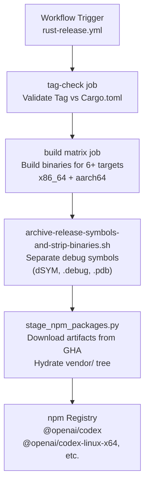
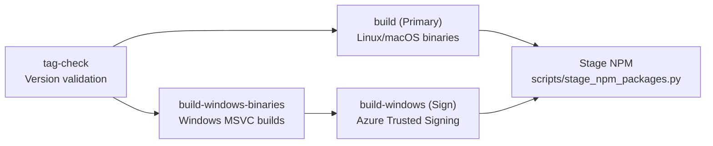
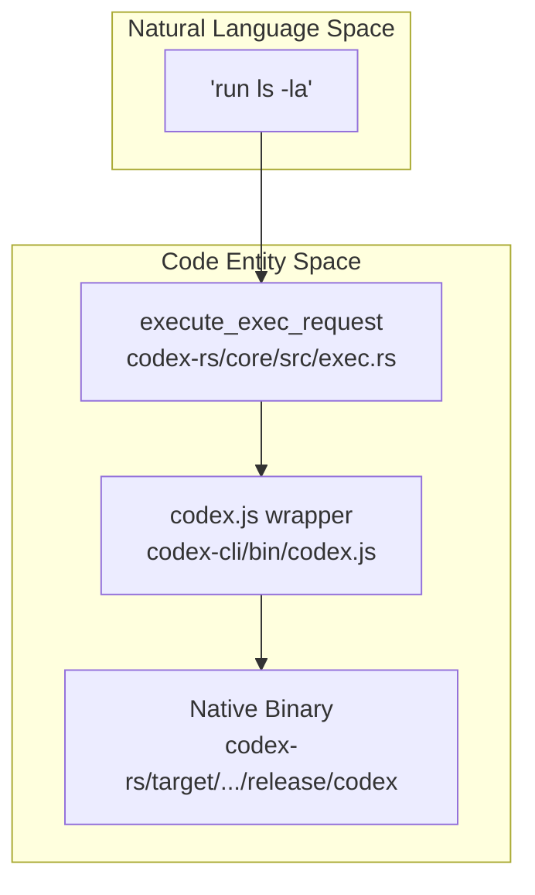
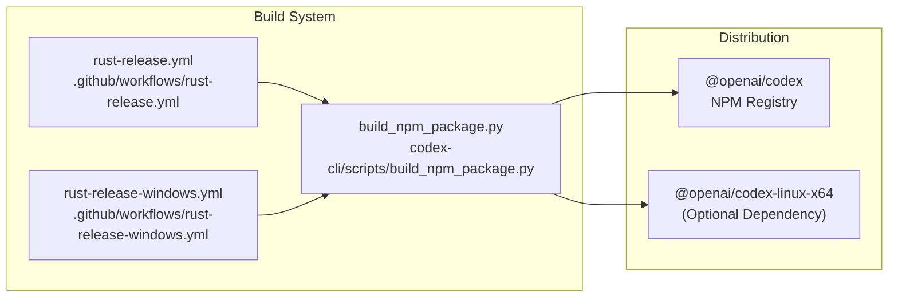

# Shell Tool MCP Build System

Relevant source files

The following files were used as context for generating this wiki page:

- [.github/actions/linux-code-sign/action.yml](.github/actions/linux-code-sign/action.yml)
- [.github/actions/windows-code-sign/action.yml](.github/actions/windows-code-sign/action.yml)
- [.github/scripts/archive-release-symbols-and-strip-binaries.sh](.github/scripts/archive-release-symbols-and-strip-binaries.sh)
- [.github/workflows/ci.yml](.github/workflows/ci.yml)
- [.github/workflows/rust-ci-full.yml](.github/workflows/rust-ci-full.yml)
- [.github/workflows/rust-ci.yml](.github/workflows/rust-ci.yml)
- [.github/workflows/rust-release-argument-comment-lint.yml](.github/workflows/rust-release-argument-comment-lint.yml)
- [.github/workflows/rust-release-windows.yml](.github/workflows/rust-release-windows.yml)
- [.github/workflows/rust-release.yml](.github/workflows/rust-release.yml)
- [.github/workflows/sdk.yml](.github/workflows/sdk.yml)
- [codex-cli/.gitignore](codex-cli/.gitignore)
- [codex-cli/bin/codex.js](codex-cli/bin/codex.js)
- [codex-cli/scripts/README.md](codex-cli/scripts/README.md)
- [codex-cli/scripts/build_npm_package.py](codex-cli/scripts/build_npm_package.py)
- [scripts/stage_npm_packages.py](scripts/stage_npm_packages.py)

## Purpose and Scope

The Shell Tool MCP Build System is responsible for building and distributing patched versions of Bash and Zsh that support execution interception for Codex's shell tools. This system compiles customized shell binaries across 11 OS/distribution variants for both `x86_64` and `aarch64` architectures, packages them into an npm distribution, and publishes them to the npm registry. The patched shells enable the `EXEC_WRAPPER` mechanism used by Codex's shell escalation protocol to intercept and control command execution within sandboxed shell sessions.

For information about how Codex uses these patched shells at runtime, see [5.2](). For details on the shell escalation protocol itself, see the shell-escalation implementation in `codex-rs/shell-escalation/`.

**Sources:** [.github/workflows/rust-release.yml:103-127](), [codex-cli/bin/codex.js:15-22]()

---

## System Overview

The `shell-tool-mcp` system operates as a component of the release pipeline that builds patched shell binaries and integrates them into the `@openai/codex` npm ecosystem. The system produces platform-specific binaries organized by target triple and OS variant, which are consumed by the CLI entry point.

### Build and Distribution Flow

**Sources:** [.github/workflows/rust-release.yml:11-51](), [.github/workflows/ci.yml:45-66](), [scripts/stage_npm_packages.py:208-223](), [.github/scripts/archive-release-symbols-and-strip-binaries.sh:60-120]()

---

## Workflow Architecture

The build system is driven by GitHub Actions workflows that coordinate cross-platform compilation and artifact management.

### Release Validation

The `tag-check` job ensures that the release tag follows the `rust-v*.*.*` format and matches the version defined in the workspace `Cargo.toml`.

| Step | Logic |
|------|-------|
| **Tag Format** | `[[ "${GITHUB_REF_NAME}" =~ ^rust-v[0-9]+\.[0-9]+\.[0-9]+... ]]` [.github/workflows/rust-release.yml:40-41]() |
| **Version Sync** | `cargo_ver="$(grep -m1 '^version' codex-rs/Cargo.toml ...)"` [.github/workflows/rust-release.yml:44-45]() |

### Job Dependency Chain

The release workflow manages a complex matrix of builds across Linux, macOS, and Windows.

**Sources:** [.github/workflows/rust-release.yml:53-127](), [.github/workflows/rust-release-windows.yml:12-68](), [.github/workflows/rust-release-windows.yml:145-177]()

---

## Build Matrix and Platforms

The build system targets 6 primary platform/architecture combinations, which are mapped to specific npm optional dependencies.

### Platform Mapping (`PLATFORM_PACKAGE_BY_TARGET`)

| Target Triple | npm Package | OS | CPU |
|---------------|-------------|----|-----|
| `x86_64-unknown-linux-musl` | `@openai/codex-linux-x64` | linux | x64 |
| `aarch64-unknown-linux-musl` | `@openai/codex-linux-arm64` | linux | arm64 |
| `x86_64-apple-darwin` | `@openai/codex-darwin-x64` | darwin | x64 |
| `aarch64-apple-darwin` | `@openai/codex-darwin-arm64` | darwin | arm64 |
| `x86_64-pc-windows-msvc` | `@openai/codex-win32-x64` | win32 | x64 |
| `aarch64-pc-windows-msvc` | `@openai/codex-win32-arm64` | win32 | arm64 |

**Sources:** [codex-cli/bin/codex.js:15-22](), [codex-cli/scripts/build_npm_package.py:23-66]()

---

## Packaging and Entry Points

The system uses a "meta-package" pattern where the main `@openai/codex` package acts as a thin wrapper that resolves and executes the correct native binary for the current platform.

### CLI Resolution Logic (`codex.js`)

The entry point script `codex-cli/bin/codex.js` performs the following steps:
1.  **Platform Detection**: Uses `process.platform` and `process.arch` to determine the `targetTriple` [codex-cli/bin/codex.js:24-67]().
2.  **Package Resolution**: Attempts to locate the native binary in the `vendor/` directory of the corresponding platform package using `require.resolve` [codex-cli/bin/codex.js:78-95]().
3.  **Environment Setup**: Detects if the package is managed by `npm` or `bun` and sets `CODEX_MANAGED_PACKAGE_ROOT` [codex-cli/bin/codex.js:119-148]().
4.  **Process Spawning**: Spawns the native binary using `node:child_process` and forwards signals (`SIGINT`, `SIGTERM`, `SIGHUP`) to ensure graceful shutdown [codex-cli/bin/codex.js:150-181]().

### Staging and Assembly

Release assembly is handled by `scripts/stage_npm_packages.py`, which:
- Resolves the correct release workflow run using `gh run list` [scripts/stage_npm_packages.py:149-172]().
- Downloads artifacts from GitHub Actions [scripts/stage_npm_packages.py:215]().
- Hydrates the `vendor/` tree using `install_binary_components` [scripts/stage_npm_packages.py:218-222]().

**Sources:** [codex-cli/bin/codex.js:1-205](), [scripts/stage_npm_packages.py:1-223]()

---

## Build Process (Symbol Management)

The `archive-release-symbols-and-strip-binaries.sh` script encapsulates the separation of debug symbols from release binaries to keep the distributed package size small while retaining diagnostic capabilities.

### Platform-Specific Symbol Handling

| OS | Tooling | Action |
|----|---------|--------|
| **macOS** | `strip -S -x` | Extracts `.dSYM` bundles and strips local symbols [.github/scripts/archive-release-symbols-and-strip-binaries.sh:68-84]() |
| **Linux** | `objcopy`, `strip` | Creates `.debug` files and adds `gnu-debuglink` [.github/scripts/archive-release-symbols-and-strip-binaries.sh:85-99]() |
| **Windows** | `cp` | Collects `.pdb` files generated during the MSVC build [.github/scripts/archive-release-symbols-and-strip-binaries.sh:101-111]() |

### Integration with Shell Execution

The `shell-tool-mcp` binaries are ultimately invoked via the core's execution engine, bridged through the Node.js wrapper.

**Sources:** [codex-cli/bin/codex.js:150-153](), [.github/workflows/rust-release.yml:83](), [.github/workflows/rust-release-windows.yml:108]()

### Build and Deployment Diagram

**Sources:** [.github/workflows/rust-release.yml:53-127](), [.github/workflows/rust-release-windows.yml:25-68](), [codex-cli/scripts/build_npm_package.py:23-66]()
