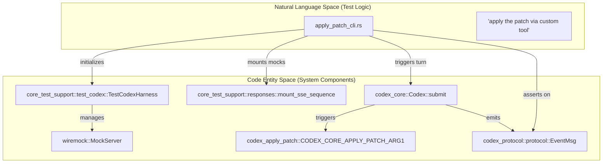
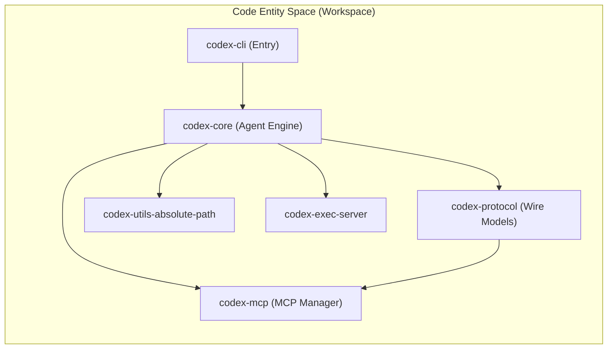

# Development and Testing

Relevant source files

The following files were used as context for generating this wiki page:

- [.bazelrc](.bazelrc)
- [.github/scripts/run-bazel-ci.sh](.github/scripts/run-bazel-ci.sh)
- [.github/scripts/run-bazel-query-ci.sh](.github/scripts/run-bazel-query-ci.sh)
- [.github/scripts/run_bazel_with_buildbuddy.py](.github/scripts/run_bazel_with_buildbuddy.py)
- [.github/scripts/rusty_v8_bazel.py](.github/scripts/rusty_v8_bazel.py)
- [.github/scripts/test_run_bazel_with_buildbuddy.py](.github/scripts/test_run_bazel_with_buildbuddy.py)
- [.github/scripts/test_rusty_v8_bazel.py](.github/scripts/test_rusty_v8_bazel.py)
- [.github/workflows/bazel.yml](.github/workflows/bazel.yml)
- [.github/workflows/rusty-v8-release.yml](.github/workflows/rusty-v8-release.yml)
- [.github/workflows/v8-canary.yml](.github/workflows/v8-canary.yml)
- [AGENTS.md](AGENTS.md)
- [codex-rs/core/tests/common/test_codex.rs](codex-rs/core/tests/common/test_codex.rs)
- [codex-rs/core/tests/suite/apply_patch_cli.rs](codex-rs/core/tests/suite/apply_patch_cli.rs)
- [codex-rs/core/tests/suite/mod.rs](codex-rs/core/tests/suite/mod.rs)
- [codex-rs/core/tests/suite/shell_serialization.rs](codex-rs/core/tests/suite/shell_serialization.rs)
- [codex-rs/core/tests/suite/tool_harness.rs](codex-rs/core/tests/suite/tool_harness.rs)
- [codex-rs/core/tests/suite/tools.rs](codex-rs/core/tests/suite/tools.rs)
- [codex-rs/docs/bazel.md](codex-rs/docs/bazel.md)
- [docs/authentication.md](docs/authentication.md)
- [docs/contributing.md](docs/contributing.md)
- [docs/install.md](docs/install.md)
- [justfile](justfile)
- [scripts/list-bazel-clippy-targets.sh](scripts/list-bazel-clippy-targets.sh)

This page provides a high-level guide for developers contributing to the Codex codebase. It covers the essential setup, testing philosophies, and coding standards required to maintain the system's reliability and performance.

For detailed setup instructions, see [Development Setup](#9.1). For an in-depth look at our testing tools, see [Testing Infrastructure](#9.2).

## Core Development Principles

The Codex codebase follows strict Rust idioms and organizational patterns to ensure maintainability. Key constraints include:

*   **Module Size**: Target Rust modules under 500 lines of code (LoC). If a file exceeds roughly 800 LoC, functionality should be extracted into new modules [AGENTS.md:45-49](). This applies especially to central orchestration modules like `chatwidget.rs` and `app.rs` [AGENTS.md:50-57]().
*   **API Design**: Avoid ambiguous `bool` or `Option` parameters. Prefer enums, named methods, or newtypes for self-documenting callsites [AGENTS.md:14]().
*   **Crate Naming**: All crates in the workspace are prefixed with `codex-` (e.g., the `core` folder contains `codex-core`) [AGENTS.md:5]().
*   **Tooling**: The project relies on `just` as a command runner, `cargo-nextest` for fast test execution, and `cargo-insta` for snapshot testing [AGENTS.md:7, 60-64]().
*   **Linting**: The codebase uses a custom `argument-comment-lint` to enforce parameter documentation for literal arguments using `/*param_name*/` comments [AGENTS.md:15-19]().

## Development Setup and Workflow

Developers use the `justfile` located in the `codex-rs` directory to manage common tasks. This ensures consistency across different development environments and CI pipelines.

| Command | Purpose |
| :--- | :--- |
| `just fmt` | Formats code automatically (Rust, Python, and Justfiles) [justfile:40-41](); required after changes [AGENTS.md:60](). |
| `just fix -p <project>` | Runs linter fixes on a specific project to avoid slow workspace-wide builds [AGENTS.md:66](). |
| `just write-config-schema` | Updates `codex-rs/core/config.schema.json` after modifying `ConfigToml` [justfile:144-145](), [AGENTS.md:33](). |
| `just argument-comment-lint` | Checks for documented opaque literal arguments using Bazel [justfile:158-164](). |
| `just bazel-lock-update` | Refreshes `MODULE.bazel.lock` after `Cargo.toml` or `Cargo.lock` changes [justfile:111-112](), [AGENTS.md:36-37](). |

For details, see [Development Setup](#9.1).

Sources: [AGENTS.md:1-70](), [justfile:1-177]()

## Testing Infrastructure

Codex employs a multi-layered testing strategy, ranging from unit tests to complex integration tests that simulate model interactions, shell execution, and protocol events.

### Integration and Model Testing
The testing suite includes `core_test_support`, which provides a `TestCodexHarness` for mounting mock SSE streams and verifying agent behavior [codex-rs/core/tests/suite/apply_patch_cli.rs:68-79](). Integration tests are aggregated in `codex-rs/core/tests/suite/mod.rs` [codex-rs/core/tests/suite/mod.rs:1-130]().

Title: Testing Flow from Prompt to System Verification

Sources: [codex-rs/core/tests/suite/apply_patch_cli.rs:68-126](), [codex-rs/core/tests/suite/mod.rs:1-28]()

### Key Testing Patterns
*   **Snapshot Testing**: Snapshot tests ensure UI and state consistency. The project uses `cargo-insta` for these verifications [AGENTS.md:7]().
*   **Remote Environment Testing**: The `TestEnv` struct supports both local and remote testing environments, the latter controlled by `CODEX_TEST_REMOTE_EXEC_SERVER_URL` [codex-rs/core/tests/common/test_codex.rs:86-156]().
*   **Binary Dispatch**: The test suite uses a `TestBinaryDispatchGuard` to allow the test binary to behave like `apply_patch` or `codex-linux-sandbox` based on `arg0` [codex-rs/core/tests/suite/mod.rs:14-28]().
*   **Bazel CI**: A comprehensive Bazel-based CI pipeline runs tests across Linux, macOS, and Windows (via cross-compilation) [ .github/workflows/bazel.yml:20-49]().

For details, see [Testing Infrastructure](#9.2).

Sources: [codex-rs/core/tests/suite/mod.rs:1-130](), [codex-rs/core/tests/common/test_codex.rs:1-183](), [AGENTS.md:1-65](), [.github/workflows/bazel.yml:1-140]()

## Code Organization and Conventions

The project emphasizes modularity and strict linting to maintain code quality.

Title: Workspace Dependency and Logic Flow

### Conventions for Contributors
*   **Exhaustive Matches**: Avoid wildcard (`_`) arms in `match` statements to ensure compile-time safety [AGENTS.md:20]().
*   **Inlining**: Always inline variables into `format!` strings and prefer method references over closures [AGENTS.md:6, 12-13]().
*   **Async Traits**: Discourage `#[async_trait]`. Prefer native RPITIT (Return Position Impl Trait In Trait) with explicit `Send` bounds [AGENTS.md:22-27]().
*   **Bazel Synchronization**: If adding `include_str!` or `sqlx::migrate!`, the `BUILD.bazel` files must be updated via `compile_data` or `build_script_data` [AGENTS.md:40-43]().

For details, see [Code Organization Patterns](#9.3).

Sources: [AGENTS.md:1-68](), [.bazelrc:114-136]()

## Observability and Telemetry

Codex uses OpenTelemetry for tracing and metrics, primarily managed through the `codex-otel` crate. This system tracks session-level telemetry, including tool execution durations and model latency.

For details, see [Observability and Telemetry](#9.4).

Sources: [codex-rs/core/tests/suite/mod.rs:74]()
