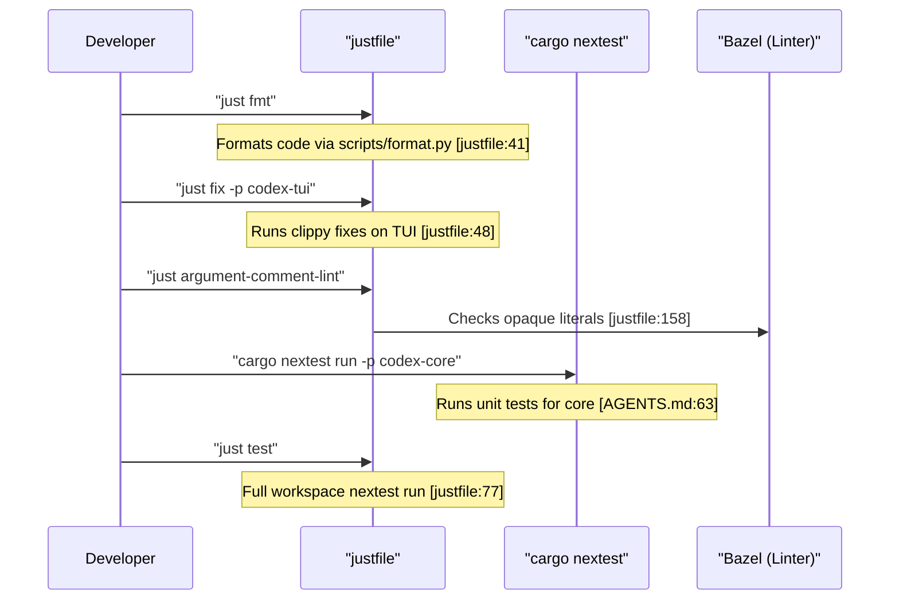

# Development Setup

<details>
<summary>Relevant source files</summary>

The following files were used as context for generating this wiki page:

- [.bazelrc](.bazelrc)
- [.github/scripts/run-bazel-ci.sh](.github/scripts/run-bazel-ci.sh)
- [.github/scripts/run-bazel-query-ci.sh](.github/scripts/run-bazel-query-ci.sh)
- [.github/scripts/run_bazel_with_buildbuddy.py](.github/scripts/run_bazel_with_buildbuddy.py)
- [.github/scripts/rusty_v8_bazel.py](.github/scripts/rusty_v8_bazel.py)
- [.github/scripts/test_run_bazel_with_buildbuddy.py](.github/scripts/test_run_bazel_with_buildbuddy.py)
- [.github/scripts/test_rusty_v8_bazel.py](.github/scripts/test_rusty_v8_bazel.py)
- [.github/workflows/bazel.yml](.github/workflows/bazel.yml)
- [.github/workflows/rusty-v8-release.yml](.github/workflows/rusty-v8-release.yml)
- [.github/workflows/v8-canary.yml](.github/workflows/v8-canary.yml)
- [.gitignore](.gitignore)
- [AGENTS.md](AGENTS.md)
- [CHANGELOG.md](CHANGELOG.md)
- [README.md](README.md)
- [cliff.toml](cliff.toml)
- [codex-cli/package.json](codex-cli/package.json)
- [codex-rs/default.nix](codex-rs/default.nix)
- [codex-rs/docs/bazel.md](codex-rs/docs/bazel.md)
- [codex-rs/responses-api-proxy/npm/package.json](codex-rs/responses-api-proxy/npm/package.json)
- [docs/authentication.md](docs/authentication.md)
- [docs/contributing.md](docs/contributing.md)
- [docs/install.md](docs/install.md)
- [flake.lock](flake.lock)
- [flake.nix](flake.nix)
- [justfile](justfile)
- [package.json](package.json)
- [pnpm-lock.yaml](pnpm-lock.yaml)
- [pnpm-workspace.yaml](pnpm-workspace.yaml)
- [scripts/list-bazel-clippy-targets.sh](scripts/list-bazel-clippy-targets.sh)
- [sdk/typescript/jest.config.cjs](sdk/typescript/jest.config.cjs)
- [sdk/typescript/package.json](sdk/typescript/package.json)
- [sdk/typescript/tsconfig.json](sdk/typescript/tsconfig.json)

</details>


## Purpose and Scope

This page documents the development environment setup for the Codex codebase. It covers toolchain requirements, workspace organization, build configuration, development workflows (formatting, linting, fixing), and schema generation. It specifically details the use of the `justfile`, `rust-toolchain.toml`, Nix flakes, and devcontainer configurations (including contributor and secure customer profiles).

---

## Prerequisites and Toolchain

The Codex project is a Rust-based monorepo that requires a modern Rust toolchain and platform-specific build dependencies.

### Rust Toolchain

The workspace is configured to use specific versions of Rust to ensure consistency across development environments. The active toolchain is managed via `rustup` [justfile:55-56](). The project uses Rust version `1.95.0` as specified in the CI workflows [.github/workflows/rusty-v8-release.yml:175-177]().

| Component | Purpose |
|-----------|---------|
| **Components** | `clippy`, `rustfmt`, and `llvm-tools-preview` are essential for linting and formatting. |
| **Cargo Tools** | `just`, `rg` (ripgrep), and `cargo-insta` must be installed before running repository instructions [AGENTS.md:7](). |

### System Dependencies

The build system relies on several native libraries and tools.

| Requirement | Details | Purpose |
|-------------|---------|---------|
| **Just** | `cargo install just` | Command runner for development tasks defined in the root `justfile` [justfile:1-179](). |
| **Pnpm** | `pnpm` (>= 10.33.0) [package.json:32-35]() | Manages Node.js dependencies for the CLI and SDKs [pnpm-lock.yaml:1-21](). |
| **Nextest** | `cargo install cargo-nextest` | Optimized test runner used by `just test` [justfile:73-78](). |
| **Bazel** | `bazel` [justfile:100-111]() | Used for hermetic builds, release binaries, and custom linting tasks [justfile:138-139](). |
| **Python** | `python3` [justfile:8]() | Used for formatting scripts and GitHub Action utilities [justfile:41-45](). |

### Reproducible Environments

- **Nix**: The project includes a `flake.nix` and `codex-rs/default.nix` to provide a reproducible development shell.
- **Devcontainer**: Configuration (located in `.devcontainer/`) provides standardized environments for contributors and secure customer profiles.
- **Node.js**: The project requires Node.js >= 22 [package.json:32]().

**Sources:** [AGENTS.md:7](), [justfile:1-179](), [package.json:32-35](), [pnpm-lock.yaml:1-21](), [.github/workflows/rusty-v8-release.yml:175-177]()

---

## Workspace Structure and Build Organization

The Codex codebase is organized as a monorepo containing a Cargo workspace for Rust code and several pnpm-managed packages for TypeScript/JavaScript components.

### Key Workspace Members

- **`codex-core`**: The primary agent engine crate [AGENTS.md:5, 33]().
- **`codex-tui`**: Implementing the Terminal User Interface [AGENTS.md:51-58, 63]().
- **`codex-cli`**: The main entry point package for the CLI [codex-cli/package.json:1-7]().
- **`codex-mcp-server`**: Implementation of Codex as an MCP server [justfile:140-141]().
- **`codex-state`**: Manages the SQLite database and logs [justfile:171-176]().

### Development Mapping (NL Space to Code Entity Space)

The following diagram maps high-level development concepts to the specific code entities that implement or configure them.

**Setup and Configuration Mapping**
```mermaid
graph TD
    subgraph "NaturalLanguageSpace"
        "DevEnvironment"["Dev Environment"]
        "BuildPipeline"["Build Pipeline"]
        "DependencyLocking"["Dependency Locking"]
        "LintingRules"["Linting Rules"]
        "SchemaGeneration"["Schema Generation"]
    end

    subgraph "CodeEntitySpace"
        "flake_nix"["flake.nix"]
        "default_nix"["codex-rs/default.nix"]
        "justfile_entity"["justfile"]
        "pnpm_lock"["pnpm-lock.yaml"]
        "agents_md"["AGENTS.md"]
        "config_schema_gen"["codex-write-config-schema"]
    end

    "DevEnvironment" --> "flake_nix"
    "DevEnvironment" --> "justfile_entity"
    "BuildPipeline" --> "default_nix"
    "BuildPipeline" --> "justfile_entity"
    "DependencyLocking" --> "pnpm_lock"
    "LintingRules" --> "agents_md"
    "SchemaGeneration" --> "config_schema_gen"

    "justfile_entity" -- "invokes" --> "config_schema_gen"
    "justfile_entity" -- "orchestrates" --> "default_nix"
    "flake_nix" -- "provides" --> "default_nix"
```

**Sources:** [AGENTS.md:1-58](), [justfile:1-179](), [pnpm-lock.yaml:1-20]()

---

## Development Workflows

The project uses `just` (invoking the `justfile` in the repository root) to standardize common development tasks.

### Core Development Commands

| Task | Command | Description |
|------|---------|-------------|
| **Formatting** | `just fmt` [justfile:40]() | Runs the `scripts/format.py` script to format Rust, Python, and Justfiles [justfile:41](). |
| **Linting/Fixing** | `just fix -p <project>` [justfile:47]() | Runs `cargo clippy --fix`. Scoping with `-p` is preferred to avoid slow workspace-wide builds [AGENTS.md:66](). |
| **Testing** | `just test` [justfile:77]() | Runs `cargo nextest run` with an 8 MiB stack size [justfile:7, 78](). |
| **Schema Gen** | `just write-config-schema` [justfile:144]() | Updates `codex-rs/core/config.schema.json` via `codex-write-config-schema` [justfile:145](), [AGENTS.md:33](). |
| **Protocol Schema** | `just write-app-server-schema` [justfile:148]() | Regenerates app-server protocol schema fixtures [justfile:149](). |
| **Hooks Schema** | `just write-hooks-schema` [justfile:152]() | Regenerates hooks schema fixtures [justfile:153](). |
| **Custom Lint** | `just argument-comment-lint` [justfile:158]() | Runs the Bazel-powered lint for opaque literal arguments [justfile:160](). |

### Dependency Management

When Rust dependencies are modified:
1. Run `just bazel-lock-update` to refresh `MODULE.bazel.lock` [justfile:111-112](), [AGENTS.md:36-37]().
2. Run `just bazel-lock-check` to verify consistency before CI [justfile:116-121](), [AGENTS.md:38-39]().

For Node.js dependencies, use `pnpm` in the relevant directories.

**Sources:** [justfile:40-179](), [AGENTS.md:33-39, 66]()

---

## Code Conventions and Formatting

### General Rules

- **Variable Inlining**: Always inline variables into `{}` in `format!` macros [AGENTS.md:6, 12]().
- **Clippy Defaults**: Follow `collapsible_if` and `redundant_closure_for_method_calls` [AGENTS.md:11, 13]().
- **Argument Comment Lint**: Use `/*param_name*/` comments before opaque literals like `None`, `true`, `false`, or numeric literals [AGENTS.md:15-18]().
- **Module Size**: Target modules under 500 lines of code; extract new modules if a file exceeds 800 lines [AGENTS.md:47-50]().
- **Trait Definition**: Newly added traits should include doc comments. Prefer native RPITIT methods with `Send` bounds over `#[async_trait]` [AGENTS.md:21-25]().

### Integration and Testing Flow

Developers should follow a specific sequence when finalizing changes to ensure stability and adherence to sandbox constraints.

**Development Command Flow**


### Sandbox Restrictions in Development

When developing or testing tools, be aware of environment-based sandbox flags:
- `CODEX_SANDBOX_NETWORK_DISABLED=1`: Set automatically when using the `shell` tool [AGENTS.md:9]().
- `CODEX_SANDBOX=seatbelt`: Set when spawning processes via `/usr/bin/sandbox-exec` on macOS [AGENTS.md:10]().
- Tests check these variables to early-exit if the environment doesn't support the required permissions [AGENTS.md:9-10]().

**Sources:** [AGENTS.md:8-10, 60-66](), [justfile:40-179](), [AGENTS.md:21-25]()
