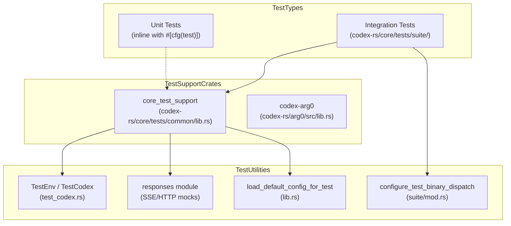
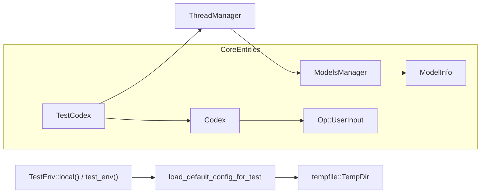

# Testing Infrastructure

Relevant source files

The following files were used as context for generating this wiki page:

- [codex-rs/core/src/context_manager/updates.rs](codex-rs/core/src/context_manager/updates.rs)
- [codex-rs/core/tests/common/Cargo.toml](codex-rs/core/tests/common/Cargo.toml)
- [codex-rs/core/tests/common/lib.rs](codex-rs/core/tests/common/lib.rs)
- [codex-rs/core/tests/common/test_codex.rs](codex-rs/core/tests/common/test_codex.rs)
- [codex-rs/core/tests/suite/apply_patch_cli.rs](codex-rs/core/tests/suite/apply_patch_cli.rs)
- [codex-rs/core/tests/suite/collaboration_instructions.rs](codex-rs/core/tests/suite/collaboration_instructions.rs)
- [codex-rs/core/tests/suite/fork_thread.rs](codex-rs/core/tests/suite/fork_thread.rs)
- [codex-rs/core/tests/suite/mod.rs](codex-rs/core/tests/suite/mod.rs)
- [codex-rs/core/tests/suite/override_updates.rs](codex-rs/core/tests/suite/override_updates.rs)
- [codex-rs/core/tests/suite/permissions_messages.rs](codex-rs/core/tests/suite/permissions_messages.rs)
- [codex-rs/core/tests/suite/prompt_caching.rs](codex-rs/core/tests/suite/prompt_caching.rs)
- [codex-rs/core/tests/suite/shell_serialization.rs](codex-rs/core/tests/suite/shell_serialization.rs)
- [codex-rs/core/tests/suite/stream_error_allows_next_turn.rs](codex-rs/core/tests/suite/stream_error_allows_next_turn.rs)
- [codex-rs/core/tests/suite/stream_no_completed.rs](codex-rs/core/tests/suite/stream_no_completed.rs)
- [codex-rs/core/tests/suite/tool_harness.rs](codex-rs/core/tests/suite/tool_harness.rs)
- [codex-rs/core/tests/suite/tools.rs](codex-rs/core/tests/suite/tools.rs)
- [codex-rs/mcp-server/tests/common/Cargo.toml](codex-rs/mcp-server/tests/common/Cargo.toml)
- [codex-rs/mcp-server/tests/common/lib.rs](codex-rs/mcp-server/tests/common/lib.rs)

This document describes the testing infrastructure for the Codex Rust codebase, including test organization, key testing tools, support utilities, and patterns for writing tests. For development environment setup, see [9.1](). For code organization patterns and conventions, see [9.3]().

## Overview

The Codex test infrastructure is built around **cargo nextest** as the primary test runner, with **snapshot testing** (via `insta`) for output validation and **HTTP mocking** (via `wiremock`) for integration tests. Tests are organized into unit tests (inline with source files), integration tests (in `tests/` directories), and test support crates that provide reusable fixtures, mocks, and utilities.

The testing approach emphasizes:
- **Isolation**: Tests use temporary directories and mock servers to avoid external dependencies.
- **Reproducibility**: Snapshot testing captures expected outputs for regression detection.
- **Maintainability**: Shared test utilities reduce boilerplate across test suites.
- **Binary Dispatch**: A custom "arg0" mechanism allows test binaries to simulate the full Codex CLI behavior for sub-process testing.

Sources: [codex-rs/core/tests/suite/mod.rs:1-28](), [codex-rs/core/tests/common/test_codex.rs:1-62]()

## Test Organization

### Natural Language to Code Entity Mapping: Test Suite
The following diagram maps high-level testing concepts to the specific Rust modules and structs that implement them.

Title: Test Infrastructure Mapping

Sources: [codex-rs/core/tests/common/test_codex.rs:42-61](), [codex-rs/core/tests/suite/mod.rs:10-28](), [codex-rs/core/tests/common/lib.rs:171-193]()

### Integration Tests
Integration tests are aggregated in `codex-rs/core/tests/suite/mod.rs` [codex-rs/core/tests/suite/mod.rs:1-131](). These exercise full system flows, including model interaction and tool execution. The suite covers specialized behaviors such as:
* **`apply_patch_cli`**: Validates the `apply_patch` tool, its safety checks, and behavior across local and remote environments [codex-rs/core/tests/suite/apply_patch_cli.rs:68-126]().
* **`prompt_caching`**: Ensures that tool definitions and instructions remain consistent across sequential turns to optimize model prefix caching [codex-rs/core/tests/suite/prompt_caching.rs:104-181]().
* **`shell_serialization`**: Ensures that shell outputs are correctly formatted as plain text and include metadata like exit codes and wall time [codex-rs/core/tests/suite/shell_serialization.rs:61-152]().
* **`stream_no_completed`**: Verifies that the agent correctly retries when an SSE stream terminates prematurely without a `response.completed` event [codex-rs/core/tests/suite/stream_no_completed.rs:24-102]().
* **`permissions_messages`**: Confirms that system permission instructions are injected into the prompt history only when configuration or profiles change [codex-rs/core/tests/suite/permissions_messages.rs:37-138]().

### Test Support Crates
The `core_test_support` module is the primary provider of shared infrastructure. It includes:
* **`TestEnv`**: Manages the lifecycle of local or remote execution environments. It handles Docker-based remote testing by tracking container names and cleaning up temporary paths on `drop` [codex-rs/core/tests/common/test_codex.rs:86-156]().
* **`TestCodex`**: A harness that bundles a `Codex` instance with its `Config`, `ThreadManager`, and a mock server for orchestrated testing [codex-rs/core/tests/common/test_codex.rs:27-30]().
* **`TestBinaryDispatchGuard`**: Configured via `#[ctor]`, it allows the test binary to simulate specific Codex sub-commands [codex-rs/core/tests/suite/mod.rs:14-28]().

Sources: [codex-rs/core/tests/common/test_codex.rs:72-142](), [codex-rs/core/tests/suite/mod.rs:14-28](), [codex-rs/core/tests/common/lib.rs:185-207]()

## Key Testing Dependencies

### cargo nextest
The project uses `cargo nextest` for parallelized test execution. It handles the large suite of integration tests efficiently, providing better isolation than standard `cargo test`.

### Snapshot Testing (insta)
The `insta` crate is used for snapshot testing. The infrastructure includes a `configure_insta_workspace_root_for_snapshot_tests` constructor to ensure snapshots are correctly located relative to the workspace root [codex-rs/core/tests/common/lib.rs:49-67]().

### HTTP Mocking (wiremock)
`wiremock` is the standard for mocking model provider APIs. It is used to simulate OpenAI-compatible endpoints, including complex SSE streams for streaming responses. The `responses` module provides helpers like `ev_response_created` and `ev_completed` to build these streams [codex-rs/core/tests/common/test_codex.rs:46-63](), [codex-rs/core/tests/suite/prompt_caching.rs:21-25]().

Sources: [codex-rs/core/tests/common/lib.rs:49-67](), [codex-rs/core/tests/common/test_codex.rs:46-63]()

## Test Support Infrastructure

### Test Environment Initialization
The `TestEnv` struct abstracts whether a test is running on the local machine or inside a remote Docker container.

Title: Test Environment Initialization

Sources: [codex-rs/core/tests/common/test_codex.rs:86-156](), [codex-rs/core/tests/common/lib.rs:185-207](), [codex-rs/core/tests/suite/prompt_caching.rs:120-153]()

### Binary Dispatch and Aliases
Because Codex relies on self-invocation (e.g., calling `apply_patch` as a sub-process), the test suite uses a `#[ctor]` in `mod.rs` to configure `TestBinaryDispatchGuard`. This allows the test binary itself to respond to flags like `CODEX_CORE_APPLY_PATCH_ARG1` or `CODEX_LINUX_SANDBOX_ARG0`, simulating the behavior of the real `codex` binary [codex-rs/core/tests/suite/mod.rs:14-28]().

### Arg0 Dispatch
The `codex-arg0` crate provides `arg0_dispatch`, which is initialized at the start of the test process via a `#[ctor]` to route execution to internal helpers based on the binary name [codex-rs/core/tests/common/lib.rs:44-47]().

Sources: [codex-rs/core/tests/suite/mod.rs:14-28](), [codex-rs/core/tests/common/lib.rs:44-47]()

## Common Testing Patterns

### Mocking Tool Invocations
Tests use `mount_sse_sequence` or `mount_sse_once` to simulate the model calling specific tools.
- `ev_function_call`: Generates a tool call event (e.g., `shell_command`) [codex-rs/core/tests/suite/tool_harness.rs:88-93]().
- `ev_custom_tool_call`: Simulates a call to a custom or environment-specific tool like `apply_patch` [codex-rs/core/tests/suite/apply_patch_cli.rs:6-7]().
- `call_output`: A helper to extract and verify the output returned to the model after a tool execution [codex-rs/core/tests/suite/tool_harness.rs:32-48]().

### Deterministic State
To ensure test reliability, global toggles are set in a `#[ctor]` block:
- `set_thread_manager_test_mode(true)`: Enables internal testing behaviors in the core.
- `set_deterministic_process_ids(true)`: Ensures that process management logic produces predictable IDs across test runs [codex-rs/core/tests/common/lib.rs:38-42]().

### Context and Instruction Verification
Integration tests frequently verify that the correct system instructions and context fragments are being sent to the model:
- `assert_env_context_fragment`: Checks for mandatory tags like `<current_date>` and `<timezone>` in the environment context [codex-rs/core/tests/suite/prompt_caching.rs:62-79]().
- `permissions_texts`: Filters model requests to verify the presence and uniqueness of `<permissions instructions>` [codex-rs/core/tests/suite/permissions_messages.rs:28-34]().

### Prompt Caching Stability
Tests like `prompt_tools_are_consistent_across_requests` verify that the order and content of tools and instructions do not change between turns unless explicitly modified, ensuring high cache hit rates for model providers [codex-rs/core/tests/suite/prompt_caching.rs:104-181]().

Sources: [codex-rs/core/tests/suite/tool_harness.rs:32-48](), [codex-rs/core/tests/common/lib.rs:38-42](), [codex-rs/core/tests/suite/prompt_caching.rs:62-79](), [codex-rs/core/tests/suite/permissions_messages.rs:28-34]()
