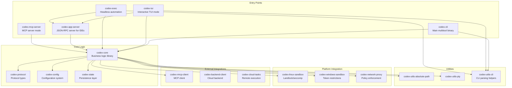
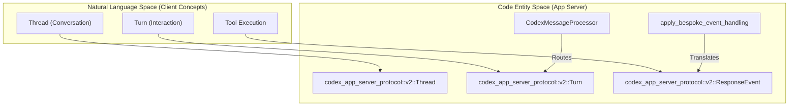
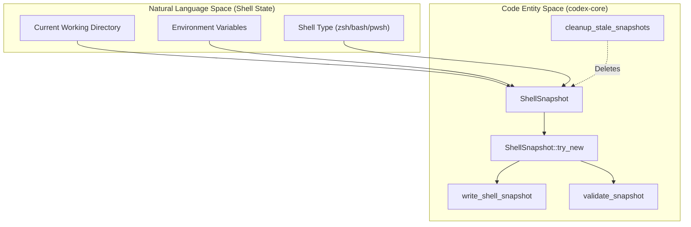

# Code Organization Patterns

Relevant source files

The following files were used as context for generating this wiki page:

- [.bazelrc](.bazelrc)
- [.github/scripts/run-bazel-ci.sh](.github/scripts/run-bazel-ci.sh)
- [.github/scripts/run-bazel-query-ci.sh](.github/scripts/run-bazel-query-ci.sh)
- [.github/scripts/run_bazel_with_buildbuddy.py](.github/scripts/run_bazel_with_buildbuddy.py)
- [.github/scripts/rusty_v8_bazel.py](.github/scripts/rusty_v8_bazel.py)
- [.github/scripts/test_run_bazel_with_buildbuddy.py](.github/scripts/test_run_bazel_with_buildbuddy.py)
- [.github/scripts/test_rusty_v8_bazel.py](.github/scripts/test_rusty_v8_bazel.py)
- [.github/workflows/Dockerfile.bazel](.github/workflows/Dockerfile.bazel)
- [.github/workflows/bazel.yml](.github/workflows/bazel.yml)
- [.github/workflows/rusty-v8-release.yml](.github/workflows/rusty-v8-release.yml)
- [.github/workflows/v8-canary.yml](.github/workflows/v8-canary.yml)
- [AGENTS.md](AGENTS.md)
- [BUILD.bazel](BUILD.bazel)
- [MODULE.bazel](MODULE.bazel)
- [MODULE.bazel.lock](MODULE.bazel.lock)
- [SECURITY.md](SECURITY.md)
- [codex-rs/app-server/BUILD.bazel](codex-rs/app-server/BUILD.bazel)
- [codex-rs/core/BUILD.bazel](codex-rs/core/BUILD.bazel)
- [codex-rs/core/src/shell_snapshot.rs](codex-rs/core/src/shell_snapshot.rs)
- [codex-rs/core/src/shell_snapshot_tests.rs](codex-rs/core/src/shell_snapshot_tests.rs)
- [codex-rs/core/tests/suite/models_etag_responses.rs](codex-rs/core/tests/suite/models_etag_responses.rs)
- [codex-rs/core/tests/suite/shell_snapshot.rs](codex-rs/core/tests/suite/shell_snapshot.rs)
- [codex-rs/docs/bazel.md](codex-rs/docs/bazel.md)
- [codex-rs/keyring-store/Cargo.toml](codex-rs/keyring-store/Cargo.toml)
- [codex-rs/keyring-store/src/lib.rs](codex-rs/keyring-store/src/lib.rs)
- [codex-rs/linux-sandbox/src/proxy_routing.rs](codex-rs/linux-sandbox/src/proxy_routing.rs)
- [codex-rs/mcp-server/BUILD.bazel](codex-rs/mcp-server/BUILD.bazel)
- [codex-rs/process-hardening/Cargo.toml](codex-rs/process-hardening/Cargo.toml)
- [codex-rs/process-hardening/README.md](codex-rs/process-hardening/README.md)
- [codex-rs/process-hardening/src/lib.rs](codex-rs/process-hardening/src/lib.rs)
- [codex-rs/responses-api-proxy/npm/README.md](codex-rs/responses-api-proxy/npm/README.md)
- [codex-rs/responses-api-proxy/npm/bin/codex-responses-api-proxy.js](codex-rs/responses-api-proxy/npm/bin/codex-responses-api-proxy.js)
- [codex-rs/tui/BUILD.bazel](codex-rs/tui/BUILD.bazel)
- [codex-rs/utils/cargo-bin/BUILD.bazel](codex-rs/utils/cargo-bin/BUILD.bazel)
- [defs.bzl](defs.bzl)
- [docs/authentication.md](docs/authentication.md)
- [docs/contributing.md](docs/contributing.md)
- [docs/install.md](docs/install.md)
- [justfile](justfile)
- [patches/BUILD.bazel](patches/BUILD.bazel)
- [patches/rules_rs_build_script_deps_annotation.patch](patches/rules_rs_build_script_deps_annotation.patch)
- [patches/v8_bazel_rules.patch](patches/v8_bazel_rules.patch)
- [patches/v8_module_deps.patch](patches/v8_module_deps.patch)
- [patches/v8_source_portability.patch](patches/v8_source_portability.patch)
- [rbe.bzl](rbe.bzl)
- [scripts/list-bazel-clippy-targets.sh](scripts/list-bazel-clippy-targets.sh)
- [third_party/v8/BUILD.bazel](third_party/v8/BUILD.bazel)
- [third_party/v8/README.md](third_party/v8/README.md)
- [tools/argument-comment-lint/README.md](tools/argument-comment-lint/README.md)
- [tools/argument-comment-lint/lint_aspect.bzl](tools/argument-comment-lint/lint_aspect.bzl)
- [tools/argument-comment-lint/src/bin/argument-comment-lint.rs](tools/argument-comment-lint/src/bin/argument-comment-lint.rs)
- [tools/argument-comment-lint/test_wrapper_common.py](tools/argument-comment-lint/test_wrapper_common.py)
- [tools/argument-comment-lint/wrapper_common.py](tools/argument-comment-lint/wrapper_common.py)
- [workspace_root_test_launcher.bat.tpl](workspace_root_test_launcher.bat.tpl)
- [workspace_root_test_launcher.sh.tpl](workspace_root_test_launcher.sh.tpl)

## Purpose and Scope

This page documents the code organization patterns, conventions, and architectural guidelines used throughout the Codex Rust codebase. It covers workspace structure, crate categorization, module organization, and quality enforcement mechanisms including the **argument-comment-lint** tool and **Bazel** build targets.

Key architectural drivers include the **AGENTS.md** conventions for AI-assisted development, the **app-server protocol v2** for IDE integrations, and strict **Clippy** enforcement at the workspace level.

---

## Workspace Structure and Crate Categorization

The Codex codebase is organized as a Cargo workspace. The workspace root [codex-rs/Cargo.toml:1-395]() (implied by workspace configuration) defines shared dependencies, lints, and build profiles.

### Crate Categories

**Sources:** [AGENTS.md:5-6](), [justfile:14-37](), [codex-rs/core/BUILD.bazel:1-55]()

---

## AGENTS.md Conventions

The `AGENTS.md` file defines critical development patterns and safety rules that must be followed by both human and AI contributors.

### Core Development Rules
*   **Module Size:** Target Rust modules under 500 LoC. If a file exceeds roughly 800 LoC, functionality must be moved to a new module [AGENTS.md:43-47](). Central orchestration modules like `codex-rs/tui/src/app.rs` and `codex-rs/tui/src/chatwidget.rs` are specifically highlighted for this rule [AGENTS.md:48-55]().
*   **Safety Restrictions:** Never modify code related to `CODEX_SANDBOX_NETWORK_DISABLED_ENV_VAR` or `CODEX_SANDBOX_ENV_VAR` as these govern the execution environment security [AGENTS.md:8-10]().
*   **Explicit Arguments:** Use `/*param_name*/` comments before opaque literal arguments (e.g., `None`, `false`, numeric literals) to maintain readability [AGENTS.md:14-18]().
*   **Dependency Management:** Changes to `Cargo.toml` or `Cargo.lock` require running `just bazel-lock-update` from the repo root to refresh `MODULE.bazel.lock` [AGENTS.md:34-35](), [justfile:113-114]().
*   **Resist codex-core Bloat:** Avoid adding new logic to `codex-core` if it can live in a specialized crate [AGENTS.md:66-69]().
*   **Formatting:** Run `just fmt` automatically after changes. It uses `scripts/format.py` which covers Rust, Python SDK code, and Python scripts [justfile:40-41](), [AGENTS.md:58]().
*   **Async Traits:** Discourage `#[async_trait]` and `#[allow(async_fn_in_trait)]`. Prefer native RPITIT trait methods with explicit `Send` bounds [AGENTS.md:22-25]().

**Sources:** [AGENTS.md:1-70](), [justfile:1-179]()

---

## App Server Protocol Patterns

The `codex-app-server` implements a JSON-RPC 2.0 bidirectional protocol.

### Protocol Layering and Data Flow
The protocol ensures that the server can communicate state changes back to the client via bespoke event handling.

**Sources:** [justfile:149-152](), [AGENTS.md:66-70]()

---

## Bazel Build and Linting Infrastructure

Codex uses Bazel alongside Cargo to provide hermetic builds and workspace-wide linting.

### Bazel Build Targets
The `defs.bzl` file provides the `codex_rust_crate` macro and custom test rules for the workspace [defs.bzl:167-186]().

*   **Multiplatform Binaries:** Bazel supports building across 10 platform triples including Linux (GNU/MUSL), macOS, and Windows (MSVC/GNULLVM) [MODULE.bazel:178-192]().
*   **Toolchains:** Bazel registers hermetic LLVM toolchains and specific Rust versions (e.g., `nightly/2025-09-18`) [MODULE.bazel:27](), [MODULE.bazel:127-131]().
*   **Windows Linking:** Specific flags are applied to match Cargo's linker behavior on Windows, including an 8 MiB stack reserve via `-Wl,--stack,8388608` or `/STACK:8388608` [defs.bzl:8-22]().
*   **Compile Data:** Bazel requires explicit `compile_data` for files accessed via `include_str!` or `include_bytes!` [AGENTS.md:38-41](), [codex-rs/core/BUILD.bazel:6-14]().

### argument-comment-lint Tool
This custom tool enforces the convention of commenting opaque literal arguments [AGENTS.md:15-19]().

*   **Local Execution:** Run via `just argument-comment-lint` [justfile:159-166]().
*   **Bazel Integration:** Implemented as a Bazel config that runs across specified targets using the `argument_comment_lint_crates` extension [MODULE.bazel:194-209](), [.bazelrc:137-140]().
*   **CI Enforcement:** The `bazel-test` target excludes these from standard test runs via `--test_tag_filters=-argument-comment-lint` [justfile:125-126]().

### Bazel Clippy
While Cargo handles local development, Bazel provides a unified Clippy check across the workspace.
*   **Config:** Uses a shared `clippy.toml` [.bazelrc:116]().
*   **Execution:** `just bazel-clippy` triggers the `@rules_rust//rust:defs.bzl%rust_clippy_aspect` [.bazelrc:114-115](), [justfile:130-131]().

**Sources:** [MODULE.bazel:1-212](), [defs.bzl:1-186](), [.bazelrc:1-140](), [justfile:100-170](), [codex-rs/core/BUILD.bazel:1-55]()

---

## Code Review and Testing Practices

### Testing Patterns
*   **Nextest:** Prefer `just test` (which uses `cargo nextest`) for local runs as it is faster than standard `cargo test` [justfile:77-78](), [AGENTS.md:60]().
*   **Equality Comparison:** When writing tests, prefer comparing entire objects over individual fields [AGENTS.md:28]().
*   **Snapshots:** Extensive use of `cargo-insta` for snapshot testing [AGENTS.md:7]().
*   **Workspace Root Tests:** Custom `workspace_root_test` rule in Bazel ensures tests run with correct directory context [defs.bzl:153-186]().

### Shell Snapshot System
A specialized pattern for capturing and restoring shell states during tool execution.
*   **Implementation:** Managed via `ShellSnapshot` struct [codex-rs/core/src/shell_snapshot.rs:27-31]().
*   **Lifecycle:** Snapshots are written to a temporary path, validated, and then finalized via rename [codex-rs/core/src/shell_snapshot.rs:138-178]().
*   **Cleanup:** Stale snapshots (older than 3 days) are cleaned up asynchronously [codex-rs/core/src/shell_snapshot.rs:34-35](), [codex-rs/core/src/shell_snapshot.rs:145-151]().

**Sources:** [AGENTS.md:58-63](), [codex-rs/core/src/shell_snapshot.rs:1-210](), [defs.bzl:153-186]()

---

## Summary of Patterns

1.  **Crate Prefixes:** All internal crates use the `codex-` prefix [AGENTS.md:5]().
2.  **Bazel Parity:** Maintain parity between `Cargo.toml` and `BUILD.bazel`. Use `just bazel-lock-update` after dependency changes [AGENTS.md:34-35]().
3.  **Argument Comments:** Mandatory `/*param_name*/` for literals like `None` or `true` [AGENTS.md:15-18]().
4.  **Module Limits:** Strict 500-800 LoC limits per module to prevent monolithic files [AGENTS.md:43-47]().
5.  **Config Schema:** Update `config.schema.json` via `just write-config-schema` whenever `ConfigToml` changes [justfile:146-147](), [AGENTS.md:31]().

**Sources:** [AGENTS.md:1-85](), [justfile:1-179](), [.bazelrc:1-140]()
