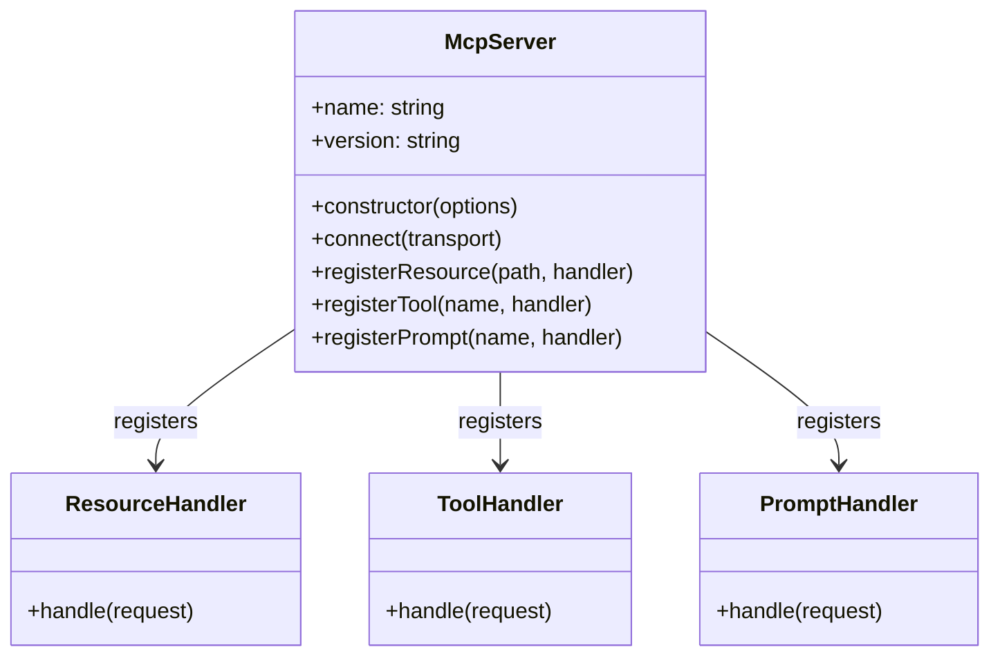
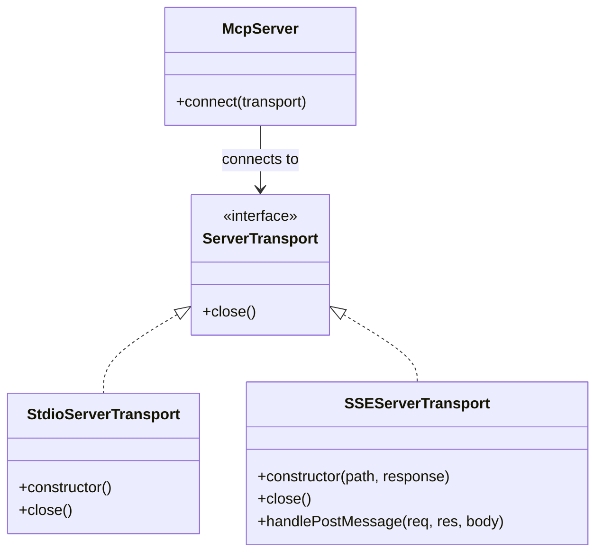
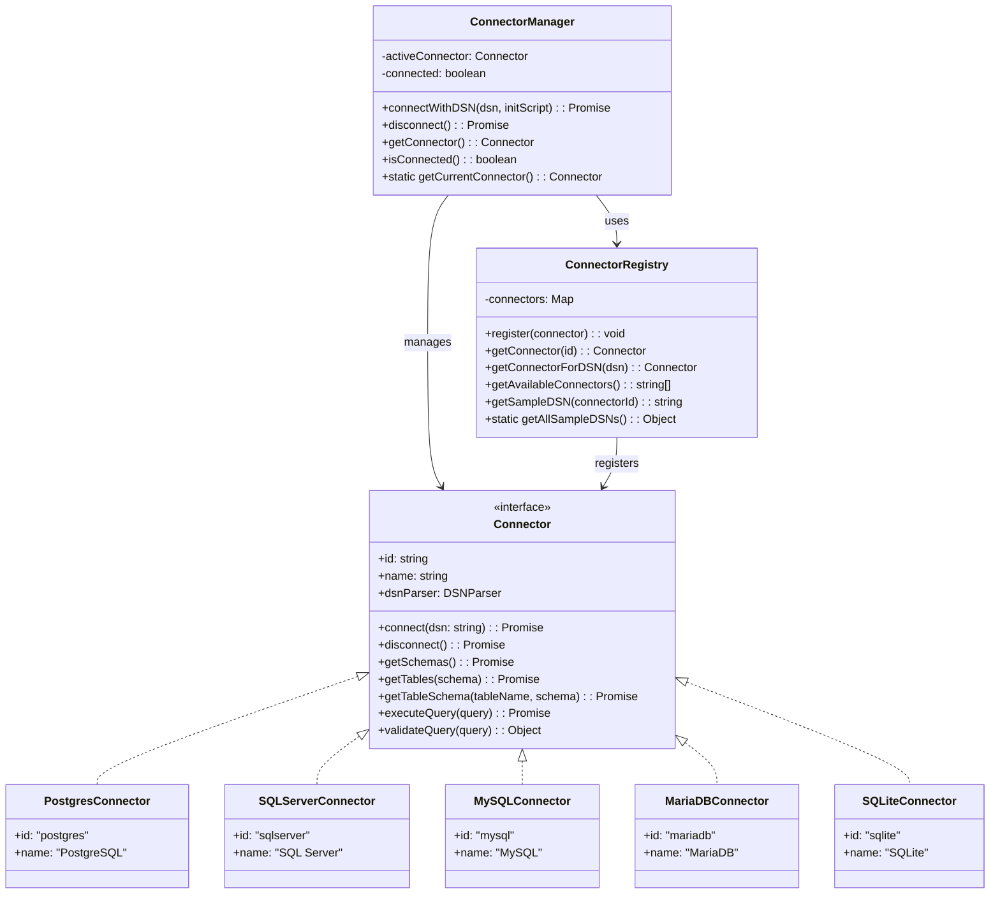
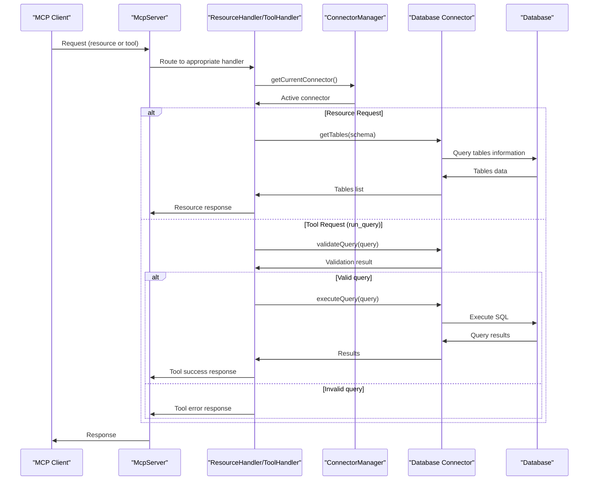
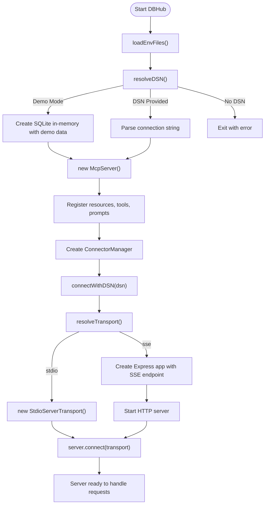
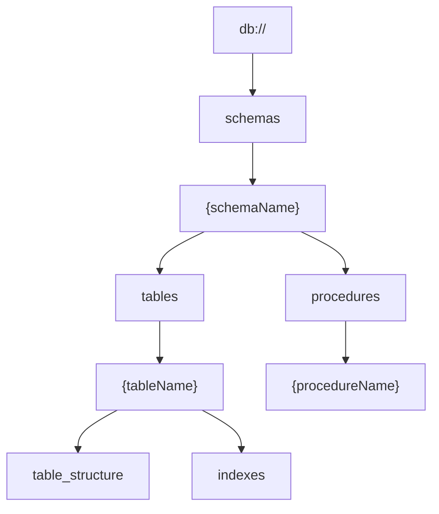
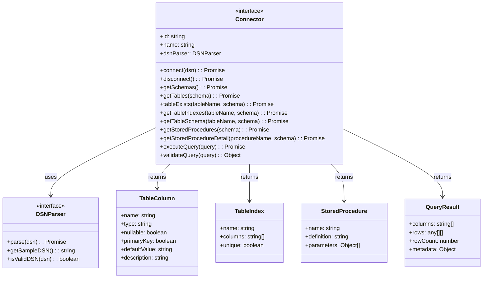

# Architecture Overview

<details>
<summary>Relevant source files</summary>

The following files were used as context for generating this wiki page:

- [README.md](README.md)
- [src/config/env.ts](src/config/env.ts)
- [src/index.ts](src/index.ts)
- [src/server.ts](src/server.ts)

</details>


This page provides a comprehensive overview of the DBHub system architecture, explaining the key components, their interactions, and the overall system design. DBHub is a universal database gateway that implements the Model Context Protocol (MCP) server interface, enabling AI assistants and other MCP-compatible clients to interact with various database systems through a unified interface.

For installation instructions, see [Installation and Quick Start](#1.1). For details about specific components, refer to the [Core Components](#2) section.

## System Architecture Overview

DBHub follows a modular architecture that separates concerns across several layers. At its core, DBHub acts as a bridge between MCP clients and database systems, providing a standardized interface for database interactions.

```mermaid
graph TD
    subgraph "MCP Clients"
        Claude["Claude Desktop"]
        Cursor["Cursor"]
        Other["Other MCP Clients"]
    end
    
    subgraph "DBHub System"
        Server["McpServer"]
        
        subgraph "Transport Layer"
            STDIO["StdioServerTransport"]
            SSE["SSEServerTransport"]
        end
        
        subgraph "Core Components"
            Resources["ResourceHandlers"]
            Tools["ToolHandlers"]
            Prompts["PromptHandlers"]
        end
        
        subgraph "Connector System"
            CM["ConnectorManager"]
            CR["ConnectorRegistry"]
            
            subgraph "Database Connectors"
                PG["PostgresConnector"]
                MSSQL["SQLServerConnector"]
                MySQL["MySQLConnector"]
                MariaDB["MariaDBConnector"]
                SQLite["SQLiteConnector"]
            end
        end
        
        subgraph "Configuration"
            EnvConfig["Environment\nConfiguration"]
            DSNParser["DSN Parsers"]
            DemoLoader["Demo Data Loader"]
        end
    end
    
    subgraph "Databases"
        PostgreSQL[(PostgreSQL)]
        SQLServer[(SQL Server)]
        MySQLDB[(MySQL)]
        MariaDBDB[(MariaDB)]
        SQLiteDB[(SQLite)]
    end
    
    Claude --> |STDIO| STDIO
    Cursor --> |STDIO/SSE| Server
    Other --> |STDIO/SSE| Server
    
    STDIO --> Server
    SSE --> Server
    
    Server --> Resources
    Server --> Tools
    Server --> Prompts
    
    Resources --> CM
    Tools --> CM
    Prompts --> CM
    
    CM --> CR
    CR --> PG & MSSQL & MySQL & MariaDB & SQLite
    
    PG --> PostgreSQL
    MSSQL --> SQLServer
    MySQL --> MySQLDB
    MariaDB --> MariaDBDB
    SQLite --> SQLiteDB
    
    EnvConfig --> Server
    DSNParser --> Database Connectors
    DemoLoader --> SQLite
```

Sources: [README.md:9-27](), [src/index.ts:1-20](), [src/server.ts:1-27]()

## Core Components

DBHub consists of several core components that work together to provide database connectivity to MCP clients:

1. **MCP Server**: The central component that implements the Model Context Protocol, handling requests from clients and routing them to appropriate handlers.
2. **Transport Layer**: Supports different communication methods for clients to connect to the server.
3. **Connector System**: Manages database connections and provides a unified interface for different database systems.
4. **Resources, Tools, and Prompts**: Interface elements exposed to clients for database exploration and interaction.
5. **Configuration System**: Handles environment variables, command-line arguments, and configuration files.

### MCP Server Component

The MCP Server is the central component of DBHub, implemented using the Model Context Protocol SDK. It registers resource handlers, tool handlers, and prompt handlers that provide the functionality exposed to clients.



Sources: [src/server.ts:78-87]()

### Transport Layer

DBHub supports two transport mechanisms for communication with clients:

1. **STDIO Transport**: Used for direct integration with tools like Claude Desktop, communicating via standard input/output streams.
2. **SSE Transport**: Server-Sent Events for browser and network clients, exposing an HTTP endpoint.



Sources: [src/server.ts:104-153]()

### Connector System

The Connector System is responsible for managing database connections and providing a unified interface for different database types. It consists of three main components:

1. **Connector Interface**: Defines the common interface for all database connectors.
2. **Connector Registry**: Maintains a registry of available connectors.
3. **Connector Manager**: Manages the active connector instance.



Sources: [src/server.ts:89-101](), [src/index.ts:3-8]()

### Resources, Tools, and Prompts

DBHub exposes three types of interfaces to clients:

1. **Resources**: Database objects like schemas, tables, and indexes accessed via URL-like paths.
2. **Tools**: Functions for executing queries and listing available connectors.
3. **Prompts**: AI-driven features for SQL generation and database explanation.

The following table summarizes the available interfaces:

| Interface Type | Examples | Purpose |
|----------------|----------|---------|
| Resources | `db://schemas`, `db://schemas/{schemaName}/tables` | Browse database structure |
| Tools | `run_query`, `list_connectors` | Execute operations |
| Prompts | `generate_sql`, `explain_db` | AI assistance features |

Sources: [README.md:37-60](), [src/server.ts:85-87]()

## Request Flow

The following diagram illustrates how requests flow through the DBHub system, from client to database and back:



Sources: [src/server.ts:78-101]()

## Initialization and Configuration

When DBHub starts, it follows a specific initialization sequence to set up the server and establish database connections:



Sources: [src/server.ts:50-153](), [src/config/env.ts:87-118](), [src/config/env.ts:124-142]()

### Configuration Options

DBHub can be configured through various mechanisms, in order of priority:

1. **Command-line arguments**: Highest priority, provided when launching the application
2. **Environment variables**: Set in the system environment
3. **Environment files**: `.env.local` (for development) or `.env` (for production)

The key configuration options include:

| Option | Description | Default |
|--------|-------------|---------|
| `--demo` | Run in demo mode with sample employee database | `false` |
| `--dsn` | Database connection string (required if not in demo mode) | None |
| `--transport` | Transport mode: `stdio` or `sse` | `stdio` |
| `--port` | HTTP server port (only applicable with `sse` transport) | `8080` |

Sources: [README.md:61-100](), [src/config/env.ts:10-36](), [src/config/env.ts:151-169]()

## Database Resource Hierarchy

DBHub organizes database resources in a hierarchical structure, accessible via URL-like paths:



This resource hierarchy provides a RESTful API for exploring database structure, allowing clients to discover schemas, tables, procedures, and other database objects in a consistent way across different database systems.

Sources: [README.md:37-47]()

## Connector Implementation

Each database connector implements the common `Connector` interface, providing specialized implementations for its specific database system:



Sources: [README.md:185-196]()

## Transport Mechanisms

DBHub supports two transport mechanisms for communication with clients:

1. **STDIO Transport**: Uses standard input/output streams for communication. This is primarily used by desktop applications like Claude Desktop that can spawn child processes.

2. **SSE Transport**: Uses Server-Sent Events over HTTP, allowing browser-based clients and network clients to connect to DBHub. This mode exposes an HTTP server with a `/sse` endpoint for connections and a `/message` endpoint for messages.

The transport mechanism is selected during server initialization based on configuration.

Sources: [src/server.ts:112-153](), [README.md:102-151]()
