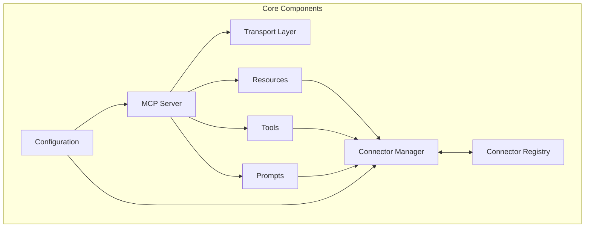
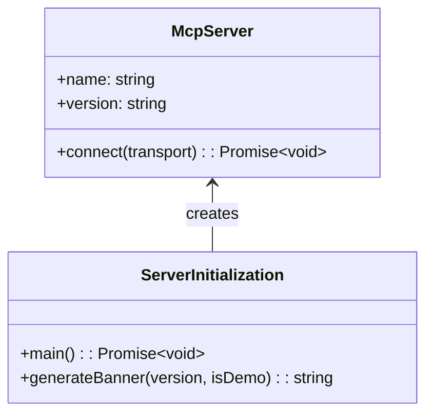
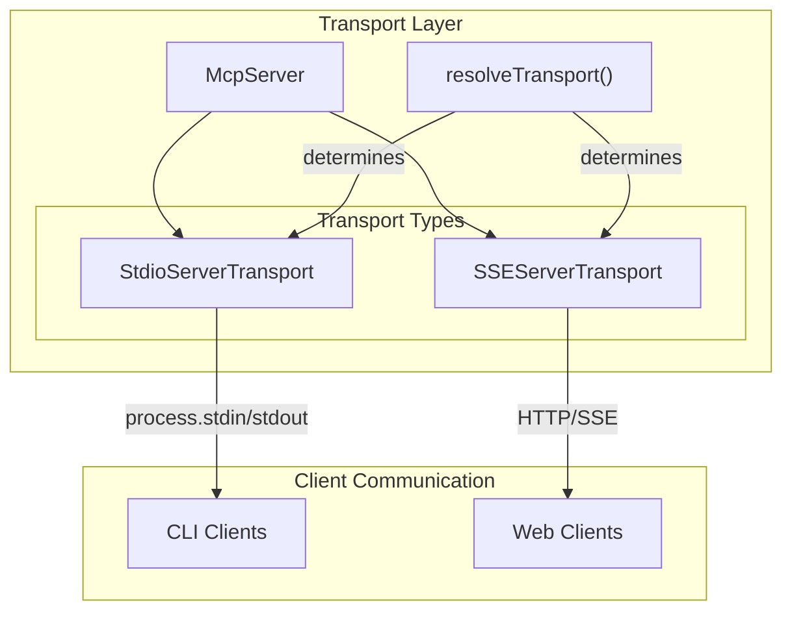
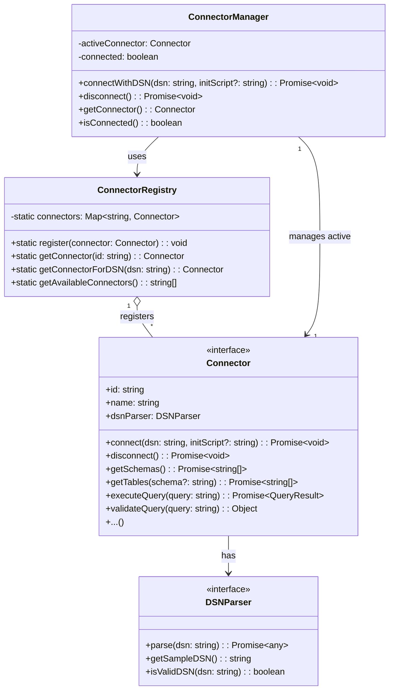
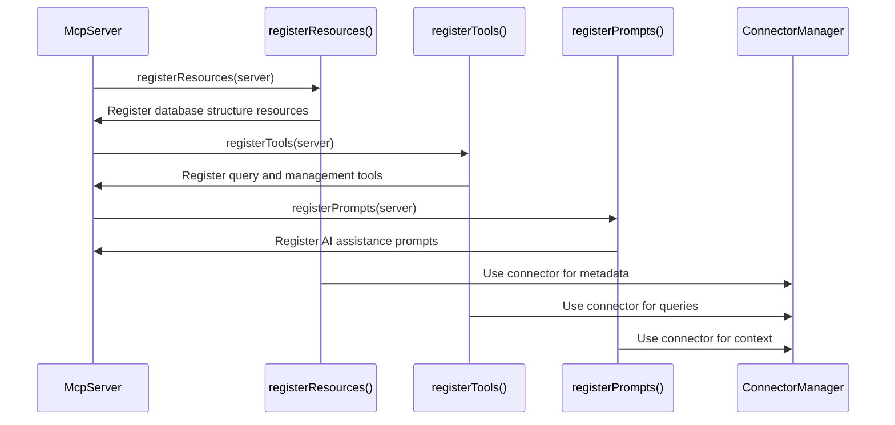
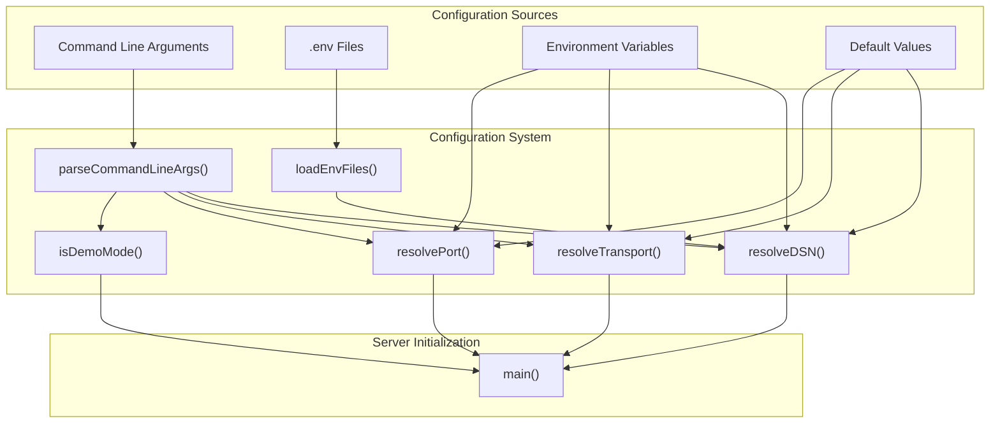
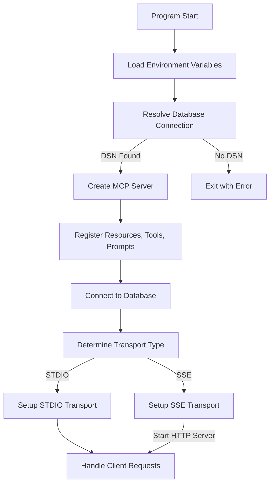
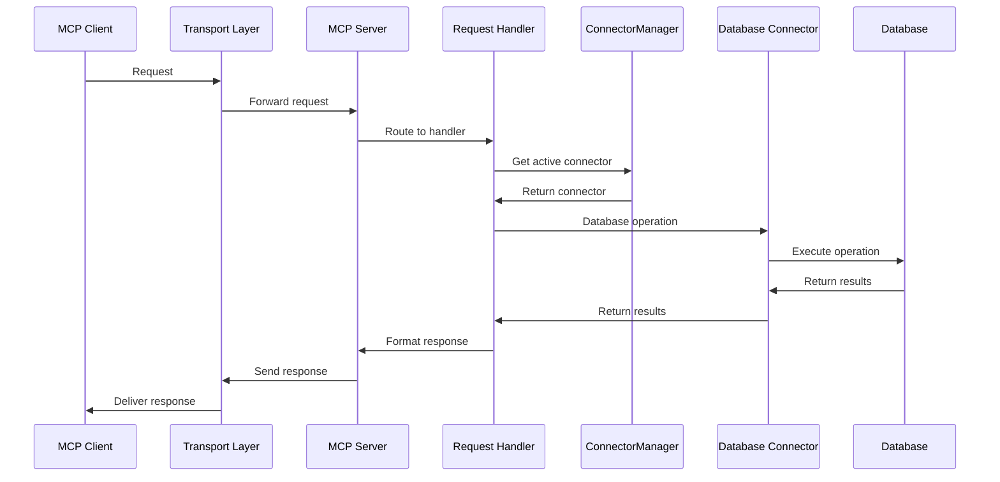

# Core Components

Relevant source files

The following files were used as context for generating this wiki page:

- [src/config/env.ts](src/config/env.ts)
- [src/connectors/interface.ts](src/connectors/interface.ts)
- [src/index.ts](src/index.ts)
- [src/server.ts](src/server.ts)

This document describes the foundational components of DBHub, detailing their structure, relationships, and how they work together to provide a universal database gateway. For information about the server implementation details, see [Server Implementation](#2.1). For the database connector system, see [Connector System](#2.2).

DBHub's core components form a modular architecture that enables the Model Context Protocol (MCP) server to interact with various database systems through a unified interface. These components handle server initialization, transport mechanisms, database connections, and the exposure of database functionality to MCP clients.

## Component Architecture Overview

The core components of DBHub can be organized into several major subsystems that work together to provide database connectivity services.

Sources: [src/server.ts:1-15](), [src/index.ts:3-11]()

## Server Component

The server component is the central hub that initializes and orchestrates all other components. It creates an MCP server instance, registers resources, tools, and prompts, and establishes the appropriate transport layer.

The `main()` function in `server.ts` serves as the entry point that:

1. Resolves the database connection string (DSN)
2. Creates a new MCP server instance
3. Registers resources, tools, and prompts
4. Connects to the database using the ConnectorManager
5. Sets up the appropriate transport (STDIO or SSE)
6. Starts handling client requests

Sources: [src/server.ts:29-158](), [src/index.ts:11-20]()

## Transport Layer

The transport layer handles communication between MCP clients and the DBHub server. DBHub supports two transport mechanisms:

- **STDIO Transport**: Used for command-line interfaces, communicating through standard input/output
- **SSE (Server-Sent Events) Transport**: Used for web-based clients, communicating through HTTP/SSE

The transport type is determined by the `resolveTransport()` function from the configuration subsystem, which checks command-line arguments and environment variables.

Sources: [src/server.ts:103-153](), [src/config/env.ts:124-142]()

## Connector System

The connector system is responsible for managing database connections and abstracting the differences between various database systems. It consists of three key components:

- **Connector Interface**: Defines the contract that all database connectors must implement
- **ConnectorRegistry**: A static registry that stores all available connectors and provides methods for accessing them
- **ConnectorManager**: Manages the active database connection and provides access to the current connector

Sources: [src/connectors/interface.ts:5-200]()

## Resources, Tools, and Prompts Registration

DBHub exposes database functionality to MCP clients through three types of components:

1. **Resources**: Expose database structure and metadata (schemas, tables, columns, etc.)
2. **Tools**: Provide functionality like query execution and connector management
3. **Prompts**: Support AI features like SQL generation and database explanation

These components are registered with the MCP server during initialization and rely on the ConnectorManager to interact with the active database.

Sources: [src/server.ts:84-87](), [src/server.ts:13-15]()

## Configuration System

The configuration system handles the loading of environment variables, parsing of command-line arguments, and resolution of connection parameters.

Key configuration functions:

- **resolveDSN()**: Resolves the database connection string from various sources
- **resolveTransport()**: Determines the transport type (STDIO or SSE)
- **resolvePort()**: Gets the HTTP port for SSE transport
- **isDemoMode()**: Checks if demo mode is enabled

Sources: [src/config/env.ts:10-193](), [src/server.ts:11]()

## Initialization Flow

The following diagram illustrates the initialization flow of DBHub's core components:

Sources: [src/server.ts:50-158](), [src/index.ts:17-20]()

## Component Interactions

The DBHub core components interact in a layered architecture pattern. When a client makes a request:

1. The request is received through the transport layer
2. The MCP server routes it to the appropriate resource, tool, or prompt handler
3. The handler uses the ConnectorManager to get the active database connector
4. The connector executes the necessary database operations
5. Results flow back through the same path to the client

Sources: [src/server.ts:77-101]()

## Summary

DBHub's core components provide a flexible, extensible architecture for connecting to various database systems through a unified MCP interface. The server, transport, connector, and configuration subsystems work together to initialize the system, establish database connections, and handle client requests. Resources, tools, and prompts expose database functionality to MCP clients, enabling AI-assisted database interaction.

For more details on specific components, refer to [Server Implementation](#2.1) and [Connector System](#2.2).
