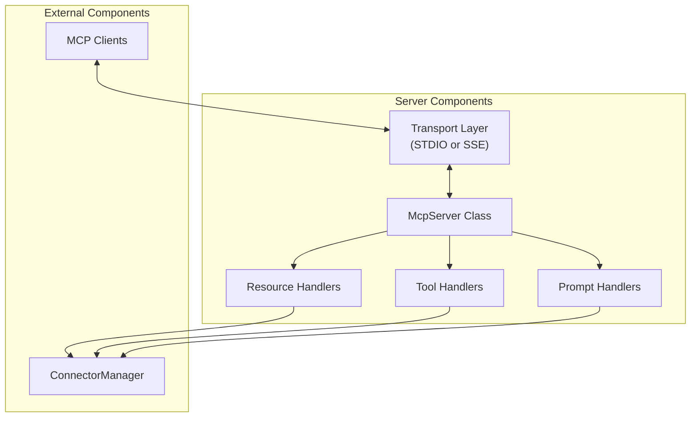
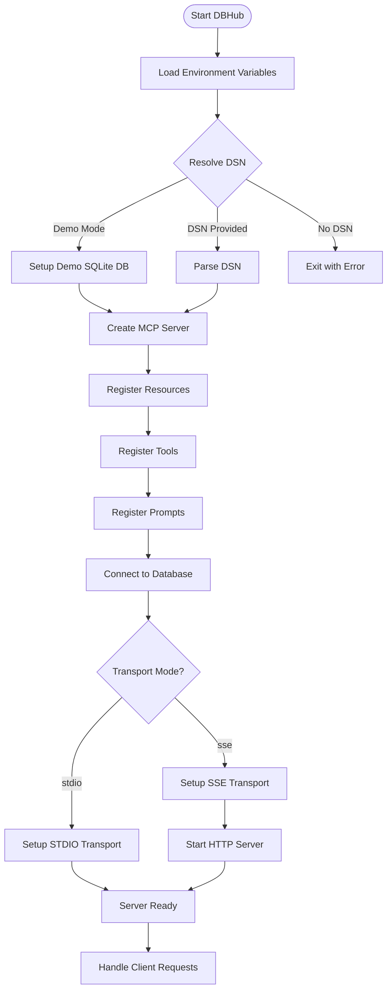
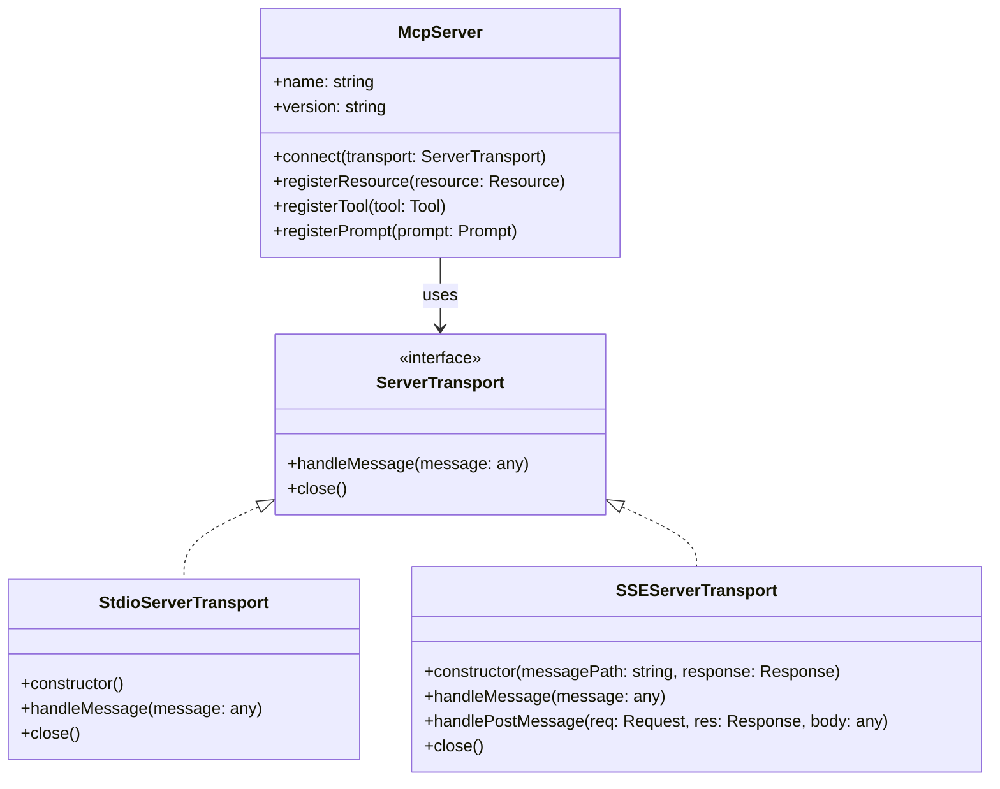
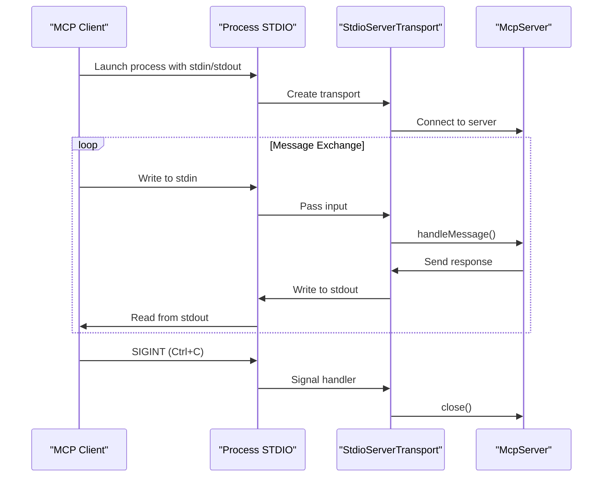
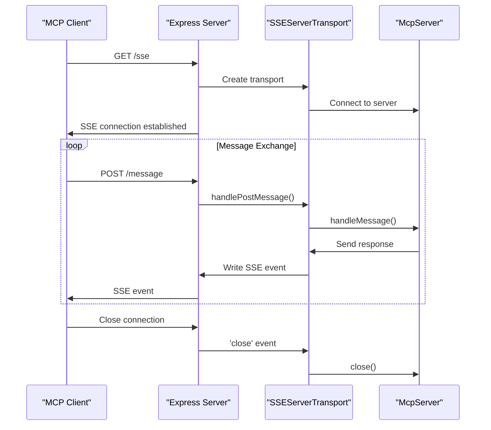
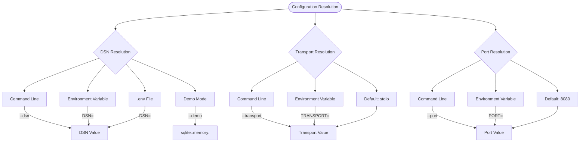

# Server Implementation

<details>
<summary>Relevant source files</summary>

The following files were used as context for generating this wiki page:

- [README.md](README.md)
- [src/config/env.ts](src/config/env.ts)
- [src/server.ts](src/server.ts)

</details>


This document details the server implementation in DBHub, focusing on the core server architecture, transport mechanisms (STDIO and SSE), and configuration options. For information about database connections and connector systems, see [Connector System](#2.2).

## Core Server Architecture

The DBHub server is built on the Model Context Protocol (MCP) SDK, providing a standardized interface for MCP-compatible clients like Claude Desktop and Cursor to interact with database systems. The server acts as a mediator between MCP clients and various database connectors.



The server implementation is centered around the `McpServer` class from the MCP SDK. The server registers resource endpoints, tools, and prompts which handle client requests. These components communicate with the database through the ConnectorManager.

Sources: [src/server.ts:1-3](), [src/server.ts:9-15](), [src/server.ts:79-87]()

## Server Initialization Flow

The server follows a structured initialization process defined in the `main()` function:



The initialization process follows these key steps:
1. Load environment variables and resolve the Database Source Name (DSN)
2. Create the MCP server instance
3. Register resources, tools, and prompts with the server
4. Connect to the database using the ConnectorManager
5. Set up the appropriate transport mechanism based on configuration
6. Start handling client requests

Sources: [src/server.ts:50-157]()

## Transport Mechanisms

DBHub supports two transport mechanisms that determine how clients communicate with the server:



Sources: [src/server.ts:1-4](), [src/server.ts:112-153]()

### STDIO Transport

The STDIO transport uses standard input/output streams for communication, making it suitable for direct integration with tools like Claude Desktop.



STDIO transport provides a simple, direct communication channel. When using STDIO, the server listens for SIGINT signals (Ctrl+C) to gracefully shut down.

Sources: [src/server.ts:141-153]()

### SSE Transport

Server-Sent Events (SSE) transport enables network-based communication through HTTP, making it suitable for browser-based and remote clients.



When using SSE transport, DBHub creates an Express server with two critical endpoints:
- `/sse` - Establishes the SSE connection
- `/message` - Receives messages from the client

Sources: [src/server.ts:112-140]()

## Configuration Resolution

DBHub implements a hierarchical configuration system that resolves settings from multiple sources in order of priority:



### Database Source Name (DSN) Resolution

The DSN is resolved in the following order:
1. Command line argument: `--dsn="your-connection-string"`
2. Environment variable: `DSN=your-connection-string`
3. Environment file (.env or .env.local): `DSN=your-connection-string`
4. Demo mode: `--demo` (uses `sqlite::memory:`)

If no DSN is provided and demo mode is not enabled, the server exits with an error.

Sources: [src/config/env.ts:87-118]()

### Transport Resolution

The transport type is resolved in the following order:
1. Command line argument: `--transport=stdio|sse`
2. Environment variable: `TRANSPORT=stdio|sse`
3. Default: `stdio`

Sources: [src/config/env.ts:124-142]()

### Port Resolution

The port number (only applicable for SSE transport) is resolved in the following order:
1. Command line argument: `--port=8080`
2. Environment variable: `PORT=8080`
3. Default: `8080`

Sources: [src/config/env.ts:151-169]()

## Environment File Support

DBHub supports loading configuration from environment files (.env and .env.local):

| Environment | Files Checked (in order) |
|-------------|--------------------------|
| Development | 1. .env.local<br>2. .env |
| Production  | .env only                |

The environment files can be located in:
1. Current working directory
2. Repository root directory
3. Explicitly specified path

Sources: [src/config/env.ts:42-72]()

## Demo Mode

DBHub includes a demo mode that uses an in-memory SQLite database pre-loaded with a sample employee database. This mode is enabled with the `--demo` flag.

When demo mode is enabled:
1. The DSN is automatically set to `sqlite::memory:`
2. An initialization script is run to create the sample database schema and load data
3. The server banner indicates `[DEMO MODE]`

The demo database includes tables for employees, departments, salaries, and other entities, making it useful for testing and demonstrations without requiring an external database.

Sources: [src/server.ts:95-98](), [src/config/env.ts:92-98]()

## Error Handling

The server implementation includes comprehensive error handling for various failure scenarios:

| Error Scenario | Handling |
|----------------|----------|
| Missing DSN | Displays detailed error message with example DSN formats for each database type and exits |
| Database connection failure | Logs connection error and exits |
| Transport setup failure | Logs error and exits |
| Client disconnection (SSE) | Logs disconnect event |
| Process termination (STDIO) | Catches SIGINT signal and gracefully closes transport |

For critical errors, the server logs detailed information and exits with a non-zero status code.

Sources: [src/server.ts:55-76](), [src/server.ts:123-125](), [src/server.ts:147-152](), [src/server.ts:154-157]()

## Server Information and Banner

The server provides version information and displays an ASCII art banner at startup:

```
 _____  ____  _   _       _     
|  __ \|  _ \| | | |     | |    
| |  | | |_) | |_| |_   _| |__  
| |  | |  _ <|  _  | | | | '_ \ 
| |__| | |_) | | | | |_| | |_) |
|_____/|____/|_| |_|\__,_|_.__/ 
                                
v{version} - Universal Database MCP Server
```

When running in demo mode, `[DEMO MODE]` is appended to the version number.

Sources: [src/server.ts:26-45](), [src/server.ts:109]()

## Related Components

The server integrates with several other DBHub components:

- **Resources**: Resource endpoints that expose database structure information
- **Tools**: Tool handlers that provide functionality like query execution
- **Prompts**: Prompt handlers that power AI features like SQL generation
- **ConnectorManager**: Manages database connections and abstracts connector details
- **ConnectorRegistry**: Maintains the registry of available database connectors

For more details on these components, see [Resource Endpoints](#4.1), [Tools](#4.2), [Prompts and AI Features](#4.3), and [Connector System](#2.2).

Sources: [src/server.ts:9-15](), [src/server.ts:85-87](), [src/server.ts:90-101]()
