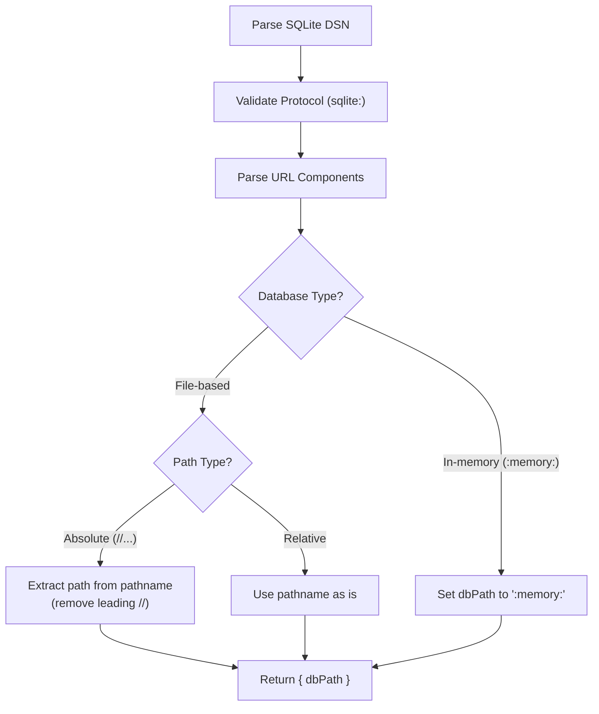
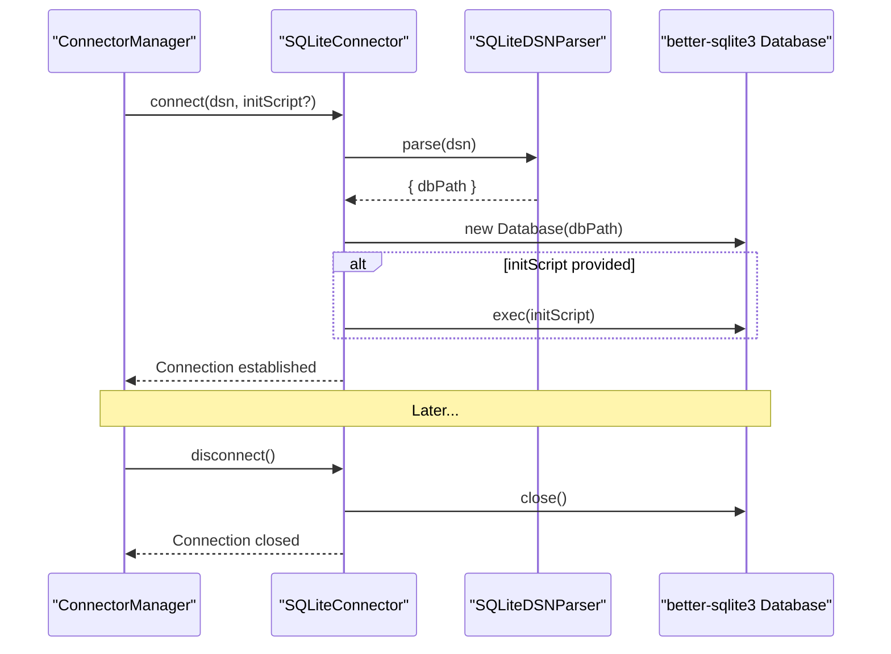
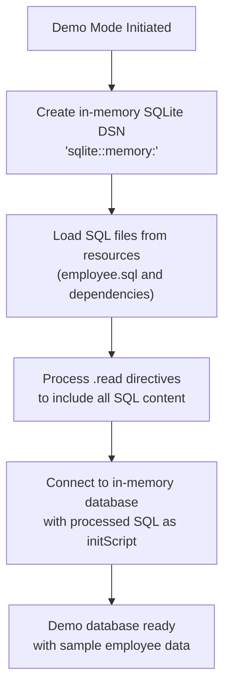

# SQLite Connector

<details>
<summary>Relevant source files</summary>

The following files were used as context for generating this wiki page:

- [src/config/demo-loader.ts](src/config/demo-loader.ts)
- [src/connectors/interface.ts](src/connectors/interface.ts)
- [src/connectors/sqlite/index.ts](src/connectors/sqlite/index.ts)
- [tsup.config.ts](tsup.config.ts)

</details>


This document details the SQLite Connector implementation in DBHub, which provides connectivity to SQLite databases for the Model Context Protocol (MCP) server. The connector supports both file-based SQLite databases and in-memory databases, making it particularly useful for demo mode and lightweight database operations.

## Overview

The SQLite Connector implements the Connector interface defined in DBHub, enabling access to SQLite databases through a consistent API shared with other database connectors. It utilizes the better-sqlite3 library for high-performance SQLite operations.

```mermaid
classDiagram
    class Connector {
        <<interface>>
        +id: string
        +name: string
        +dsnParser: DSNParser
        +connect(dsn: string): Promise~void~
        +disconnect(): Promise~void~
        +getSchemas(): Promise~string[]~
        +getTables(schema?: string): Promise~string[]~
        +executeQuery(query: string): Promise~QueryResult~
    }
    
    class SQLiteConnector {
        +id: "sqlite"
        +name: "SQLite"
        +dsnParser: SQLiteDSNParser
        -db: Database.Database | null
        -dbPath: string
        +connect(dsn: string, initScript?: string): Promise~void~
        +executeQuery(query: string): Promise~QueryResult~
        +validateQuery(query: string): object
    }
    
    class DSNParser {
        <<interface>>
        +parse(dsn: string): Promise~any~
        +getSampleDSN(): string
        +isValidDSN(dsn: string): boolean
    }
    
    class SQLiteDSNParser {
        +parse(dsn: string): Promise~{dbPath: string}~
        +getSampleDSN(): string
        +isValidDSN(dsn: string): boolean
    }
    
    Connector <|.. SQLiteConnector
    DSNParser <|.. SQLiteDSNParser
    SQLiteConnector --> SQLiteDSNParser
```

Sources: [src/connectors/sqlite/index.ts:79-319](), [src/connectors/interface.ts:59-139]()

## Connection String (DSN) Format

The SQLite Connector supports three DSN formats:

| DSN Format | Purpose | Example |
|------------|---------|---------|
| `sqlite:///path/to/database.db` | Absolute path to file-based database | `sqlite:///home/user/mydb.sqlite` |
| `sqlite://./relative/path/to/database.db` | Relative path to file-based database | `sqlite://./data/mydb.sqlite` |
| `sqlite::memory:` | In-memory database | `sqlite::memory:` |

The `SQLiteDSNParser` class handles parsing of these DSN formats into configuration objects that can be used to establish connections.



Sources: [src/connectors/sqlite/index.ts:20-65]()

## Connection Management

The SQLite Connector establishes connections using the better-sqlite3 library. Connection management involves:

1. Parsing the DSN to obtain the database path
2. Creating a new Database instance with the specified path
3. Optionally executing an initialization script
4. Managing connection lifecycles (connect/disconnect)



Sources: [src/connectors/sqlite/index.ts:87-116]()

## SQLite-Specific Behavior

### Schema Handling

Unlike other database systems (PostgreSQL, MySQL, SQL Server), SQLite doesn't have the concept of schemas. The SQLite Connector implements schema-related methods by:

- Returning either the database path or 'main' (for in-memory databases) as the schema name
- Ignoring schema parameters in most methods since SQLite uses a single namespace per database file

```javascript
async getSchemas(): Promise<string[]> {
  // Return the database path or 'main' for in-memory databases as the "schema"
  return [this.dbPath === ':memory:' ? 'main' : this.dbPath];
}
```

Sources: [src/connectors/sqlite/index.ts:118-128]()

### Table Operations

The SQLite Connector provides methods to:

- List tables using SQLite's sqlite_master system table
- Check if a table exists
- Retrieve table schema information using SQLite's PRAGMA commands
- Get table index information

Example of getting table schema:
```javascript
async getTableSchema(tableName: string): Promise<TableColumn[]> {
  // Use SQLite's PRAGMA table_info to get column metadata
  const rows = this.db.prepare(`PRAGMA table_info(${tableName})`).all();
  return rows.map(row => ({
    column_name: row.name,
    data_type: row.type,
    is_nullable: row.notnull === 0 ? 'YES' : 'NO',
    column_default: row.dflt_value
  }));
}
```

Sources: [src/connectors/sqlite/index.ts:130-255]()

### Stored Procedures

SQLite doesn't support stored procedures in the same way other database systems do. The SQLite Connector:

- Returns an empty array for `getStoredProcedures()`
- Throws an explanatory error for `getStoredProcedureDetail()`

Sources: [src/connectors/sqlite/index.ts:257-287]()

### Query Execution and Validation

The SQLite Connector implements query execution with security checks:

1. Validates the query to ensure it's a SELECT query (preventing destructive operations)
2. Executes the query using better-sqlite3
3. Returns the results in a standardized format

```javascript
async executeQuery(query: string): Promise<QueryResult> {
  // Validate query for safety
  const safetyCheck = this.validateQuery(query);
  if (!safetyCheck.isValid) {
    throw new Error(safetyCheck.message || "Query validation failed");
  }

  const rows = this.db.prepare(query).all();
  return { rows };
}

validateQuery(query: string): { isValid: boolean; message?: string } {
  // Only allow SELECT queries for security
  const normalizedQuery = query.trim().toLowerCase();
  if (!normalizedQuery.startsWith('select')) {
    return {
      isValid: false,
      message: "Only SELECT queries are allowed for security reasons."
    };
  }
  return { isValid: true };
}
```

Sources: [src/connectors/sqlite/index.ts:289-318]()

## Demo Mode Integration

The SQLite Connector plays a key role in DBHub's demo mode, which uses an in-memory SQLite database pre-loaded with sample data.



The integration process:

1. When demo mode is enabled, an in-memory SQLite DSN (`sqlite::memory:`) is generated
2. The demo-loader loads SQL files from the resources directory
3. SQL files are processed to handle `.read` directives (replacing them with file contents)
4. The processed SQL is used as an initialization script when connecting to the database

Sources: [src/config/demo-loader.ts:1-77]()

## Resource Copying for Deployment

To ensure the demo mode works correctly in production builds, the SQL resource files are copied to the distribution directory during the build process.

```javascript
// In tsup.config.ts
async onSuccess() {
  // Create target directory
  const targetDir = path.join('dist', 'resources', 'employee-sqlite');
  fs.mkdirSync(targetDir, { recursive: true });
  
  // Copy all SQL files from resources/employee-sqlite to dist/resources/employee-sqlite
  const sourceDir = path.join('resources', 'employee-sqlite');
  const files = fs.readdirSync(sourceDir);
  
  for (const file of files) {
    if (file.endsWith('.sql')) {
      const sourcePath = path.join(sourceDir, file);
      const targetPath = path.join(targetDir, file);
      fs.copyFileSync(sourcePath, targetPath);
    }
  }
}
```

Sources: [tsup.config.ts:11-29]()

## Usage

To use the SQLite Connector:

1. **For file-based database**:
   ```
   DSN=sqlite:///path/to/database.db
   ```

2. **For in-memory database**:
   ```
   DSN=sqlite::memory:
   ```

3. **For demo mode**:
   ```
   --demo
   ```
   or
   ```
   DB_DEMO=true
   ```

The SQLite Connector is automatically registered with the ConnectorRegistry and can be accessed using the connector ID `sqlite`.

Sources: [src/connectors/sqlite/index.ts:321-323]()
