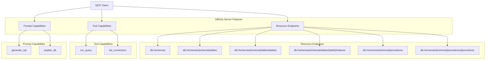
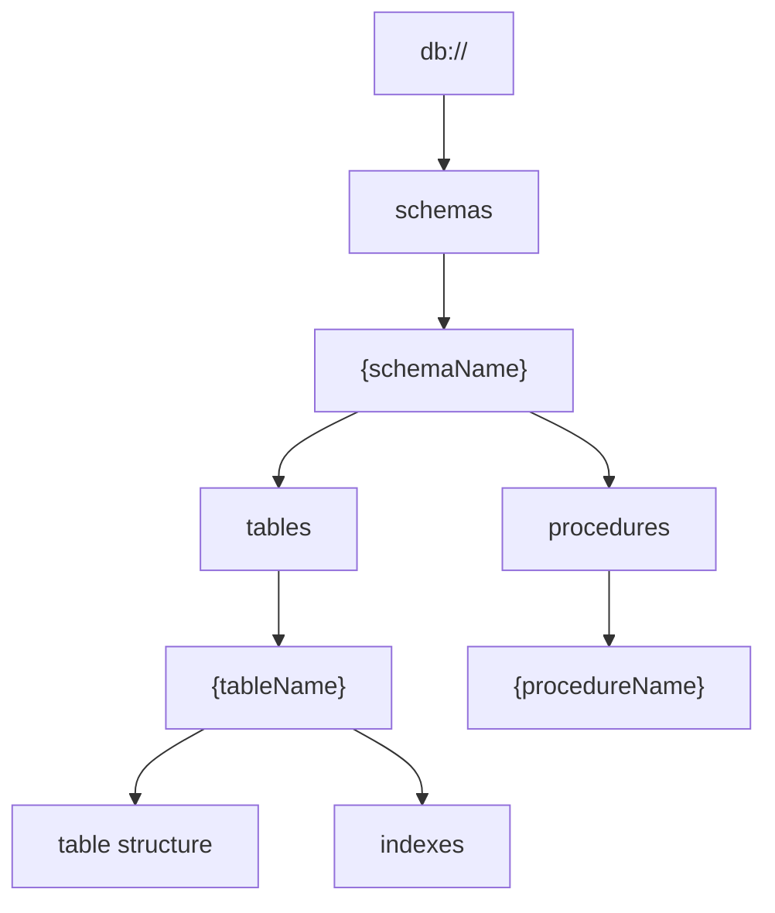
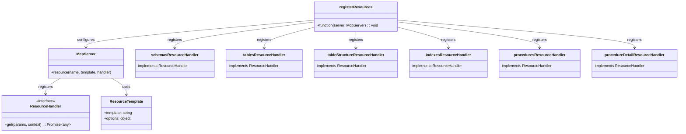
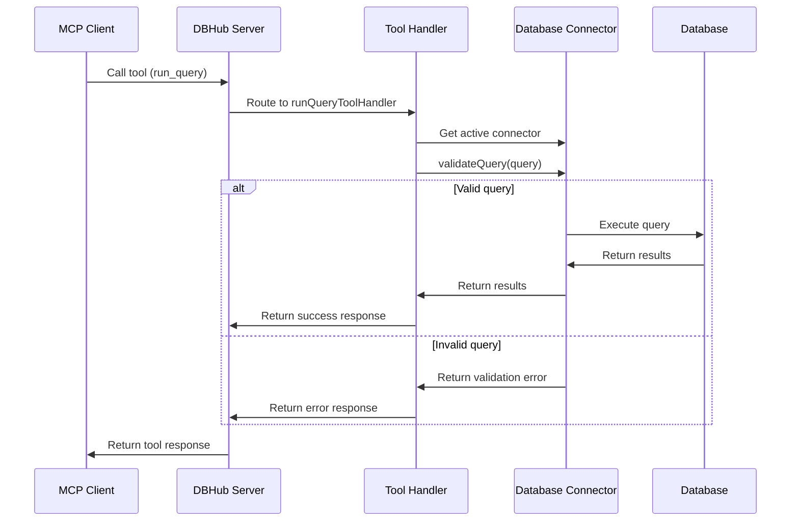
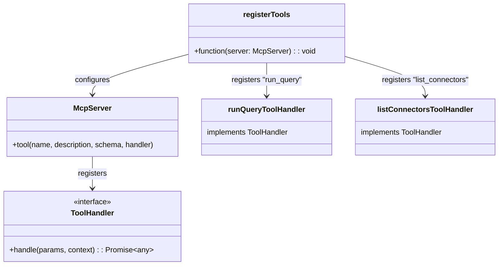
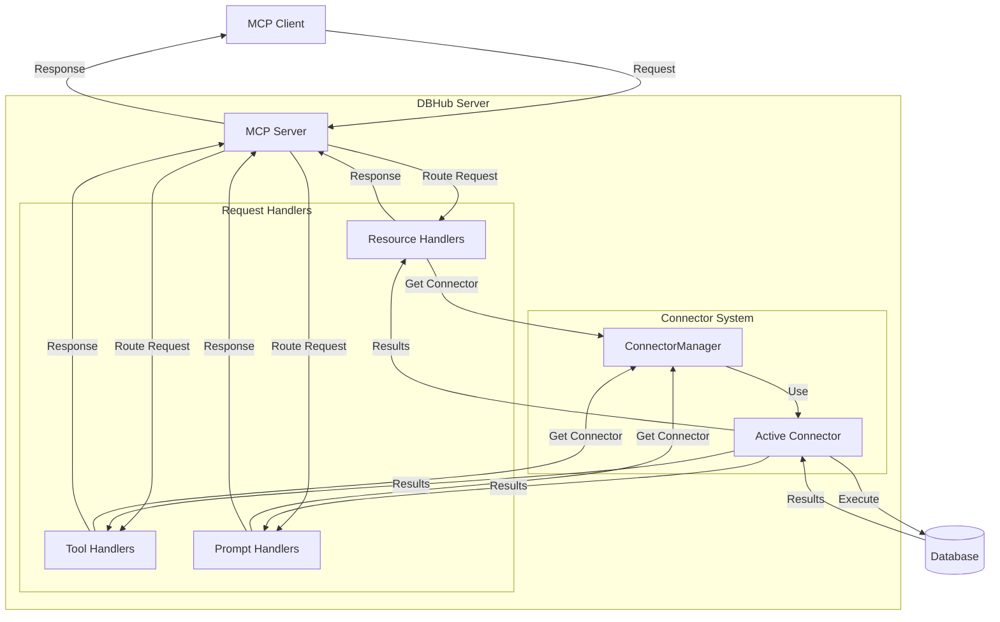

# Server Features

Relevant source files

The following files were used as context for generating this wiki page:

- [README.md](README.md)
- [src/resources/index.ts](src/resources/index.ts)
- [src/tools/index.ts](src/tools/index.ts)

This document provides a comprehensive overview of the features and capabilities exposed by the DBHub MCP server. It covers the various resource endpoints, tools, and prompt capabilities that enable clients to interact with databases through the Model Context Protocol (MCP). For information about the specific database connector implementations, see [Database Connectors](#3).

DBHub exposes a consistent interface across multiple database types, allowing MCP clients to explore database structures and execute queries without needing to understand the specifics of each database system.

## Feature Overview

DBHub's server features can be categorized into three main groups:

1. **Resource Endpoints**: Provide structured access to database objects (schemas, tables, etc.)
2. **Tools**: Enable dynamic operations like executing queries
3. **Prompt Capabilities**: Support AI-powered features like SQL generation and database explanation

Sources: [README.md:35-60](), [src/resources/index.ts:1-60](), [src/tools/index.ts:1-24]()

## Resource Endpoints

DBHub exposes database structures through a RESTful resource hierarchy, allowing clients to navigate and explore database objects in a structured way. Each resource endpoint maps to a specific handler that retrieves the appropriate information from the active database connector.

### Resource Hierarchy

Resources are organized in a hierarchical structure following RESTful patterns:

Sources: [src/resources/index.ts:18-60]()

### Resource Implementation

Resource handlers are registered with the MCP server during initialization. Each resource has a unique identifier, a URI template, and a handler function that processes requests.

Sources: [src/resources/index.ts:1-60]()

### Resource Compatibility Matrix

The following table shows the compatibility of each resource endpoint with different database systems:

| Resource Endpoint | URI Format | PostgreSQL | MySQL | MariaDB | SQL Server | SQLite |
|-------------------|------------|:----------:|:-----:|:-------:|:----------:|:------:|
| schemas | `db://schemas` | ✅ | ✅ | ✅ | ✅ | ✅ |
| tables_in_schema | `db://schemas/{schemaName}/tables` | ✅ | ✅ | ✅ | ✅ | ✅ |
| table_structure_in_schema | `db://schemas/{schemaName}/tables/{tableName}` | ✅ | ✅ | ✅ | ✅ | ✅ |
| indexes_in_table | `db://schemas/{schemaName}/tables/{tableName}/indexes` | ✅ | ✅ | ✅ | ✅ | ✅ |
| procedures_in_schema | `db://schemas/{schemaName}/procedures` | ✅ | ✅ | ✅ | ✅ | ❌ |
| procedure_details_in_schema | `db://schemas/{schemaName}/procedures/{procedureName}` | ✅ | ✅ | ✅ | ✅ | ❌ |

Sources: [README.md:37-47]()

## Tool Features

Tools provide dynamic functionality that allows clients to perform operations on databases. Unlike resources, which represent static database structures, tools enable actions like executing queries.

### Available Tools

DBHub provides two primary tools:

1. **run_query**: Executes SQL queries on the connected database
2. **list_connectors**: Lists available database connectors

Sources: [src/tools/index.ts:1-24](), [README.md:48-53]()

### Tool Registration

Tools are registered with the MCP server during initialization:

Sources: [src/tools/index.ts:1-24]()

### Tool Compatibility Matrix

The following table shows the compatibility of each tool with different database systems:

| Tool | Command Name | PostgreSQL | MySQL | MariaDB | SQL Server | SQLite |
|------|--------------|:----------:|:-----:|:-------:|:----------:|:------:|
| Execute Query | `run_query` | ✅ | ✅ | ✅ | ✅ | ✅ |
| List Connectors | `list_connectors` | ✅ | ✅ | ✅ | ✅ | ✅ |

Sources: [README.md:48-53]()

## Prompt Capabilities

Prompt capabilities enable AI-powered features that enhance database interactions. These capabilities are designed to help users generate SQL queries and understand database structures through natural language.

### Available Prompt Capabilities

DBHub provides two primary prompt capabilities:

1. **generate_sql**: Generates SQL queries based on natural language descriptions
2. **explain_db**: Provides explanations of database elements and structures

### Prompt Capability Compatibility Matrix

The following table shows the compatibility of each prompt capability with different database systems:

| Prompt | Command Name | PostgreSQL | MySQL | MariaDB | SQL Server | SQLite |
|--------|--------------|:----------:|:-----:|:-------:|:----------:|:------:|
| Generate SQL | `generate_sql` | ✅ | ✅ | ✅ | ✅ | ✅ |
| Explain DB Elements | `explain_db` | ✅ | ✅ | ✅ | ✅ | ✅ |

Sources: [README.md:55-60]()

## Feature Request Flow

The following diagram illustrates how client requests flow through the DBHub server:

Sources: [README.md:9-27](), [src/resources/index.ts:1-60](), [src/tools/index.ts:1-24]()

## Summary

DBHub's server features provide a comprehensive set of capabilities for interacting with databases through the Model Context Protocol. By exposing resources, tools, and prompt capabilities, DBHub enables MCP clients to explore database structures, execute queries, and leverage AI-powered features across multiple database systems.

The consistent interface across different database types allows users to interact with databases in a unified way, regardless of the underlying database system. This compatibility matrix ensures that users can rely on a consistent experience across supported databases, with clear indications of which features are available for each database type.
