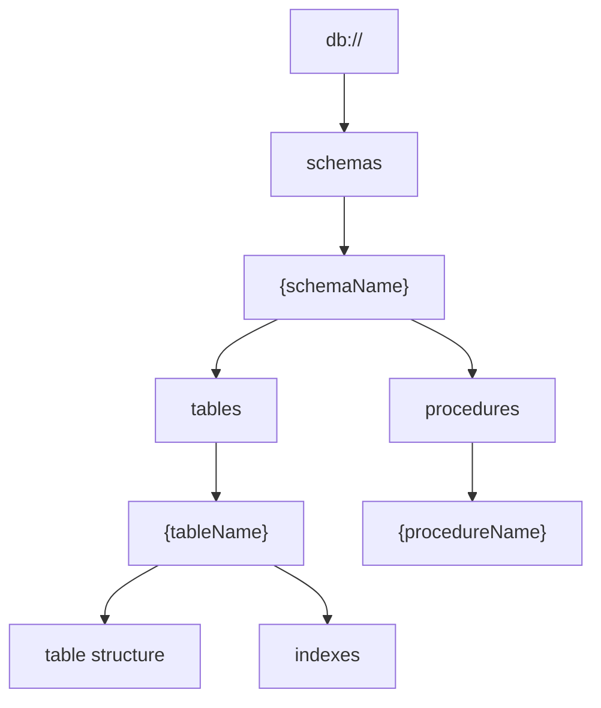
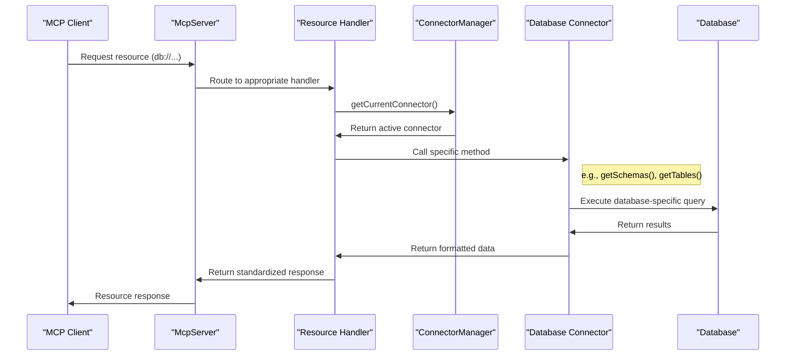
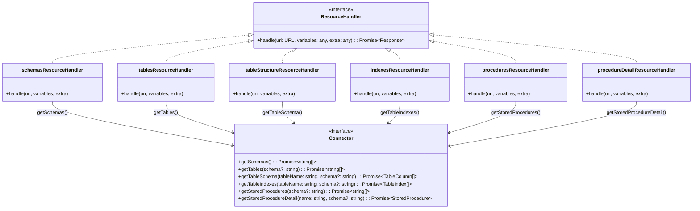
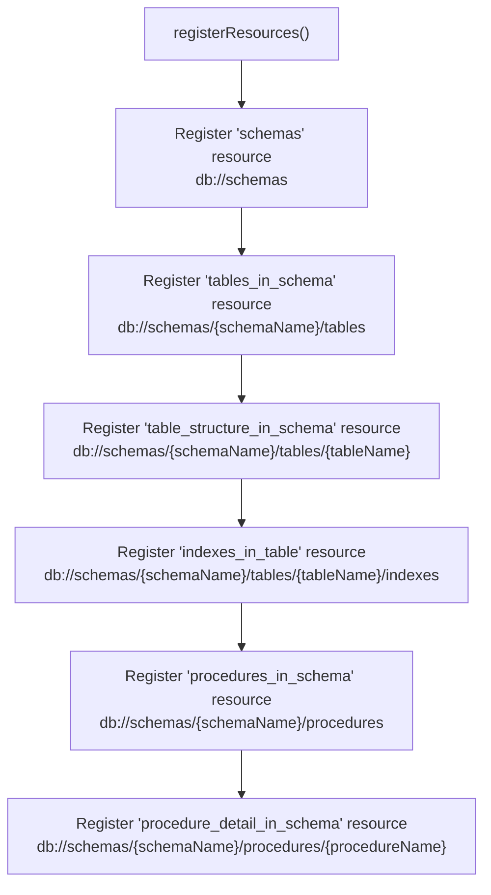

# Resource Endpoints

<details>
<summary>Relevant source files</summary>

The following files were used as context for generating this wiki page:

- [CLAUDE.md](CLAUDE.md)
- [src/resources/index.ts](src/resources/index.ts)
- [src/resources/procedures.ts](src/resources/procedures.ts)
- [src/resources/schema.ts](src/resources/schema.ts)
- [src/resources/schemas.ts](src/resources/schemas.ts)
- [src/resources/tables.ts](src/resources/tables.ts)

</details>


## Overview

Resource endpoints in DBHub provide a structured way to access database metadata and information through a RESTful interface. These endpoints follow the Model Context Protocol (MCP) and enable clients to explore database schemas, tables, indexes, and stored procedures in a hierarchical manner. For information about tools that execute operations on databases, see [Tools](#4.2).

DBHub exposes a comprehensive set of resource endpoints that follow a consistent URL pattern beginning with `db://`. These endpoints allow MCP clients like Claude Desktop and Cursor to discover and explore database structures without executing direct SQL queries.

Sources: [src/resources/index.ts:15-60]()

## Resource Endpoint Hierarchy

DBHub organizes database resources in a hierarchical RESTful style structure. The following diagram illustrates this hierarchy:



This hierarchy allows clients to navigate the database structure starting from the root and drilling down to specific details as needed.

Sources: [src/resources/index.ts:18-60]()

## Resource Request Flow

The following diagram illustrates how resource requests flow through the DBHub system, from MCP client to database:



Each resource request is handled by a specific resource handler function registered with the MCP server. These handlers interact with the database through the connector interface, which abstracts the database-specific logic.

Sources: [src/resources/tables.ts:1-49](), [src/resources/schema.ts:1-75](), [src/resources/schemas.ts:1-29]()

## Available Resource Endpoints

DBHub provides the following resource endpoints:

| Resource Endpoint | URL Pattern | Handler | Description |
|-------------------|-------------|---------|-------------|
| schemas | `db://schemas` | schemasResourceHandler | Lists all schemas in the database |
| tables_in_schema | `db://schemas/{schemaName}/tables` | tablesResourceHandler | Lists all tables in a specific schema |
| table_structure_in_schema | `db://schemas/{schemaName}/tables/{tableName}` | tableStructureResourceHandler | Returns the structure (columns) of a specific table |
| indexes_in_table | `db://schemas/{schemaName}/tables/{tableName}/indexes` | indexesResourceHandler | Lists all indexes for a specific table |
| procedures_in_schema | `db://schemas/{schemaName}/procedures` | proceduresResourceHandler | Lists all stored procedures in a specific schema |
| procedure_detail_in_schema | `db://schemas/{schemaName}/procedures/{procedureName}` | procedureDetailResourceHandler | Returns details of a specific stored procedure |

Sources: [src/resources/index.ts:18-60]()

## Resource Handler Implementation

The following diagram shows the relationship between resource handlers and the connector methods they use:



Resource handlers follow a consistent pattern:
1. Get the active database connector from `ConnectorManager`
2. Extract and validate parameters from the request URL
3. Call the appropriate connector method to retrieve data
4. Format the response using utility functions
5. Handle errors and return appropriate error responses

Sources: [src/resources/schemas.ts:1-29](), [src/resources/tables.ts:1-49](), [src/resources/schema.ts:1-75](), [src/resources/procedures.ts:1-113]()

## Resource Response Format

Resource endpoints return responses in a standardized format using utility functions:

### Success Response

```json
{
  "status": "success",
  "uri": "db://schemas/public/tables/employees",
  "data": {
    "table": "employees",
    "schema": "public",
    "columns": [
      {
        "name": "id",
        "type": "integer",
        "nullable": false,
        "default": null
      },
      {
        "name": "name",
        "type": "varchar",
        "nullable": true,
        "default": null
      }
    ],
    "count": 2
  }
}
```

### Error Response

```json
{
  "status": "error",
  "uri": "db://schemas/invalid_schema/tables",
  "error": {
    "message": "Schema 'invalid_schema' does not exist or cannot be accessed",
    "code": "SCHEMA_NOT_FOUND"
  }
}
```

Sources: [src/resources/tables.ts:39-47](), [src/resources/schema.ts:49-73](), [src/resources/schemas.ts:20-27]()

## Resource Registration

Resources are registered with the MCP server during initialization through the `registerResources` function. This function creates resource templates and associates them with their respective handler functions.



The `registerResources` function is called during server initialization to set up all available resource endpoints.

Sources: [src/resources/index.ts:18-60]()

## Implementation Details

### Schemas Resource

The schemas resource handler retrieves a list of all database schemas using the connector's `getSchemas()` method. The response includes the list of schemas and the total count.

```javascript
{
  "schemas": ["public", "information_schema"],
  "count": 2
}
```

Sources: [src/resources/schemas.ts:8-29]()

### Tables Resource

The tables resource handler retrieves a list of tables within a specified schema using the connector's `getTables(schemaName)` method. Before fetching tables, it verifies that the specified schema exists. The response includes the list of tables, the total count, and the schema name.

```javascript
{
  "tables": ["employees", "departments", "salaries"],
  "count": 3,
  "schema": "public"
}
```

Sources: [src/resources/tables.ts:8-49]()

### Table Structure Resource

The table structure resource handler retrieves the structure (columns) of a specified table using the connector's `getTableSchema(tableName, schemaName)` method. It validates both the schema and table existence before fetching the structure. The response includes table and schema information, column details, and column count.

```javascript
{
  "table": "employees",
  "schema": "public",
  "columns": [
    {
      "name": "id",
      "type": "integer",
      "nullable": false,
      "default": null
    },
    // Additional columns...
  ],
  "count": 5
}
```

Sources: [src/resources/schema.ts:9-75]()

### Stored Procedures Resources

DBHub provides resources to list stored procedures and get detailed information about specific procedures. The procedures resource handler retrieves a list of stored procedures within a specified schema, while the procedure detail resource handler retrieves detailed information about a specific procedure, including its parameters, return type, and definition.

Sources: [src/resources/procedures.ts:8-113]()

## Error Handling

Resource handlers implement consistent error handling for common error scenarios:

1. **Schema Not Found**: When a requested schema doesn't exist
2. **Table Not Found**: When a requested table doesn't exist in the specified schema
3. **Parameter Missing**: When a required URL parameter is missing
4. **Retrieval Error**: When an error occurs while retrieving data from the database

Error responses include a descriptive message and an error code to help clients identify and handle the error appropriately.

Sources: [src/resources/tables.ts:20-26](), [src/resources/schema.ts:26-44](), [src/resources/procedures.ts:19-27](), [src/resources/procedures.ts:68-74]()
