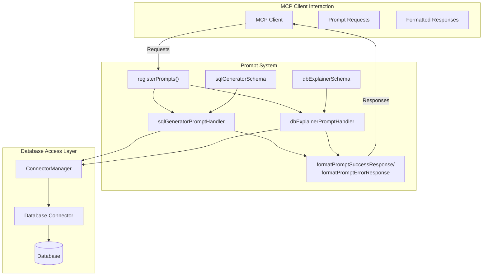
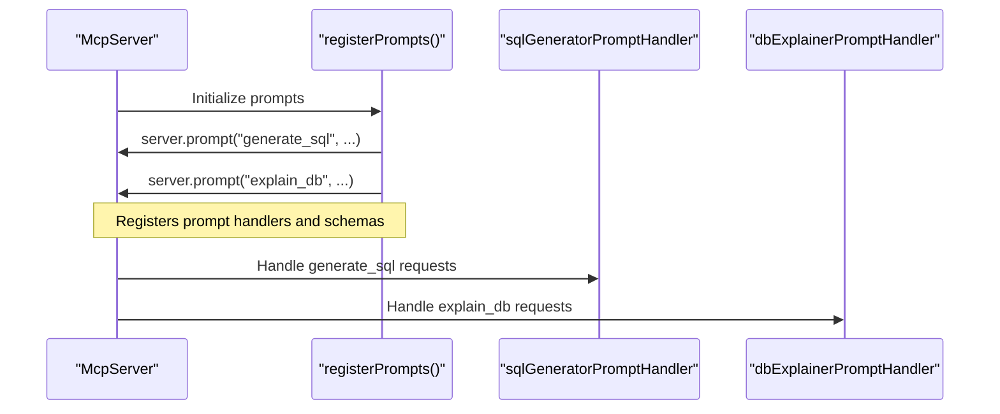
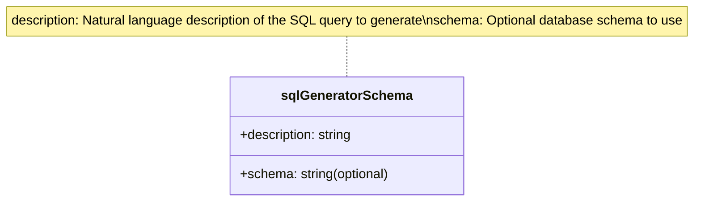
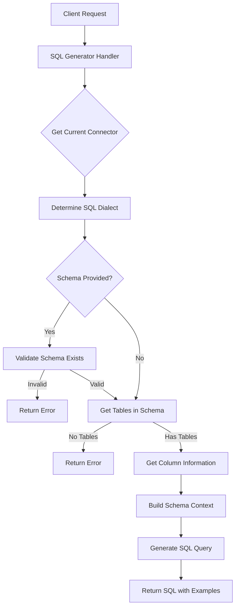
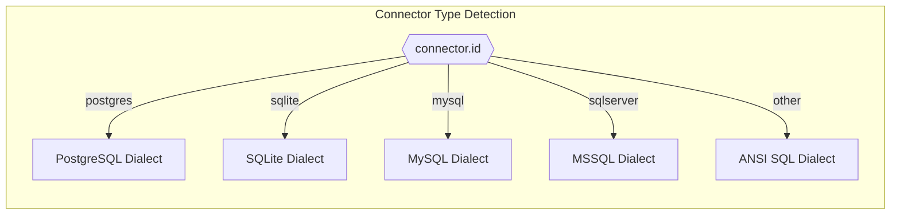
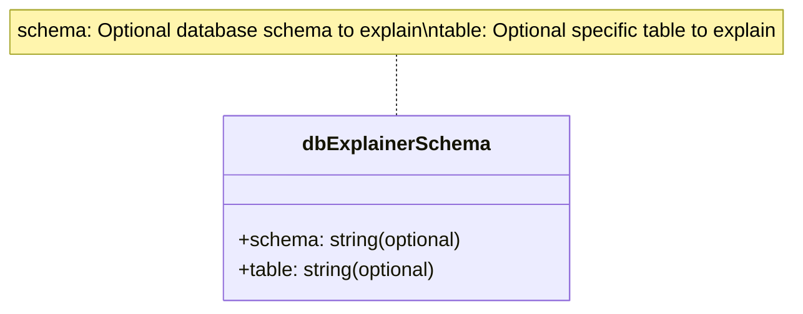
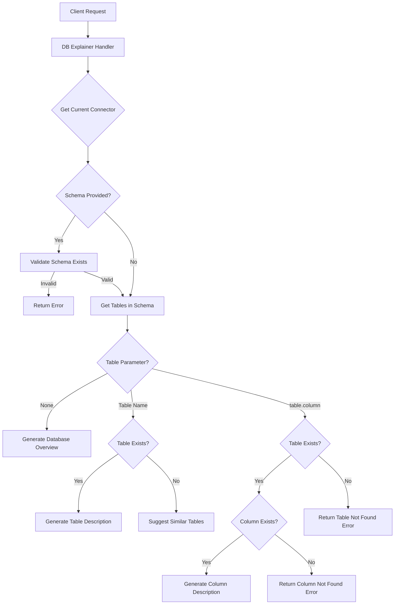
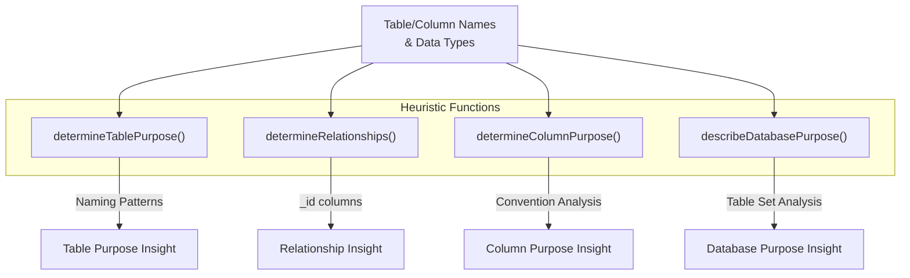
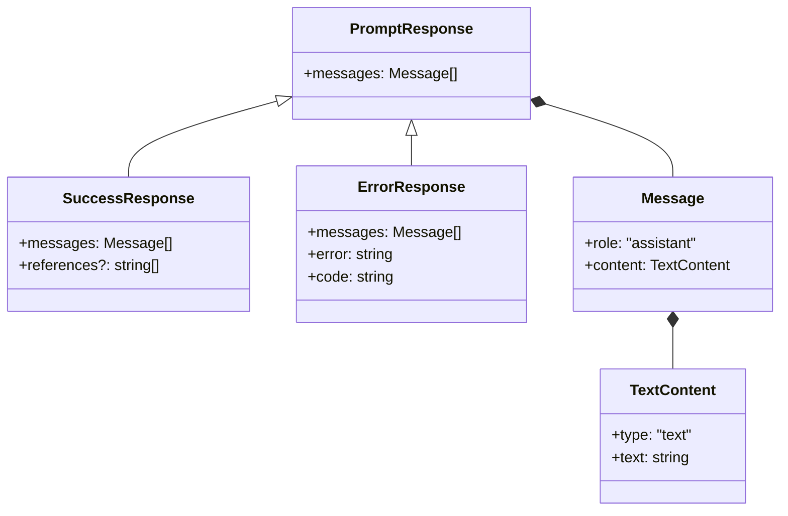

# Prompts and AI Features

<details>
<summary>Relevant source files</summary>

The following files were used as context for generating this wiki page:

- [README.md](README.md)
- [src/prompts/db-explainer.ts](src/prompts/db-explainer.ts)
- [src/prompts/index.ts](src/prompts/index.ts)
- [src/prompts/sql-generator.ts](src/prompts/sql-generator.ts)
- [src/types/sql.ts](src/types/sql.ts)
- [src/utils/response-formatter.ts](src/utils/response-formatter.ts)

</details>


This document details the prompt-based capabilities implemented in DBHub for natural language interaction with databases. DBHub exposes two primary AI features through the Model Context Protocol (MCP): SQL query generation from natural language and database structure explanation.

For information about resources and tools provided by DBHub, see [Resource Endpoints](#4.1) and [Tools](#4.2).

## Overview

DBHub implements a prompt system that bridges natural language requests with database operations. These features enable users to generate SQL queries without knowing SQL syntax and to get plain-language explanations of database structures.

### Prompt System Architecture



Sources: [src/prompts/index.ts:1-24](), [src/prompts/sql-generator.ts:1-205](), [src/prompts/db-explainer.ts:1-344]()

## Supported Prompt Capabilities

The following table outlines the prompt capabilities supported by DBHub:

| Prompt Feature  | Command Name   | Description                                  | Support     |
|-----------------|----------------|----------------------------------------------|-------------|
| Generate SQL    | `generate_sql` | Generates SQL queries from natural language  | All databases |
| Explain DB      | `explain_db`   | Explains database elements in plain language | All databases |

Sources: [README.md:56-61]()

## Prompt Registration

Both prompt handlers are registered with the MCP server during initialization:



Sources: [src/prompts/index.ts:1-24]()

## SQL Generator

The SQL Generator translates natural language descriptions into executable SQL queries tailored to the connected database's dialect.

### Parameter Schema



Sources: [src/prompts/sql-generator.ts:7-10]()

### SQL Generation Flow



Sources: [src/prompts/sql-generator.ts:16-205]()

### Dialect Detection

The SQL Generator automatically detects the appropriate SQL dialect based on the active connector:



Sources: [src/prompts/sql-generator.ts:24-41](), [src/types/sql.ts:1-5]()

### SQL Generation Logic

The current implementation uses pattern matching to generate SQL queries based on the natural language description. The system:

1. Retrieves tables and column information from the database
2. Builds a schema context with available tables and their columns
3. Analyzes the description for keywords like "count", "average", or "join"
4. Generates appropriate SQL based on the detected operation
5. Adds reference examples for the specific SQL dialect
6. Returns the SQL with explanatory comments

Sources: [src/prompts/sql-generator.ts:54-193]()

## Database Explainer

The Database Explainer provides natural language explanations of database elements, helping users understand database structure without reading raw schema definitions.

### Parameter Schema



Sources: [src/prompts/db-explainer.ts:6-9]()

### Explanation Modes

The DB Explainer supports several explanation modes based on the parameters provided:



Sources: [src/prompts/db-explainer.ts:15-187]()

### Insight Generation

The DB Explainer uses heuristics to infer the purpose and relationships of database elements:



Sources: [src/prompts/db-explainer.ts:192-344]()

## Response Formatting

Both prompt handlers use standardized response formatting functions to ensure consistent output structure according to the MCP specification:



Sources: [src/utils/response-formatter.ts:91-149]()

## Example Usage

### SQL Generator Example

When a client sends a request to generate SQL:

```
{
  "description": "Find all employees hired in the last year with salary > 50000",
  "schema": "public"
}
```

The system would return:

```
{
  "messages": [
    {
      "role": "assistant",
      "content": {
        "type": "text",
        "text": "-- Schema: public\n-- Query generated from: \"Find all employees hired in the last year with salary > 50000\"\nSELECT *\nFROM employees\nWHERE hire_date > NOW() - INTERVAL '1 year'\nAND salary > 50000;"
      }
    }
  ],
  "references": [
    "SELECT * FROM users WHERE created_at > NOW() - INTERVAL '1 day'",
    "SELECT u.name, COUNT(o.id) FROM users u JOIN orders o ON u.id = o.user_id GROUP BY u.name HAVING COUNT(o.id) > 5"
  ]
}
```

### DB Explainer Example

When a client sends a request to explain a table:

```
{
  "schema": "public",
  "table": "employees"
}
```

The system would return:

```
{
  "messages": [
    {
      "role": "assistant",
      "content": {
        "type": "text",
        "text": "Table: employees in schema 'public'\n\nStructure:\n- employee_id (integer), not nullable\n- first_name (varchar), not nullable\n- last_name (varchar), not nullable\n- email (varchar), not nullable\n- hire_date (date), not nullable\n- department_id (integer), nullable\n- salary (numeric), nullable\n\nPurpose:\nThis table appears to store user information and profiles\n\nRelationships:\nMay have a relationship with the \"department\" table (via department_id)"
      }
    }
  ]
}
```

Sources: [src/prompts/sql-generator.ts:154-185](), [src/prompts/db-explainer.ts:54-80]()

## Implementation Limitations

The current implementation has several limitations:

1. The SQL generation uses simple pattern matching rather than a real language model
2. Table purpose and relationship inferences are based on basic naming conventions
3. The system lacks knowledge of actual foreign key constraints defined in the database
4. No history is maintained between prompt interactions

In a production environment with real AI integration, these features would be enhanced with actual language model calls to provide more sophisticated responses.

Sources: [src/prompts/sql-generator.ts:149-151](), [src/prompts/db-explainer.ts:192-344]()
