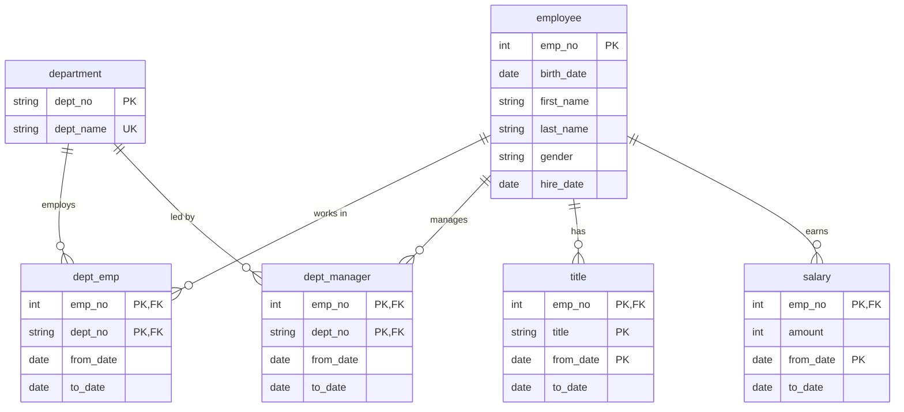
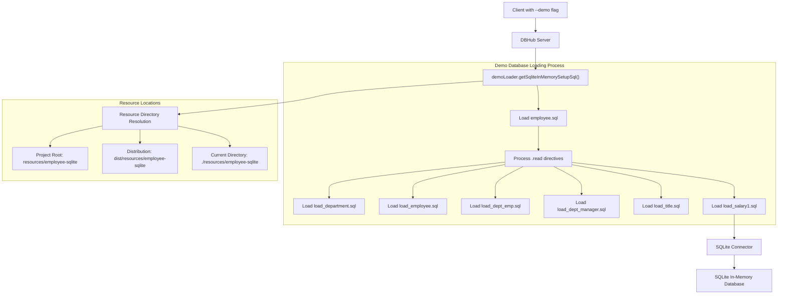

# Demo Database

<details>
<summary>Relevant source files</summary>

The following files were used as context for generating this wiki page:

- [resources/employee-sqlite/employee.sql](resources/employee-sqlite/employee.sql)
- [resources/employee-sqlite/load_department.sql](resources/employee-sqlite/load_department.sql)
- [resources/employee-sqlite/load_dept_emp.sql](resources/employee-sqlite/load_dept_emp.sql)
- [src/config/demo-loader.ts](src/config/demo-loader.ts)
- [tsup.config.ts](tsup.config.ts)

</details>


This page documents the demo database feature in DBHub, which provides a pre-configured sample employee database for testing and exploration. The demo mode allows users to immediately interact with a fully functional database without requiring an external database connection.

## Enabling Demo Mode

DBHub includes a built-in demo mode that automatically sets up an in-memory SQLite database with sample employee data. This mode is enabled by providing the `--demo` flag when starting the application:

```bash
dbhub --demo
```

When demo mode is enabled, DBHub automatically:
1. Creates an in-memory SQLite database
2. Loads a predefined schema with employee data
3. Makes this database available through all DBHub interfaces

No additional configuration is required, as the connection string is automatically set to `sqlite::memory:`.

Sources: [src/config/demo-loader.ts:52-54]()

## Database Schema Overview

The demo database is based on a simplified version of the standard "employee" sample database, commonly used for SQL demonstrations. It contains a comprehensive schema that models employees, departments, titles, and salaries within a fictional organization.



The schema includes both current and historical data tracking through the use of temporal fields (`from_date` and `to_date`), allowing for complex queries that analyze changes over time.

Sources: [resources/employee-sqlite/employee.sql:39-92]()

## Tables and Relationships

### Employee Table

The `employee` table serves as the core table, containing basic employee information:

```sql
CREATE TABLE employee (
    emp_no      INTEGER         NOT NULL,
    birth_date  DATE            NOT NULL,
    first_name  TEXT            NOT NULL,
    last_name   TEXT            NOT NULL,
    gender      TEXT            NOT NULL CHECK (gender IN ('M','F')),
    hire_date   DATE            NOT NULL,
    PRIMARY KEY (emp_no)
);
```

Each employee has a unique employee number (`emp_no`) that serves as the primary key and is referenced by related tables.

Sources: [resources/employee-sqlite/employee.sql:39-47]()

### Department Table

The `department` table defines the departments within the organization:

```sql
CREATE TABLE department (
    dept_no     TEXT            NOT NULL,
    dept_name   TEXT            NOT NULL,
    PRIMARY KEY (dept_no),
    UNIQUE      (dept_name)
);
```

The demo database includes 9 departments:
- Marketing (d001)
- Finance (d002)
- Human Resources (d003)
- Production (d004)
- Development (d005)
- Quality Management (d006)
- Sales (d007)
- Research (d008)
- Customer Service (d009)

Sources: [resources/employee-sqlite/employee.sql:49-54](), [resources/employee-sqlite/load_department.sql:1-9]()

### Relational Tables

The schema includes several tables that establish relationships between employees and departments:

#### Department Employee Relationship

The `dept_emp` table tracks which departments an employee belongs to, including historical data:

```sql
CREATE TABLE dept_emp (
    emp_no      INTEGER         NOT NULL,
    dept_no     TEXT            NOT NULL,
    from_date   DATE            NOT NULL,
    to_date     DATE            NOT NULL,
    FOREIGN KEY (emp_no)  REFERENCES employee (emp_no)   ON DELETE CASCADE,
    FOREIGN KEY (dept_no) REFERENCES department (dept_no) ON DELETE CASCADE,
    PRIMARY KEY (emp_no,dept_no)
);
```

Sources: [resources/employee-sqlite/employee.sql:66-74]()

#### Department Manager Relationship

The `dept_manager` table identifies which employees have managed departments:

```sql
CREATE TABLE dept_manager (
   emp_no       INTEGER         NOT NULL,
   dept_no      TEXT            NOT NULL,
   from_date    DATE            NOT NULL,
   to_date      DATE            NOT NULL,
   FOREIGN KEY (emp_no)  REFERENCES employee (emp_no)    ON DELETE CASCADE,
   FOREIGN KEY (dept_no) REFERENCES department (dept_no) ON DELETE CASCADE,
   PRIMARY KEY (emp_no,dept_no)
);
```

Sources: [resources/employee-sqlite/employee.sql:56-64]()

### Title and Salary Tables

The `title` table tracks employee job titles over time:

```sql
CREATE TABLE title (
    emp_no      INTEGER         NOT NULL,
    title       TEXT            NOT NULL,
    from_date   DATE            NOT NULL,
    to_date     DATE,
    FOREIGN KEY (emp_no) REFERENCES employee (emp_no) ON DELETE CASCADE,
    PRIMARY KEY (emp_no,title,from_date)
);
```

The `salary` table tracks employee salaries over time:

```sql
CREATE TABLE salary (
    emp_no      INTEGER         NOT NULL,
    amount      INTEGER         NOT NULL,
    from_date   DATE            NOT NULL,
    to_date     DATE            NOT NULL,
    FOREIGN KEY (emp_no) REFERENCES employee (emp_no) ON DELETE CASCADE,
    PRIMARY KEY (emp_no,from_date)
);
```

Sources: [resources/employee-sqlite/employee.sql:76-92]()

## Database Views

The schema also includes two views that simplify common queries:

### Department Employee Latest Date View

```sql
CREATE VIEW dept_emp_latest_date AS
    SELECT emp_no, MAX(from_date) AS from_date, MAX(to_date) AS to_date
    FROM dept_emp
    GROUP BY emp_no;
```

This view helps retrieve the most recent department assignment dates for each employee.

### Current Department Employee View

```sql
CREATE VIEW current_dept_emp AS
    SELECT l.emp_no, dept_no, l.from_date, l.to_date
    FROM dept_emp d
        INNER JOIN dept_emp_latest_date l
        ON d.emp_no=l.emp_no AND d.from_date=l.from_date AND l.to_date = d.to_date;
```

This view simplifies querying for an employee's current department assignment.

Sources: [resources/employee-sqlite/employee.sql:94-104]()

## Implementation Details

The demo database functionality is implemented through several key components:



The demo loader performs these key steps:

1. Locates the SQL resource files in one of several possible locations
2. Loads the main schema file (`employee.sql`)
3. Processes `.read` directives in the schema file to load additional data files
4. Sets up the SQLite in-memory database with the complete schema and data

The loader is smart enough to find the SQL files in different environments (development, production, or as an installed package).

Sources: [src/config/demo-loader.ts:1-77](), [tsup.config.ts:11-29]()

## Using the Demo Database

When in demo mode, the database is automatically loaded and connected. You can immediately use all DBHub features with this database, including:

- Exploring the schema through resource endpoints
- Running queries using the `run_query` tool
- Using AI features to analyze or generate SQL for the database

The demo database is particularly useful for:

1. Testing DBHub functionality without configuring an external database
2. Learning SQL with a realistic but manageable dataset
3. Developing and testing AI-assisted database query features
4. Demonstrating DBHub's capabilities in presentations or tutorials

For production use or connecting to other database systems, see the [Environment Configuration](#5.1) page.

Sources: [src/config/demo-loader.ts:1-6]()

## Sample Queries

Here are some example queries you can run against the demo database to explore its data:

### Basic Employee Information
```sql
SELECT * FROM employee LIMIT 10;
```

### Department Structure
```sql
SELECT d.dept_no, d.dept_name, COUNT(de.emp_no) as employee_count
FROM department d
LEFT JOIN dept_emp de ON d.dept_no = de.dept_no AND de.to_date = '9999-01-01'
GROUP BY d.dept_no, d.dept_name
ORDER BY d.dept_no;
```

### Employee Department History
```sql
SELECT e.emp_no, e.first_name, e.last_name, 
       d.dept_name, de.from_date, de.to_date
FROM employee e
JOIN dept_emp de ON e.emp_no = de.emp_no
JOIN department d ON de.dept_no = d.dept_no
WHERE e.emp_no = 10010
ORDER BY de.from_date;
```

These queries demonstrate the kinds of information that can be extracted from the demo database, which provides a realistic foundation for learning and testing.
