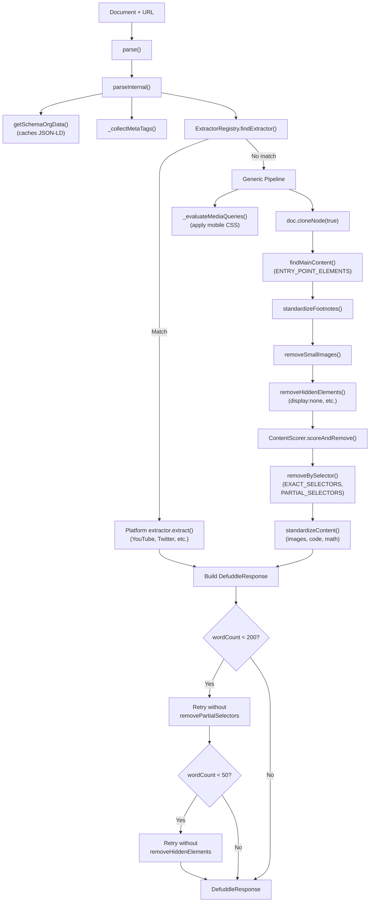
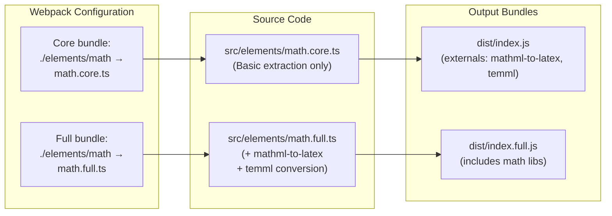

# Overview

Relevant source files

The following files were used as context for generating this wiki page:

- [README.md](README.md)
- [package-lock.json](package-lock.json)
- [package.json](package.json)
- [src/constants.ts](src/constants.ts)
- [src/defuddle.ts](src/defuddle.ts)
- [src/metadata.ts](src/metadata.ts)
- [src/types.ts](src/types.ts)
- [tsconfig.node.json](tsconfig.node.json)
- [webpack.config.js](webpack.config.js)

Defuddle is a TypeScript library for extracting main content from web pages. It removes clutter (navigation, ads, sidebars) and standardizes HTML into consistent formats suitable for Markdown conversion or direct consumption. 

The library was developed for the [Obsidian Web Clipper](https://github.com/obsidianmd/obsidian-clipper) browser extension, but runs in any environment: browser (core/full bundles), Node.js (linkedom/jsdom), or command-line.

**Core features:**
- Generic content extraction using scoring algorithms and selector-based removal
- Platform-specific extractors for YouTube, Twitter/X, Reddit, ChatGPT, GitHub, Hacker News
- HTML standardization for images, code blocks, math equations, and footnotes
- Comprehensive metadata extraction from Schema.org, meta tags, and DOM analysis
- Optional Markdown conversion via Turndown

**Sources:** [README.md:1-20](), [package.json:1-10]()

## System Architecture

Defuddle is organized into five major subsystems coordinated by the `Defuddle` class:

### High-Level Architecture

```mermaid
graph TB
    subgraph "Core Library (src/)"
        Defuddle["Defuddle class<br/>(defuddle.ts)"]
        Registry["ExtractorRegistry<br/>(extractor-registry.ts)"]
        Metadata["MetadataExtractor<br/>(metadata.ts)"]
        Scorer["ContentScorer<br/>(scoring.ts)"]
        Standardize["standardizeContent()<br/>(standardize.ts)"]
    end
    
    subgraph "Platform Extractors (src/extractors/)"
        YouTube["YouTubeExtractor"]
        Twitter["TwitterExtractor"]
        Reddit["RedditExtractor"]
        ChatGPT["ChatGPTExtractor"]
        GitHub["GitHubExtractor"]
        HackerNews["HackerNewsExtractor"]
    end
    
    subgraph "Element Transformers (src/elements/)"
        Images["imageRules<br/>(images.ts)"]
        Code["codeBlockRules<br/>(code-blocks.ts)"]
        Math["mathRules<br/>(math.ts)"]
        Footnotes["FootnoteHandler<br/>(footnotes.ts)"]
    end
    
    subgraph "Constants (src/constants.ts)"
        EntryPoints["ENTRY_POINT_ELEMENTS<br/>(21 selectors)"]
        ExactSel["EXACT_SELECTORS<br/>(238 selectors)"]
        PartialSel["PARTIAL_SELECTORS<br/>(812 patterns)"]
    end
    
    subgraph "Distribution"
        CoreBundle["dist/index.js<br/>(Core Bundle)"]
        FullBundle["dist/index.full.js<br/>(Full Bundle)"]
        NodeBundle["dist/node.js<br/>(Node.js Bundle)"]
    end
    
    Defuddle --> Registry
    Defuddle --> Metadata
    Defuddle --> Scorer
    Defuddle --> Standardize
    Defuddle --> EntryPoints
    Defuddle --> ExactSel
    Defuddle --> PartialSel
    
    Registry -.selects.-> YouTube
    Registry -.selects.-> Twitter
    Registry -.selects.-> Reddit
    Registry -.selects.-> ChatGPT
    Registry -.selects.-> GitHub
    Registry -.selects.-> HackerNews
    
    Standardize --> Images
    Standardize --> Code
    Standardize --> Math
    Standardize --> Footnotes
    
    Defuddle ==>|packaged| CoreBundle
    Defuddle ==>|packaged| FullBundle
    Defuddle ==>|packaged| NodeBundle
```

The `Defuddle` class ([src/defuddle.ts:51-1672]()) acts as the main orchestrator. It coordinates:

1. **ExtractorRegistry** - Pattern-matches URLs/DOM to select platform-specific extractors
2. **MetadataExtractor** - Extracts title, author, dates from Schema.org/meta tags/DOM
3. **ContentScorer** - Scores block elements by content density to identify main content
4. **standardizeContent()** - Normalizes HTML via element-specific transformation rules
5. **Selector constants** - 1000+ removal patterns for clutter (ads, navigation, metadata)

**Sources:** [src/defuddle.ts:1-30](), [src/constants.ts:1-100]()

### Content Extraction Pipeline

The `parse()` method orchestrates a multi-stage pipeline with automatic retry logic:

The pipeline includes three automatic retry strategies for pages where initial extraction produces minimal content:

| Retry Strategy | Trigger | Approach |
|----------------|---------|----------|
| Partial selector retry | `wordCount < 200` | Disable `removePartialSelectors` to preserve short articles |
| Hidden element retry | `wordCount < 50` | Disable `removeHiddenElements` for client-rendered SPAs |
| Index page retry | `wordCount < 50` | Disable `removeLowScoring` for listing/index pages |

**Sources:** [src/defuddle.ts:88-184](), [src/defuddle.ts:461-651]()

## Distribution Strategy

Defuddle produces four bundles via Webpack and TypeScript compilation:

### Bundle Configurations

| Bundle | Entry Point | Output | Format | Math Handling |
|--------|-------------|--------|--------|---------------|
| **Core** | [src/index.ts]() | `dist/index.js` | UMD | Externalizes `mathml-to-latex`, `temml` |
| **Full** | [src/index.full.ts]() | `dist/index.full.js` | UMD | Bundles `mathml-to-latex`, `temml` |
| **Node.js** | [src/node.ts]() | `dist/node.js` | CommonJS | Includes all dependencies |
| **CLI** | [src/cli.ts]() | `dist/cli.js` | Binary | Uses `commander` for args |

### Module Aliasing Strategy

Webpack's `resolve.alias` configuration ([webpack.config.js:69-72](), [webpack.config.js:94-97]()) allows the same import statement `import { mathRules } from './elements/math'` to resolve to different implementations depending on the build target:

- **Core bundle**: Aliases to `math.core.ts`, which extracts existing MathML/LaTeX but doesn't perform conversions
- **Full bundle**: Aliases to `math.full.ts`, which includes `mathml-to-latex` and `temml` for bidirectional conversion

The core bundle uses `externals` ([webpack.config.js:52-55]()) to exclude math libraries, requiring users to provide them separately if needed.

**Sources:** [webpack.config.js:48-99](), [package.json:24-38]()

## Key Capabilities

### Content Extraction

- **Generic Algorithm**: Uses content scoring, element removal, and structural analysis to identify main content from arbitrary web pages
- **Site-Specific Extractors**: Specialized handlers for major platforms including Twitter/X, YouTube, GitHub, ChatGPT, Grok, and Gemini
- **Metadata Extraction**: Comprehensive extraction from Schema.org data, meta tags, and DOM analysis

For detailed information, see [Content Extraction](#3) and [Site-Specific Extractors](#5).

### Content Standardization  

- **HTML Normalization**: Converts diverse HTML structures into consistent, clean markup
- **Element-Specific Rules**: Specialized processing for images, code blocks, mathematical expressions, and footnotes  
- **Mobile-Aware Processing**: Uses responsive design styles to identify and remove mobile-hidden elements

For detailed information, see [Content Standardization](#4).

### Multi-Format Output

- **Clean HTML**: Standardized HTML suitable for further processing or direct display
- **Markdown Conversion**: Optional conversion to Markdown format with preservation of semantic structure
- **Rich Metadata**: Extracted author, publication date, images, and structured data

For detailed information, see [Markdown Conversion](#6.1).

**Sources:** [README.md:10-20](), [src/defuddle.ts:95-118](), [src/types.ts]()
