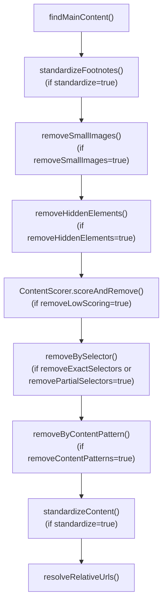
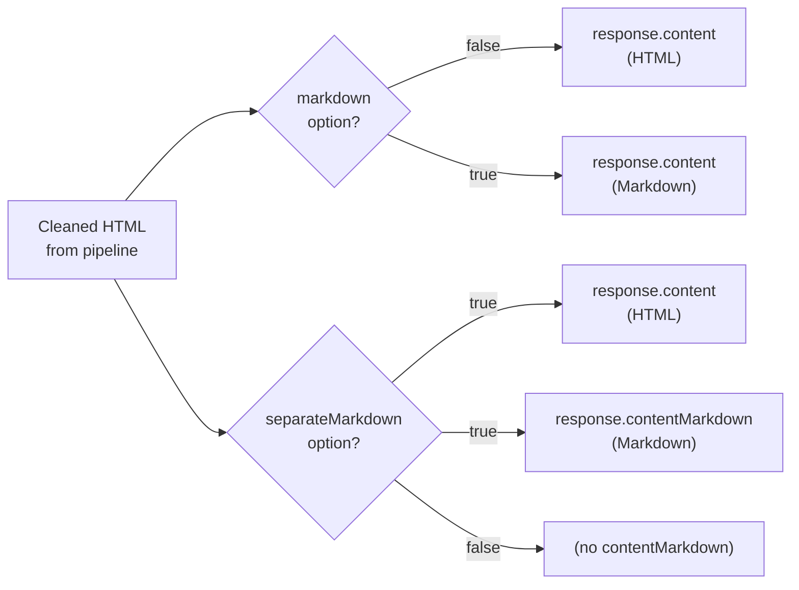
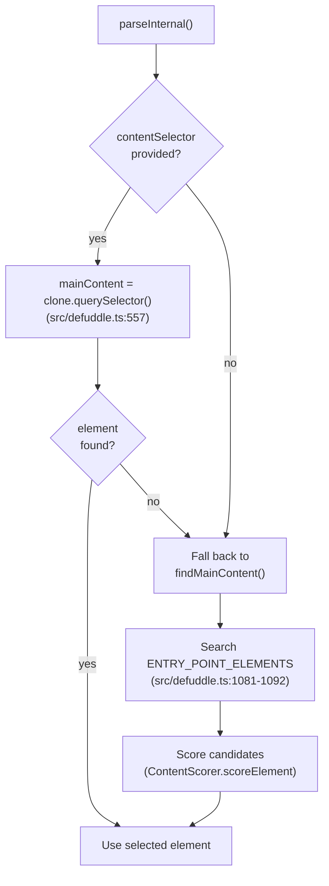
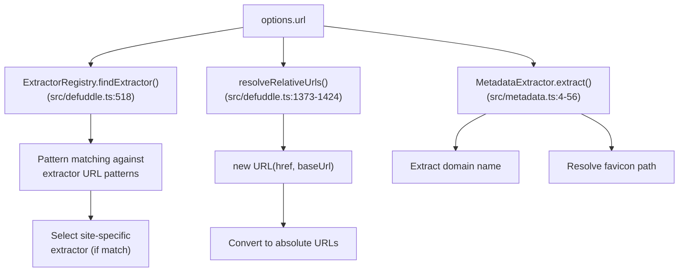
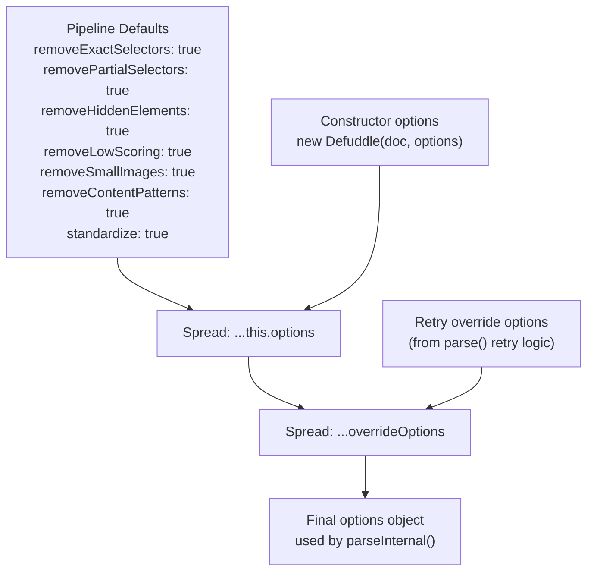
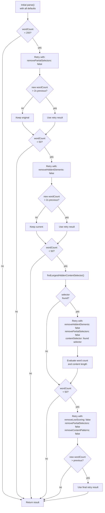

# Configuration and Options

<details>
<summary>Relevant source files</summary>

The following files were used as context for generating this wiki page:

- [README.md](README.md)
- [src/constants.ts](src/constants.ts)
- [src/defuddle.ts](src/defuddle.ts)
- [src/metadata.ts](src/metadata.ts)
- [src/types.ts](src/types.ts)

</details>


This page provides a comprehensive reference for the `DefuddleOptions` interface, which controls all aspects of Defuddle's content extraction and processing pipeline. Options enable fine-grained control over clutter removal phases, output formats, content selection strategy, and debug capabilities.

For information about using debug mode to diagnose extraction issues, see [Debugging Features](#11.1). For details on the extraction pipeline itself, see [Core Extraction Pipeline](#3.1).

---

## DefuddleOptions Interface

The `DefuddleOptions` interface is defined in [src/types.ts:43-126]() and controls the behavior of both the `Defuddle` class constructor and the `parseInternal()` method. All options are optional and have sensible defaults optimized for general web content extraction.

**Sources:** [src/types.ts:43-126]()

---

## Option Categories

Defuddle options are organized into five functional categories based on their role in the extraction pipeline.

### Pipeline Control Options

These boolean flags enable or disable specific phases of the clutter removal pipeline. All default to `true`, meaning the corresponding cleanup phase is active.

| Option | Type | Default | Description |
|--------|------|---------|-------------|
| `removeExactSelectors` | `boolean` | `true` | Remove elements matching exact CSS selectors (ads, navigation, footers, etc.) |
| `removePartialSelectors` | `boolean` | `true` | Remove elements whose attributes partially match clutter patterns |
| `removeHiddenElements` | `boolean` | `true` | Remove elements hidden via CSS (`display:none`, `visibility:hidden`, `opacity:0`) |
| `removeLowScoring` | `boolean` | `true` | Remove non-content blocks identified by the `ContentScorer` algorithm |
| `removeSmallImages` | `boolean` | `true` | Remove small images (icons, tracking pixels, buttons) |
| `removeContentPatterns` | `boolean` | `false` | Remove elements matching content-based patterns (read time, boilerplate text, article cards) |
| `standardize` | `boolean` | `true` | Standardize HTML structures (footnotes, code blocks, math, images) |

**Pipeline Execution Order:**



**Sources:** [src/defuddle.ts:484-494](), [src/defuddle.ts:575-620](), [src/types.ts:68-120]()

---

### Output Format Options

These options control how the extracted content is returned in the `DefuddleResponse`.

| Option | Type | Default | Description |
|--------|------|---------|-------------|
| `markdown` | `boolean` | `false` | Convert `content` field from HTML to Markdown |
| `separateMarkdown` | `boolean` | `false` | Keep `content` as HTML and add `contentMarkdown` field with Markdown |

When `markdown: true`, the HTML content is converted to Markdown using Turndown and custom rules. When `separateMarkdown: true`, both HTML and Markdown versions are returned in the response.

**Response Field Mapping:**



**Sources:** [src/types.ts:56-65](), [src/node.ts:1-50]()

---

### Content Selection Options

These options modify how Defuddle identifies and extracts content.

| Option | Type | Default | Description |
|--------|------|---------|-------------|
| `contentSelector` | `string` | `undefined` | CSS selector to use as main content element, bypassing auto-detection |
| `useAsync` | `boolean` | `true` | Allow async extractors to fetch from third-party APIs when local HTML has no content |
| `removeImages` | `boolean` | `false` | Remove all `` elements from the document |

**contentSelector Bypass Flow:**



The `contentSelector` option is particularly useful when debugging or when you know the exact location of content on a specific site. If the selector doesn't match any element, Defuddle falls back to its normal auto-detection logic.

**Sources:** [src/defuddle.ts:554-562](), [src/types.ts:122-125](), [src/types.ts:86-90]()

---

### Metadata Options

| Option | Type | Default | Description |
|--------|------|---------|-------------|
| `url` | `string` | `undefined` | URL of the page being parsed, used for resolving relative URLs and extractor selection |

The `url` option serves three purposes:

1. **Extractor Selection**: [src/extractor-registry.ts]() uses the URL to match site-specific extractors (YouTube, Reddit, Twitter, etc.)
2. **Relative URL Resolution**: Converts relative URLs in `href` and `src` attributes to absolute URLs
3. **Metadata Fallback**: Used when `document.URL` is not available (e.g., in Node.js environments)

**URL Usage Flow:**



**Sources:** [src/types.ts:50-53](), [src/defuddle.ts:517-522](), [src/defuddle.ts:1373-1424]()

---

### Debug Options

| Option | Type | Default | Description |
|--------|------|---------|-------------|
| `debug` | `boolean` | `false` | Enable debug logging and return debug information in response |

When `debug: true`, Defuddle modifies its behavior in several ways:

**Debug Mode Effects:**

| Effect | Implementation | Location |
|--------|---------------|----------|
| Console logging | `this._log()` outputs to console | [src/defuddle.ts:669-673]() |
| Debug response field | `result.debug` contains `contentSelector` and `removals` | [src/defuddle.ts:632-637]() |
| Preserve attributes | HTML `class`, `id`, and `data-*` attributes retained | [src/standardize.ts]() |
| Track removals | Each removed element logged with step, reason, and text preview | [src/defuddle.ts:842-849]() |

**Debug Response Structure:**

```typescript
interface DebugInfo {
  contentSelector: string;  // CSS selector path of main content element
  removals: DebugRemoval[]; // Array of removal events
}

interface DebugRemoval {
  step: string;      // Pipeline step: 'removeHiddenElements', 'removeLowScoring', etc.
  selector?: string; // Matching selector (for selector-based removal)
  reason?: string;   // Reason for removal: 'score: -20', 'display:none', etc.
  text: string;      // First 200 characters of removed content
}
```

**Sources:** [src/types.ts:22-32](), [src/defuddle.ts:632-637](), [src/defuddle.ts:842-849]()

---

## Option Application and Merging

Options flow through multiple stages of merging before being applied to the pipeline. Understanding this hierarchy is crucial for debugging unexpected behavior.

### Option Hierarchy



The merging happens at [src/defuddle.ts:484-494]():

```typescript
const options = {
  removeExactSelectors: true,
  removePartialSelectors: true,
  removeHiddenElements: true,
  removeLowScoring: true,
  removeSmallImages: true,
  removeContentPatterns: true,
  standardize: true,
  ...this.options,        // Constructor options
  ...overrideOptions      // Retry-specific overrides
};
```

**Sources:** [src/defuddle.ts:484-494]()

---

### Retry Logic and Dynamic Option Overrides

The `parse()` method uses dynamic option overrides to implement a sophisticated retry strategy when initial extraction yields insufficient content. This is a key part of Defuddle's "forgiving" extraction approach.

**Retry Strategy Flow:**



This retry logic appears in [src/defuddle.ts:88-159]().

**Sources:** [src/defuddle.ts:88-159](), [src/defuddle.ts:324-347]()

---

## Usage Examples

### Basic Usage with Options

```typescript
import Defuddle from 'defuddle';

// Minimal parsing with defaults
const result1 = new Defuddle(document).parse();

// Enable debug mode
const result2 = new Defuddle(document, { 
  debug: true 
}).parse();
console.log(result2.debug.contentSelector); // "article.post-content"
console.log(result2.debug.removals.length); // 47

// Convert to markdown
const result3 = new Defuddle(document, { 
  markdown: true 
}).parse();
console.log(typeof result3.content); // string (markdown)
```

**Sources:** [README.md:23-34]()

---

### Pipeline Tuning

```typescript
// Aggressive cleanup (remove more)
const aggressive = new Defuddle(document, {
  removePartialSelectors: true,   // default
  removeLowScoring: true,         // default
  removeContentPatterns: true     // enable pattern removal
}).parse();

// Conservative cleanup (remove less)
const conservative = new Defuddle(document, {
  removePartialSelectors: false,  // keep elements with ambiguous class names
  removeLowScoring: false,        // keep low-scoring blocks
  removeContentPatterns: false    // keep read-time, dates, etc.
}).parse();

// Minimal cleanup (remove almost nothing)
const minimal = new Defuddle(document, {
  removeExactSelectors: false,    // keep ads, navigation
  removePartialSelectors: false,
  removeHiddenElements: false,
  removeLowScoring: false,
  removeSmallImages: false,
  removeContentPatterns: false
}).parse();
```

**Sources:** [README.md:297-322]()

---

### Content Selection Override

```typescript
// Bypass auto-detection with specific selector
const result = new Defuddle(document, {
  contentSelector: 'article.main-content'
}).parse();

// If selector doesn't match, falls back to auto-detection
const fallback = new Defuddle(document, {
  contentSelector: '.does-not-exist'  // Falls back to findMainContent()
}).parse();
```

**Sources:** [README.md:312-321](), [src/defuddle.ts:554-562]()

---

### Node.js with Options

```typescript
import { parseHTML } from 'linkedom';
import { Defuddle } from 'defuddle/node';

const { document } = parseHTML(html);

// Node.js automatically uses markdown conversion
const result = await Defuddle(document, 'https://example.com', {
  markdown: true,           // Convert to markdown
  debug: true,              // Enable debug mode
  removeImages: false,      // Keep images
  standardize: true         // Standardize HTML before conversion
});
```

**Sources:** [README.md:40-52](), [src/node.ts:1-50]()

---

### Disabling Async Extractors

```typescript
// Prevent third-party API calls
const result = await new Defuddle(document, {
  useAsync: false  // Only use local HTML, no external fetches
}).parseAsync();

// Default behavior: allows async extractors
const withAsync = await new Defuddle(document, {
  useAsync: true   // May fetch from FxTwitter API, etc.
}).parseAsync();
```

**Sources:** [src/types.ts:86-90](), [src/defuddle.ts:393-409]()

---

## Option-to-Code Mapping

The following table maps each option to its implementation in the codebase:

| Option | Primary Implementation | Related Code |
|--------|----------------------|--------------|
| `debug` | [src/defuddle.ts:70]() | [src/defuddle.ts:669-673](), [src/defuddle.ts:632-637]() |
| `url` | [src/defuddle.ts:518]() | [src/defuddle.ts:1373-1424](), [src/metadata.ts:8-41]() |
| `markdown` | [src/node.ts:35-44]() | [src/markdown.ts]() |
| `separateMarkdown` | [src/node.ts:35-44]() | [src/markdown.ts]() |
| `removeExactSelectors` | [src/defuddle.ts:597-606]() | [src/defuddle.ts:854-976]() |
| `removePartialSelectors` | [src/defuddle.ts:597-606]() | [src/defuddle.ts:887-935]() |
| `removeHiddenElements` | [src/defuddle.ts:585-588]() | [src/defuddle.ts:777-852]() |
| `removeLowScoring` | [src/defuddle.ts:590-594]() | [src/scoring.ts]() |
| `removeSmallImages` | [src/defuddle.ts:580-583]() | [src/defuddle.ts:1033-1048]() |
| `removeContentPatterns` | [src/defuddle.ts:609-611]() | [src/defuddle.ts:1426-1553]() |
| `standardize` | [src/defuddle.ts:576-578](), [src/defuddle.ts:614-616]() | [src/standardize.ts]() |
| `contentSelector` | [src/defuddle.ts:554-562]() | [src/defuddle.ts:1077-1149]() |
| `useAsync` | [src/defuddle.ts:394](), [src/defuddle.ts:403]() | [src/defuddle.ts:393-434]() |
| `removeImages` | [src/defuddle.ts:511-513]() | [src/defuddle.ts:770-775]() |

**Sources:** [src/defuddle.ts:1-2000](), [src/types.ts:43-126]()

---

## Related Configuration Systems

While this page covers the `DefuddleOptions` interface, several related configuration systems exist:

- **Selector Constants**: The extensive selector lists in [src/constants.ts]() (e.g., `EXACT_SELECTORS`, `PARTIAL_SELECTORS`) are not configurable via options but can be understood through [Constants and Selectors](#3.3)
- **Debug Output**: The structure and usage of debug information is detailed in [Debugging Features](#11.1)
- **Pipeline Phases**: The execution order and internal logic of pipeline phases is explained in [Clutter Removal Pipeline](#4.3)

**Sources:** [src/constants.ts:1-977]()
