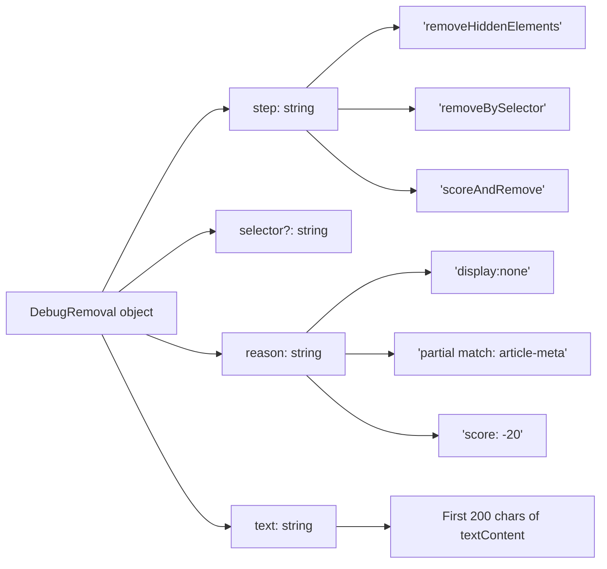
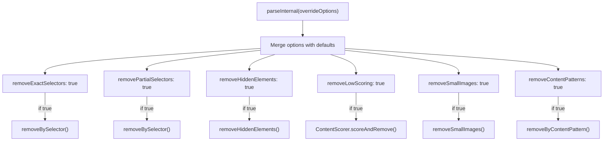
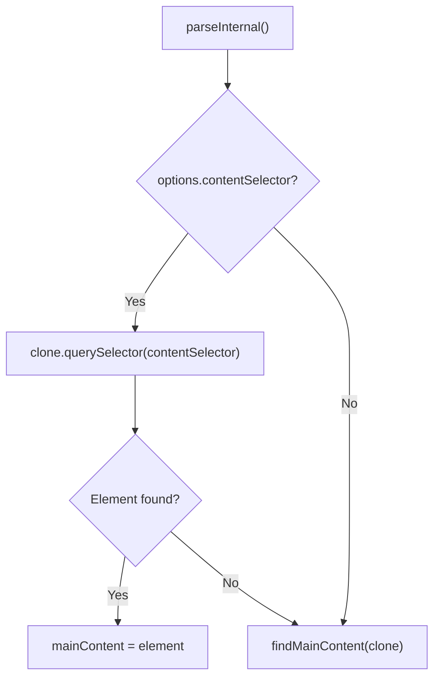
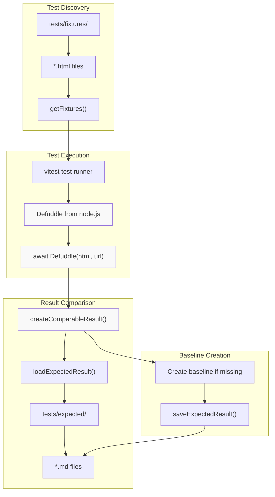
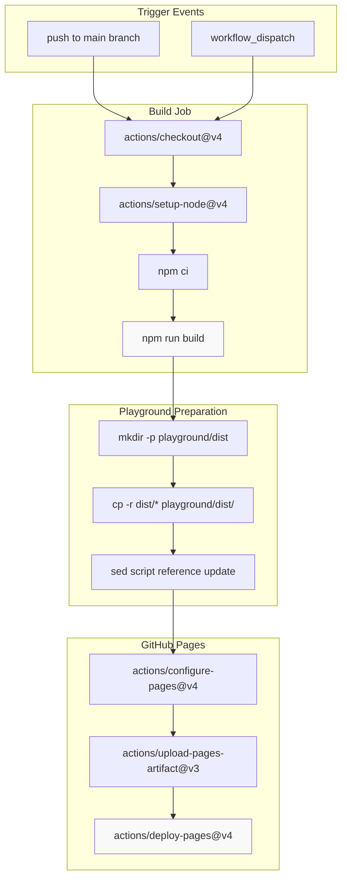

# Development

<details>
<summary>Relevant source files</summary>

The following files were used as context for generating this wiki page:

- [src/constants.ts](src/constants.ts)
- [src/defuddle.ts](src/defuddle.ts)
- [tests/debug.test.ts](tests/debug.test.ts)
- [website/src/docs.ts](website/src/docs.ts)
- [website/src/landing.ts](website/src/landing.ts)
- [website/src/playground.ts](website/src/playground.ts)

</details>


This document covers development resources for working with and contributing to Defuddle, including debugging features for tuning extraction behavior and the testing framework for validating changes.

## Debugging Features

Defuddle provides comprehensive debugging capabilities to help diagnose extraction issues and tune parsing behavior.

### Debug Mode

Debug mode is enabled by setting the `debug` option to `true` when creating a Defuddle instance:

```javascript
const result = new Defuddle(document, { debug: true }).parse();
```

When debug mode is enabled:
- Returns a `debug` field in `DefuddleResponse` with detailed extraction information
- Outputs verbose console logging about the parsing process via `_log()` method
- Preserves HTML `class` and `id` attributes that are normally stripped
- Retains all `data-*` attributes for inspection
- Skips div flattening to preserve document structure

Sources: [src/defuddle.ts:67-71](), [src/defuddle.ts:669-673](), [src/defuddle.ts:632-637]()

### Debug Response Structure

The `debug` field in `DefuddleResponse` contains two key properties:

| Property | Type | Description |
|----------|------|-------------|
| `contentSelector` | `string` | CSS selector path of the chosen main content element |
| `removals` | `DebugRemoval[]` | Array of elements removed during processing |

The `contentSelector` field is populated by `getElementSelector()` at [src/defuddle.ts:634]() and shows the precise DOM path to the extracted content, useful for creating custom `contentSelector` overrides.

Sources: [src/defuddle.ts:632-637](), [src/types.ts]()

#### Title: Debug Removals Array Structure



Sources: [src/types.ts](), [src/defuddle.ts:842-847](), [src/defuddle.ts:958-964]()

Each entry in the `removals` array contains:

| Field | Description |
|-------|-------------|
| `step` | Pipeline step that removed the element (e.g. `removeHiddenElements`, `removeBySelector`, `scoreAndRemove`) |
| `selector` | CSS selector or pattern that matched (optional) |
| `reason` | Human-readable explanation (e.g. `display:none`, `partial match: article-meta`, `score: -20`) |
| `text` | First 200 characters of the removed element's text content |

The removals are logged at three points in the pipeline: `removeHiddenElements()` at [src/defuddle.ts:842-847](), `removeBySelector()` at [src/defuddle.ts:958-964](), and `ContentScorer.scoreAndRemove()`.

Sources: [src/defuddle.ts:777-851](), [src/defuddle.ts:854-976](), [src/scoring.ts]()

### Pipeline Toggles

Defuddle allows disabling individual pipeline steps to diagnose extraction issues:

| Option | Default | Purpose |
|--------|---------|---------|
| `removeExactSelectors` | `true` | Remove elements matching exact selectors (ads, social buttons, etc.) |
| `removePartialSelectors` | `true` | Remove elements matching partial attribute patterns |
| `removeHiddenElements` | `true` | Remove elements hidden via CSS (`display:none`, `visibility:hidden`, etc.) |
| `removeLowScoring` | `true` | Remove non-content blocks by content scoring (navigation, link lists, etc.) |
| `removeSmallImages` | `true` | Remove small images (icons, tracking pixels, etc.) |
| `removeContentPatterns` | `true` | Remove elements by content patterns (read time, boilerplate, article cards) |
| `standardize` | `true` | Standardize HTML (footnotes, headings, code blocks, etc.) |

These options are processed in `parseInternal()` at [src/defuddle.ts:484-494]() and control the removal steps executed during parsing.

Sources: [src/defuddle.ts:484-616](), [src/types.ts]()

#### Title: Pipeline Toggle Usage



Sources: [src/defuddle.ts:484-616]()

Example usage:

```javascript
// Skip content scoring to preserve more content
const result = new Defuddle(document, { 
  removeLowScoring: false 
}).parse();

// Skip hidden element removal for JavaScript-rendered pages
const result = new Defuddle(document, { 
  removeHiddenElements: false 
}).parse();

// Disable all removal steps
const result = new Defuddle(document, {
  removeLowScoring: false,
  removeHiddenElements: false,
  removeSmallImages: false,
  removeExactSelectors: false,
  removePartialSelectors: false,
  removeContentPatterns: false
}).parse();
```

The retry mechanism in `parse()` automatically uses these toggles: if initial extraction yields < 200 words, it retries with `removePartialSelectors: false` at [src/defuddle.ts:93-106](). If still < 50 words, it retries with `removeHiddenElements: false` at [src/defuddle.ts:112-143]().

Sources: [src/defuddle.ts:88-159](), [tests/debug.test.ts:57-114]()

### Content Selector Override

The `contentSelector` option bypasses automatic content detection and specifies the main content element directly:

```javascript
const result = new Defuddle(document, {
  contentSelector: 'article.post-content'
}).parse();
```

If the selector doesn't match any element, Defuddle falls back to automatic detection via `findMainContent()`. The selector is processed at [src/defuddle.ts:556-562]().

Sources: [src/defuddle.ts:556-573](), [tests/debug.test.ts:116-154]()

#### Title: Content Selector Flow



Sources: [src/defuddle.ts:556-573]()

## Testing Framework

The testing framework uses a fixture-based approach where HTML files are processed by Defuddle and compared against expected results. This system enables comprehensive regression testing and validation of extractor functionality.

### Testing Architecture



Sources: [tests/fixtures.test.ts:1-113]()

### Test File Organization

The testing system follows a structured approach for organizing test data:

| Directory | Purpose | File Format |
|-----------|---------|-------------|
| `tests/fixtures/` | Input HTML files | `.html` files named by domain |
| `tests/expected/` | Expected outputs | `.md` files with JSON metadata preamble |

The `getFixtures()` function at [tests/fixtures.test.ts:36-46]() discovers all HTML files in the fixtures directory, while `getExpectedMarkdownPath()` at [tests/fixtures.test.ts:49-51]() constructs paths to corresponding expected result files.

Sources: [tests/fixtures.test.ts:36-51]()

### Expected Result Format

The testing framework uses a hybrid format combining JSON metadata with Markdown content. The `createComparableResult()` function at [tests/fixtures.test.ts:71-80]() creates this format:

```markdown
```json
{
  "title": "Defuddle on Cloudflare Workers · Issue #56 · kepano/defuddle",
  "author": "jmorrell", 
  "site": "GitHub",
  "published": "2025-05-25T20:35:48.000Z"
}
```

**jmorrell** opened this issue on 5/25/2025

Example repo here: [https://github.com/jmorrell/defuddle-cloudflare-example]...
```

This format allows for easy visual comparison of both metadata and content changes during development.

Sources: [tests/fixtures.test.ts:71-80](), [tests/expected/github.com-issue-56.md:1-71]()

### Adding New Test Cases

To add new test fixtures:

1. Add HTML files to `tests/fixtures/` directory
2. Run `npm test` to generate baseline expected results
3. Review generated files in `tests/expected/`
4. The test runner automatically creates baselines for missing expected results

The test execution logic at [tests/fixtures.test.ts:89-111]() handles both baseline creation and comparison, logging when new baselines are created.

Sources: [tests/fixtures.test.ts:89-111]()

## Continuous Integration and Deployment

The project uses GitHub Actions for automated deployment of the playground to GitHub Pages, ensuring the latest version is always available for testing.

### Deployment Pipeline



Sources: [.github/workflows/deploy-playground.yml:1-53]()

### Build and Deployment Process

The deployment workflow performs several key steps:

1. **Environment Setup**: Uses Node.js 20 and installs dependencies with `npm ci`
2. **Build Process**: Runs `npm run build` to create distribution files
3. **Asset Preparation**: Copies built files to `playground/dist/` directory
4. **Script Reference Update**: Updates HTML to reference local distribution files using `sed -i 's|\.\.\/dist\/|dist\/|g'`
5. **Pages Deployment**: Uploads the playground directory as a GitHub Pages artifact

The workflow is configured with appropriate permissions for GitHub Pages deployment and runs on both push to main and manual workflow dispatch.

Sources: [.github/workflows/deploy-playground.yml:18-42]()

### Playground Distribution Structure

After deployment, the playground has the following structure:

```
playground/
├── index.html          # Main playground interface
├── dist/              # Built Defuddle distribution files
│   ├── index.js       # Core bundle
│   ├── index.full.js  # Full bundle with dependencies
│   └── node.js        # Node.js bundle
└── README.md          # Usage documentation
```

The script reference update at [.github/workflows/deploy-playground.yml:34]() ensures the playground HTML correctly references the local distribution files rather than the relative path used during development.

Sources: [.github/workflows/deploy-playground.yml:30-42](), [playground/README.md:1-21]()
