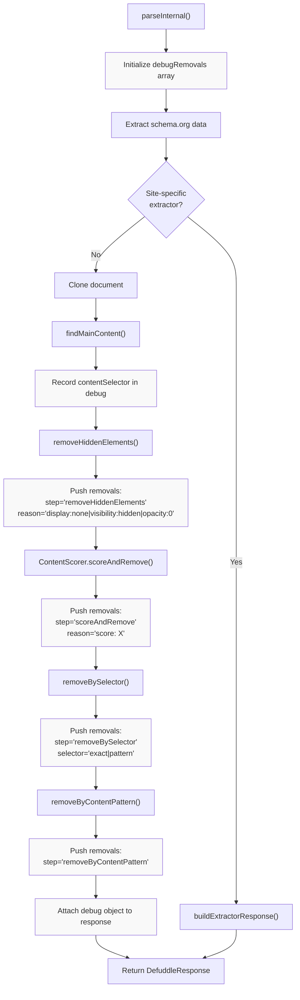
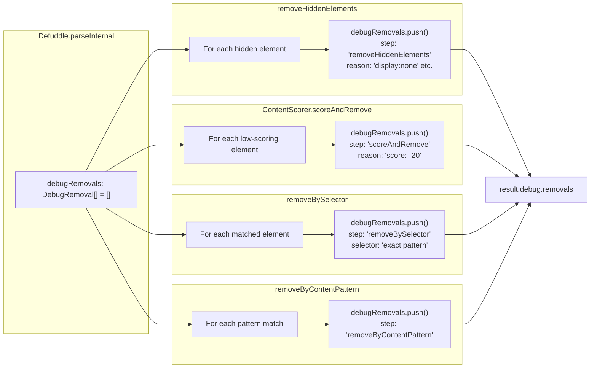
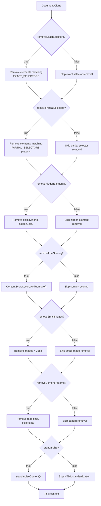
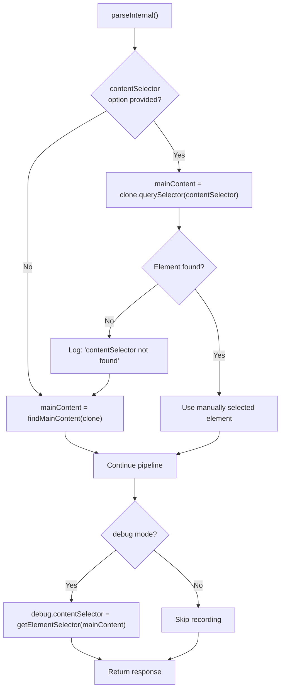

# Debugging Features

<details>
<summary>Relevant source files</summary>

The following files were used as context for generating this wiki page:

- [src/constants.ts](src/constants.ts)
- [src/defuddle.ts](src/defuddle.ts)
- [tests/debug.test.ts](tests/debug.test.ts)
- [website/src/docs.ts](website/src/docs.ts)
- [website/src/landing.ts](website/src/landing.ts)
- [website/src/playground.ts](website/src/playground.ts)

</details>


This page documents the debugging capabilities built into Defuddle for diagnosing content extraction issues. These features help developers understand why certain content was selected or removed during the parsing pipeline.

For general configuration options not specific to debugging, see [Configuration and Options](#10). For understanding how the extraction pipeline works, see [Core Extraction Pipeline](#3.1).

---

## Debug Mode Overview

Debug mode is enabled by setting `debug: true` in the options passed to the Defuddle constructor. When enabled, it provides:

- A `debug` field in the `DefuddleResponse` containing extraction diagnostics
- Verbose console logging via `console.log` throughout the parsing process
- Preservation of HTML structure attributes (`class`, `id`, `data-*`) that are normally stripped
- Skipping of wrapper flattening to maintain the original document structure

```javascript
// Browser usage
const result = new Defuddle(document, { debug: true }).parse();
console.log(result.debug.contentSelector);  // CSS selector of main content
console.log(result.debug.removals);         // Array of removed elements

// Node.js usage
const result = await Defuddle(document, url, { debug: true });
```

**Sources:** [src/defuddle.ts:54-70](), [src/defuddle.ts:632-637](), [website/src/docs.ts:491-511]()

---

## Debug Response Structure

When debug mode is enabled, the `DefuddleResponse` includes a `debug` field with two key properties:

| Property | Type | Description |
|----------|------|-------------|
| `contentSelector` | `string` | CSS selector path identifying the chosen main content element |
| `removals` | `DebugRemoval[]` | Array of all elements removed during processing, with metadata about why they were removed |

### Debug Removal Entry Structure

Each entry in the `removals` array contains:

| Property | Type | Description |
|----------|------|-------------|
| `step` | `string` | Pipeline stage that removed the element: `"removeHiddenElements"`, `"removeBySelector"`, `"scoreAndRemove"`, `"removeByContentPattern"` |
| `selector` | `string?` | CSS selector or pattern that matched (if applicable) |
| `reason` | `string` | Human-readable explanation (e.g., `"display:none"`, `"score: -20"`, `"exact selector match"`) |
| `text` | `string` | First 200 characters of the removed element's text content for identification |

**Sources:** [src/defuddle.ts:632-637](), [src/types.ts:2](), [website/src/docs.ts:524-536]()

---

## Debug Data Flow Through Pipeline



**Sources:** [src/defuddle.ts:461-651](), [src/defuddle.ts:777-851](), [src/defuddle.ts:854-976]()

---

## Debug Removal Collection Points

The following diagram maps where debug removals are recorded throughout the codebase:



**Sources:** [src/defuddle.ts:495](), [src/defuddle.ts:842-850](), [src/defuddle.ts:958-965](), [src/scoring.ts]()

---

## Console Logging

Debug mode enables verbose logging through the private `_log()` method, which only outputs when `this.debug === true`:

| Log Point | Message | Location |
|-----------|---------|----------|
| Retry logic | "Initial parse returned very little content, trying again" | [src/defuddle.ts:94]() |
| Retry success | "Retry produced more content" | [src/defuddle.ts:104]() |
| Hidden content retry | "Still very little content, retrying without hidden-element removal" | [src/defuddle.ts:113]() |
| Selector retry | "Retrying with hidden content selector: ..." | [src/defuddle.ts:126]() |
| Index page retry | "Still very little content, retrying without scoring/partial selectors" | [src/defuddle.ts:149]() |
| Schema fallback | "Found DOM content matching schema.org text" | [src/defuddle.ts:174]() |
| contentSelector usage | "Using contentSelector: X found/not found" | [src/defuddle.ts:558]() |
| Content candidates | "Content candidates: [{element, selector, score}]" | [src/defuddle.ts:1103-1108]() |
| Small images | "Found small elements: X" | [src/defuddle.ts:1029]() |
| Hidden elements | "Removed hidden elements: X" | [src/defuddle.ts:851]() |
| Clutter removal | "Removed clutter elements: {exactSelectors, partialSelectors, total}" | [src/defuddle.ts:970-975]() |

**Sources:** [src/defuddle.ts:669-673](), [src/defuddle.ts:94-174]()

---

## Pipeline Toggles

Individual stages of the extraction pipeline can be disabled for diagnostic purposes. Each toggle is a boolean option that defaults to `true`:

### Removal Pipeline Toggles



### Toggle Reference Table

| Option | Default | Purpose | When to Disable |
|--------|---------|---------|-----------------|
| `removeExactSelectors` | `true` | Remove elements matching exact CSS selectors (ads, headers, footers) | Page uses common class names for actual content (e.g., `.author` for byline in article text) |
| `removePartialSelectors` | `true` | Remove elements with attributes matching patterns (e.g., `post-meta`, `article-date`) | Short pages where partial selectors are too aggressive |
| `removeHiddenElements` | `true` | Remove CSS-hidden elements (`display:none`, `visibility:hidden`, `opacity:0`) | Content reveals on interaction or uses hidden wrappers |
| `removeLowScoring` | `true` | Remove blocks with low content scores (navigation, link lists) | Index/listing pages where cards are scored as non-content |
| `removeSmallImages` | `true` | Remove images smaller than 33×33 pixels | Icons are part of legitimate content |
| `removeContentPatterns` | `true` | Remove elements matching content patterns (read time, boilerplate text) | Legitimate content contains these patterns |
| `removeImages` | `false` | Remove all images from output | Text-only extraction needed |
| `standardize` | `true` | Run HTML standardization (footnotes, headings, code blocks, math) | Debugging raw extraction before normalization |

**Sources:** [src/defuddle.ts:484-494](), [src/defuddle.ts:576-616](), [tests/debug.test.ts:57-114]()

---

## Using Pipeline Toggles

```javascript
// Disable content scoring for index pages
const result = new Defuddle(document, {
    removeLowScoring: false,
    removePartialSelectors: false
}).parse();

// Disable hidden element removal for JavaScript-rendered content
const result = new Defuddle(document, {
    removeHiddenElements: false
}).parse();

// Extract raw content without any standardization
const result = new Defuddle(document, {
    standardize: false,
    removeExactSelectors: false,
    removePartialSelectors: false
}).parse();

// Combine with debug mode to understand the difference
const withScoring = new Defuddle(document, { debug: true }).parse();
const withoutScoring = new Defuddle(document, {
    debug: true,
    removeLowScoring: false
}).parse();

console.log('Removed by scoring:', 
    withScoring.debug.removals.filter(r => r.step === 'scoreAndRemove')
);
```

**Sources:** [website/src/docs.ts:538-553](), [tests/debug.test.ts:58-75]()

---

## contentSelector Option

The `contentSelector` option bypasses automatic content detection and forces Defuddle to use a specific CSS selector as the main content element:

```javascript
const result = new Defuddle(document, {
    contentSelector: 'article.post-content'
}).parse();
```

### Behavior

1. If the selector matches an element, that element becomes `mainContent`
2. If the selector doesn't match, fallback to automatic content detection
3. The selector is logged when debug mode is enabled
4. The chosen selector appears in `debug.contentSelector` regardless of whether it was manually specified

### Use Cases

| Scenario | Example Selector |
|----------|------------------|
| Known content container | `article.post-content`, `#main-article` |
| Bypass scoring on feed pages | `.article-card:first-child` |
| Target hidden content wrapper | `[data-article-content]` |
| Extract specific section | `section.methodology` |
| Force body as root | `body` (extracts everything) |



**Sources:** [src/defuddle.ts:556-562](), [src/defuddle.ts:632-637](), [tests/debug.test.ts:116-154]()

---

## Debug Workflow Example

The following workflow demonstrates using debug features to troubleshoot an extraction issue:

### Step 1: Initial Parse with Debug

```javascript
const result = new Defuddle(document, {
    debug: true,
    url: 'https://example.com/article'
}).parse();

console.log('Content selector:', result.debug.contentSelector);
console.log('Word count:', result.wordCount);
console.log('Removals:', result.debug.removals.length);
```

### Step 2: Examine Removals by Step

```javascript
const byStep = result.debug.removals.reduce((acc, r) => {
    acc[r.step] = (acc[r.step] || 0) + 1;
    return acc;
}, {});

console.log('Removals by pipeline step:', byStep);
// Example output:
// {
//   removeBySelector: 45,
//   removeHiddenElements: 12,
//   scoreAndRemove: 8
// }
```

### Step 3: Identify Problem Removals

```javascript
// Find removals that might be content
const suspectRemovals = result.debug.removals.filter(r => {
    const wordCount = r.text.split(/\s+/).length;
    return wordCount > 20;  // Removed elements with substantial text
});

console.log('Potentially removed content:', suspectRemovals);
```

### Step 4: Test with Toggles Disabled

```javascript
// If many removals from scoreAndRemove, try disabling it
const retryResult = new Defuddle(document, {
    debug: true,
    removeLowScoring: false
}).parse();

console.log('Before:', result.wordCount);
console.log('After:', retryResult.wordCount);
```

### Step 5: Use Specific Content Selector

```javascript
// If a specific container is known from debug.contentSelector
const targetResult = new Defuddle(document, {
    debug: true,
    contentSelector: 'div.article-body'
}).parse();
```

**Sources:** [website/src/docs.ts:491-561](), [tests/debug.test.ts:17-154]()

---

## Attribute Preservation in Debug Mode

When debug mode is enabled, certain HTML attributes are preserved that would normally be stripped during the cleaning process:

| Attribute | Normal Mode | Debug Mode | Purpose |
|-----------|-------------|------------|---------|
| `class` | Removed | Preserved | Identify elements by CSS classes |
| `id` | Removed | Preserved | Identify elements by IDs |
| `data-*` | Removed | Preserved | Inspect custom data attributes |

This preservation allows developers to inspect the extracted HTML and understand which specific elements were selected or removed based on their attributes.

**Sources:** [src/defuddle.ts:632-637](), [src/constants.ts:973-976]()

---

## Testing with Debug Features

The test suite demonstrates proper usage of debug features:

```javascript
// Verify debug field exists and is populated
test('debug: true returns debug info', async () => {
    const result = await Defuddle(parseDocument(html, url), url, { 
        debug: true 
    });
    
    expect(result.debug).toBeDefined();
    expect(result.debug.contentSelector).toBeTruthy();
    expect(Array.isArray(result.debug.removals)).toBe(true);
});

// Verify removal entries have required fields
test('debug removals include step and text', async () => {
    const result = await Defuddle(parseDocument(html, url), url, { 
        debug: true 
    });
    
    for (const removal of result.debug.removals) {
        expect(removal.step).toBeTruthy();
        expect(typeof removal.text).toBe('string');
        expect(removal.text.length).toBeLessThanOrEqual(200);
    }
});

// Verify pipeline toggles affect removals
test('removeLowScoring: false skips content scoring', async () => {
    const withScoring = await Defuddle(parseDocument(html, url), url, {
        debug: true
    });
    const withoutScoring = await Defuddle(parseDocument(html, url), url, {
        debug: true,
        removeLowScoring: false
    });
    
    const scoringRemovals = withoutScoring.debug.removals.filter(
        r => r.step === 'scoreAndRemove'
    );
    expect(scoringRemovals.length).toBe(0);
});
```

For more comprehensive testing information, see [Testing Framework](#11.2).

**Sources:** [tests/debug.test.ts:1-154]()
