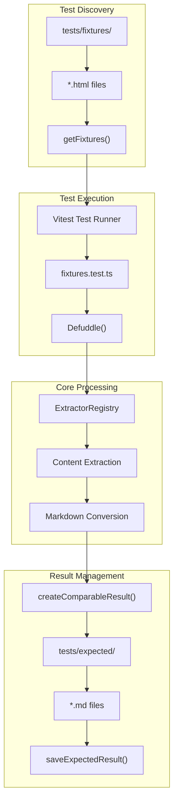
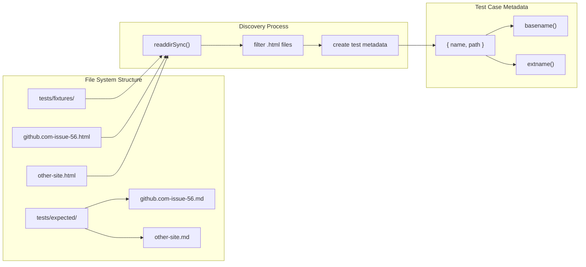
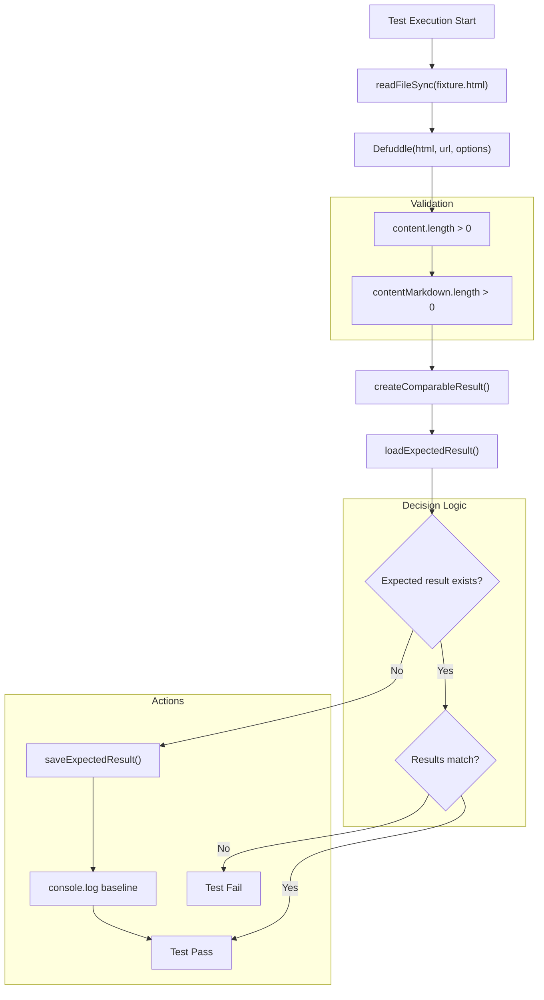
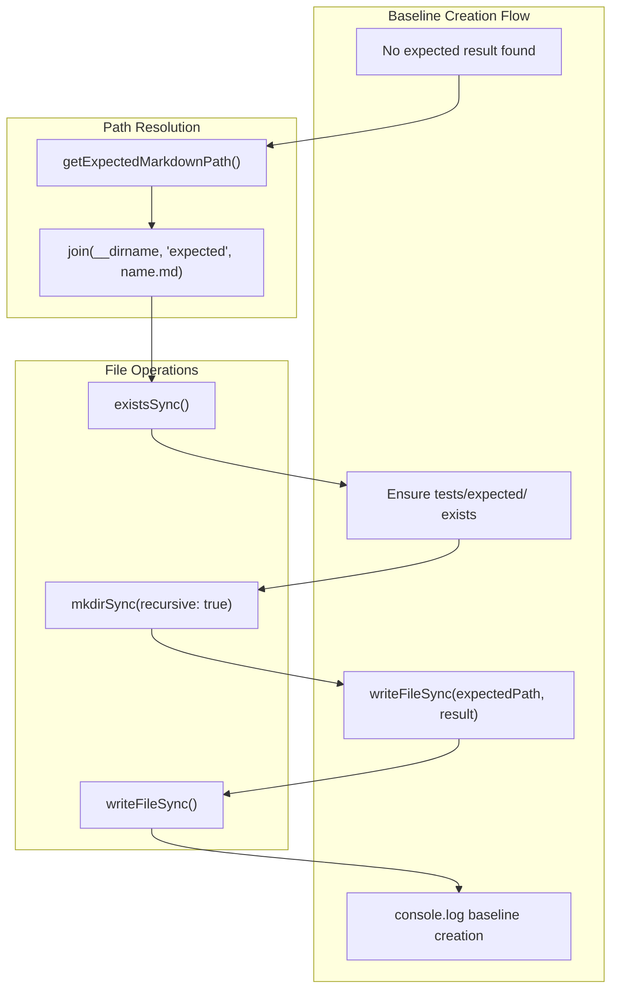
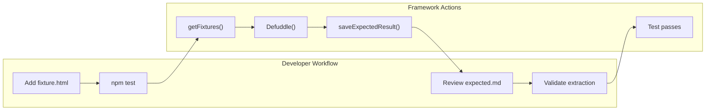

# Testing Framework

<details>
<summary>Relevant source files</summary>

The following files were used as context for generating this wiki page:

- [src/elements/code.ts](src/elements/code.ts)
- [src/extractors/youtube.ts](src/extractors/youtube.ts)
- [tests/youtube-transcript.test.ts](tests/youtube-transcript.test.ts)
- [website/src/convert.ts](website/src/convert.ts)

</details>


The Defuddle testing framework provides a comprehensive fixture-based testing system for validating content extraction across different websites and content types. The framework automatically discovers HTML fixtures, processes them through Defuddle extractors, and compares results against saved expected outputs to ensure consistent extraction quality.

For information about the interactive playground for manual testing, see [Playground](#7.1).

## Architecture Overview

The testing framework operates on a fixture-driven approach where real-world HTML samples are stored as test cases and processed through the complete Defuddle pipeline. The system automatically handles baseline creation, result comparison, and test failure reporting.



**Test Framework Architecture**

Sources: [tests/fixtures.test.ts:1-113]()

## Fixture Discovery System

The framework automatically discovers test cases through the `getFixtures()` function, which scans the `tests/fixtures/` directory for HTML files and creates test case metadata.



**Fixture Discovery and File Structure**

| Function | Purpose | Location |
|----------|---------|----------|
| `getFixtures()` | Discovers HTML fixtures in tests/fixtures/ | [tests/fixtures.test.ts:36-46]() |
| `readdirSync()` | Reads fixture directory contents | [tests/fixtures.test.ts:38]() |
| `basename()` | Extracts fixture name from filename | [tests/fixtures.test.ts:41]() |

Sources: [tests/fixtures.test.ts:35-46]()

## Expected Results Format

The framework stores expected results as markdown files with JSON metadata preambles. This format enables both automated comparison and human review of extraction quality.

```mermaid
graph TB
    subgraph "DefuddleResponse Structure"
        RESPONSE["DefuddleResponse"]
        TITLE["title"]
        AUTHOR["author"]
        SITE["site"]
        PUBLISHED["published"]
        CONTENT_MD["contentMarkdown"]
        CONTENT_HTML["content"]
    end
    
    subgraph "Expected Result Format"
        JSON_BLOCK["```json\n{ metadata }\n```"]
        SEPARATOR["\n\n"]
        MARKDOWN_CONTENT["markdown content"]
    end
    
    subgraph "Processing Functions"
        CREATE_COMPARABLE["createComparableResult()"]
        METADATA_ONLY["metadataOnly extraction"]
        JSON_STRINGIFY["JSON.stringify()"]
    end
    
    RESPONSE --> TITLE
    RESPONSE --> AUTHOR
    RESPONSE --> SITE
    RESPONSE --> PUBLISHED
    RESPONSE --> CONTENT_MD
    
    TITLE --> METADATA_ONLY
    AUTHOR --> METADATA_ONLY
    SITE --> METADATA_ONLY
    PUBLISHED --> METADATA_ONLY
    
    METADATA_ONLY --> JSON_STRINGIFY
    JSON_STRINGIFY --> JSON_BLOCK
    CONTENT_MD --> MARKDOWN_CONTENT
    
    JSON_BLOCK --> CREATE_COMPARABLE
    SEPARATOR --> CREATE_COMPARABLE
    MARKDOWN_CONTENT --> CREATE_COMPARABLE
```

**Expected Result File Format Structure**

The `createComparableResult()` function transforms `DefuddleResponse` objects into a standardized format:

```typescript
// Metadata extracted for comparison
const metadataOnly = {
  title: response.title,
  author: response.author, 
  site: response.site,
  published: response.published,
};
```

Sources: [tests/fixtures.test.ts:71-80]()

## Test Execution Pipeline

The test execution follows a comprehensive pipeline that processes fixtures through the complete Defuddle system and validates results against expectations.



**Test Execution Flow**

| Step | Function | Purpose |
|------|----------|---------|
| Load Fixture | `readFileSync()` | Read HTML fixture content | 
| Process | `Defuddle()` | Extract content using full pipeline |
| Format Result | `createComparableResult()` | Create standardized comparison format |
| Load Expected | `loadExpectedResult()` | Load saved expected result |
| Compare | `expect().toEqual()` | Validate extraction matches expectation |

Sources: [tests/fixtures.test.ts:89-111]()

## Baseline Creation and Management

When no expected result exists for a fixture, the framework automatically creates a baseline expected result. This supports iterative test development and ensures new fixtures are immediately testable.



**Baseline Creation Process**

The `saveExpectedResult()` function manages baseline creation:

| Function | Purpose | Location |
|----------|---------|----------|
| `getExpectedMarkdownPath()` | Generate expected result file path | [tests/fixtures.test.ts:49-51]() |
| `saveExpectedResult()` | Write expected result to filesystem | [tests/fixtures.test.ts:53-60]() |
| `loadExpectedResult()` | Load existing expected result | [tests/fixtures.test.ts:62-69]() |

Sources: [tests/fixtures.test.ts:48-69](), [tests/fixtures.test.ts:102-106]()

## Adding New Test Cases

New test cases are added by placing HTML fixture files in the `tests/fixtures/` directory. The framework automatically discovers and processes them during test execution.

### Fixture Naming Convention

Fixture files should be named using the pattern `domain.com-page-identifier.html` to clearly identify their source and content type:

- `github.com-issue-56.html` - GitHub issue page
- `twitter.com-thread-123.html` - Twitter thread
- `youtube.com-video-abc.html` - YouTube video page

### Test Case Workflow

1. **Add Fixture**: Place HTML file in `tests/fixtures/`
2. **Run Tests**: Execute `npm test` to discover new fixture
3. **Review Baseline**: Check generated file in `tests/expected/`
4. **Validate Results**: Ensure extraction quality meets expectations



**Adding New Test Cases Workflow**

Sources: [tests/fixtures.test.ts:24-32]()

## Updating Expected Results

When extraction logic changes, expected results can be updated by deleting the corresponding expected result file and re-running tests to generate new baselines.

### Update Workflow

1. **Delete Expected Result**: Remove file from `tests/expected/`
2. **Run Tests**: Execute test to regenerate baseline
3. **Review Changes**: Validate new extraction results
4. **Commit Updated Baseline**: Include new expected result in version control

| Operation | Command | Purpose |
|-----------|---------|---------|
| Delete Expected | `rm tests/expected/fixture-name.md` | Remove outdated baseline |
| Regenerate | `npm test` | Create new baseline |
| Review | `git diff tests/expected/` | Compare changes |

Sources: [tests/fixtures.test.ts:29-32]()
