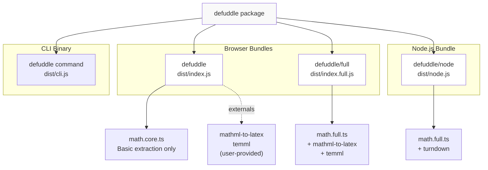
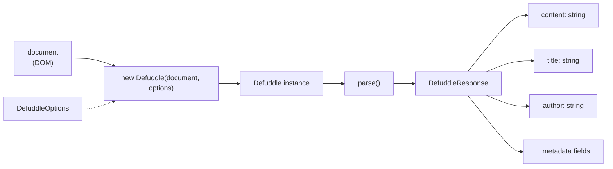
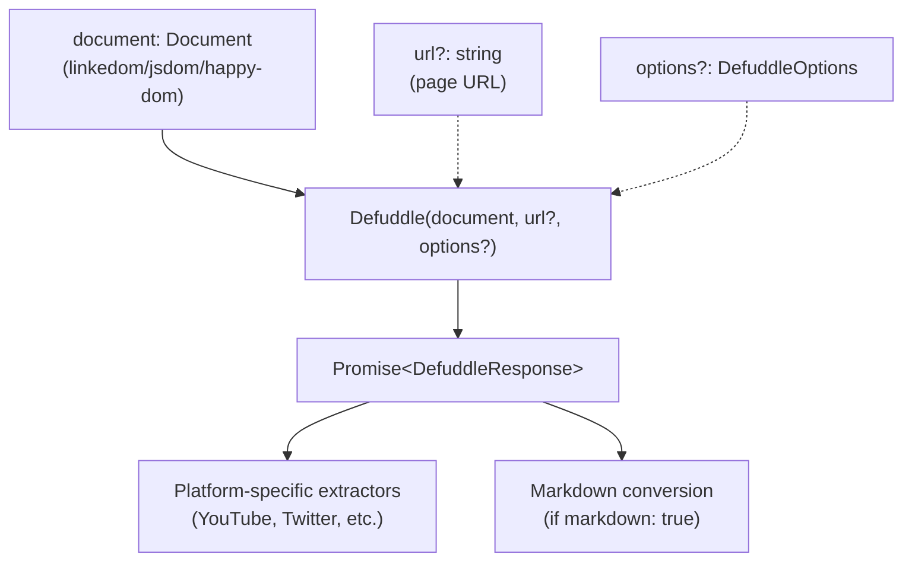
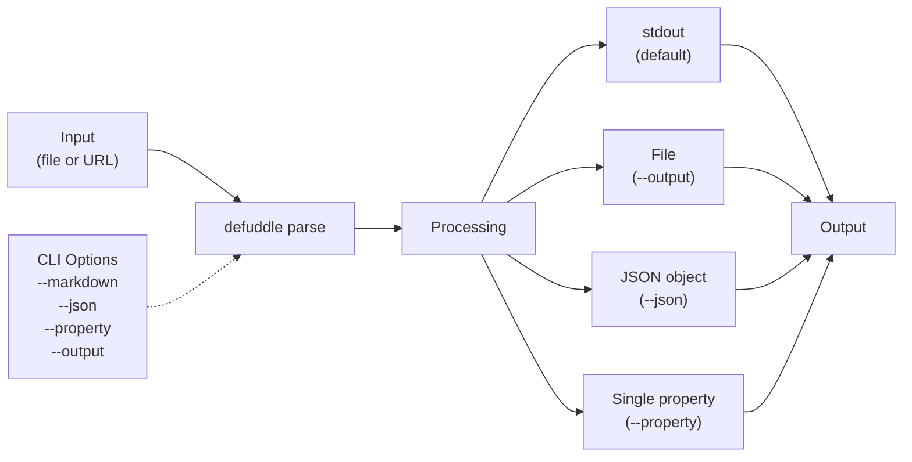

# Getting Started

<details>
<summary>Relevant source files</summary>

The following files were used as context for generating this wiki page:

- [README.md](README.md)
- [package-lock.json](package-lock.json)
- [package.json](package.json)
- [src/metadata.ts](src/metadata.ts)
- [src/types.ts](src/types.ts)
- [tsconfig.node.json](tsconfig.node.json)
- [webpack.config.js](webpack.config.js)

</details>


This page provides installation instructions and basic usage examples to get you up and running with Defuddle quickly. It covers the three primary ways to use Defuddle: in the browser, in Node.js environments, and via the command-line interface.

For detailed information about architecture and internal systems, see [Architecture](#3). For comprehensive configuration options, see [Configuration and Options](#10).

---

## Installation

### Browser and Node.js

Install Defuddle from npm:

```bash
npm install defuddle
```

For Node.js usage, you also need a DOM implementation. Defuddle supports `linkedom`, `jsdom`, or `happy-dom`:

```bash
# Recommended: linkedom (fastest, smallest)
npm install linkedom

# Alternative: jsdom (most compatible)
npm install jsdom
```

### CLI

The CLI can be used with `npx` without installation:

```bash
npx defuddle parse https://example.com/article
```

Or install globally for the `defuddle` command:

```bash
npm install -g defuddle
```

**Sources:** [package.json:1-103](), [README.md:104-134]()

---

## Package Structure and Bundles

Defuddle provides three distinct bundles optimized for different environments:

### Bundle Distribution Diagram



| Bundle | Import Path | Format | Environment | Math Libraries | Markdown |
|--------|------------|--------|-------------|----------------|----------|
| **Core** | `defuddle` | UMD | Browser | External (optional) | No |
| **Full** | `defuddle/full` | UMD | Browser | Bundled | No |
| **Node.js** | `defuddle/node` | CommonJS | Node.js | Bundled | Yes |
| **CLI** | `defuddle` | Binary | Command-line | Bundled | Yes |

The **core bundle** is recommended for most browser use cases. It externalizes math conversion libraries to minimize bundle size. The **full bundle** includes complete math processing capabilities. The **Node.js bundle** includes both math processing and markdown conversion via `turndown`.

**Sources:** [package.json:24-39](), [README.md:158-167](), [webpack.config.js:1-102]()

---

## Browser Usage

### Basic Usage

In browser environments, Defuddle operates on the current `document`:

```javascript
import Defuddle from 'defuddle';

// Parse the current document
const defuddle = new Defuddle(document);
const result = defuddle.parse();

// Access extracted content and metadata
console.log(result.content);    // Clean HTML content
console.log(result.title);      // Article title
console.log(result.author);     // Author name
console.log(result.wordCount);  // Word count
```

### Usage Flow Diagram



### With Options

```javascript
const result = new Defuddle(document, {
  debug: true,
  removeImages: false,
  contentSelector: 'article.main-content'
}).parse();
```

### Bundle Selection

For math equation conversion (LaTeX ↔ MathML):

```javascript
// Full bundle with built-in math libraries
import Defuddle from 'defuddle/full';

const result = new Defuddle(document).parse();
```

**Sources:** [README.md:19-34](), [package.json:24-32]()

---

## Node.js Usage

### With linkedom

The `Defuddle()` function in Node.js accepts any DOM `Document` implementation:

```javascript
import { parseHTML } from 'linkedom';
import { Defuddle } from 'defuddle/node';

const html = '<html>...</html>';
const { document } = parseHTML(html);

const result = await Defuddle(document, 'https://example.com/article', {
  markdown: true
});

console.log(result.content);        // Markdown content
console.log(result.title);          // Extracted title
console.log(result.description);    // Meta description
```

### With jsdom

```javascript
import { JSDOM } from 'jsdom';
import { Defuddle } from 'defuddle/node';

const html = '<html>...</html>';
const dom = new JSDOM(html, { url: 'https://example.com/article' });

const result = await Defuddle(dom.window.document, 'https://example.com/article', {
  markdown: true
});
```

### Node.js Function Signature



**Note:** Node.js usage requires `{ "type": "module" }` in your `package.json` for proper ESM import support.

**Sources:** [README.md:36-64](), [package.json:35-38]()

---

## Command-Line Interface

### Basic Commands

The CLI provides direct command-line access to Defuddle's parsing capabilities:

```bash
# Parse local HTML file
npx defuddle parse page.html

# Parse URL
npx defuddle parse https://example.com/article

# Convert to markdown
npx defuddle parse page.html --markdown

# Output as JSON with full metadata
npx defuddle parse page.html --json

# Extract specific property
npx defuddle parse page.html --property title

# Save to file
npx defuddle parse page.html --output result.html --markdown

# Enable debug mode
npx defuddle parse page.html --debug
```

### CLI Options Table

| Option | Alias | Description |
|--------|-------|-------------|
| `--output <file>` | `-o` | Write output to file instead of stdout |
| `--markdown` | `-m` | Convert content to markdown format |
| `--md` | | Alias for `--markdown` |
| `--json` | `-j` | Output as JSON with metadata and content |
| `--property <name>` | `-p` | Extract specific property (title, author, domain, etc.) |
| `--debug` | | Enable debug mode with detailed logging |

### CLI Workflow Diagram



**Sources:** [README.md:66-103](), [package.json:6-8]()

---

## Response Structure

All Defuddle parsing methods return a `DefuddleResponse` object:

### DefuddleResponse Properties

```mermaid
graph TB
    Response["DefuddleResponse"]
    
    subgraph "Core Content"
        Content["content: string<br/>(cleaned HTML or markdown)"]
        ContentMD["contentMarkdown?: string<br/>(if separateMarkdown: true)"]
    end
    
    subgraph "Metadata"
        Title["title: string"]
        Author["author: string"]
        Description["description: string"]
        Published["published: string"]
        Domain["domain: string"]
        Site["site: string"]
        Language["language: string"]
    end
    
    subgraph "Media"
        Image["image: string<br/>(main image URL)"]
        Favicon["favicon: string"]
    end
    
    subgraph "Structured Data"
        SchemaOrg["schemaOrgData: object"]
        MetaTags["metaTags?: MetaTagItem[]"]
    end
    
    subgraph "Processing Info"
        WordCount["wordCount: number"]
        ParseTime["parseTime: number<br/>(milliseconds)"]
        ExtractorType["extractorType?: string"]
    end
    
    subgraph "Debugging"
        Debug["debug?: DebugInfo<br/>(if debug: true)"]
    end
    
    Response --> Content
    Response --> ContentMD
    Response --> Title
    Response --> Author
    Response --> Description
    Response --> Published
    Response --> Domain
    Response --> Site
    Response --> Language
    Response --> Image
    Response --> Favicon
    Response --> SchemaOrg
    Response --> MetaTags
    Response --> WordCount
    Response --> ParseTime
    Response --> ExtractorType
    Response --> Debug
```



### Property Details Table

| Property | Type | Description |
|----------|------|-------------|
| `content` | string | Cleaned HTML content (or markdown if `markdown: true`) |
| `contentMarkdown` | string | Markdown content (only if `separateMarkdown: true`) |
| `title` | string | Article title from meta tags, Schema.org, or DOM |
| `author` | string | Author name from various sources |
| `description` | string | Article description/summary |
| `domain` | string | Domain name (e.g., `example.com`) |
| `site` | string | Site name (e.g., `Example Blog`) |
| `published` | string | Publication date in ISO format |
| `language` | string | Language code in BCP 47 format (e.g., `en-US`) |
| `image` | string | Main article image URL |
| `favicon` | string | Site favicon URL |
| `schemaOrgData` | object | Raw Schema.org JSON-LD data |
| `metaTags` | MetaTagItem[] | Collected meta tags (optional) |
| `wordCount` | number | Total word count of extracted content |
| `parseTime` | number | Processing time in milliseconds |
| `extractorType` | string | Name of extractor used (if platform-specific) |
| `debug` | DebugInfo | Debug information (only if `debug: true`) |

**Sources:** [src/types.ts:34-41](), [README.md:136-156]()

---

## Basic Options

Configure Defuddle's behavior using `DefuddleOptions`:

### Essential Options

```javascript
const options = {
  // Convert output to markdown
  markdown: true,
  
  // Enable debug logging and info
  debug: true,
  
  // Specify page URL (for Node.js)
  url: 'https://example.com/article',
  
  // Force specific content container
  contentSelector: 'article.main',
  
  // Remove all images
  removeImages: true
};

const result = new Defuddle(document, options).parse();
```

### Options Quick Reference

| Option | Type | Default | Description |
|--------|------|---------|-------------|
| `markdown` | boolean | `false` | Convert `content` to markdown |
| `separateMarkdown` | boolean | `false` | Keep HTML in `content`, add `contentMarkdown` |
| `debug` | boolean | `false` | Enable debug mode with detailed logging |
| `url` | string | - | Page URL (required for Node.js) |
| `contentSelector` | string | - | CSS selector to force as main content |
| `removeImages` | boolean | `false` | Remove all images from output |
| `useAsync` | boolean | `true` | Allow async API calls for platform extractors |

### Pipeline Control Options

| Option | Type | Default | Description |
|--------|------|---------|-------------|
| `removeExactSelectors` | boolean | `true` | Remove ads, social buttons (exact matches) |
| `removePartialSelectors` | boolean | `true` | Remove ads, social buttons (partial matches) |
| `removeHiddenElements` | boolean | `true` | Remove CSS-hidden elements |
| `removeLowScoring` | boolean | `true` | Remove low-content blocks via scoring |
| `removeSmallImages` | boolean | `true` | Remove icons and tracking pixels |
| `standardize` | boolean | `true` | Normalize HTML structures |

For complete option details, see [Configuration and Options](#10).

**Sources:** [src/types.ts:43-126](), [README.md:168-184]()

---

## Quick Start Examples

### Example 1: Basic Browser Extraction

```javascript
import Defuddle from 'defuddle';

const defuddle = new Defuddle(document);
const result = defuddle.parse();

document.body.innerHTML = result.content;
```

### Example 2: Node.js with Markdown

```javascript
import { parseHTML } from 'linkedom';
import { Defuddle } from 'defuddle/node';
import fs from 'fs';

const html = fs.readFileSync('article.html', 'utf8');
const { document } = parseHTML(html);

const result = await Defuddle(document, 'https://example.com/article', {
  markdown: true
});

fs.writeFileSync('article.md', result.content);
```

### Example 3: CLI Batch Processing

```bash
# Process multiple files
for file in *.html; do
  npx defuddle parse "$file" --markdown --output "${file%.html}.md"
done
```

### Example 4: Debug Mode Investigation

```javascript
const result = new Defuddle(document, {
  debug: true,
  removeLowScoring: false  // Disable scoring to test
}).parse();

console.log('Chosen selector:', result.debug.contentSelector);
console.log('Removals:', result.debug.removals);
```

**Sources:** [README.md:19-91](), [README.md:259-321]()

---

## Next Steps

Now that you have Defuddle installed and running:

- **Learn the architecture:** See [Architecture](#3) for system design and component relationships
- **Understand content extraction:** See [Content Extraction](#4) for the complete pipeline
- **Explore platform extractors:** See [Platform-Specific Extractors](#6) for YouTube, Twitter, Reddit, etc.
- **Configure advanced options:** See [Configuration and Options](#10) for all available settings
- **Debug extraction issues:** See [Development](#11) for debugging techniques

**Sources:** [README.md:1-322]()
