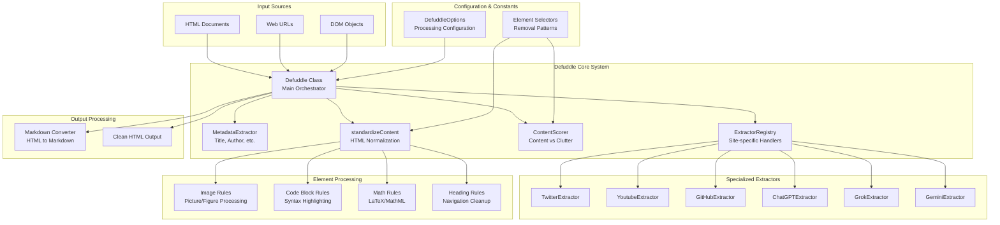
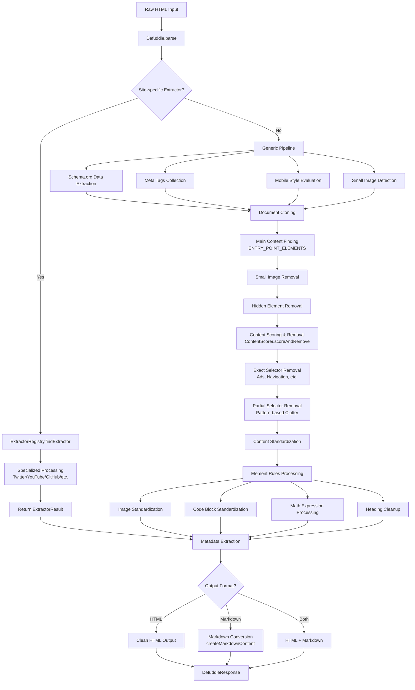
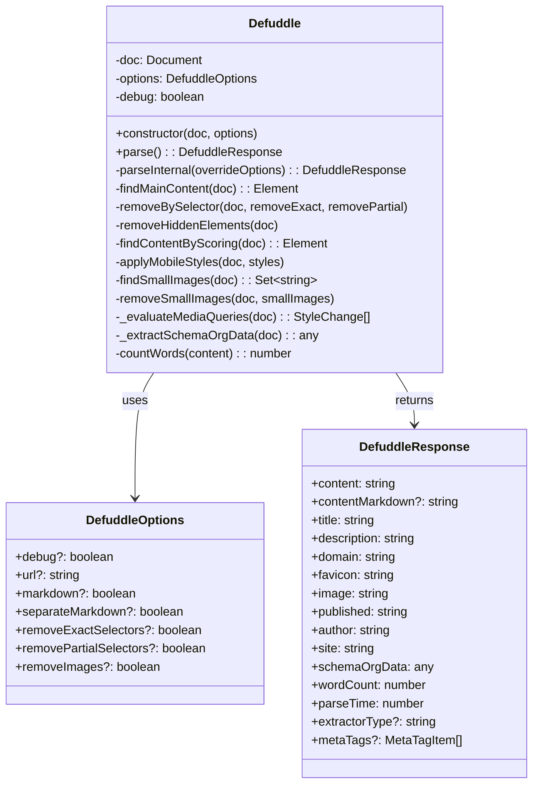
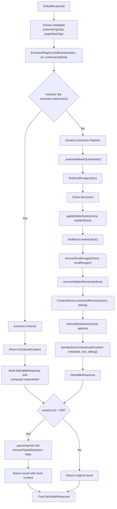
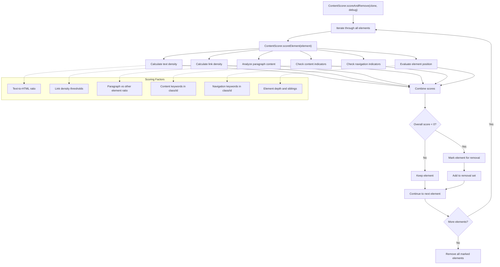
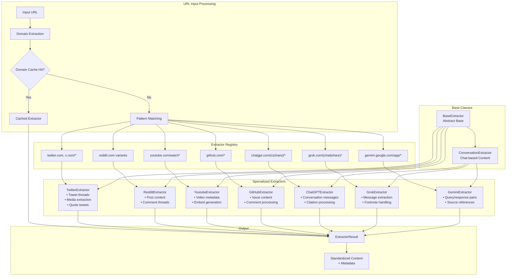
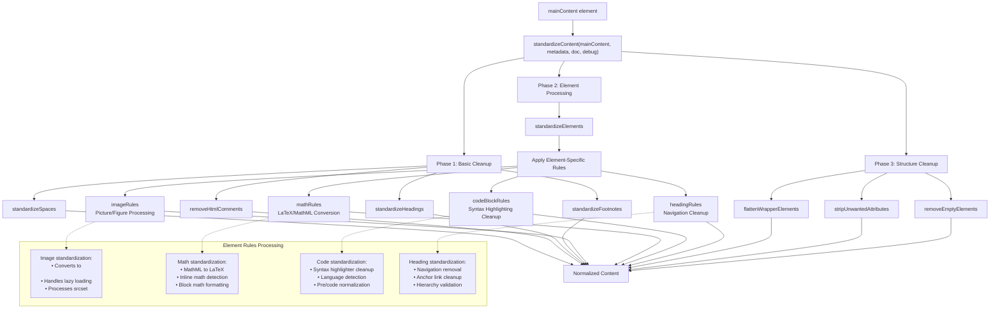
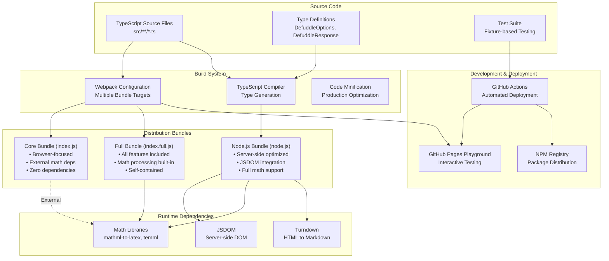
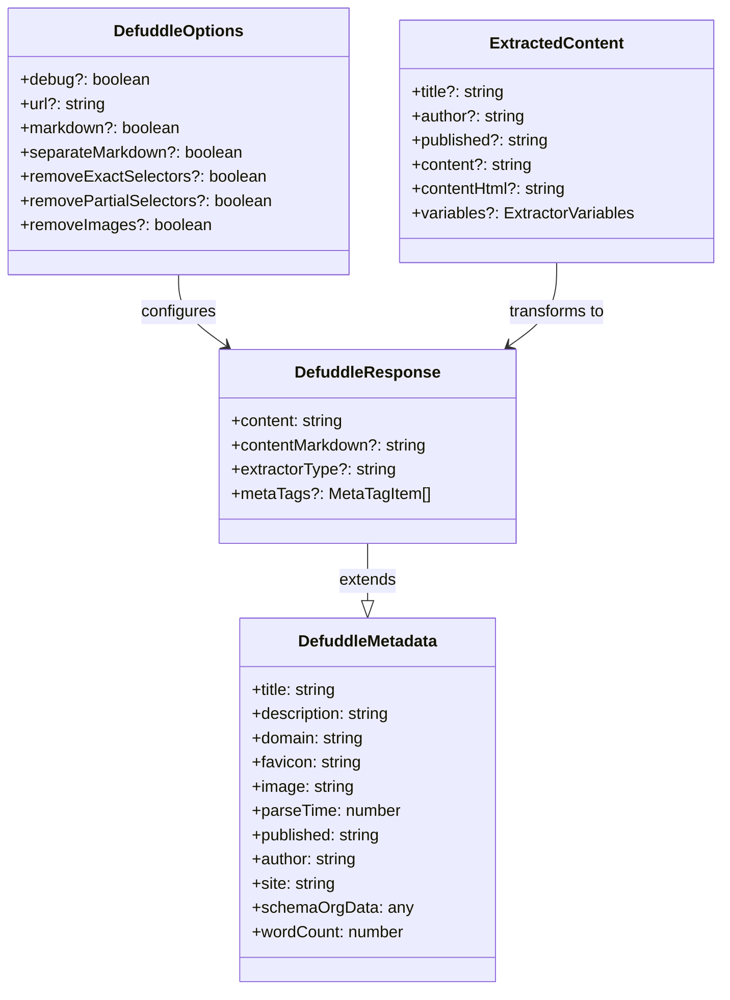

# Architecture

Relevant source files

The following files were used as context for generating this wiki page:

- [package-lock.json](package-lock.json)
- [package.json](package.json)
- [src/constants.ts](src/constants.ts)
- [src/defuddle.ts](src/defuddle.ts)
- [tsconfig.node.json](tsconfig.node.json)
- [webpack.config.js](webpack.config.js)

This document provides an overview of Defuddle's high-level architecture, including its key components, data flow, and system organization. It explains how the different parts of the codebase work together to extract and process content from web pages.

For information about using the library, see [Overview](#1). For details on how content is extracted, see [Content Extraction](#3).

## System Overview

Defuddle is a content extraction library that processes HTML documents to identify and extract main content while removing clutter, ads, and navigation elements. The system follows a modular architecture with specialized extractors for known websites and a generic extraction pipeline for general web content.

### Overall System Architecture

Sources: [src/defuddle.ts:1-14](), [src/defuddle.ts:21-35](), [src/defuddle.ts:40-59]()

### Content Processing Pipeline

Sources: [src/defuddle.ts:40-186](), [src/defuddle.ts:64-175]()

## Core Components

### Core System Components

The `Defuddle` class serves as the main orchestrator, coordinating all extraction processes through a well-defined interface.

The `Defuddle.parse()` method implements a sophisticated extraction strategy:

1. **Metadata Collection**: Extracts Schema.org data and meta tags from the document
2. **Site-Specific Detection**: Uses `ExtractorRegistry.findExtractor()` to find specialized extractors
3. **Fallback Processing**: If no extractor is found, applies generic content extraction
4. **Retry Logic**: If initial extraction yields little content (< 200 words), retries with less aggressive clutter removal
5. **Content Standardization**: Applies `standardizeContent()` to normalize HTML structure
6. **Response Generation**: Returns structured `DefuddleResponse` with content and metadata

Sources: [src/defuddle.ts:21-35](), [src/defuddle.ts:40-59](), [src/defuddle.ts:64-186](), [src/types.ts:1-83]()

### Extraction Algorithm Implementation

The extraction process implements a two-phase approach with fallback mechanisms:

The algorithm includes several optimization strategies:
- **Document Cloning**: Original document is preserved while a clone is modified
- **Mobile Style Application**: CSS media queries are evaluated and applied for better mobile content detection
- **Batch Processing**: Hidden element removal and small image detection use batching for performance
- **Retry Mechanism**: If extraction produces minimal content, retries with reduced clutter removal

Sources: [src/defuddle.ts:40-59](), [src/defuddle.ts:64-186](), [src/defuddle.ts:122-164]()

### Content Scoring System

The `ContentScorer` implements heuristic-based content identification using multiple scoring factors:

The `ContentScorer.findBestElement()` method also provides element ranking functionality for identifying the most likely content container when multiple candidates exist.

Sources: [src/defuddle.ts:155](), [src/defuddle.ts:603-607](), [src/defuddle.ts:654]()

### Site-Specific Extractor System

The `ExtractorRegistry` provides domain-based routing to specialized extractors for known websites:

Each extractor implements the `canExtract()` and `extract()` methods, returning `ExtractedContent` with site-specific optimizations for content structure and metadata.

Sources: [src/defuddle.ts:97-118]()

### Content Standardization Pipeline

The `standardizeContent()` function applies comprehensive HTML normalization through multiple processing phases:

The standardization process ensures consistent HTML structure across different source websites and content management systems.

Sources: [src/defuddle.ts:163]()

## Distribution Architecture

Defuddle provides three distribution bundles optimized for different deployment scenarios:

### Bundle Configuration

### Bundle Comparison

| Bundle | Target | Entry Point | Dependencies | Use Case |
|--------|--------|-------------|--------------|----------|
| Core | Browser | `./dist/index.js` | None | Lightweight browser integration |
| Full | Browser | `./dist/index.full.js` | mathml-to-latex, temml | Complete browser functionality |
| Node.js | Server | `./dist/node.js` | jsdom, turndown | Server-side processing |

The modular architecture allows developers to choose the appropriate bundle based on their deployment requirements and dependency constraints.

Sources: Based on build system analysis and package structure

## Integration Interfaces

Defuddle provides interfaces for integration with other systems:

### Type System Architecture

The library's type system provides comprehensive interfaces for configuration and data exchange:

#### Core Configuration Types

| Interface | Purpose | Key Properties |
|-----------|---------|----------------|
| `DefuddleOptions` | Extraction configuration | `debug`, `url`, `markdown`, `removeExactSelectors`, `removePartialSelectors`, `removeImages` |
| `DefuddleResponse` | Extraction results | `content`, `title`, `description`, `wordCount`, `parseTime`, `extractorType` |
| `DefuddleMetadata` | Document metadata | `title`, `description`, `domain`, `favicon`, `image`, `published`, `author`, `site` |

#### Extractor System Types

| Interface | Purpose | Key Properties |
|-----------|---------|----------------|
| `ExtractedContent` | Extractor output | `title`, `author`, `published`, `content`, `contentHtml`, `variables` |
| `ExtractorVariables` | Dynamic metadata | Key-value pairs for extractor-specific data |
| `MetaTagItem` | HTML meta tags | `name`, `property`, `content` |

#### Type Relationships

Sources: [src/types.ts:1-83]()

## Data Flow Summary

When extracting content from a document, Defuddle follows this sequence:

1. Extract metadata from the document first (title, author, etc.)
2. Check if a site-specific extractor exists and can handle the document
   - If yes, use the extractor to get content and metadata
3. If no extractor or extraction fails, apply generic extraction:
   - Evaluate and apply mobile styles to improve extraction
   - Find the main content container
   - Remove small images and hidden elements
   - Apply content scoring to remove non-content blocks
   - Remove clutter elements using predefined selectors
   - Standardize the content
4. Return the extracted content and metadata as a `DefuddleResponse`

Sources: [src/defuddle.ts:64-164]()
