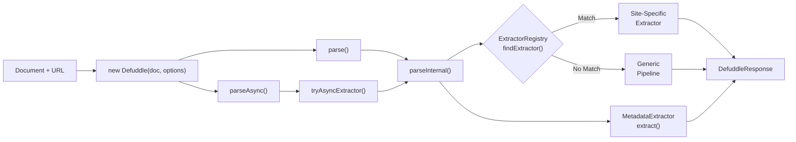
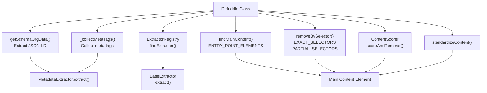
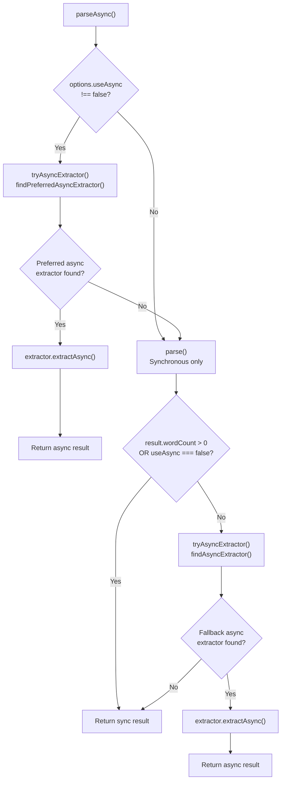
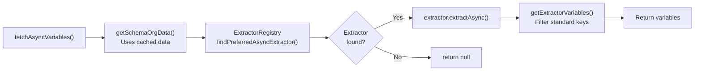

# Core Extraction Pipeline

Relevant source files

The following files were used as context for generating this wiki page:

- [README.md](README.md)
- [src/constants.ts](src/constants.ts)
- [src/defuddle.ts](src/defuddle.ts)
- [src/metadata.ts](src/metadata.ts)
- [src/types.ts](src/types.ts)

The core extraction pipeline, implemented in the `Defuddle` class, orchestrates the complete content extraction process. It coordinates specialized extractors, applies multi-phase clutter removal, extracts metadata, and implements sophisticated retry logic to handle difficult pages.

This pipeline serves as the main entry point for all content extraction operations, whether through synchronous `parse()` or asynchronous `parseAsync()` methods.

Related pages: [Extractor Registry](6.1) for site-specific extraction, [Content Identification and Scoring](4.1) for scoring algorithms, [Clutter Removal Pipeline](4.3) for removal phases, [Content Standardization](5) for HTML normalization.

## Pipeline Architecture

The `Defuddle` class implements the core extraction pipeline through two primary entry points: `parse()` for synchronous extraction and `parseAsync()` for asynchronous extraction with third-party API fallbacks.

### Pipeline Components and Flow

**Defuddle Class Pipeline Flow**

Sources: [src/defuddle.ts:51-71](), [src/defuddle.ts:88-185](), [src/defuddle.ts:393-410]()

### Core Pipeline Coordination

**Subsystem Coordination in Defuddle**

Sources: [src/defuddle.ts:1-23](), [src/defuddle.ts:461-652](), [src/constants.ts:1-27]()

## The parse() Method

The `parse()` method is the synchronous entry point for content extraction. It implements intelligent retry logic to handle edge cases where initial extraction returns insufficient content.

### Parse Method Flow

**parse() Execution Flow with Retry Logic**

```mermaid
flowchart TD
    parse["parse()"] --> parseInternal1["parseInternal()<br/>Default settings"]
    
    parseInternal1 --> checkWordCount1{"wordCount < 200?"}
    
    checkWordCount1 -->|"No"| stripUnsafe["_stripUnsafeElements()"]
    checkWordCount1 -->|"Yes"| retry1["parseInternal()<br/>removePartialSelectors: false"]
    
    retry1 --> compareResults1{"retryWordCount ><br/>2x original?"}
    compareResults1 -->|"Yes"| useRetry1["Use retry result"]
    compareResults1 -->|"No"| checkWordCount2{"wordCount < 50?"}
    
    useRetry1 --> checkWordCount2
    checkWordCount2 -->|"No"| stripUnsafe
    checkWordCount2 -->|"Yes"| retry2["parseInternal()<br/>removeHiddenElements: false"]
    
    retry2 --> compareResults2{"retryWordCount ><br/>2x original?"}
    compareResults2 -->|"Yes"| useRetry2["Use retry result"]
    compareResults2 -->|"No"| findHidden["findLargestHiddenContentSelector()"]
    
    useRetry2 --> findHidden
    findHidden --> hasHidden{"Hidden selector<br/>found?"}
    
    hasHidden -->|"Yes"| retry3["parseInternal()<br/>contentSelector: hidden<br/>removeHiddenElements: false"]
    hasHidden -->|"No"| checkWordCount3{"wordCount < 50?"}
    
    retry3 --> compareResults3{"Better focused<br/>content?"}
    compareResults3 -->|"Yes"| useRetry3["Use retry result"]
    compareResults3 -->|"No"| checkWordCount3
    
    useRetry3 --> checkWordCount3
    checkWordCount3 -->|"No"| stripUnsafe
    checkWordCount3 -->|"Yes"| retry4["parseInternal()<br/>removeLowScoring: false<br/>removePartialSelectors: false<br/>removeContentPatterns: false"]
    
    retry4 --> compareResults4{"retryWordCount ><br/>original?"}
    compareResults4 -->|"Yes"| useRetry4["Use retry result"]
    compareResults4 -->|"No"| stripUnsafe
    
    useRetry4 --> stripUnsafe
    stripUnsafe --> schemaFallback["Check schema.org<br/>_getSchemaText()"]
    
    schemaFallback --> hasSchemaText{"Schema text ><br/>extracted words?"}
    hasSchemaText -->|"Yes"| findBySchema["_findContentBySchemaText()"]
    hasSchemaText -->|"No"| returnResult["Return Result"]
    
    findBySchema --> useSchema["Use schema content"]
    useSchema --> returnResult
```

Sources: [src/defuddle.ts:88-185]()

### Retry Strategy Table

| Retry Stage | Trigger | Options Modified | Rationale |
|-------------|---------|------------------|-----------|
| **Initial** | Always | Default settings | Standard extraction with all filters enabled |
| **Retry 1** | wordCount < 200 | `removePartialSelectors: false` | Partial selectors may have removed legitimate content (e.g., article cards) |
| **Retry 2** | wordCount < 50 | `removeHiddenElements: false` | Page may use hidden wrappers that reveal content at runtime |
| **Retry 3** | wordCount < 50 | `contentSelector: hiddenSelector` `removeHiddenElements: false` | Target largest hidden subtree directly to avoid body-level artifacts |
| **Retry 4** | wordCount < 50 | `removeLowScoring: false` `removePartialSelectors: false` `removeContentPatterns: false` | Page may be an index/listing where scoring incorrectly removes cards |
| **Schema.org Fallback** | After retries | Use `_findContentBySchemaText()` | Schema.org may contain text not found in DOM (e.g., social media posts) |

Sources: [src/defuddle.ts:88-185]()

### Retry Logic Details

Each retry uses a 2x threshold (except the final retry which uses 1x) to ensure that retries only succeed when they produce significantly more content. This prevents false positives where partial selectors correctly removed small amounts of clutter.

For the hidden content retry, the system identifies the largest hidden element using `findLargestHiddenContentSelector()` and targets it directly with a `contentSelector`, avoiding body-level leftovers like FPS counters.

Sources: [src/defuddle.ts:93-159](), [src/defuddle.ts:324-347]()

## The parseAsync() Method

The `parseAsync()` method extends the pipeline to support asynchronous extractors that can fetch content from third-party APIs when local HTML contains no usable content (e.g., client-side rendered SPAs).

### Async Extraction Flow

**parseAsync() Decision Tree**

Sources: [src/defuddle.ts:393-410]()

### Async Extractor Selection

The pipeline uses two levels of async extractor selection:

1. **Preferred Async Extractors**: Checked first, before synchronous parsing. Used for platforms like YouTube where async extraction (transcript fetching) is preferred even when DOM content exists.

2. **Fallback Async Extractors**: Checked only if synchronous parsing yields no content. Used for platforms like Twitter/X where the API is a last resort.

The `tryAsyncExtractor()` method accepts a finder function (`findPreferredAsyncExtractor` or `findAsyncExtractor`) and handles the async extraction flow.

Sources: [src/defuddle.ts:436-456](), [src/defuddle.ts:393-410]()

### fetchAsyncVariables()

The `fetchAsyncVariables()` method provides a way to fetch only async variables (e.g., YouTube transcripts) without re-parsing the document. It safely reuses cached schema.org data since `parse()` strips script tags.

Sources: [src/defuddle.ts:417-434]()

## The parseInternal() Pipeline

The `parseInternal()` method implements the core extraction pipeline. It operates on a cloned document to preserve the original, and coordinates all extraction phases.

### Generic Pipeline Phases

**parseInternal() Pipeline Phases**

```mermaid
flowchart TD
    parseInternal["parseInternal(overrideOptions)"] --> guard{"doc.documentElement<br/>exists?"}
    
    guard -->|"No"| emptyResponse["Return empty<br/>DefuddleResponse"]
    guard -->|"Yes"| mergeOptions["Merge default options<br/>with overrides"]
    
    mergeOptions --> schemaOrg["getSchemaOrgData()<br/>Extract JSON-LD<br/>_extractSchemaOrgData()"]
    schemaOrg --> collectMeta["_collectMetaTags()<br/>Cache meta tags"]
    collectMeta --> extractMetadata["MetadataExtractor.extract()<br/>Cache metadata"]
    
    extractMetadata --> checkExtractor{"ExtractorRegistry<br/>findExtractor()"}
    
    checkExtractor -->|"Found"| canExtract{"extractor<br/>canExtract()?"}
    canExtract -->|"Yes"| siteExtract["extractor.extract()"]
    siteExtract --> buildResponse1["buildExtractorResponse()"]
    
    canExtract -->|"No"| genericStart["Continue to<br/>generic pipeline"]
    checkExtractor -->|"Not Found"| genericStart
    
    genericStart --> mobileStyles["_evaluateMediaQueries()<br/>Cache mobile styles"]
    mobileStyles --> findSmall["findSmallImages()<br/>Cache small images"]
    findSmall --> clone["doc.cloneNode(true)<br/>Clone document"]
    
    clone --> normalize["clone.body.normalize()<br/>Merge text nodes"]
    normalize --> flattenShadow["flattenShadowRoots()<br/>Flatten shadow DOM"]
    flattenShadow --> resolveStream["resolveStreamedContent()<br/>React SSR boundaries"]
    resolveStream --> applyMobile["applyMobileStyles()"]
    
    applyMobile --> selectMain{"options<br/>contentSelector?"}
    selectMain -->|"Yes"| querySelector["querySelector(contentSelector)"]
    selectMain -->|"No"| findMain["findMainContent()<br/>ENTRY_POINT_ELEMENTS"]
    
    querySelector --> hasMain{"mainContent<br/>found?"}
    findMain --> hasMain
    
    hasMain -->|"No"| fallback["Return body content"]
    hasMain -->|"Yes"| footnotes{"options<br/>standardize?"}
    
    footnotes -->|"Yes"| stdFootnotes["standardizeFootnotes()"]
    footnotes -->|"No"| removeSmall{"options<br/>removeSmallImages?"}
    
    stdFootnotes --> removeSmall
    removeSmall -->|"Yes"| removeSmallImg["removeSmallImages()"]
    removeSmall -->|"No"| removeHidden{"options<br/>removeHiddenElements?"}
    
    removeSmallImg --> removeHidden
    removeHidden -->|"Yes"| removeHiddenEl["removeHiddenElements()"]
    removeHidden -->|"No"| removeLow{"options<br/>removeLowScoring?"}
    
    removeHiddenEl --> removeLow
    removeLow -->|"Yes"| scoreRemove["ContentScorer<br/>scoreAndRemove()"]
    removeLow -->|"No"| removeSelectors{"removeExactSelectors<br/>OR removePartialSelectors?"}
    
    scoreRemove --> removeSelectors
    removeSelectors -->|"Yes"| removeBySelector["removeBySelector()"]
    removeSelectors -->|"No"| removePatterns{"options<br/>removeContentPatterns?"}
    
    removeBySelector --> removePatterns
    removePatterns -->|"Yes"| removeContent["removeByContentPattern()"]
    removePatterns -->|"No"| standardize{"options<br/>standardize?"}
    
    removeContent --> standardize
    standardize -->|"Yes"| stdContent["standardizeContent()"]
    standardize -->|"No"| resolveUrls["resolveRelativeUrls()"]
    
    stdContent --> resolveUrls
    resolveUrls --> buildResponse2["Build DefuddleResponse<br/>content = mainContent.outerHTML"]
```

Sources: [src/defuddle.ts:461-652]()

### Pipeline Caching Strategy

The pipeline caches several expensive operations across retries:

| Cached Item | Cache Key | Purpose |
|-------------|-----------|---------|
| Schema.org data | `_schemaOrgData` | Avoid re-parsing JSON-LD scripts across retries |
| Meta tags | `_metaTags` | Avoid re-querying meta tags across retries |
| Metadata | `_metadata` | Avoid re-extracting metadata across retries |
| Mobile styles | `_mobileStyles` | Avoid re-evaluating media queries across retries |
| Small images | `_smallImages` | Avoid re-identifying small images across retries |

This caching is safe because retries only modify options, not the source document.

Sources: [src/defuddle.ts:55-60](), [src/defuddle.ts:497-536]()

## Document Preprocessing

Before the main pipeline runs, `parseInternal()` performs several preprocessing steps on the cloned document to handle edge cases and browser-specific behaviors.

### Preprocessing Steps

| Step | Method | Purpose |
|------|--------|---------|
| **Text Node Normalization** | `clone.body.normalize()` | Merge adjacent text nodes created by linkedom when parsing HTML entities like `&#39;` |
| **Shadow DOM Flattening** | `flattenShadowRoots()` | Copy shadow DOM content into the main document for extraction |
| **Streamed Content Resolution** | `resolveStreamedContent()` | Resolve React streaming SSR suspense boundaries that may hide content |
| **Mobile Styles Application** | `applyMobileStyles()` | Apply mobile viewport styles to reveal hidden content |

Sources: [src/defuddle.ts:543-552]()

### Mobile Styles Evaluation

The `_evaluateMediaQueries()` method evaluates CSS `@media` rules with `max-width` conditions at a mobile viewport width (600px). This reveals content that may be hidden on desktop but visible on mobile.

The method:
1. Iterates through all stylesheets
2. Filters for `CSSMediaRule` instances with `max-width`
3. Checks if the mobile width (600px) satisfies the condition
4. Collects matching CSS rules with selectors and styles
5. Returns an array of `StyleChange` objects

These styles are then applied to the cloned document via `applyMobileStyles()`, which appends the style text to each matching element's inline style attribute.

Sources: [src/defuddle.ts:675-768]()

### Shadow DOM Flattening

The `flattenShadowRoots()` method handles web components by copying shadow DOM content into the light DOM of the cloned document. This ensures shadow DOM content is included in extraction.

Sources: [src/defuddle.ts:546]()

## Error Handling and Fallbacks

The core system implements multiple fallback strategies to ensure robust operation:

### Retry Logic
- If initial parse returns < 200 words, retry without partial selector removal [src/defuddle.ts:44-56]()

### Graceful Degradation
- Falls back to full document content on parsing errors [src/defuddle.ts:175-185]()
- Uses table-based content detection for legacy layouts [src/defuddle.ts:636-655]()
- Handles cross-origin stylesheet access gracefully [src/defuddle.ts:217-229]()

### Performance Optimizations
- Batched DOM operations to minimize layout thrashing [src/defuddle.ts:318-354]()
- Efficient regex compilation for selector matching [src/defuddle.ts:380-416]()
- Chunked processing for large element sets [src/defuddle.ts:462-537]()

Sources: [src/defuddle.ts:40-748]()
