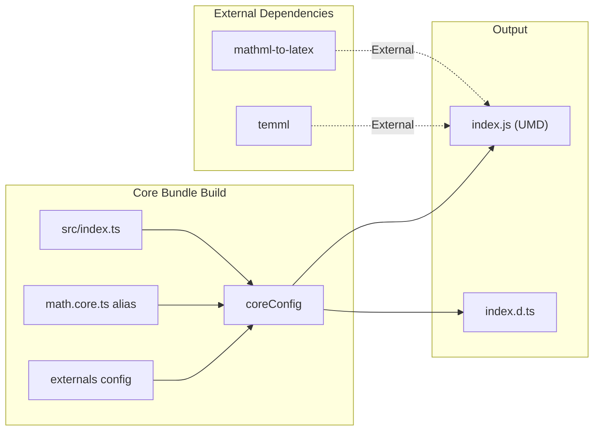
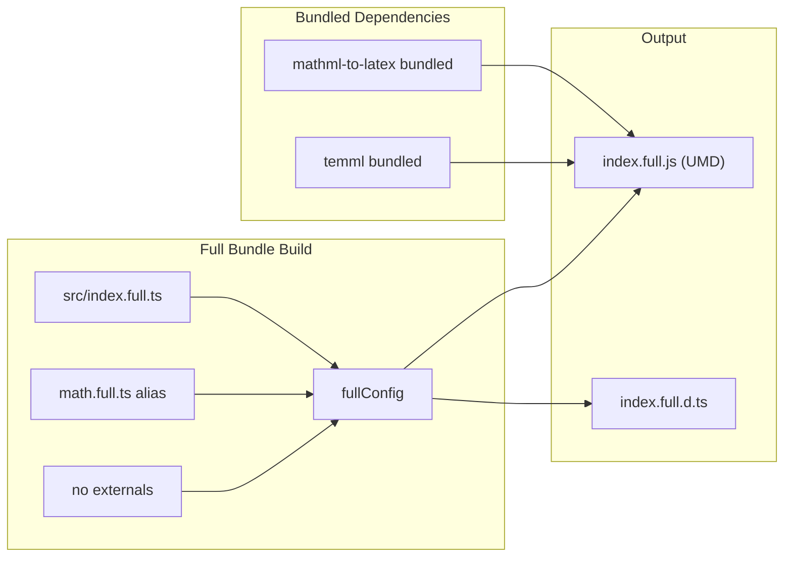
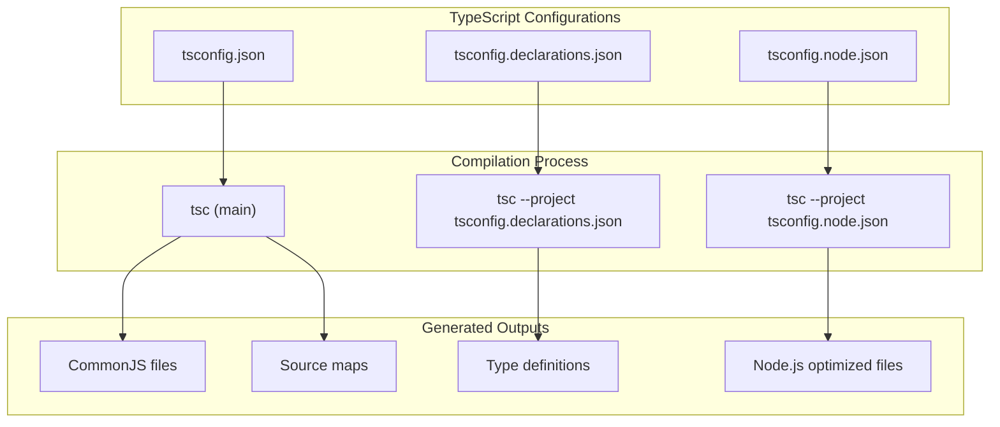
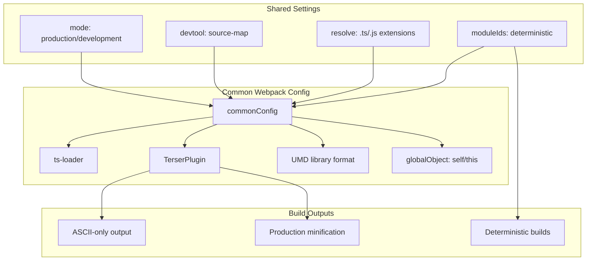
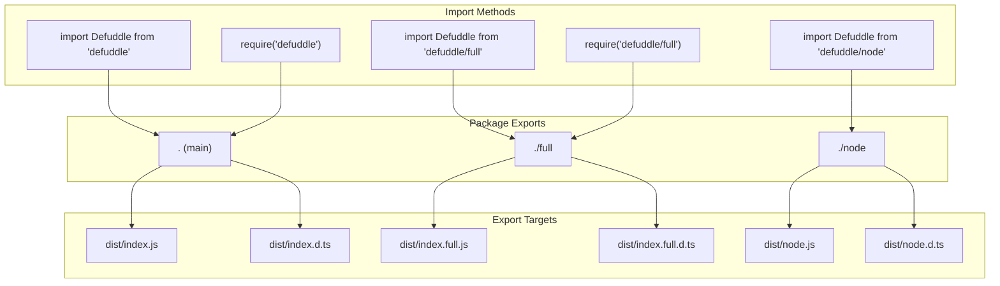
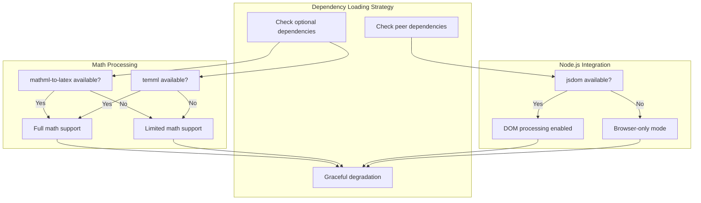
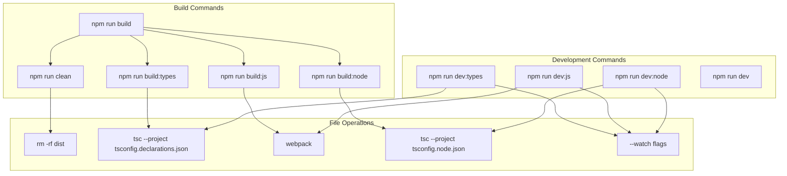

# Build and Distribution System

<details>
<summary>Relevant source files</summary>

The following files were used as context for generating this wiki page:

- [package-lock.json](package-lock.json)
- [package.json](package.json)
- [tsconfig.node.json](tsconfig.node.json)
- [webpack.config.js](webpack.config.js)

</details>


This document covers the build configuration, bundling strategy, and distribution system for the Defuddle library. The system produces multiple optimized bundles for different deployment scenarios, from lightweight browser usage to full-featured Node.js integration.

For information about the core extraction logic, see [Core System](#2.1). For details on how individual features are processed, see [Content Standardization](#4).

## Build Architecture

The Defuddle build system uses a multi-target approach, producing three distinct distribution bundles optimized for different use cases. The build process combines TypeScript compilation with Webpack bundling to create browser-compatible UMD modules and Node.js-specific distributions.

```mermaid
graph TB
    subgraph "Source Files"
        SRC["src/index.ts"]
        FULL_SRC["src/index.full.ts"]
        MATH_CORE["src/elements/math.core.ts"]
        MATH_FULL["src/elements/math.full.ts"]
        TS_FILES["src/**/*.ts"]
    end
    
    subgraph "Build Configurations"
        WEBPACK_CONFIG["webpack.config.js"]
        TSCONFIG["tsconfig.json"]
        TSCONFIG_DECL["tsconfig.declarations.json"]
        TSCONFIG_NODE["tsconfig.node.json"]
    end
    
    subgraph "Build Scripts"
        BUILD_TYPES["npm run build:types"]
        BUILD_JS["npm run build:js"]
        BUILD_NODE["npm run build:node"]
        BUILD_ALL["npm run build"]
    end
    
    subgraph "Output Bundles"
        CORE_JS["dist/index.js"]
        CORE_DTS["dist/index.d.ts"]
        FULL_JS["dist/index.full.js"]
        FULL_DTS["dist/index.full.d.ts"]
        NODE_JS["dist/node.js"]
        NODE_DTS["dist/node.d.ts"]
    end
    
    SRC --> BUILD_JS
    FULL_SRC --> BUILD_JS
    TS_FILES --> BUILD_TYPES
    TS_FILES --> BUILD_NODE
    
    WEBPACK_CONFIG --> BUILD_JS
    TSCONFIG_DECL --> BUILD_TYPES
    TSCONFIG_NODE --> BUILD_NODE
    
    BUILD_TYPES --> CORE_DTS
    BUILD_TYPES --> FULL_DTS
    BUILD_JS --> CORE_JS
    BUILD_JS --> FULL_JS
    BUILD_NODE --> NODE_JS
    BUILD_NODE --> NODE_DTS
    
    BUILD_ALL --> BUILD_TYPES
    BUILD_ALL --> BUILD_JS
    BUILD_ALL --> BUILD_NODE
```



Sources: [package.json:31-44](), [webpack.config.js:1-102](), [tsconfig.json:1-16](), [tsconfig.declarations.json:1-20]()

## Bundle Variants

The build system produces three distinct bundle variants, each optimized for specific deployment scenarios and dependency management strategies.

| Bundle | File | Target | Dependencies | Use Case |
|--------|------|--------|--------------|----------|
| Core | `index.js` | Browser | External math libs | Lightweight browser usage |
| Full | `index.full.js` | Browser | All bundled | Self-contained browser deployment |
| Node | `node.js` | Node.js | Optional deps + JSDOM | Server-side processing |

### Core Bundle Configuration

The core bundle uses external dependencies for math processing libraries, keeping the bundle size minimal for browser environments where users may already have these dependencies loaded.



Sources: [webpack.config.js:47-74](), [package.json:15-20]()

### Full Bundle Configuration

The full bundle includes all dependencies, providing a self-contained distribution for environments where dependency management is challenging or where a single-file deployment is preferred.



Sources: [webpack.config.js:76-99](), [package.json:21-26]()

## TypeScript Compilation Strategy

The build system uses multiple TypeScript configurations to handle different compilation targets and output requirements. Each configuration serves a specific purpose in the overall build pipeline.

### Configuration Files

| Config File | Purpose | Target | Output |
|-------------|---------|--------|---------|
| `tsconfig.json` | Main compilation | CommonJS | Source maps + declarations |
| `tsconfig.declarations.json` | Type definitions only | Multiple entries | `.d.ts` files only |
| `tsconfig.node.json` | Node.js build | Node.js specific | Server-side optimized |



Sources: [tsconfig.json:1-16](), [tsconfig.declarations.json:1-20](), [package.json:33-36]()

## Webpack Bundle Configuration

The Webpack configuration creates two parallel builds with different dependency strategies. Both configurations share common settings but differ in their handling of external dependencies and math processing modules.

### Common Configuration Elements



Sources: [webpack.config.js:8-45]()

### Math Module Aliasing

The build system uses Webpack aliases to swap math processing implementations between core and full bundles. This allows the same source code to produce different outputs based on dependency requirements.

| Bundle Type | Alias Target | Math Dependencies |
|-------------|--------------|-------------------|
| Core | `math.core.ts` | External references |
| Full | `math.full.ts` | Bundled implementations |

Sources: [webpack.config.js:69-72](), [webpack.config.js:94-97]()

## Package Export Strategy

The `package.json` exports field defines how different bundles are exposed to consuming applications. This configuration supports both CommonJS and ES module imports while providing appropriate type definitions for each variant.



Sources: [package.json:15-30]()

## Dependency Management

The build system uses a sophisticated dependency management strategy that balances bundle size, functionality, and deployment flexibility through optional and peer dependencies.

### Dependency Categories

| Category | Libraries | Purpose | Bundle Inclusion |
|----------|-----------|---------|------------------|
| `optionalDependencies` | `mathml-to-latex`, `temml`, `turndown` | Math and markdown processing | Conditional |
| `peerDependencies` | `jsdom` | DOM manipulation for Node.js | External |
| `devDependencies` | `webpack`, `typescript`, `vitest` | Build and testing | None |

### Runtime Dependency Resolution



Sources: [package.json:65-72]()

## Build Script Orchestration

The build process is orchestrated through npm scripts that coordinate TypeScript compilation, Webpack bundling, and output generation. The scripts support both development and production workflows.

### Build Commands



Sources: [package.json:31-44]()

## Output Structure

The build system generates a consistent output structure in the `dist` directory that supports multiple consumption patterns and provides comprehensive type information for TypeScript users.

```
dist/
├── index.js          # Core bundle (UMD)
├── index.d.ts        # Core bundle types
├── index.full.js     # Full bundle (UMD)
├── index.full.d.ts   # Full bundle types
├── node.js          # Node.js bundle
└── node.d.ts        # Node.js bundle types
```

Each bundle includes appropriate source maps in development mode and minified output in production mode, with consistent module IDs to ensure deterministic builds across different environments.

Sources: [package.json:5-14](), [package.json:87-91]()
