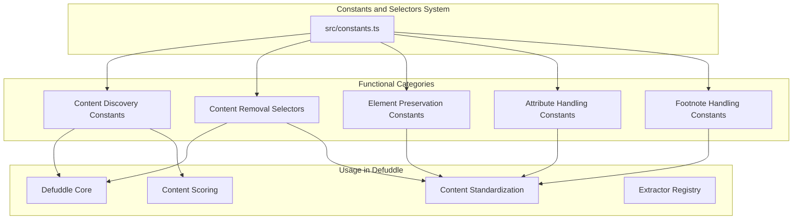
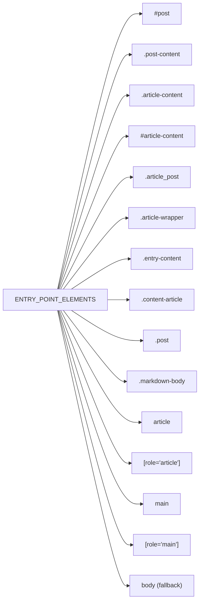
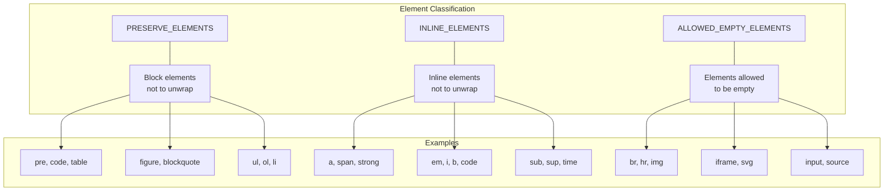
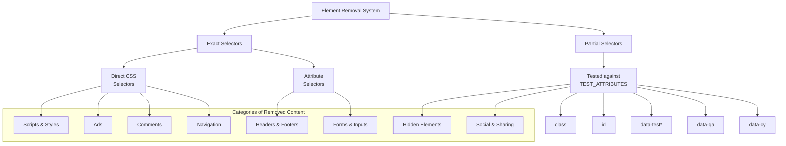
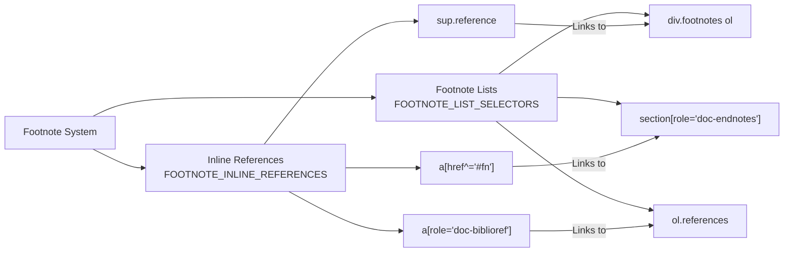
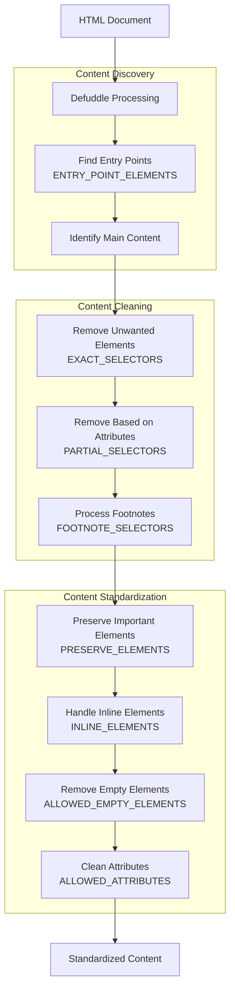

# Constants and Selectors

<details>
<summary>Relevant source files</summary>

The following files were used as context for generating this wiki page:

- [src/constants.ts](src/constants.ts)
- [src/defuddle.ts](src/defuddle.ts)

</details>


This document provides detailed information about the constants and selectors used in Defuddle for content extraction, identification, and cleanup. These constants serve as the foundation for how Defuddle identifies important content, removes clutter, and standardizes the extracted information.

For information about the overall architecture of Defuddle, see [Architecture](#2). For details on the content standardization process, see [Content Standardization](#4).

## 1. Overview

Defuddle uses a comprehensive set of constants and selectors defined in its codebase to:

1. Identify entry points for content extraction
2. Determine which elements to preserve or remove
3. Identify special content types (footnotes, code blocks, etc.)
4. Standardize extracted content
5. Control which attributes are kept in the final output



Sources: [src/constants.ts:1-908]()

## 2. Content Discovery Constants

These constants help Defuddle locate the main content within a webpage.

### 2.1 Entry Point Elements

The `ENTRY_POINT_ELEMENTS` array contains selectors that are used as starting points for finding the main content. Defuddle tries each selector in order until it finds a match.



Sources: [src/constants.ts:3-19]()

### 2.2 Block and Structure Elements

Block elements are used to identify structural components of the content:

- `BLOCK_ELEMENTS`: Defines standard block-level elements that structure content
- `MOBILE_WIDTH`: Defines the width threshold for mobile styles (600px)

| Constant | Purpose | Elements |
|----------|---------|----------|
| `BLOCK_ELEMENTS` | Identifies structural blocks | 'div', 'section', 'article', 'main', 'aside', 'header', 'footer', 'nav', 'content' |

Sources: [src/constants.ts:21-22]()

## 3. Element Preservation and Classification

These constants define which elements should be preserved and how they should be handled during the standardization process.

### 3.1 Elements to Preserve



Preservation constants serve several purposes:
- `PRESERVE_ELEMENTS`: Block-level elements that should not be unwrapped (like `pre`, `table`, `blockquote`)
- `INLINE_ELEMENTS`: Inline elements that should be preserved (like `a`, `strong`, `em`)
- `ALLOWED_EMPTY_ELEMENTS`: Elements that are allowed to be empty and not removed (like `img`, `br`, `iframe`)

Sources: [src/constants.ts:25-32](), [src/constants.ts:35-39](), [src/constants.ts:803-840]()

## 4. Content Removal Selectors

Defuddle uses two types of selectors to identify content that should be removed:

### 4.1 Exact Selectors

The `EXACT_SELECTORS` array contains CSS selectors that identify elements to be removed entirely. These are matched exactly against elements in the document.

Categories of elements removed by exact selectors include:
- Scripts and styles
- Advertisements
- Comments sections
- Navigation elements
- Headers and footers
- Forms and inputs
- Hidden elements
- Metadata elements
- Sidebars and banners

Example exact selectors:
```
'script:not([type^="math/"])'
'.ad:not([class*="gradient"])'
'[id="comments" i]'
'header'
'nav'
'footer'
'form'
'.hidden'
'[hidden]'
```

Sources: [src/constants.ts:42-210]()

### 4.2 Partial Selectors

The `PARTIAL_SELECTORS` array contains string patterns that are tested against specific attributes of elements. These are partial matches, where an element is removed if any of its specified attributes contains one of these strings.

The `TEST_ATTRIBUTES` array defines which attributes are checked for partial matches:

| Attribute | Purpose |
|-----------|---------|
| `class` | CSS class names |
| `id` | Element IDs |
| `data-test` | Test automation selectors |
| `data-testid` | Test automation IDs |
| `data-test-id` | Alternative test ID format |
| `data-qa` | QA automation selectors |
| `data-cy` | Cypress test selectors |

Common partial selector patterns:
- **Ad-related**: `'ad-placement'`, `'ads-container'`, `'advert'`
- **Metadata**: `'article-meta'`, `'article-date'`, `'article-author'`
- **Navigation**: `'nav-'`, `'menu-'`, `'breadcrumb'`
- **Social/Sharing**: `'social-shar'`, `'share-'`, `'twitter'`
- **Comments**: `'comment-'`, `'commentbox'`, `'disqus'`
- **Sidebar**: `'sidebar-'`, `'aside'`, `'rail'`

Sources: [src/constants.ts:213-221](), [src/constants.ts:225-756]()



Sources: [src/constants.ts:42-756]()

## 5. Footnote Handling Constants

Defuddle has specialized selectors for handling footnotes and citations in content.

### 5.1 Footnote References

`FOOTNOTE_INLINE_REFERENCES` contains selectors that identify inline footnote references within the content (like superscript numbers or citation marks).

Example selectors:
```
'sup.reference'
'a[href^="#fn"]'
'a[href^="#cite"]'
'a[role="doc-biblioref"]'
```

Sources: [src/constants.ts:759-781]()

### 5.2 Footnote Lists

`FOOTNOTE_LIST_SELECTORS` identifies the sections that contain the actual footnote content, typically found at the end of documents.

Example selectors:
```
'div.footnotes ol'
'section[role="doc-endnotes"]'
'ol.references'
```

Sources: [src/constants.ts:783-799]()



Sources: [src/constants.ts:759-799]()

## 6. Attribute Handling

Defuddle controls which attributes are preserved in the final content through two sets:

### 6.1 Allowed Attributes

`ALLOWED_ATTRIBUTES` defines which HTML attributes are kept in the final output. This filtering helps remove tracking codes, event handlers, and other non-essential attributes.

Key categories of allowed attributes:
- Essential attributes (`src`, `href`, `alt`, `title`)
- Structural attributes (`colspan`, `rowspan`, `headers`)
- Accessibility attributes (`aria-label`, `role`)
- Media attributes (`width`, `height`, `controls`)
- Specialized attributes for math content

### 6.2 Debug Attributes

`ALLOWED_ATTRIBUTES_DEBUG` provides additional attributes (`class`, `id`) that are retained in debug mode to help with troubleshooting.

Sources: [src/constants.ts:843-908]()

## 7. Usage in the Defuddle System

The constants and selectors defined in `src/constants.ts` are used throughout the Defuddle system to control how content is extracted, cleaned, and standardized.



Sources: [src/constants.ts:1-908]()

## 8. NODE_TYPE Constants

The `NODE_TYPE` object provides cross-platform node type constants that work in both browser and Node.js environments:

| Constant | Value | Description |
|----------|-------|-------------|
| `ELEMENT_NODE` | 1 | An element node like `<p>` or `<div>` |
| `ATTRIBUTE_NODE` | 2 | An attribute of an element |
| `TEXT_NODE` | 3 | The text content inside an element |
| `CDATA_SECTION_NODE` | 4 | A CDATASection |
| `COMMENT_NODE` | 8 | A comment node |
| `DOCUMENT_NODE` | 9 | A document node |
| `DOCUMENT_FRAGMENT_NODE` | 11 | A DocumentFragment node |

These constants are used throughout Defuddle when working with DOM nodes to ensure consistent behavior across different environments.

Sources: [src/constants.ts:2-15]()
