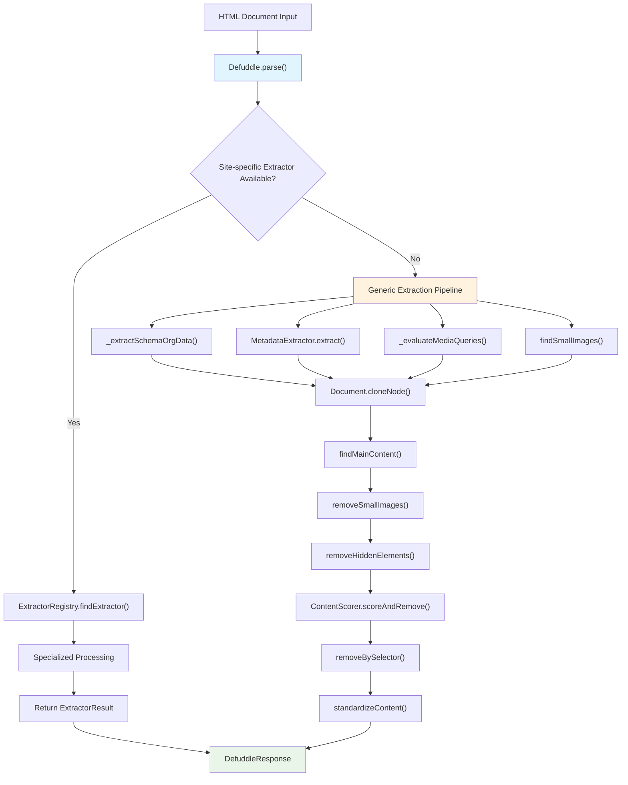
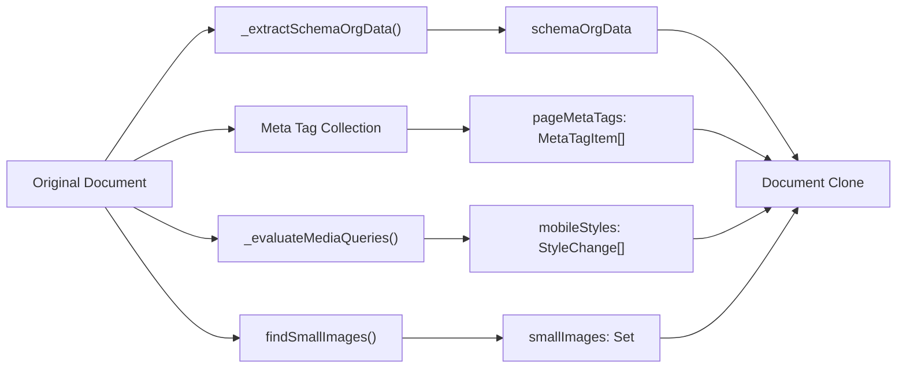
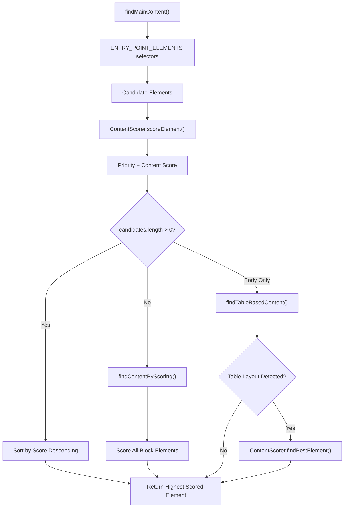
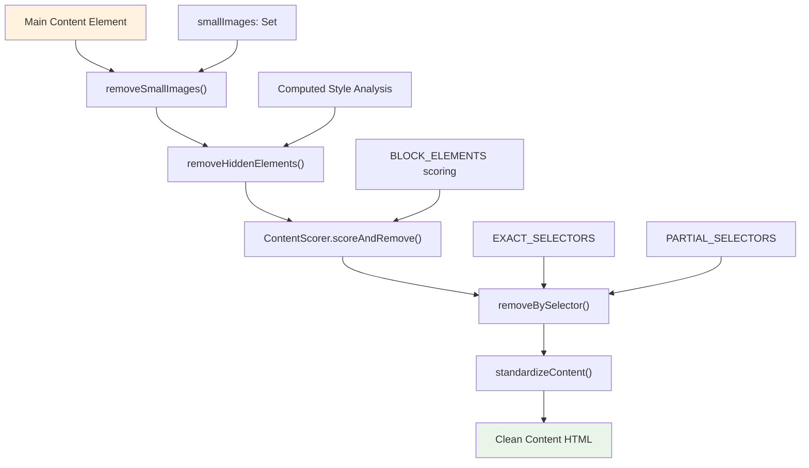
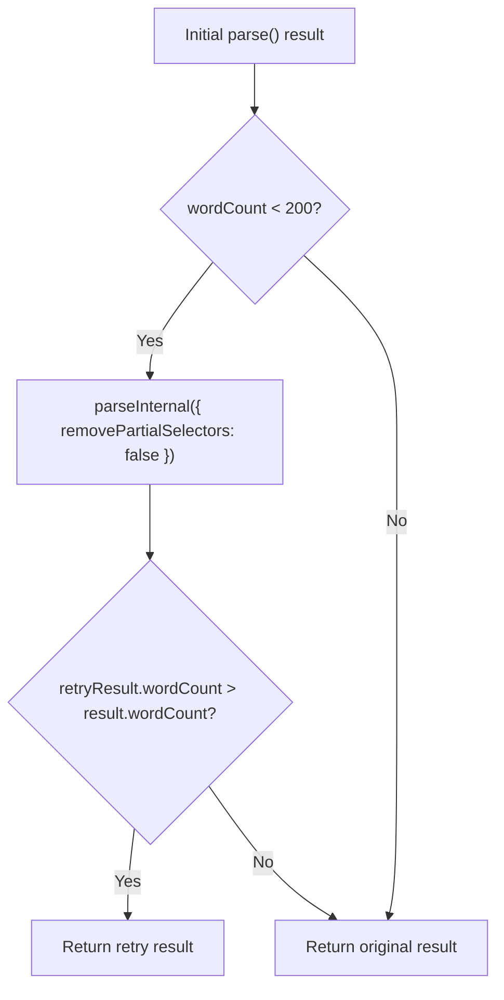

# Content Extraction

Relevant source files

The following files were used as context for generating this wiki page:

- [README.md](README.md)
- [src/constants.ts](src/constants.ts)
- [src/defuddle.ts](src/defuddle.ts)
- [src/metadata.ts](src/metadata.ts)
- [src/types.ts](src/types.ts)

This document covers the core content extraction pipeline that transforms raw HTML documents into clean, standardized content. The extraction process identifies main content, removes clutter elements, and prepares content for further processing.

For detailed information about content quality scoring algorithms, see [Content Scoring](#3.1). For metadata extraction from various sources, see [Metadata Extraction](#3.2). For content normalization and standardization, see [Content Standardization](#4).

## Extraction Pipeline Overview

The content extraction process is orchestrated by the `Defuddle` class through its `parse()` method, which implements a multi-stage pipeline that progressively refines content identification and removes non-content elements.

Sources: [src/defuddle.ts:40-59](), [src/defuddle.ts:64-186]()

## Initial Content Analysis

Before processing begins, the system performs several analysis steps on the original document to gather information that guides the extraction process.

### Schema.org and Metadata Collection

The pipeline starts by extracting structured data and metadata from the document:

| Data Source | Method | Purpose |
|-------------|--------|---------|
| Schema.org JSON-LD | `_extractSchemaOrgData()` | Structured content metadata |
| Meta tags | `querySelectorAll('meta')` | Page metadata collection |
| Mobile styles | `_evaluateMediaQueries()` | Responsive design analysis |
| Small images | `findSmallImages()` | Icon and decoration detection |

Sources: [src/defuddle.ts:73-86](), [src/defuddle.ts:123-127](), [src/defuddle.ts:211-283](), [src/defuddle.ts:432-546]()

## Main Content Identification

The `findMainContent()` method implements a multi-tier approach to identify the primary content container within the document.

### Entry Point Detection

The system first searches for semantic content containers using predefined selectors from `ENTRY_POINT_ELEMENTS`:

Sources: [src/defuddle.ts:592-634](), [src/defuddle.ts:636-655](), [src/defuddle.ts:657-670]()

### Content Scoring Integration

Each candidate element receives a composite score combining:

- **Selector Priority**: Position in `ENTRY_POINT_ELEMENTS` array
- **Content Quality**: Score from `ContentScorer.scoreElement()`
- **Structure Analysis**: Text density, paragraph count, link density

Sources: [src/defuddle.ts:596-607](), [src/scoring.ts:103-190]()

## Clutter Removal Process

After identifying the main content container, the system applies multiple clutter removal techniques in sequence.

### Progressive Cleanup Pipeline

Sources: [src/defuddle.ts:148-164](), [src/defuddle.ts:548-563](), [src/defuddle.ts:311-358](), [src/scoring.ts:211-253](), [src/defuddle.ts:360-429]()

### Selector-Based Removal

The `removeBySelector()` method processes two types of selectors:

| Selector Type | Source | Processing Method |
|---------------|--------|-------------------|
| Exact selectors | `EXACT_SELECTORS` | Direct `querySelectorAll()` |
| Partial selectors | `PARTIAL_SELECTORS` | Regex pattern matching against `TEST_ATTRIBUTES` |

The method uses performance optimizations including:
- Pre-compiled regex patterns
- Batch element collection
- Single-pass removal

Sources: [src/defuddle.ts:360-429](), [src/constants.ts]()

### Hidden Element Detection

The `removeHiddenElements()` method identifies elements with computed styles indicating invisibility:

- `display: none`
- `visibility: hidden` 
- `opacity: 0`

The method processes elements in batches to minimize layout thrashing and uses fallback inline style parsing when computed styles are unavailable.

Sources: [src/defuddle.ts:311-358]()

## Content Quality Assessment

The extraction pipeline integrates with the `ContentScorer` class to distinguish between content and navigation elements. The scoring system evaluates:

- **Text density**: Word count and paragraph structure
- **Link density**: Ratio of links to text content
- **Semantic indicators**: Classes, IDs, and text patterns
- **Structural patterns**: Navigation lists and layout elements

Elements scoring below threshold values are removed from the document, while high-scoring elements are preserved.

Sources: [src/scoring.ts:211-253](), [src/scoring.ts:302-361]()

## Fallback Mechanisms

The system implements several fallback strategies to handle edge cases:

### Low Content Detection

If the initial extraction produces fewer than 200 words, the system retries with relaxed settings:

Sources: [src/defuddle.ts:44-58]()

### Table-Based Layout Detection

For legacy table-based layouts, the system can fall back to cell-based content identification when standard semantic selectors fail.

Sources: [src/defuddle.ts:636-655]()

## Integration with Specialized Systems

The content extraction pipeline integrates with several specialized subsystems:

- **Site-specific extractors**: Priority handling for known platforms via `ExtractorRegistry`
- **Metadata extraction**: Parallel processing via `MetadataExtractor`
- **Content standardization**: Post-processing via `standardizeContent()`
- **Output formatting**: Conversion to HTML or Markdown formats

For detailed information about these integrations, see [Site-Specific Extractors](#5), [Metadata Extraction](#3.2), and [Content Standardization](#4).

Sources: [src/defuddle.ts:95-118](), [src/defuddle.ts:163]()
