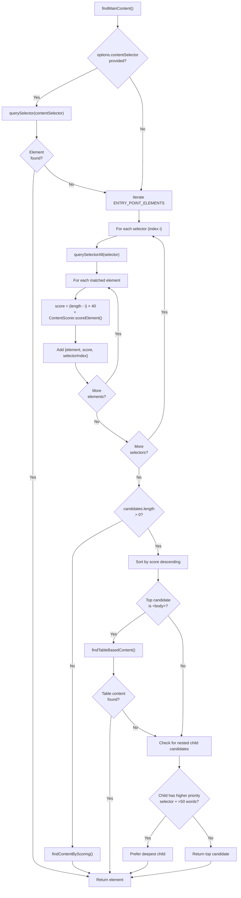
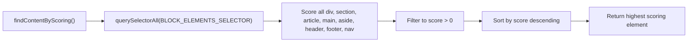
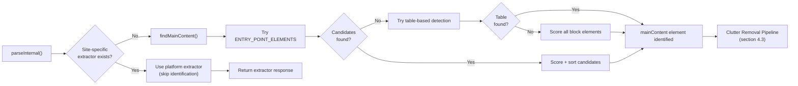

# Content Identification and Scoring

<details>
<summary>Relevant source files</summary>

The following files were used as context for generating this wiki page:

- [src/constants.ts](src/constants.ts)
- [src/defuddle.ts](src/defuddle.ts)
- [src/scoring.ts](src/scoring.ts)
- [src/standardize.ts](src/standardize.ts)

</details>


## Purpose and Scope

This document explains how Defuddle identifies the main content container within an HTML document during the generic extraction pipeline. The identification process uses a two-tier strategy: first attempting to match prioritized CSS selectors for common content containers (`ENTRY_POINT_ELEMENTS`), then falling back to heuristic scoring algorithms (`ContentScorer`) when selectors fail. This process runs only when no platform-specific extractor is available (see [Extractor Registry](#6.1)). For information about removing clutter from the identified content, see [Clutter Removal Pipeline](#4.3). For extracting metadata from the page, see [Metadata Extraction](#4.2).

## Entry Point Selectors

The `ENTRY_POINT_ELEMENTS` constant defines a prioritized array of CSS selectors targeting common content containers. Selectors are ordered from most specific to most general, allowing Defuddle to prefer semantic containers (like `#post`, `.article-content`) over generic fallbacks (like `main`, `body`).

**Priority Order:**

| Priority | Selector | Target |
|----------|----------|--------|
| 1 | `#post` | Single post containers |
| 2 | `.post-content` | Post content wrappers |
| 3 | `.post-body` | Post body sections |
| 4 | `.article-content` | Article content divs |
| 5 | `#article-content` | Article content by ID |
| 6 | `.article_post` | Article post containers |
| 7 | `.article-wrapper` | Article wrappers |
| 8 | `.entry-content` | WordPress-style entries |
| 9 | `.content-article` | Content articles |
| 10 | `.instapaper_body` | Instapaper format |
| 11 | `.post` | Generic post class |
| 12 | `.markdown-body` | GitHub-style markdown |
| 13 | `article` | HTML5 article element |
| 14 | `[role="article"]` | ARIA article role |
| 15 | `main` | HTML5 main element |
| 16 | `[role="main"]` | ARIA main role |
| 17 | `#content` | Generic content ID |
| 18 | `body` | Document body (fallback) |

The `body` selector ensures there is always at least one match, preventing null returns.

**Sources:** [src/constants.ts:3-22]()

## Content Scoring Algorithm

The `ContentScorer` class provides static methods for evaluating the "content-worthiness" of DOM elements. The scoring algorithm combines multiple heuristics to distinguish main content from navigation, advertisements, and boilerplate.

### Score Calculation Components

```mermaid
graph TB
    Element["Element to Score"]
    
    Element --> TextDensity["Text Density<br/>+1 per word"]
    Element --> Paragraphs["Paragraph Count<br/>+10 per &lt;p&gt;"]
    Element --> Commas["Comma Count<br/>+1 per comma"]
    Element --> Images["Image Density<br/>-3 × (images/words)"]
    Element --> Position["Position Bonus<br/>+5 if right-aligned"]
    Element --> ContentMarkers["Content Indicators<br/>+10 for date/author"]
    Element --> Classes["Content Classes<br/>+15 for content/article/post"]
    Element --> Footnotes["Footnote References<br/>+10 if present"]
    Element --> FootnoteList["Footnote Lists<br/>+10 if present"]
    Element --> Tables["Nested Tables<br/>-5 per table"]
    Element --> TableCell["Table Cell Bonus<br/>+10 for center cells"]
    Element --> LinkDensity["Link Density<br/>×(1 - density) multiplier"]
    
    TextDensity --> FinalScore["Final Score"]
    Paragraphs --> FinalScore
    Commas --> FinalScore
    Images --> FinalScore
    Position --> FinalScore
    ContentMarkers --> FinalScore
    Classes --> FinalScore
    Footnotes --> FinalScore
    FootnoteList --> FinalScore
    Tables --> FinalScore
    TableCell --> FinalScore
    LinkDensity --> FinalScore
```



**Sources:** [src/scoring.ts:132-230]()

### Scoring Criteria Details

| Criterion | Calculation | Rationale |
|-----------|-------------|-----------|
| **Text Density** | `+1` per word | More text indicates content |
| **Paragraphs** | `+10` per `<p>` | Prose structure signals articles |
| **Commas** | `+1` per comma | Prose has commas; navigation doesn't |
| **Image Density** | `-3 × (images / words)` | High image density suggests galleries |
| **Position Bonus** | `+5` if `float: right` or `text-align: right` | Center/right content is often main |
| **Date Presence** | `+10` if date pattern matches | Articles have publication dates |
| **Author Presence** | `+10` if author pattern matches | Articles have author attributions |
| **Content Classes** | `+15` if class contains `content`, `article`, `post` | Semantic naming indicates content |
| **Footnote References** | `+10` if inline footnote refs exist | Academic/long-form content marker |
| **Footnote Lists** | `+10` if footnote list exists | Additional content signal |
| **Nested Tables** | `-5` per `<table>` | Navigation often uses tables |
| **Table Cell Bonus** | `+10` for center cells in layout tables | Old-style layouts use center cells |
| **Link Density** | `score × (1 - min(linkText/totalText, 0.5))` | High link density suggests navigation |

The link density acts as a final multiplier, scaling the score down proportionally. It's capped at 0.5 reduction to avoid over-penalizing link-heavy content like blog index pages.

**Sources:** [src/scoring.ts:132-230]()

## Main Content Discovery Process

The `findMainContent()` method orchestrates content identification using a multi-stage approach:



**Sources:** [src/defuddle.ts:1077-1188]()

### Candidate Selection Logic

The algorithm builds a list of candidates by:

1. **Base Score Assignment**: Each selector has a priority score: `(ENTRY_POINT_ELEMENTS.length - selectorIndex) × 40`. Earlier selectors (like `#post`) get higher base scores than later ones (like `body`).

2. **Content Score Addition**: The `ContentScorer.scoreElement()` result is added to the base score, creating a combined metric that favors both high-priority selectors and content-rich elements.

3. **Sorting**: Candidates are sorted by total score in descending order.

4. **Child Preference Logic**: If the top candidate contains a child candidate that:
   - Matched a higher-priority selector (lower `selectorIndex`)
   - Contains meaningful content (>50 words)
   - Is the only such child (not a listing page)
   
   Then the child is preferred over the parent. This prevents selecting `<main>` when it contains a single `<article>` with noise siblings.

**Sources:** [src/defuddle.ts:1118-1153]()

### Listing Page Detection

The child preference logic includes protection against selecting individual cards from listing pages:

```javascript
// Count how many candidates share this selector index inside the top element
let siblingsAtIndex = 0;
for (const c of candidates) {
    if (c.selectorIndex === child.selectorIndex && top.element.contains(c.element)) {
        if (++siblingsAtIndex > 1) break;
    }
}
if (siblingsAtIndex > 1) {
    // Multiple articles/cards inside the parent — it's a listing page
    continue;
}
```

If multiple elements matched the same high-priority selector (e.g., multiple `<article>` tags), the parent container is kept as the main content, preventing extraction of a single card from a grid.

**Sources:** [src/defuddle.ts:1137-1145]()

## Fallback Mechanisms

### Table-Based Content Detection

For old-style table-based layouts (common before CSS Grid/Flexbox), the `findTableBasedContent()` method identifies content cells in layout tables.

**Detection Criteria:**

| Criterion | Check |
|-----------|-------|
| Table width | `width` attribute > 400px or CSS width > 400px |
| Table alignment | `align="center"` attribute |
| Table class | Class name contains `content` or `article` |

If a table matches these criteria, all `<td>` elements are scored using `ContentScorer.findBestElement()`, which returns the cell with the highest score above a minimum threshold of 50.

**Sources:** [src/defuddle.ts:1156-1175]()

### General Block Element Scoring

When entry point selectors and table detection both fail, `findContentByScoring()` provides a final fallback:



This method scores every block-level element (`div`, `section`, `article`, `main`, `aside`, `header`, `footer`, `nav`, `content`) and returns the highest-scoring one.

**Sources:** [src/defuddle.ts:1177-1188](), [src/constants.ts:25-26]()

## Non-Content Detection

The `ContentScorer` also provides methods for identifying elements that are **not** content, used during the clutter removal phase (see [Clutter Removal Pipeline](#4.3)).

### Navigation Indicators

The scorer maintains lists of text patterns that signal navigation/boilerplate:

```javascript
const navigationIndicators = [
    'advertisement', 'all rights reserved', 'banner', 'cookie', 'comments',
    'copyright', 'follow me', 'follow us', 'footer', 'header', 'homepage',
    'login', 'menu', 'more articles', 'more like this', 'most read',
    'nav', 'navigation', 'newsletter', 'popular', 'privacy', 'recommended',
    'register', 'related', 'responses', 'share', 'sidebar', 'sign in',
    'sign up', 'signup', 'social', 'sponsored', 'subscribe', 'terms', 'trending'
];
```

**Sources:** [src/scoring.ts:24-60]()

### Social Profile Detection

Author bios and social widgets are identified by checking for social media profile URLs:

```javascript
const socialProfilePattern = /\b(linkedin\.com\/(in|company)\/|twitter\.com\/(?!intent\b)\w|x\.com\/(?!intent\b)\w|facebook\.com\/(?!share\b)\w|instagram\.com\/\w|threads\.net\/\w|mastodon\.\w)/i;
```

The pattern excludes share/intent URLs to avoid false positives on legitimate content sharing buttons.

**Sources:** [src/scoring.ts:63]()

### Card Grid Detection

Article card grids (e.g., "Related Articles" sections) are detected by `isCardGrid()`:

**Detection Logic:**

1. Element has 3+ headings (h2, h3, or h4)
2. Element has 2+ images
3. Element has 3-500 words total
4. Prose per heading < 20 words (calculated as `(totalWords - headingWords) / headingCount`)

This combination identifies layouts with many titled cards but little prose content per card.

**Sources:** [src/scoring.ts:531-543]()

### Byline Detection

Standalone author bylines with dates are identified using pattern matching:

```javascript
const bylinePattern = /\bBy\s+[A-Z]/;  // Case-sensitive "By" + capitalized name
const datePattern = /(?:Jan|Feb|Mar|Apr|May|Jun|Jul|Aug|Sep|Oct|Nov|Dec)[a-z]*\s+\d{1,2}/i;
```

Elements < 15 words matching both patterns receive a penalty during scoring.

**Sources:** [src/scoring.ts:67-70](), [src/scoring.ts:503-507]()

## Content vs. Non-Content Scoring

The `scoreNonContentBlock()` method provides negative scoring for elements that should be removed during clutter cleanup:

```mermaid
graph TB
    Element["Block Element"]
    
    Element --> SkipFootnotes{"Is footnote<br/>container?"}
    SkipFootnotes -->|Yes| Return0["Return 0<br/>(preserve)"]
    SkipFootnotes -->|No| InitScore["score = 0"]
    
    InitScore --> CommaBonus["+1 per comma<br/>(prose indicator)"]
    CommaBonus --> NavIndicators["-10 per navigation indicator match"]
    NavIndicators --> LinkDensity{">0.5 link<br/>density?"}
    LinkDensity -->|Yes| Penalty1["-15"]
    LinkDensity -->|No| LinkTextRatio
    
    Penalty1 --> LinkTextRatio
    LinkTextRatio{">1 links and<br/><80 words?"}
    LinkTextRatio -->|Yes| CheckRatio{"Link text<br/>> 80% total?"}
    CheckRatio -->|Yes| Penalty2["-15"]
    CheckRatio -->|No| ListStructure
    LinkTextRatio -->|No| ListStructure
    
    Penalty2 --> ListStructure
    ListStructure{"Lists present<br/>and links > lists×3?"}
    ListStructure -->|Yes| Penalty3["-10"]
    ListStructure -->|No| SocialProfile
    
    Penalty3 --> SocialProfile
    SocialProfile{"<80 words and<br/>social profile link?"}
    SocialProfile -->|Yes| Penalty4["-15"]
    SocialProfile -->|No| Byline
    
    Penalty4 --> Byline
    Byline{"<15 words and<br/>byline + date?"}
    Byline -->|Yes| Penalty5["-10"]
    Byline -->|No| CardGrid
    
    Penalty5 --> CardGrid
    CardGrid{"Is card<br/>grid?"}
    CardGrid -->|Yes| Penalty6["-15"]
    CardGrid -->|No| ClassPatterns
    
    Penalty6 --> ClassPatterns
    ClassPatterns["-8 per non-content class pattern"]
    ClassPatterns --> FinalScore["Return score<br/>(negative = remove)"]
```



**Sources:** [src/scoring.ts:425-525]()

### Non-Content Class Patterns

Elements with classes/IDs matching these patterns receive score penalties:

```
advert, ad-, ads, banner, cookie, copyright, footer, header, homepage,
menu, nav, newsletter, popular, privacy, recommended, related, rights,
share, sidebar, social, sponsored, subscribe, terms, trending, widget
```

Each match reduces the score by 8 points.

**Sources:** [src/scoring.ts:90-116]()

## Integration with Content Extraction Pipeline

The content identification and scoring process integrates into the main extraction pipeline as follows:



Once the main content element is identified, it becomes the root for subsequent clutter removal operations. The `mainContent` variable is passed to scoring and removal functions to prevent accidental deletion of content ancestors.

**Sources:** [src/defuddle.ts:554-606]()
