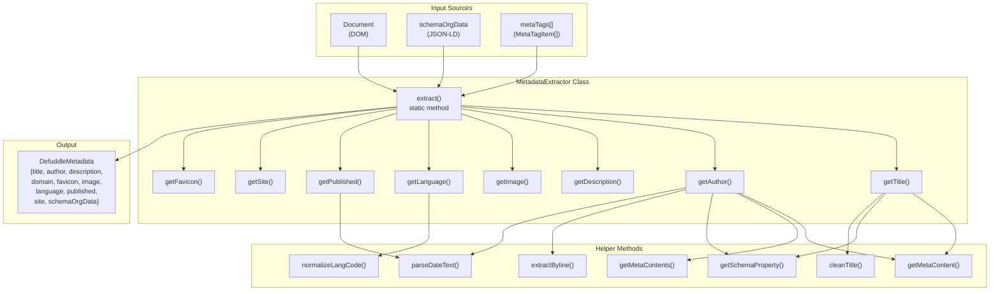
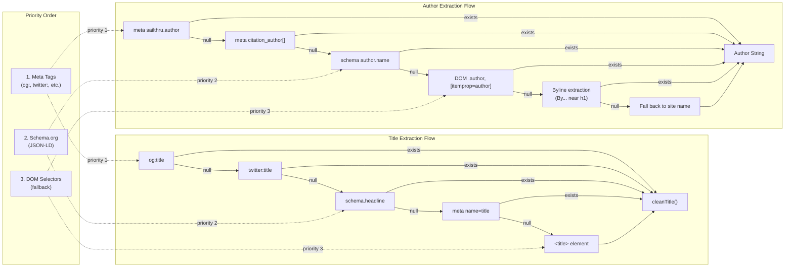
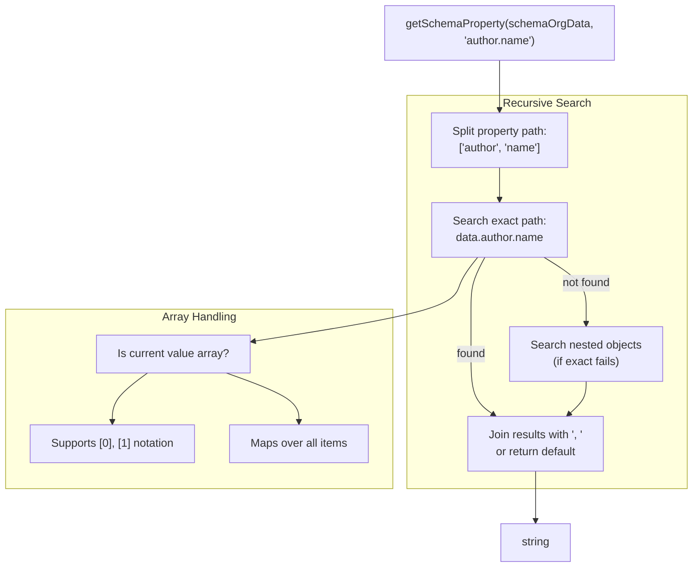
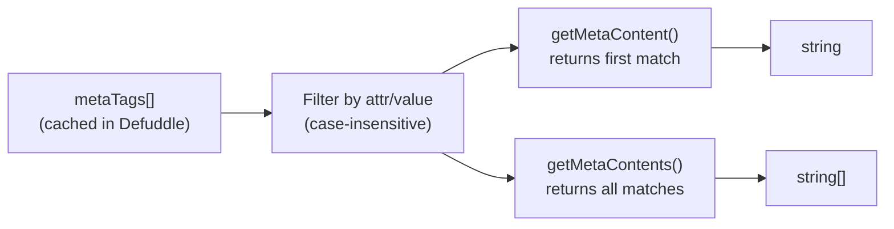
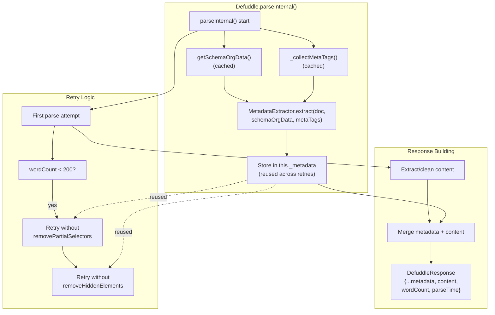

# Metadata Extraction

<details>
<summary>Relevant source files</summary>

The following files were used as context for generating this wiki page:

- [README.md](README.md)
- [src/constants.ts](src/constants.ts)
- [src/defuddle.ts](src/defuddle.ts)
- [src/metadata.ts](src/metadata.ts)
- [src/types.ts](src/types.ts)

</details>


This page documents the metadata extraction subsystem, specifically the `MetadataExtractor` class and its multi-source priority strategy for extracting title, author, description, and other page metadata. For information about identifying and scoring main content, see [Content Identification and Scoring](#4.1). For the complete extraction pipeline, see [Core Extraction Pipeline](#3.1).

## Overview

The metadata extraction system collects page metadata from three primary sources in priority order: Schema.org JSON-LD data, HTML meta tags, and DOM element selectors. The `MetadataExtractor` class implements a sophisticated fallback strategy where each metadata field (e.g., title, author, published date) tries multiple extraction methods in decreasing order of reliability until a value is found.

Metadata extraction occurs early in the parsing pipeline and is cached across retry attempts. The extracted metadata populates the `DefuddleResponse` object alongside the cleaned content.

**Sources:** [src/metadata.ts:1-473](), [src/defuddle.ts:1-24](), [src/types.ts:1-14]()

## MetadataExtractor Architecture



**MetadataExtractor Class Structure**

The `MetadataExtractor` class is a static utility with a single public method `extract()` that orchestrates metadata collection. Each metadata field has a dedicated private static method implementing its specific extraction logic.

**Sources:** [src/metadata.ts:3-57](), [src/metadata.ts:59-185]()

## Multi-Source Priority Strategy



**Priority Fallback Pattern**

Each metadata field implements a waterfall pattern where extraction attempts multiple sources in priority order, returning the first non-empty value. Meta tags (Open Graph, Twitter Cards) are checked first for their reliability, followed by Schema.org JSON-LD data, and finally DOM element selectors as a last resort.

**Sources:** [src/metadata.ts:224-236](), [src/metadata.ts:59-185]()

## Metadata Fields

### Title

| Method | `getTitle()` |
|--------|--------------|
| **Priority Order** | 1. `og:title` meta tag<br/>2. `twitter:title` meta tag<br/>3. Schema.org `headline`<br/>4. `name="title"` meta tag<br/>5. `<title>` element |
| **Post-Processing** | `cleanTitle()` removes site name suffixes/prefixes using patterns like "Title \| Site Name" |

**Sources:** [src/metadata.ts:224-257]()

### Author

| Method | `getAuthor()` |
|--------|---------------|
| **Priority Order** | 1. Meta tags: `sailthru.author`, `author`, `byl`, `authorList`<br/>2. Research meta tags: `citation_author[]`, `dc.creator[]` (with name reversal)<br/>3. Schema.org: `author.name`, `author.[].name`<br/>4. DOM selectors: `[itemprop="author"]`, `.author`, `[href*="/author/"]`<br/>5. Byline extraction: "By ..." text near `<h1>`<br/>6. Site name fallback |
| **Post-Processing** | • Deduplicates comma-separated lists<br/>• Reverses "Last, First" format from citation_author<br/>• Limits to 10 authors max<br/>• Filters out generic "author" text<br/>• Searches up to 3 ancestors and siblings of `<h1>` for bylines |
| **Special Logic** | `extractByline()` matches `/^By\s+([A-Z].+)$/i` pattern<br/>`parseDateText()` identifies date-adjacent author links |

**Sources:** [src/metadata.ts:59-200](), [src/metadata.ts:374-398]()

### Description

| Method | `getDescription()` |
|--------|-------------------|
| **Priority Order** | 1. `name="description"` meta tag<br/>2. `property="description"` meta tag<br/>3. `og:description` meta tag<br/>4. Schema.org `description`<br/>5. `twitter:description` meta tag<br/>6. `sailthru.description` meta tag |

**Sources:** [src/metadata.ts:259-269]()

### Image

| Method | `getImage()` |
|--------|--------------|
| **Priority Order** | 1. `og:image` meta tag<br/>2. `twitter:image` meta tag<br/>3. Schema.org `image.url`<br/>4. `sailthru.image.full` meta tag |

**Sources:** [src/metadata.ts:271-279]()

### Language

| Method | `getLanguage()` |
|--------|----------------|
| **Priority Order** | 1. `<html lang="...">` attribute<br/>2. `content-language` meta tag<br/>3. `og:locale` property<br/>4. `http-equiv="Content-Language"`<br/>5. Schema.org `inLanguage` |
| **Post-Processing** | `normalizeLangCode()` converts underscores to hyphens (e.g., `en_US` → `en-US`) for BCP 47 compliance |

**Sources:** [src/metadata.ts:281-309]()

### Published Date

| Method | `getPublished()` |
|--------|-----------------|
| **Priority Order** | 1. Schema.org `datePublished`<br/>2. `name="publishDate"` meta tag<br/>3. `article:published_time` property<br/>4. `<abbr itemprop="datePublished">` title attribute<br/>5. `<time>` element datetime or text<br/>6. `sailthru.date` meta tag<br/>7. Date text near `<h1>` (next 3 siblings) |
| **Post-Processing** | `parseDateText()` parses two formats:<br/>• "26 February 2025" → `2025-02-26T00:00:00+00:00`<br/>• "February 26, 2025" → `2025-02-26T00:00:00+00:00` |

**Sources:** [src/metadata.ts:332-372](), [src/metadata.ts:374-398]()

### Site Name

| Method | `getSiteName()`, `getSite()` |
|--------|------------------------------|
| **Priority Order** | 1. Schema.org `publisher.name`<br/>2. `og:site_name` property<br/>3. Schema.org `WebSite.name`, `sourceOrganization.name`<br/>4. `name="copyright"` meta tag<br/>5. Schema.org `copyrightHolder.name`, `isPartOf.name`<br/>6. `application-name` meta tag |
| **Fallback** | `getSite()` falls back to author if site name not found |

**Sources:** [src/metadata.ts:202-222]()

### Favicon

| Method | `getFavicon()` |
|--------|----------------|
| **Priority Order** | 1. `og:image:favicon` property<br/>2. `<link rel="icon">`<br/>3. `<link rel="shortcut icon">`<br/>4. `/favicon.ico` (constructed from base URL if available) |

**Sources:** [src/metadata.ts:310-330]()

### Domain

| Extraction Logic | Derived from document URL or base tag |
|------------------|---------------------------------------|
| **Sources** | 1. `doc.location.href`<br/>2. `og:url`, `twitter:url` meta tags<br/>3. Schema.org `url`, `mainEntityOfPage.url`<br/>4. `<link rel="canonical">`<br/>5. `<base href="">` |
| **Processing** | Removes `www.` prefix from hostname |

**Sources:** [src/metadata.ts:5-41]()

## Helper Methods

### getSchemaProperty()



**Schema.org Property Extraction**

The `getSchemaProperty()` method implements a recursive search through Schema.org JSON-LD data with support for:
- Dot-notation paths (e.g., `author.name`)
- Array indexing (e.g., `author.[0].name`)
- Automatic array mapping (e.g., `author.[].name` returns all author names)
- Nested object fallback (searches entire tree if exact path fails)
- Comma-joined results for multiple matches

**Sources:** [src/metadata.ts:400-472]()

### getMetaContent() / getMetaContents()



**Meta Tag Helpers**

These methods filter the cached `metaTags[]` array by attribute name/property and value. The `getMetaContents()` variant returns all matches, used for fields like `citation_author` where multiple tags may exist.

**Sources:** [src/metadata.ts:356-365]()

## Integration with Defuddle Pipeline



**Pipeline Integration**

Metadata extraction occurs once per `parse()` call and is cached in `this._metadata` to avoid redundant extraction during retry attempts. The extraction happens early in the pipeline, immediately after Schema.org data and meta tags are collected.

**Caching Strategy:**
- `this._schemaOrgData`: Cached lazily via `getSchemaOrgData()`, extracted once before script tag removal
- `this._metaTags`: Cached via `_collectMetaTags()`, extracted once per parse
- `this._metadata`: Cached after first `MetadataExtractor.extract()` call, reused across retries

**Integration Points:**
1. **Synchronous parsing**: [src/defuddle.ts:498-509]() - Metadata extracted during `parseInternal()`
2. **Async extraction**: [src/defuddle.ts:448]() - Metadata extracted when async extractors are used
3. **Response merging**: [src/defuddle.ts:624-630]() - Metadata spread into final `DefuddleResponse`
4. **Extractor fallback**: [src/defuddle.ts:521]() - Metadata used when platform extractors override content

**Sources:** [src/defuddle.ts:461-652](), [src/defuddle.ts:77-83](), [src/defuddle.ts:393-410]()

## Data Structures

### MetaTagItem Interface

```typescript
interface MetaTagItem {
  name?: string | null;      // meta name attribute
  property?: string | null;  // meta property attribute (og:, twitter:)
  content: string | null;    // meta content value
}
```

Meta tags are collected once via `_collectMetaTags()` and cached in an array. Both `name` and `property` attributes are captured to support Open Graph and Twitter Card tags.

**Sources:** [src/types.ts:16-20]()

### DefuddleMetadata Interface

```typescript
interface DefuddleMetadata {
  title: string;
  description: string;
  domain: string;
  favicon: string;
  image: string;
  language: string;
  parseTime: number;
  published: string;
  author: string;
  site: string;
  schemaOrgData: any;
  wordCount: number;
}
```

The `DefuddleResponse` extends this interface, adding `content`, `contentMarkdown`, `metaTags`, `debug`, and `variables` fields.

**Sources:** [src/types.ts:1-14](), [src/types.ts:34-41]()
